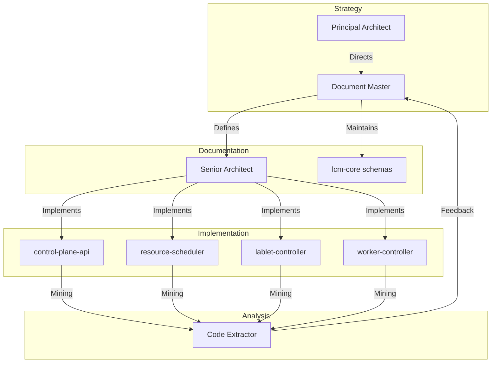

# LCM Architecture Team

## Parent Platform

This team extends the **AIX Architecture Core Team** and inherits its patterns, quality standards, and architectural principles. LCM-specific adaptations focus on the cloud infrastructure domain.

## Members

| Agent | Role | Focus |
|-------|------|-------|
| `lcm-principal-architect` | **Team Lead** | Strategy, Cloud Architecture, AWS Cost Optimization |
| `lcm-document-master` | **Documentation Lead** | Single Source of Truth, CML API Specs, Infrastructure Docs |
| `lcm-senior-architect` | **Implementation Lead** | Spec-to-Code translation, Pattern verification, Microservice Coordination |
| `lcm-code-extractor` | **Reverse Engineer** | Current State Analysis, Cross-Service Drift Detection, Implementation Mining |

## Domain Context

The LCM team specializes in:

- **AWS EC2 Infrastructure**: Management of m5zn.metal instances (nested virtualization)
- **Cisco Modeling Lab (CML)**: Lab lifecycle management, node definitions, licensing
- **Distributed Microservices**: Coordination across control-plane-api, resource-scheduler, lablet-controller, worker-controller
- **Cloud Cost Optimization**: Idle detection, resource scheduling, automatic shutdown policies

## Responsibilities

1. **Strategic Alignment**: Ensure all changes map back to LCM platform goals and Mozart ecosystem vision.
2. **Cross-Service Coherence**: Maintain consistency across the 4 LCM microservices.
3. **Infrastructure Governance**: Manage AWS resource lifecycle and cost optimization patterns.
4. **Drift Management**: Reconcile difference between source code and documentation across services.
5. **Pattern Enforcement**: Strict adherence to Neuroglia (CQRS/ES), Clean Architecture, and shared lcm-core.

## Microservice Ownership

| Service | Primary Owner | Purpose |
|---------|---------------|---------|
| `control-plane-api` | Senior Architect | User-facing API, UI, Authentication |
| `resource-scheduler` | Principal Architect | Scheduling policies, reservation management |
| `lablet-controller` | Senior Architect | CML lab lifecycle, CRUD operations |
| `worker-controller` | Senior Architect | EC2 instance lifecycle, metrics collection |
| `lcm-core` | Document Master | Shared domain models, infrastructure utilities |

## Operational Workflows

## Knowledge Namespaces

This team collectively owns and manages:

- `lcm-infrastructure`: AWS/EC2 patterns, cloud cost strategies
- `lcm-cml-domain`: Cisco Modeling Lab concepts, API integration
- `lcm-architecture`: Microservice patterns, shared models
- `lcm-operations`: Monitoring, scheduling, lifecycle policies

## Coordination with AIX

The LCM team inherits from AIX and coordinates on:

| Topic | AIX Responsibility | LCM Responsibility |
|-------|-------------------|-------------------|
| Neuroglia Framework | Pattern definition | Pattern application |
| Shared Infrastructure | Docker compose infra | Service consumption |
| Knowledge Manager | Core implementation | Domain-specific content |
| Authentication | Keycloak realm design | RBAC enforcement |

## Communication Channels

- **Task Queue**: `.agent/a2a/tasks/` - For cross-agent work assignment
- **Architecture Channel**: `.agent/a2a/channels/architecture.channel.md` - Decision broadcasts
- **AIX Upstream**: Cross-repo communication via A2A protocol
