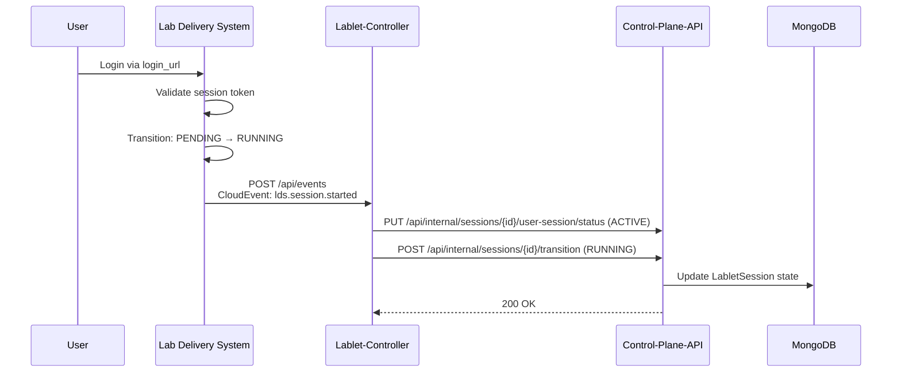
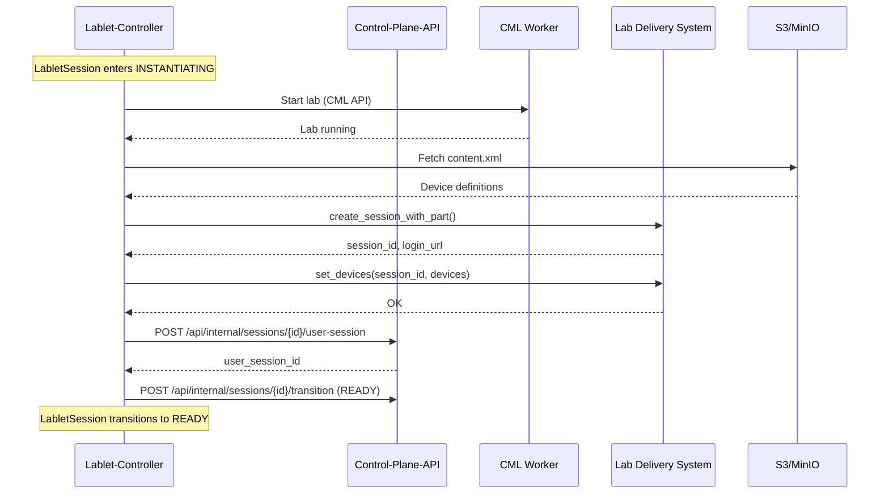

# ADR-018: Lab Delivery System (LDS) Integration

- **Status**: Accepted (Amended)
- **Date**: 2025-02-10 (Amended 2026-02-18)
- **Deciders**: Platform Team
- **Related**: ADR-017 (Lab Operations via Lablet-Controller), ADR-015 (Control Plane API No External Calls), [ADR-020](./ADR-020-session-entity-model.md) (Session Entity Model), [ADR-021](./ADR-021-child-entity-architecture.md) (Child Entities), [ADR-022](./ADR-022-cloudevent-ingestion-lablet-controller.md) (CloudEvent Ingestion)
- **Amended by**: ADR-020 (LabletInstance → LabletSession), ADR-022 (CloudEvent routing)

## Context

The Lablet Cloud Manager (LCM) provides lab infrastructure (CML workers and labs) but users need a separate system for interacting with labs:

1. **User-facing Web UI** for task viewing and lab interaction
2. **Device access provisioning** with console credentials
3. **Assessment and grading** integration
4. **Response collection** for evaluation

The **Lab Delivery System (LDS)** is an existing Cisco platform that provides these capabilities through a concept called "LabSession":

- **LabSession**: A user-facing session providing web UI, task display, and device access
- **LabSessionPart**: A segment of a LabSession tied to specific content (form_qualified_name)
- **Device access info**: Protocol, host, port, username/password for each lab device

### Problem Statement

A LabletSession (formerly LabletInstance — see ADR-020) in LCM currently represents only the CML lab infrastructure. Users cannot:

- See their tasks or instructions
- Get device access credentials
- Submit responses for grading
- Access a unified web UI for the lab experience

### Requirements

1. When a LabletSession enters INSTANTIATING state, LCM must provision a corresponding LabSession in LDS
2. Device access information must be derived from content.xml (device definitions) + cml.yaml (node labels) + allocated ports
3. LDS content must be refreshed when a LabletDefinition is versioned
4. LabSession must be archived when LabletSession is TERMINATED

## Decision

### 1. LabletSession = CML Lab + LabSession + GradingEngine

A LabletSession is a **composite resource** consisting of:

- **CML Lab**: Infrastructure running on a CML worker (managed by lablet-controller → CML API)
- **LabSession**: User-facing session in LDS (managed by lablet-controller → LDS API)
- **GradingEngine**: Assessment and scoring (managed by lablet-controller → GradingSPI)

All three components are orchestrated through the LabletSession lifecycle (see ADR-020).

### 2. Lablet-Controller Owns All LDS Interactions

Following the principle established in ADR-015 and ADR-017, **lablet-controller** is the only LCM component that interacts with LDS:

| Component | LDS Access |
|-----------|------------|
| control-plane-api | ❌ None (no external calls) |
| resource-scheduler | ❌ None (scheduling only) |
| worker-controller | ❌ None (worker metrics only) |
| **lablet-controller** | ✅ Full LDS API access |

### 3. Synchronous REST API Pattern

LDS integration uses **synchronous REST calls** (not CloudEvents) because:

- LDS API is internal service, not external integration
- Immediate response needed for session creation
- Simpler error handling and retry logic
- Consistent with existing controller patterns

### 4. LabDeliverySPI Abstraction

A Service Provider Interface (SPI) abstracts LDS API details:

```python
class LabDeliverySPI(Protocol):
    """Service Provider Interface for Lab Delivery System integration."""

    async def create_session_with_part(
        self,
        session_id: str,
        form_qualified_name: str,
        lablet_instance_id: str,
    ) -> LabSessionInfo:
        """Create LDS session with initial content part."""
        ...

    async def set_devices(
        self,
        session_id: str,
        devices: list[DeviceAccessInfo],
    ) -> None:
        """Provision device access information for session."""
        ...

    async def get_session_info(
        self,
        session_id: str,
    ) -> LabSessionInfo:
        """Get current session state and login URL."""
        ...

    async def get_login_url(
        self,
        session_id: str,
    ) -> str:
        """Get user login URL for the session."""
        ...

    async def archive_session(
        self,
        session_id: str,
    ) -> None:
        """Archive session (called on TERMINATED)."""
        ...

    async def refresh_content(
        self,
        form_qualified_name: str,
    ) -> None:
        """Signal LDS to refresh content from S3 bucket."""
        ...
```

### 5. Device Mapping Flow

Device access credentials are derived through a multi-step mapping:

```
content.xml          →  cml.yaml           →  Port Allocation    →  DeviceAccessInfo
(device_labels)         (node annotations)     (allocated ports)     (final payload)
```

1. **content.xml** defines devices with `device_label` identifiers
2. **cml.yaml** contains nodes with matching `device_label` annotations
3. **Port Allocation** (FR-2.2.4) assigns external ports to node protocols
4. **DeviceAccessInfo** combines all data for LDS provisioning:

```python
@dataclass
class DeviceAccessInfo:
    name: str           # Device label from content.xml
    protocol: str       # ssh, telnet, https, etc.
    host: str           # Worker public hostname
    port: int           # Allocated external port
    uri: str | None     # Optional full URI (for web consoles)
    username: str       # Device credentials
    password: str       # Device credentials
```

### 6. State Decoupling

LabletSession states and LDS LabSession states are **decoupled**:

| LabletSession State | LDS LabSession State | Trigger | Notes |
|---------------------|---------------------|---------|-------|
| PENDING | - | - | No session created yet |
| SCHEDULED | - | - | Waiting for scheduling |
| INSTANTIATING | PENDING | lablet-controller | Session created, devices being provisioned |
| **READY** | PENDING | lablet-controller | Infrastructure ready, awaiting user login |
| RUNNING | RUNNING | LDS CloudEvent → lablet-controller | User has logged in |
| COLLECTING | RUNNING | lablet-controller | Assessment collection in progress |
| GRADING | USER_FINISHED | lablet-controller | GradingEngine scoring in progress |
| STOPPING | ARCHIVING | lablet-controller | Session being archived |
| STOPPED | ARCHIVED | lablet-controller | Session archived |
| TERMINATED | ARCHIVED | - | Emergency termination |

!!! info "READY State"
    The READY state explicitly tracks when infrastructure is fully provisioned but the user has not yet logged in.
    This enables: (1) user engagement metrics, (2) no-show detection, (3) event-driven state transitions from LDS.

!!! note "Independent Lifecycles"
    LDS session state may transition independently due to user actions or LDS-internal events.
    Lablet-controller observes LDS state during reconciliation but does not force transitions.

### 7. CloudEvent Integration (Amended by ADR-022)

!!! warning "Amendment"
    The original design routed LDS CloudEvents to control-plane-api. Per ADR-022, all inbound CloudEvents
    are now routed to **lablet-controller** via its CloudEventIngestor. lablet-controller then calls
    control-plane-api's internal endpoints for state mutations.

LDS and GradingEngine emit CloudEvents to notify LCM of session state changes:

| Event Type | Source | Handler Location | Effect |
|------------|--------|-----------------|--------|
| `lds.session.started` | LDS | lablet-controller | UserSession → ACTIVE, READY → RUNNING |
| `lds.session.ended` | LDS | lablet-controller | UserSession → ENDED, trigger COLLECTING + grading |
| `grading.session.completed` | Grading Engine | lablet-controller | Create ScoreReport, → STOPPING |
| `grading.session.failed` | Grading Engine | lablet-controller | GradingSession → FAULTED |

**Why lablet-controller, not control-plane-api:**

- CloudEvent handlers need to call external systems (GradingSPI, LabDeliverySPI)
- ADR-015 forbids external calls from control-plane-api
- lablet-controller already owns LabletSession lifecycle orchestration
- See ADR-022 for detailed rationale



### 8. New LabletDefinition Attributes

To support LDS integration, LabletDefinition requires:

| Attribute | Type | Description |
|-----------|------|-------------|
| `form_qualified_name` | string | Globally unique content identifier (e.g., "Exam CCNP ENCOR v2.3 LAB 2.3.4a") |
| `content_bucket_name` | string | Slugified form_qualified_name for S3/MinIO bucket (auto-derived) |

### 9. LabletSession Attributes for LDS (Amended by ADR-020, ADR-021)

!!! note "Amendment"
    Per ADR-020, `LabletInstance` is renamed to `LabletSession`. Per ADR-021, LDS session details
    are now tracked in a separate `UserSession` entity rather than directly on LabletSession.

| Entity | Attribute | Type | Description |
|--------|-----------|------|-------------|
| `LabletSession` | `user_session_id` | string | FK to UserSession entity |
| `UserSession` | `lds_session_id` | string | LDS LabSession identifier |
| `UserSession` | `lds_part_id` | string | LDS LabSessionPart identifier |
| `UserSession` | `login_url` | string | User-facing URL to access the session |
| `UserSession` | `devices` | list[DeviceAccessInfo] | Provisioned device access info |

### 10. Assessment Flow (Amended by ADR-021, ADR-022)

Assessment is now orchestrated by lablet-controller via GradingSPI, triggered by LDS CloudEvents:

```
LDS CloudEvent (session.ended) → lablet-controller → GradingSPI → GradingEngine
                                                                          │
                                GradingEngine CloudEvent ←───────────────┘
                                (grading.session.completed)
                                         │
                                         └→ lablet-controller → Create ScoreReport → STOPPING
```

See ADR-021 for GradingSession and ScoreReport entity details.
See ADR-022 for CloudEvent ingestion architecture.

## Consequences

### Positive

- **Complete user experience**: Users get unified web UI, tasks, and device access
- **Clean architecture**: Single controller (lablet-controller) handles all lab lifecycle including LDS and GradingEngine
- **Separation of concerns**: CML for infrastructure, LDS for user interaction, GradingEngine for assessment
- **User engagement tracking**: READY state enables metrics on login time, no-shows
- **Event-driven transitions**: CloudEvents for user-initiated state changes (via lablet-controller — ADR-022)
- **Extensibility**: SPI pattern allows future LDS/GradingEngine provider implementations
- **Consistent patterns**: Follows established ADR-015/017 controller architecture

### Negative

- **Added complexity**: Lablet-controller now manages three external systems (CML, LDS, GradingEngine)
- **Failure modes**: LDS or GradingEngine outages can affect LabletSession provisioning or grading
- **Latency**: Additional API calls during INSTANTIATING phase
- **Dependency**: System requires LDS availability for full functionality

### Mitigations

1. **Graceful degradation**: If LDS fails, LabletSession can still reach READY for CML-only access
2. **Retry logic**: Transient LDS failures handled with exponential backoff
3. **Health monitoring**: LDS availability tracked in lablet-controller health endpoint
4. **Timeout configuration**: `LDS_API_TIMEOUT` configurable per deployment

## Implementation Notes

### Content Package Structure

Content stored in S3/MinIO bucket (named by `content_bucket_name`):

```
{content_bucket_name}/
├── content.xml        # Device definitions, task structure
├── cml.yaml           # Lab topology with device_label annotations
├── tasks/             # Task content (HTML/Markdown)
└── assets/            # Images, scripts, etc.
```

### LDS Provisioning Sequence



### Content Refresh Trigger

When a LabletDefinition is versioned (new `content_bucket_name` or updated content):

1. Platform updates content in S3 bucket
2. Platform calls LCM API to trigger refresh
3. Lablet-controller calls `refresh_content(form_qualified_name)`
4. LDS refreshes content from S3 bucket

### Future Extensions

The LabDeliverySPI is designed for future capabilities.
Assessment and grading capabilities are now tracked via GradingSession and ScoreReport entities (ADR-021).

```python
# Feedback Collection (future)
async def collect_user_feedback_by_session(self, session_id: str) -> Feedback: ...
async def collect_user_feedback_by_form(self, form_qualified_name: str) -> list[Feedback]: ...
```

## Related Documents

- [FR-2.1.6 LDS Content Synchronization](../../specs/lablet-resource-manager-requirements.md#fr-216-lds-content-synchronization)
- [FR-2.2.5 LabSession Provisioning](../../specs/lablet-resource-manager-requirements.md#fr-225-labsession-provisioning)
- [Lablet Controller: LDS Integration](../components/lablet-controller/index.md#10-lds-integration)
- [Architecture Overview: LabDeliverySPI](../index.md#service-provider-interfaces-spis)
