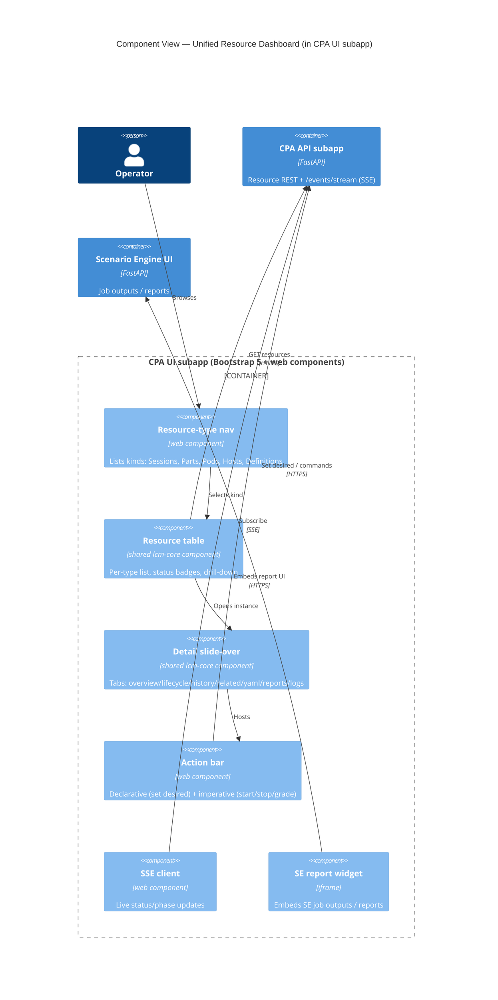

# ADR-048: Unified Resource Dashboard and Shared `lcm-core` UI Components

| Attribute | Value |
|-----------|-------|
| **Status** | Proposed |
| **Date** | 2026-06-12 |
| **Deciders** | Architecture Team |
| **Extends** | [ADR-009](./ADR-009-shared-core-package.md) (Shared Core Package), [ADR-013](./ADR-013-sse-protocol-improvements.md) (SSE) |
| **Related ADRs** | [ADR-036](./ADR-036-resource-management-abstraction-layer.md), [ADR-039](./ADR-039-sse-race-condition-fix.md), [ADR-047](./ADR-047-generic-reconciliation-framework.md) |

---

## 1. Context

Each service ships its own `ui/` (Bootstrap 5 + vanilla web components). With the generalized
resource tree (ADR-036 §2.6), operators need a **single** place to see and act on every resource
kind — `Session`, `SessionPart`, `PodInstance`, `Host`/`Worker`, and the catalog definitions —
across CPA, the controllers, and the scheduler. Per-service UIs cannot give a consolidated,
Kubernetes-style view, and re-implementing tables/detail panels per service duplicates code.

## 2. Decision

### 2.1 CPA hosts one unified LCM dashboard

CPA (already the single front door) hosts the **unified resource dashboard** for the LCM
services (resource-scheduler, session-controller/CPA, worker-controller, lablet-controller). It
aggregates resources over the existing REST + SSE surfaces. **SE keeps its own UI** for job
outputs and reports; it is **embedded into LCM as an iframe widget**, not re-implemented.

### 2.2 Keep the stack; grow shared components in `lcm-core`

Keep **Bootstrap 5 + vanilla web components + SSE** (no new SPA framework). Generic, repeatable
pieces — `resource-table`, `resource-detail-panel`, `status-badge`, `lifecycle-phases`,
`state-history-timeline` — are promoted into the **`lcm-core` (`lcm_ui`) shared package**
(ADR-009) so every service UI can reuse them and the dashboard composes them.

### 2.3 K8s-style interaction model

- **Navigation:** per-type lists with **drill-down** from owner to owned
  (Session → Parts → Pods → Host).
- **Detail:** a **slide-over side panel** with tabs: Overview (spec vs status), Lifecycle &
  phases (current vs desired + progress), State history/events, Related resources, Raw
  YAML/JSON, Reports & artifacts, Live logs.
- **Actions:** **both** declarative (edit `desired_status`, retry phase, force reconcile) and
  imperative (start/stop/grade) — declarative aligns with the reconciliation framework
  (ADR-047), imperative covers operator break-glass.
- **Real-time:** status, phase progress, and transitions stream via SSE (ADR-013/039).

## 3. Consequences

**Positive**

- One consolidated operator surface; uniform UX across resource kinds.
- Shared components remove per-service UI duplication; SE reports reused via iframe, not rebuilt.
- Declarative actions make the UI a thin client over the reconciliation framework.

**Negative / trade-offs**

- CPA must aggregate resources owned by other services (read via their APIs/SSE), adding a
  read-aggregation responsibility to CPA.
- The iframe embedding requires SE to expose an embeddable, auth-aware report view.

**Neutral**

- No framework migration; existing Bootstrap/web-component patterns are extended, not replaced.

## 4. Related

- [ui-resource-dashboard.md](../solution/ui-resource-dashboard.md) — dashboard design + mockups.
- [resource-model.md](../solution/resource-model.md) — what the dashboard renders.
