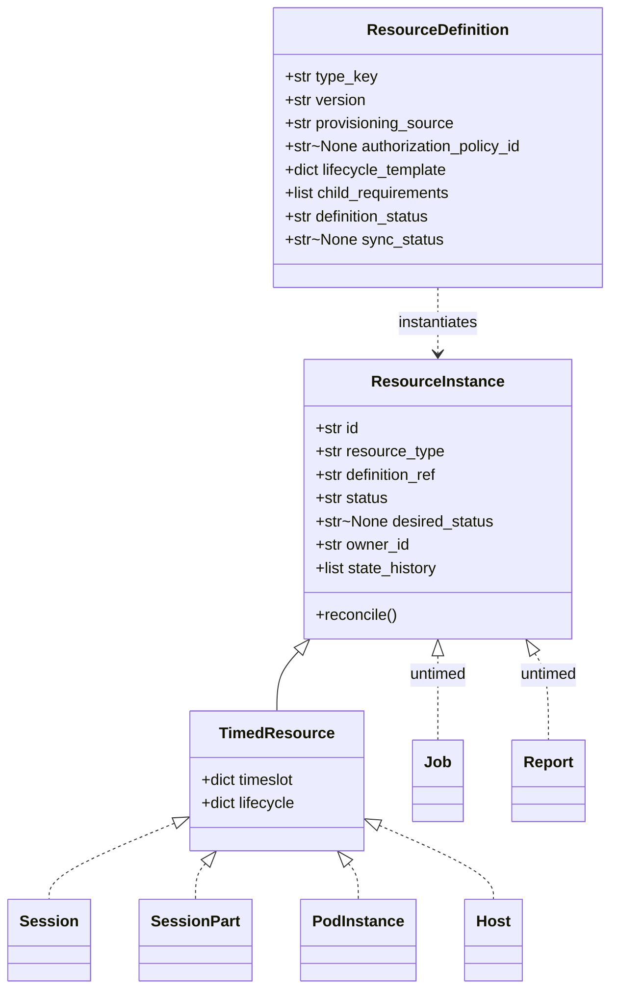

# ADR-050: Definition/Instance Duality and Two-Tier Instance Layering

| Attribute | Value |
|-----------|-------|
| **Status** | Proposed |
| **Date** | 2026-06-12 |
| **Deciders** | Architecture Team |
| **Extends** | [ADR-036](./ADR-036-resource-management-abstraction-layer.md) (Resource Management Abstraction Layer) |
| **Related ADRs** | [ADR-045](./ADR-045-multi-part-session-part-model.md), [ADR-046](./ADR-046-host-abstraction-and-pod-host-type-split.md), [ADR-047](./ADR-047-generic-reconciliation-framework.md), [ADR-051](./ADR-051-provisioning-sources.md) |

---

## 1. Context

ADR-036 layered the **instance** state (`ResourceState` → `TimedResourceState` → concrete) and
ADR-047 gave us one reconcile loop. But the platform also has a large **definition** side — the
legacy .NET _Track Manager_, _Session Manager_, and _Pod Manager_ all express a
**definition → instance** duality (`SessionType → Session`, `PodDefinition → Pod`,
`Track → … → Form`). Today LCM models only a few of these (`SessionDefinition`, `PodDefinition`)
ad hoc, with no shared base, and treats _every_ runtime resource as timed — even automation
outputs (`Job`, `Report`) that have no schedule of their own.

We need (a) one **definition** base mirroring the one **instance** base, and (b) a clean split
between **timed** and **untimed** instances.

## 2. Decision

### 2.1 Two parallel families

Generalise onto two bases in `lcm_core`:

- **`ResourceDefinition`** — _type metadata_: `type_key`, `version`, `provisioning_source`,
  optional `authorization_policy_id`, a **lifecycle template**, child **requirements/selectors**,
  a `definition_status`, and (for synced content) a `sync_status`. Definitions are the
  **catalogue**; they do **not** reconcile against infrastructure.
- **`ResourceInstance`** — _a running thing_: `status` + `desired_status`, `state_history`,
  an instantiated `lifecycle`, `owner_id`, children. Its behaviour is to **reconcile** toward
  `desired_status`.

### 2.2 Two-tier instance layering

`ResourceInstance` (L1) carries lifecycle + reconciliation but **no `Timeslot`**. `TimedResource`
(L2) adds the `Timeslot` (and `TimedResourceState` of ADR-036). The split decides where each
resource sits:

| Tier | Class | Instances |
|---|---|---|
| **L1 (untimed)** | `ResourceInstance` (holds `ResourceState`) | `Job`, `Report` — inherit their parent part's window. |
| **L2 (timed)** | `TimedResource` (holds `TimedResourceState`) | `Session`, `SessionPart`, `PodInstance`, `Host`/`Worker`. |

### 2.3 Catalogue → runtime map

| Definition | → Instance | Tier | Source |
|---|---|---|---|
| `SessionDefinition` | `Session` | Timed | seed |
| `PartDefinition` | `SessionPart` | Timed | seed |
| `PodDefinition` | `PodInstance` | Timed | seed / content_package |
| `HostDefinition` | `Host` / `Worker` | Timed | seed |
| `Form` (+ taxonomy) | _delivered by `SessionPart` — no instance_ | — | content_package |
| `JobDefinition` | `Job` | Untimed | content_package |
| `ReportDefinition` | `Report` | Untimed | content_package |
| config (`DeliveryEnvironment`, `LabLocation`, `HostingSiteLocation`, `AuthorizationPolicy`) | _no instance_ | — | seed |

`Device` / `DeviceDefinition` are **deferred** (out of scope this round).

## 3. Consequences

**Positive** — one definition base + one instance base; a single mental model
(_definition instantiates instance_); untimed automation no longer forced into a timeslot;
aligns the reconcile loop (ADR-047) with both timed and untimed instances.

**Negative / trade-offs** — two base classes to maintain; the L1/L2 split must be enforced so
untimed instances are not accidentally scheduled.

**Persistence** — both bases are **state-based** Neuroglia aggregates (`MotorRepository` +
`state_version`); see [ADR-051](./ADR-051-provisioning-sources.md).

## 4. Related

- [resource-model.md](../solution/resource-model.md) — instance side.
- [definition-catalog-model.md](../solution/definition-catalog-model.md) — definition side.
