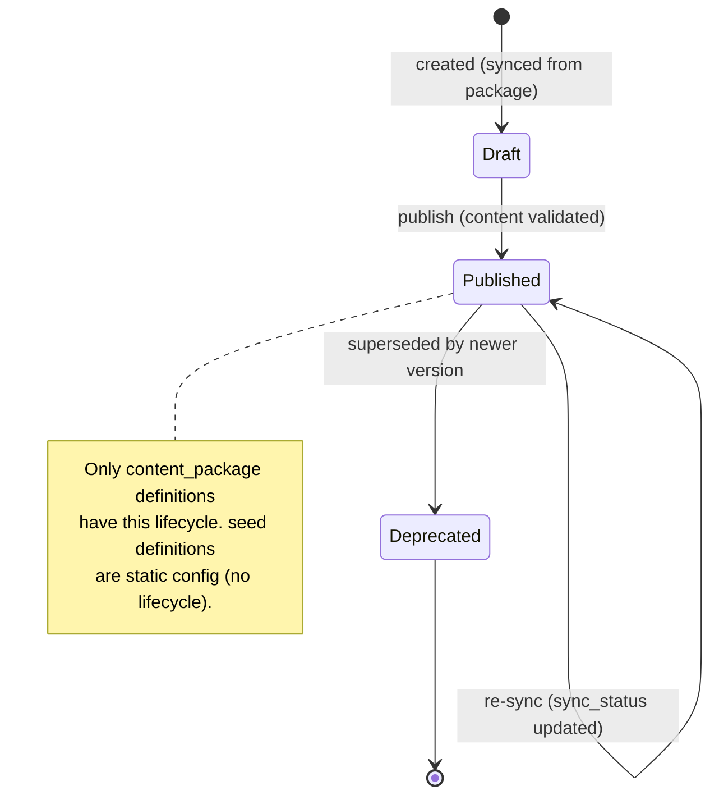

# ADR-051: Provisioning Sources and Asymmetric Definition Lifecycle

| Attribute | Value |
|-----------|-------|
| **Status** | Proposed |
| **Date** | 2026-06-12 |
| **Deciders** | Architecture Team |
| **Extends** | [ADR-050](./ADR-050-definition-instance-duality.md) (Definition/Instance Duality) |
| **Related ADRs** | [ADR-023](./ADR-023-content-sync-trigger.md), [ADR-024](./ADR-024-content-package-storage.md), [ADR-027](./ADR-027-content-version-auto-increment.md), [ADR-028](./ADR-028-definition-initial-status.md), [ADR-052](./ADR-052-content-authoring-taxonomy.md) |

---

## 1. Context

ADR-050 introduced `ResourceDefinition` as the base for every catalogue entry. But definitions
come from **two very different origins**: static reference data loaded once (session types, pod
definitions, locations, policies) versus authored content **continuously synced** from a content
package (the exam taxonomy, per-part automation). Treating them uniformly would either force a
sync/version lifecycle onto inert config, or deny one to authored content that genuinely changes.
The legacy services split these too — a `DatabaseInitializer` seeds YAML assets, while content is
published/updated through a separate flow.

## 2. Decision

### 2.1 `provisioning_source` switch

Every `ResourceDefinition` declares a `provisioning_source`:

| Source | Origin | Lifecycle |
|---|---|---|
| **`seed`** | YAML assets loaded by a **seeder** when the store is empty (inverse of an export/backup). | **None** — static config, `definition_status = published`, immutable until re-seeded. No `sync_status`. |
| **`content_package`** | Synced from a **PAv1 content package** on publish/update. | **`draft → published → deprecated`** + a `sync_status` reconciled against the package. |

### 2.2 Asymmetric lifecycle

This is the **only** asymmetry in the definition model. `seed` definitions are inert reference
data — no reconciliation. `content_package` definitions are **synced, not provisioned**: the
content-controller owns a sync loop that maintains `sync_status` and advances `definition_status`.

### 2.3 Persistence — state-based, not EventStore

The legacy _Track / Session / Pod_ managers are event-sourced (EventStoreDB write + Mongo read
projections). LCM **keeps its state-based persistence**: each definition/instance is a Neuroglia
`AggregateRoot` persisted by a `MotorRepository` with `state_version`, and the legacy event-driven
behaviour is preserved as `@dispatch` reducers over domain events. Only the _persistence substrate_
differs — no EventStore is introduced.

## 3. Consequences

**Positive** — inert config stays inert (no spurious versioning); authored content gets a real
sync/version lifecycle; one field (`provisioning_source`) drives the difference; reuses the
existing content-sync machinery (ADR-023/024/027).

**Negative / trade-offs** — the seeder and the content-sync loop are two ingestion paths to
maintain; re-seeding is a full replace (acceptable — local-only, no migration windows).

## 4. Related

- [definition-catalog-model.md](../solution/definition-catalog-model.md) — sources, taxonomy,
  catalogue/config plane.
- [ADR-052](./ADR-052-content-authoring-taxonomy.md) — the content taxonomy these sources feed.
