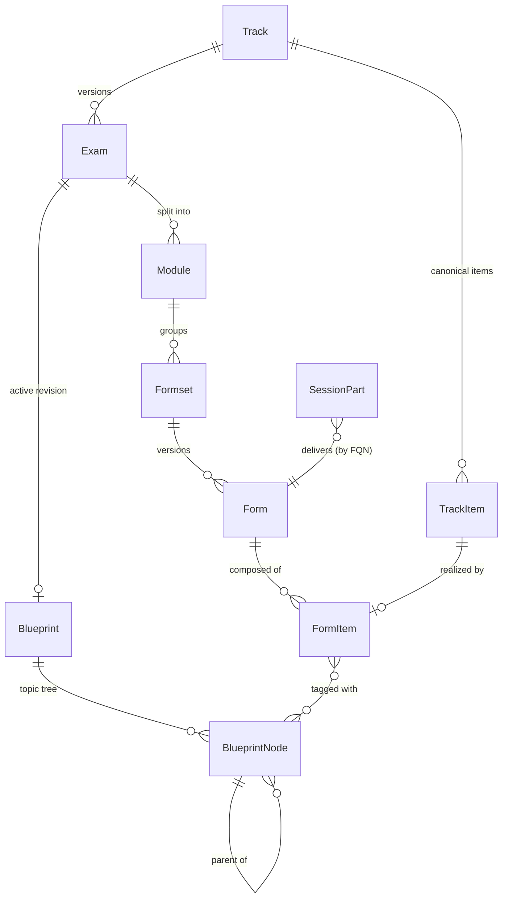

# ADR-052: Content-Authoring Taxonomy Import and Form Delivery

| Attribute | Value |
|-----------|-------|
| **Status** | Proposed |
| **Date** | 2026-06-12 |
| **Deciders** | Architecture Team |
| **Extends** | [ADR-050](./ADR-050-definition-instance-duality.md), [ADR-051](./ADR-051-provisioning-sources.md) |
| **Related ADRs** | [ADR-045](./ADR-045-multi-part-session-part-model.md) (Multi-part Session/Part), [ADR-044](./ADR-044-content-driven-lifecycle-engine.md) (Content-driven Lifecycle), [ADR-053](./ADR-053-authorization-policy-model.md) |

---

## 1. Context

The legacy _Track Manager_ owns the **certification-authoring** domain — a strict, versioned
taxonomy from an abstract `Track` down to the scored `FormItem`s on a specific `Form`. LCM's
session model selects content by **form-qualified name (FQN)** but has never modelled the taxonomy
that _produces_ those forms. Without it, the meaning of a `PartDefinition`'s selector
(`"Exam CCIE * * DES*"`) and its admissibility `requirements` is implicit, and there is nowhere to
attach exam content, blueprints, or per-item scoring.

## 2. Decision

### 2.1 Import the taxonomy as `content_package` definitions

Model the authoring taxonomy as `ResourceDefinition`s with
`provisioning_source = content_package`, ids as **deterministic slugs** derived from the parent
chain (so re-sync is idempotent — a duplicate id is a conflict, not a new node):

- **Track / TrackItem** — the certification line and its canonical item catalogue.
- **Exam** — a versioned realisation (`Draft → Released → Retired`) with an optional **Blueprint**.
- **Blueprint / BlueprintNode** — the weighted, self-referential topic tree.
- **Module → Formset → Form → FormItem** — the section → form-family → form → scored-item path.
  A `FormItem` references its `TrackItem`, carries **type-driven scoring**, and is tagged with
  `BlueprintNode`s.

### 2.2 Form delivery — no runtime Form instance

A `Form` is **authored content**, not a running resource. A `SessionPart` (the timed instance)
**delivers** a `Form` by binding its FQN; there is **no** separate "Form instance" in the runtime
tree. A `PartDefinition`'s `requirements` are **admissibility filters** (ported from the legacy
`SessionPartRequirement`) constraining which `Form` may fill the slot: `track_types`,
`track_levels`, `track_acronyms`, `exam_versions`, `module_acronyms`, `parts_count`,
`requires_pod`.

### 2.3 FQN as the join key

The six-token FQN (`{Type} {Level} {Acronym} v{version} {module} {form}`) is the stable key a
`PartDefinition` selector resolves against, and the same key LDS / SE / the environment resolver
already use. The taxonomy makes that key **first-class** rather than an opaque string.

### 2.4 Seeding & sync

Authored content is synced through the existing content-package flow (ADR-023/024); per-part
automation (`JobDefinition`, `ReportDefinition`) and the part **lifecycle** (ADR-044) travel in the
same package. The denormalised, queryable read side is preserved (each node's ancestor coordinates
are projected down) so list/filter endpoints work without joins.

## 3. Consequences

**Positive** — selectors and requirements now have a concrete referent; exam content, blueprints,
and scoring have a home; idempotent slug ids make re-sync safe; one taxonomy serves authoring,
selection, and grading.

**Negative / trade-offs** — a sizeable domain to port (nine node types + projections); strict
slug/FQN rules must be preserved exactly to keep ids stable across services.

## 4. Related

- [definition-catalog-model.md](../solution/definition-catalog-model.md) — full taxonomy + Form
  delivery.
- [session-model.md](../solution/session-model.md) — how a `SessionPart` selects/delivers a Form.
