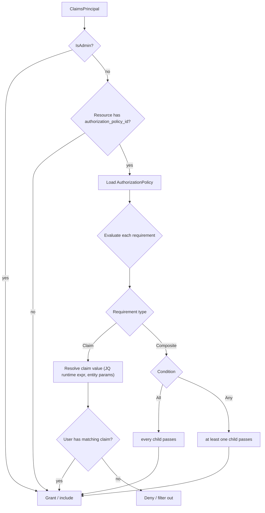

# ADR-053: Authorization Policy Model Port

| Attribute | Value |
|-----------|-------|
| **Status** | Proposed |
| **Date** | 2026-06-12 |
| **Deciders** | Architecture Team |
| **Extends** | [ADR-050](./ADR-050-definition-instance-duality.md) (Definition/Instance Duality) |
| **Related ADRs** | [ADR-052](./ADR-052-content-authoring-taxonomy.md), [ADR-001](./ADR-001-api-centric-state-management.md) |

---

## 1. Context

LCM authenticates with **Keycloak/OIDC** and enforces coarse **RBAC** at the application layer.
The legacy _Track / Session / Pod_ managers carry a richer, **per-resource** authorization model:
a reusable `AuthorizationPolicy` (a named set of `AuthorizationRequirement`s) that can guard any
definition or resource, evaluated with **JQ runtime expressions** against the entity under check
to **filter** what each user may see (e.g. _"the user's `track` claim must equal this track's id"_).
RBAC alone cannot express that data-dependent, per-entity filtering.

## 2. Decision

### 2.1 Port the policy model as definitions

Model `AuthorizationPolicy` as a `seed` `ResourceDefinition` composed of embedded
`AuthorizationRequirement`s (a child value structure, **not** an aggregate). Any definition or
resource references one via `authorization_policy_id`.

- **Claim requirement** — `claim_type` (regex-capable) + optional `claim_value`. The value may be
  a **JQ runtime expression** evaluated against the entity (keyed by upper-cased type name, e.g.
  `TRACK`). Absence ⇒ existence check only.
- **Composite requirement** — `All` or `Any` over nested requirements (recursive).

### 2.2 Authentication stays Keycloak; authorization filters

Keycloak/OIDC remains the **authentication** layer (cookie/BFF for UI, JWT for API — unchanged).
The policy model adds **authorization filtering** on top: the `…ForCurrentUser` query pattern loads
candidates, then includes those with **no** policy _or_ whose policy the principal satisfies.
**Admin principals bypass** all checks.

### 2.3 Persistence & evaluation

`AuthorizationPolicy` is state-based like every aggregate (ADR-051). Evaluation needs a **JQ
expression evaluator** as a `lcm_core` service; claims come from the validated Keycloak token. The
evaluator is invoked by query handlers to **filter** (not hard-fail) result sets.

## 3. Consequences

**Positive** — fine-grained, data-dependent, per-resource visibility the RBAC layer cannot
express; reusable named policies; consistent with the legacy contract and seed assets.

**Negative / trade-offs** — adds a JQ evaluator dependency and an evaluation cost on list
endpoints; policy authoring must map onto Keycloak claim shapes; two authorization concepts
(Keycloak roles + policies) coexist and must be kept clearly scoped (authN vs per-resource authZ).

## 4. Related

- [definition-catalog-model.md](../solution/definition-catalog-model.md) — authorization model in
  context.
