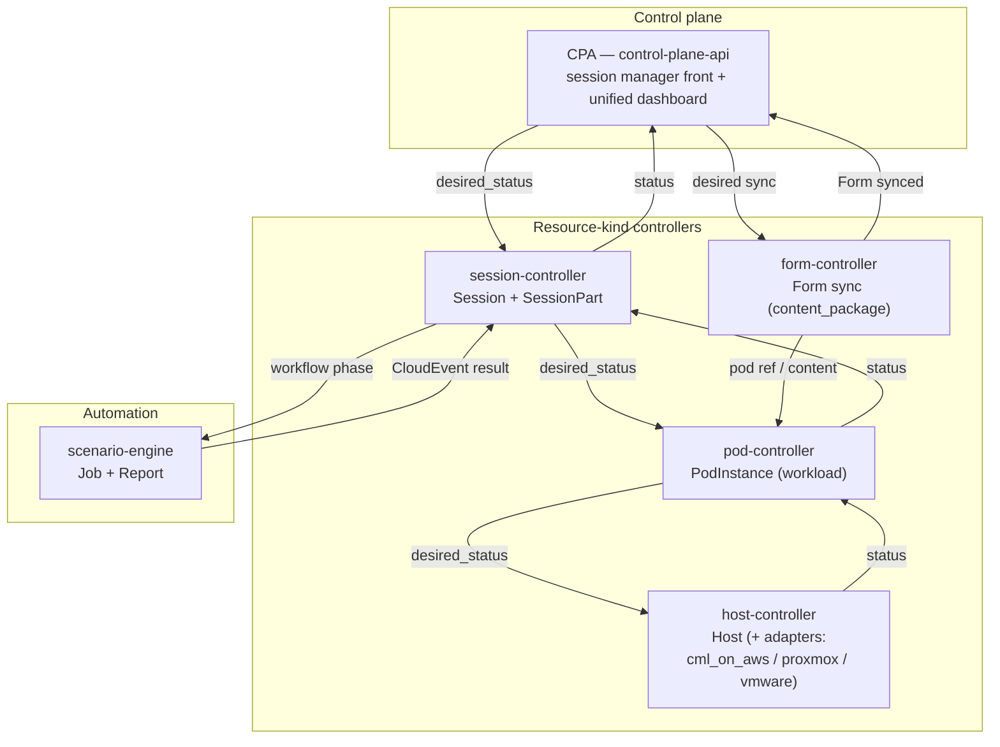

# ADR-054: Controller Topology by Resource Kind

| Attribute | Value |
|-----------|-------|
| **Status** | Proposed |
| **Date** | 2026-06-12 |
| **Deciders** | Architecture Team |
| **Extends** | [ADR-047](./ADR-047-generic-reconciliation-framework.md) (Generic Reconciliation Framework) |
| **Supersedes** | service topology of [ADR-016](./ADR-016-license-operations-via-worker-controller.md), [ADR-017](./ADR-017-lab-operations-via-lablet-controller.md) (the controller boundaries, not the reconcile-through-controller principle) |
| **Related ADRs** | [ADR-002](./ADR-002-separate-resource-scheduler-service.md) (scheduler role re-scoped — §2.3), [ADR-035](./ADR-035-legacy-scheduler-service-removal.md) (scheduler role re-scoped), [ADR-016](./ADR-016-license-operations-via-worker-controller.md), [ADR-017](./ADR-017-lab-operations-via-lablet-controller.md), [ADR-046](./ADR-046-host-abstraction-and-pod-host-type-split.md) (Host = generalized worker — §2.1), [ADR-050](./ADR-050-definition-instance-duality.md), [ADR-052](./ADR-052-content-authoring-taxonomy.md), [ADR-059](./ADR-059-form-as-first-class-synced-resource.md) (`form-controller` owns Form sync) |

> **Rev 2 (2026-06-16).** The original §2.1 folded `worker-controller` **into** `pod-controller`
> and named the content-sync owner `content-controller`. This revision **splits Host into its own
> `host-controller`** (Host = the generalized `CmlWorker`, the runtime substrate a `Pod` binds to —
> ADR-046) and renames the content-sync owner **`form-controller`** to match the synced unit of
> [ADR-059](./ADR-059-form-as-first-class-synced-resource.md). Target reconcilers are now
> `session-` / `form-` / `pod-` / `host-controller` + CPA + SE.

---

## 1. Context

The current services (`lablet-controller`, `worker-controller`, `resource-scheduler`,
`scenario-engine`, `CPA`) were carved along the **old** model: a single `LabletSession`, CML
workers, and a scheduler. With the generalized tree (ADR-036/045/046), the Definition/Instance
duality (ADR-050), and the imported content taxonomy (ADR-052), those boundaries no longer match
the resource kinds we reconcile. We want service boundaries that align with the **per-type
managers** of ADR-047 — one owner per resource kind — rather than per delivery _profile_
(lablet / practicelab / expert) or per _platform_ (cml / proxmox / vmware).

## 2. Decision

### 2.1 Split by resource kind

| Controller | Owns (reconciles) | Replaces / absorbs |
|---|---|---|
| **CPA** | Control plane: session-manager front, scheduling intent, **unified dashboard**, **seeds** the `seed` catalogue/config (inert, no reconcile). | — |
| **session-controller** | `Session` + `SessionPart` (ordering, gating, part lifecycle). | the session half of `lablet-controller`. |
| **form-controller** | `Form` **sync** (Mosaic → RustFS → LDS + SE fan-out) — the single synced `content_package` unit (ADR-059); the surrounding taxonomy is inert catalogue metadata. | the content-sync half of `lablet-controller`. |
| **pod-controller** | `PodInstance` (any `PodType`) — the workload (ADR-046). | the pod half of `lablet-controller`. |
| **host-controller** | `Host` (any `HostType`) with **host adapters** for `cml_on_aws` / `proxmox` / `vmware` **inside** (ADR-046) — the runtime substrate a `Pod` binds to; the generalized `CmlWorker`. | `worker-controller`. |
| **scenario-engine** | `Job` + `Report` (untimed automation instances). | unchanged in role. |

### 2.2 Why resource-kind (not profile or platform)

- **Profile** controllers (lablet / practicelab / expert) would duplicate the same reconcile logic
  per delivery kind — exactly what ADR-047 unifies. Profiles are **data** (`session_type`), not
  services.
- **Platform** controllers (cml / proxmox / vmware) would fragment `Host` reconciliation; the
  platform difference is a **host adapter** detail (ADR-046), so it lives **inside** host-controller,
  not as separate services. `Pod` (workload) and `Host` (platform) are **separate kinds** — a pod
  binds to a host — so they get separate controllers, not one merged service.
- **Resource-kind** controllers map 1:1 to per-type managers, keep intent-down/status-up clean, and
  let each service own one `desired_status` contract.

### 2.3 Scheduling

`resource-scheduler`'s timeslot booking/allocation (ADR-002) folds into the control plane as the
intent producer (it sets `desired_status` + `Timeslot`); it is not a reconciler of a resource kind.

## 3. Consequences

**Positive** — service boundaries match resource kinds and per-type managers; platform variety is
an adapter concern, not a service explosion; the content-sync, session, and pod concerns currently
tangled in `lablet-controller` separate cleanly.

**Negative / trade-offs** — a real re-map of existing services: split `lablet-controller` into
`session-` / `form-` / `pod-controller`, and **rename `worker-controller` → `host-controller`**
(generalized beyond `cml_on_aws`); since this is local-only with no migration window, the cut is
clean but touches deployment, Makefiles, and the workspace layout.

## 4. Related

- [resource-model.md](../solution/resource-model.md) — manager registry per kind.
- [unified-resource-management.md](../solution/unified-resource-management.md) — planes overview.
