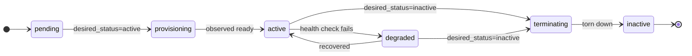

# ADR-055: Per-Resource-Kind Lifecycle State Machines

| Attribute | Value |
|-----------|-------|
| **Status** | Proposed |
| **Date** | 2026-06-13 |
| **Deciders** | Architecture Team |
| **Extends** | [ADR-047](./ADR-047-generic-reconciliation-framework.md) (Generic Reconciliation Framework), [ADR-050](./ADR-050-definition-instance-duality.md) (Definition/Instance Duality) |
| **Related ADRs** | [ADR-036](./ADR-036-resource-management-abstraction-layer.md), [ADR-037](./ADR-037-timeslot-management.md), [ADR-045](./ADR-045-multi-part-session-part-model.md), [ADR-046](./ADR-046-host-abstraction-and-pod-host-type-split.md), [ADR-054](./ADR-054-controller-topology-resource-kind.md) |

---

## 1. Context

The generic reconciliation framework (ADR-047) gives every resource the same **observe → diff →
act → record** loop, and the layered state abstraction (ADR-036) gives every resource a `status`
(observed), a `desired_status` (intent), and — for content-driven parts — a `workflow` `phase`.
What is **not** yet written down is the **concrete, per-kind state machine**: the legal `status`
values, the legal `desired_status` targets, and the transitions each per-type manager is allowed to
drive for `Session`, `SessionPart`, `PodInstance`, `Host`/`Worker`, and the untimed `Job` /
`Report`. Without a single normative source, each manager risks inventing its own vocabulary, which
breaks the "one `desired_status` contract per kind" goal of ADR-054 and makes the unified dashboard
(ADR-048) hard to render consistently.

## 2. Decision

> **Stub.** This ADR will define one canonical state machine per resource kind. The shape below is
> the agreed skeleton; the per-kind tables are to be filled in during ratification.

### 2.1 Common shape

Every `TimedResource` shares the same backbone — intent flows **down** (`desired_status`), observed
state flows **up** (`status`):

### 2.2 Per-kind machines (to be completed)

| Kind | Tier | `status` set | `desired_status` set | `workflow.phase` (if any) |
|---|---|---|---|---|
| `Session` | L2 (timed) | _TBD_ | _TBD_ | n/a (gates parts) |
| `SessionPart` | L2 (timed) | _TBD_ | _TBD_ | collect → grade → report |
| `PodInstance` | L2 (timed) | _TBD_ | _TBD_ | n/a |
| `Host` / `Worker` | L2 (timed) | _TBD_ | _TBD_ | n/a |
| `Job` | L1 (untimed) | _TBD_ | _TBD_ | Collect → Evaluate → Report |
| `Report` | L1 (untimed) | _TBD_ | _TBD_ | n/a |

### 2.3 Rules

- Each kind declares its state set **once** in `lcm_core`; managers may only drive declared
  transitions.
- `desired_status` is the **only** lever the control plane pulls; managers never set intent.
- Untimed instances (`Job`, `Report`) inherit their parent's window but own an independent
  completion machine.

## 3. Consequences

**Positive** — one normative source for every kind's states; the dashboard and reconcilers share a
vocabulary; ADR-054's "one `desired_status` contract per kind" becomes enforceable.

**Negative / trade-offs** — requires auditing the current ad-hoc status strings across services and
consolidating them; some existing values will be renamed (clean cut, no migration window since
local-only).

## 4. Related

- [resource-model.md](../solution/resource-model.md) — the `TimedResource` tree and reconcile loop.
- [ADR-054](./ADR-054-controller-topology-resource-kind.md) — the controller that owns each kind.
- [ADR-048](./ADR-048-unified-resource-dashboard.md) — consumes these states for rendering.
