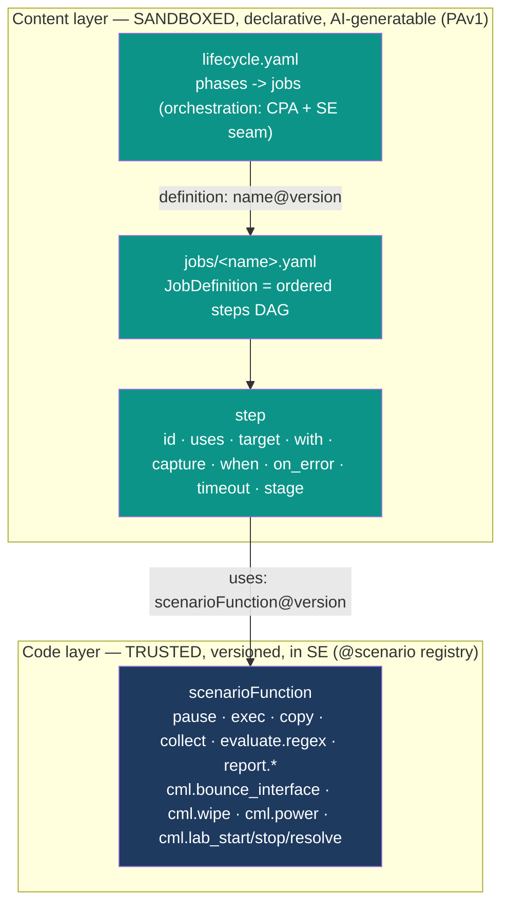

# ADR-057: Content-Driven Lifecycle DSL — Primitives, Phases, and scenarioFunctions

| Attribute | Value |
|-----------|-------|
| **Status** | Proposed |
| **Date** | 2026-06-13 |
| **Deciders** | Architecture Team |
| **Extends** | [ADR-049](./ADR-049-unified-workflow-dsl.md) (Unified Workflow DSL), [ADR-044](./ADR-044-content-driven-lifecycle-engine.md) (ScenarioEngine service) |
| **Related ADRs** | [ADR-034](./ADR-034-pipeline-executor-lifecycle-handlers.md), [ADR-038](./ADR-038-step-handler-registry-and-reconciler-decomposition.md), [ADR-047](./ADR-047-generic-reconciliation-framework.md), [ADR-055](./ADR-055-per-resource-kind-lifecycle-state-machines.md), [ADR-058](./ADR-058-lifecycle-data-flow-and-variable-scopes.md) (data-flow scopes) |
| **Supersedes** | the inline-`tasks` body shape of [ADR-049](./ADR-049-unified-workflow-dsl.md) §2.1 and the ServerlessWorkflow task-type list of [ADR-044](./ADR-044-content-driven-lifecycle-engine.md) §2.8 |

---

## 1. Context

ADR-049 unified the _orchestration_ shape: a `lifecycle.yaml` declares **phases**, each with an
`engine` (`pipeline` = native LCM steps, `workflow` = SE job) and gating. ADR-044 introduced the
SE as a separate service with an `@scenario` registry and sketched a ServerlessWorkflow-inspired
DSL with jq. But the **body of a job** — the actual unit-of-work vocabulary the SE runs — is
described **three incompatible ways** across the docs, and **none of them can express the real
content** we must ship.

The fidelity bar is the published lablet `deployment/lds/content/LAB-1.1.1/` (legacy RCUv1 XML).
Its four phases exercise primitives that have no home in the current DSL:

- **`post_init`** (`sb_post_init.xml`): pause, run a command on a device and capture output, push
  a content file to the POD over a PAT port (`tScp`), regex-gate a captured value into a flag
  (`tVerify`), and **control-node operations** (`bounce_interface`, `cmlctl --action stop`).
- **`pre_collect`** (`sb_pre_collect.xml`): wipe devices via the control node, bounce interfaces,
  and run the **candidate's own solution** (`py_deploy.py`, `run-playbook.sh`) over a serial
  console with venv activate/deactivate.
- **`grade`** (`grade.xml`): collect `show` output (`verify subject='commandOutput'`) and grade a
  captured variable with a regex check (`verify subject='parse'`, `mode`, `issue_replace`), across
  10 points / 9 subsections.
- **Connector model** (`pod.xml`): per-device `unit-template`/`connector` (Telnet, UnixSSH via PAT
  `5052`, serial, control node) with prompts, timeouts, and credentials.

Three structural inconsistencies block authoring (and block AI generation):

1. **`LifecyclePhaseJob` vs `scenarioFunction` is unreconciled.** Is a job a _fixed_
   Collect→Evaluate→Report triad ([generic-pattern.md](../solution/generic-pattern.md)), or a _free_
   task DAG ([ADR-044](./ADR-044-content-driven-lifecycle-engine.md) §2.8)? Authors do not know
   whether they compose primitives or fill a template.
2. **No closed primitive set.** `tScp`, `tVerify` gating, control-node ops, candidate-solution
   exec, pauses, and conditionals have no primitive. Examples LAB-0.1/0.2 can only express
   `collect` + regex grading.
3. **Overloaded terminology.** _JobDefinition / workflow / scenario / scenarioFunction / step
   handler / task / native step_ are used interchangeably.

This ADR resolves all three by defining **one closed primitive set** (`scenarioFunction`s) and
**one job body shape** (a declarative step DAG that composes them). The companion
[ADR-058](./ADR-058-lifecycle-data-flow-and-variable-scopes.md) defines the data-flow scopes that
the `with`/`capture`/`when` fields reference.

## 2. Decision

### 2.1 Two layers, one vocabulary



| Concept | Defined by | Mutable by authors? | Persisted as |
|---|---|---|---|
| **scenarioFunction** | **Code** — an `@scenario(name, version)` class in `scenario-engine/scenarios/` | **No** (PR + version bump) | the in-memory SE registry (ADR-044 §2.9) |
| **JobDefinition** | **Content** — `PAv1/jobs/<name>.yaml`, a step DAG | **Yes** (authoring / LLM) | a `content_package` `ResourceDefinition` (ADR-051) |
| **Job** | **Runtime** — one execution of a JobDefinition bound to a phase | — | an untimed `ResourceInstance` (ADR-050) |

> **The resolution of Q1.** A **`scenarioFunction`** is the _code-defined, trusted primitive_. A
> **`LifecyclePhaseJob`** (henceforth just **JobDefinition**, the content artifact, and **Job**, its
> runtime) is a _content-defined phase body that composes scenarioFunctions into a DAG_. Authors and
> LLMs write **only declarative wiring** — they never write imperative code, never add a primitive.
> This keeps content sandboxed, validatable, and generatable.

### 2.2 The closed scenarioFunction primitive set

The vocabulary is **closed and orthogonal** — small enough for an LLM to hold in context, complete
enough to express LAB-1.1.1. Adding a primitive is a code change with a version bump, never a
content change.

| `uses:` | Stage | Purpose | Key `with:` inputs | `capture:` outputs | Legacy origin |
|---|---|---|---|---|---|
| `pause@v1` | setup | Wait/settle | `seconds` | — | `tPause` |
| `exec@v1` | setup | Run command/script on a connector, capture output, gate | `command` \| `script`, `suppress_error?` | `stdout`, `ok`, `error` | `tExecute`, `tExecuteBatch` |
| `copy@v1` | setup | Push a content file to the POD host | `source` (content ref), `dest`, `via_port?` | `ok` | `tScp` |
| `cml.bounce_interface@v1` | setup | Bounce an interface via the control node | `device`, `interface`, `serial_port` | `ok` | `bounce_interface` |
| `cml.wipe@v1` | setup | Wipe devices via the control node | `devices[]` | `ok` | `cmlctl --action wipe` |
| `cml.power@v1` | setup | Start/stop a node or ext-conn | `node`, `action` (`start`\|`stop`) | `ok` | `cmlctl --action stop` |
| `cml.lab_resolve@v1` | setup | Resolve/import the lab topology | `definition_id` | `lab_id`, `title`, `nodes` | (native) |
| `cml.lab_start@v1` | setup | Start the lab and poll to convergence | `lab_id` | `lab_state`, `poll_count` | (native) |
| `cml.lab_stop@v1` | setup | Stop the lab | `lab_id` | `ok` | (native) |
| `collect@v1` | collect | Run a `show` command on a device, capture output | `command`, `match?` | `output` | `verify subject='commandOutput'` |
| `evaluate.regex@v1` | evaluate | Regex check a captured var → pass/fail + issue | `source`, `regex`, `mode` (`positive`\|`negative`), `flags[]?`, `issue?` | `passed`, `issue?` | `verify subject='parse'`, `tVerify` |
| `report.score@v1` | report | Assemble a ScoreReport from graded items | `items[]`, `report_class?` | `report_ref` | `reportClass='LabletReport'` |
| `report.readiness@v1` | report | Assemble a ReadinessReport | `checks[]` | `report_ref` | (Initialization) |

Notes:

- **`evaluate.regex` is the single check primitive** and absorbs the legacy `tVerify` gate. In a
  **grading** stage its `passed`/`issue` feed `report.score`; in a **setup** stage its captured
  `passed` flag feeds a later step's `when:` (this is exactly `tVerify … set='file.OK'` →
  `if='file.OK'`). One primitive, two uses — no separate "verify-gate" type.
- **Control-node operations are first-class `cml.*` scenarioFunctions**, not raw shell on a magic
  `cmlctl-0` device. The author names the operation; SE owns the mechanics, the `cml_password`
  (resolved from `runtime_env.*`, never hard-coded — see ADR-058), and the serial-port wiring.
- **Candidate-solution execution** (`py_deploy.py`, `run-playbook.sh`) is just `exec@v1` with a
  `script` on the `workstation_serial` connector — no special primitive needed.
- The `report.*` primitive actually emitted is selected by the job's `process_type` (§2.5).

### 2.3 The connector model (target binding)

`pod.xml`'s `unit-template`/`connector` becomes a declarative `PAv1/connectors.yaml`. Each entry is
a **named connector** a step selects with `target:`. Prompts, timeouts, transports, serial/PAT ports,
and credentials are **resolved from `runtime_env.*`** (ADR-058) — the connector file declares the
_shape_, the runtime supplies the _facts_.

```yaml
# PAv1/connectors.yaml  — derived 1:1 from RCUv1/pod.xml
apiVersion: pav1
kind: ConnectorModel
metadata:
  name: LAB-1.1.1
spec:
  connectors:
    - name: rtr01
      class: cisco_common            # CiscoCommon
      transport: telnet              # serial console reached over Telnet
      prompt: "${ runtime_env.devices.rtr01.prompt }"
      enable_password: "${ runtime_env.devices.rtr01.enable_password }"
      port: "${ runtime_env.devices.rtr01.serial_port }"
    - name: workstation_22
      class: unix
      transport: ssh                 # UnixSSH via PAT
      via_port: "${ runtime_env.devices.workstation.pat_port }"   # 5052 -> 22
      username: "${ runtime_env.devices.workstation.username }"
      password: "${ runtime_env.devices.workstation.password }"
    - name: workstation_serial
      class: unix
      transport: telnet              # serial console
      port: "${ runtime_env.devices.workstation.serial_port }"
    - name: control_node
      class: control                 # cmlctl-0 control node — used only by cml.* primitives
      transport: telnet
      port: "${ runtime_env.control_node.serial_port }"
```

`cml.*` primitives implicitly target the `control` connector — the author never targets it by hand.

### 2.4 The JobDefinition body — one declarative step DAG

A `JobDefinition` is an **ordered list of steps**. There is no inline-`tasks` block in
`lifecycle.yaml` (superseding ADR-049 §2.1's inline body) and no free ServerlessWorkflow task-type
zoo (superseding ADR-044 §2.8). The single step shape is:

```yaml
- id: <unique-in-job>            # required — stable id, also the capture namespace
  uses: <scenarioFunction>@<ver> # required — must exist in the SE registry
  target: <connector-name>       # optional — omitted for pause/report/cml.* (implicit)
  with: { <input>: <value|expr> }# inputs; values may be ${ jq } over the scopes
  capture: { <var>: <output-ref> }# write named outputs into vars.* (see ADR-058)
  when: "${ <jq-bool-expr> }"    # optional gating; step is skipped if false
  on_error: { action: fail|continue|retry, retries?: <n>, backoff?: <s> }
  timeout: <seconds>             # optional per-step timeout
  stage: setup|collect|evaluate|report  # optional grouping (default: setup)
```

`stage` is a **soft grouping**, not a control structure: it labels a step for report assembly and
documents the Collect→Evaluate→Report intent. SE executes steps **in document order**, honouring
`when` and `on_error`; a step may read any `vars.*` captured by an earlier step (sequential
data-flow). Parallelism is deferred — the legacy content is sequential, and a DAG executor can be
added later without changing the step shape.

> **Q1 closure restated.** A phase's body is **a list of `scenarioFunction` calls**, _not_ a fixed
> triad and _not_ an open task language. The Collect→Evaluate→Report triad survives as the
> **`stage` convention** and as `process_type`-driven report selection — it is the _recommended
> ordering_, enforced softly by the schema (a `Grading` job SHOULD contain `collect` →
> `evaluate.*` → `report.score`), never a rigid template the author must fill.

**Worked example — the gate pattern.** The legacy `tVerify set='file.OK'` / `if='file.OK'` flag
(check a result, then conditionally run later steps) becomes `capture:` on an `evaluate.regex@v1`
step feeding a downstream `when:`. From
[`LAB-0.1/PAv1/jobs/post_init.yaml`](../solution/examples/LAB-0.1/README.md#jobspost_inityaml):

```yaml
- id: verify_package           # was tVerify (set="file.OK", if="CMD1.OK")
  uses: evaluate.regex@v1
  when: "${ vars.cmd1_ok }"     # only check if the ls step succeeded
  with:
    source: "${ vars.files }"   # the captured `ls` output
    regex: "desktop_package\\.tgz"
    mode: positive
  capture: { passed: file_ok }  # was set="file.OK"

- id: unpack                    # was tExecute (if="file.OK")
  uses: exec@v1
  target: workstation_22
  when: "${ vars.file_ok }"     # gated on the verify above
  with: { command: "tar -C /home/cisco/Desktop/tasks/ -xzf …/desktop_package.tgz" }
```

The same primitive (`evaluate.regex@v1`) serves both roles: a **gate** in a `setup` stage (its
`passed` flag drives a `when:`) and a **graded check** in an `evaluate` stage (it feeds
`report.score`). See [`LAB-1.1.1`](../solution/examples/LAB-1.1.1/README.md) for the full 1:1 port.

### 2.5 process_type ↔ report, and the legacy-phase mapping

`process_type` is the job's **intent**; it selects the terminal `report.*` primitive and the
report class. This reconciles `process_type` (ADR-055 / generic-pattern) with the step DAG.

| `process_type` | Typical stages | Terminal primitive | Report |
|---|---|---|---|
| `Initialization` | setup → collect → evaluate | `report.readiness@v1` | ReadinessReport |
| `Grading` | setup → collect → evaluate | `report.score@v1` | ScoreReport |
| `Change` | setup → collect → evaluate | `report.change@v1` | ChangeReport |
| `Submission` | setup → collect | `report.submission@v1` | SubmissionReport |
| `Archive` | setup | — | ArchiveReport |

**Legacy phase → new phase + process_type** (the missing mapping, now documented):

| Legacy RCUv1 phase | New `lifecycle.yaml` phase | JobDefinition | `process_type` |
|---|---|---|---|
| `init` (implicit) | `instantiate` | native steps + `cml.lab_resolve`/`cml.lab_start` | `Initialization` |
| `post_init` (`sb_post_init.xml`) | `post_init` | `jobs/post_init.yaml` (setup-heavy) | `Initialization` |
| `pre_collect` (`sb_pre_collect.xml`) | `grade` (setup stage) | `jobs/grade.yaml` steps `stage: setup` | `Grading` |
| `grade.xml` `verify commandOutput` | `grade` (collect stage) | `jobs/grade.yaml` steps `stage: collect` | `Grading` |
| `grade.xml` `verify parse` + report | `grade` (evaluate+report) | `jobs/grade.yaml` steps `stage: evaluate`/`report` | `Grading` |

`pre_collect` is **not a separate phase** — it is the **setup stage of the `grade` job** (it prepares
the lab so the collect stage can read it). One job, four stages, one `process_type`.

### 2.6 Canonical PAv1 layout (converges the three competing layouts)

There is **ONE** content layout (resolving the ADR-044 §1.3 / LAB-0.1 / LAB-0.2 divergence). A
single-part lablet uses the top level directly; a multi-part session repeats the per-part subtree
under `parts/` (each part is the single-part shape):

```
PAv1/
├── manifest.yaml          # definition metadata + pod_type (single-part)  OR
│                          #   kind: SessionDefinition + parts[] (multi-part)
├── lifecycle.yaml         # phases -> { native_steps_by_pod_type, jobs[] }   (CPA + SE seam)
├── connectors.yaml        # connector model (§2.3)                          (runtime_env binding)
├── topology/
│   ├── devices.json       # instance config (instance_type, ami, disk…)     (LCM instantiate)
│   └── ports.json         # per-device serial/vnc/pat ports                 (LCM ports_alloc)
├── jobs/                  # JobDefinitions — the step DAGs (§2.4)            (SE)
│   ├── post_init.yaml
│   └── grade.yaml
├── grading/
│   └── rubric.yaml        # EvaluationRuleset — graded items + checks + points (SE evaluate)
├── reports/
│   └── score_report.yaml  # ProcessReportSpec — report shape                (SE report)
└── files/                 # packaged payloads pushed by copy@v1 (desktop_package.tgz)
```

- **Single canonical lifecycle shape:** `phases[].{native_steps_by_pod_type, jobs[]}`. The
  single-part case uses the `cml_on_aws` (or `none`) entry of `native_steps_by_pod_type`; the
  multi-part case applies the same `jobs[]` per part under `part_workflow`. This subsumes LAB-0.1's
  `native_steps` (now `native_steps_by_pod_type.cml_on_aws`) and LAB-0.2's `part_workflow` — they
  are the same shape at two scopes.
- **`jobs[]` always reference a JobDefinition file** (`definition: <name>@<version>` →
  `jobs/<name>.yaml`). The step DAG never lives inline in `lifecycle.yaml`. This kills the
  "inline tasks vs separate files" inconsistency: orchestration is in `lifecycle.yaml`, bodies are
  in `jobs/`.
- `grading/rubric.yaml` and `reports/score_report.yaml` are **referenced by** the `evaluate`/`report`
  steps (the rubric supplies the `items[]`; the report spec supplies the `report_class`/shape).

### 2.7 AI-generation contract + sync-time validation (Q4)

A JSON Schema set is **published from `lcm_core`** at `src/core/lcm_core/schemas/`:

| Schema file | Validates |
|---|---|
| `lifecycle.schema.json` | `PAv1/lifecycle.yaml` (phases, native steps, job refs, gating) |
| `job-definition.schema.json` | `PAv1/jobs/*.yaml` (the step DAG: `id`/`uses`/`target`/`with`/`capture`/`when`/`on_error`/`timeout`/`stage`) |
| `connector-model.schema.json` | `PAv1/connectors.yaml` |
| `evaluation-ruleset.schema.json` | `PAv1/grading/rubric.yaml` |
| `process-report-spec.schema.json` | `PAv1/reports/*.yaml` |
| `scenario-functions.catalog.json` | **generated** from the SE `@scenario` registry — each primitive's `input_schema`/`output_schema` |

Validation runs at **content sync** (ADR-023): both CPA and SE load these schemas. A step's `with:`
is validated against the referenced scenarioFunction's `input_schema`, and its `capture:` keys
against the `output_schema`, from `scenario-functions.catalog.json`. An invalid package **fails the
sync** (no partial ingestion, per ADR-049 §2.3). This makes a phase/step/task machine-validatable
the moment it is authored — the precondition for reliable LLM generation.

**What an LLM is given / emits:**

| LLM input | LLM output |
|---|---|
| Lab brief (objectives, grading rubric prose) | `PAv1/jobs/*.yaml` (step DAGs) |
| Topology (`devices.json`, `ports.json`) | `PAv1/connectors.yaml` |
| Connector model (transports, prompts) | `PAv1/grading/rubric.yaml` |
| **scenario-functions.catalog.json** (the closed vocabulary + each primitive's I/O schema) | `PAv1/lifecycle.yaml` phase→job bindings |
| The 4 data-flow scopes (ADR-058) | `PAv1/reports/score_report.yaml` |

The LLM **selects** from a closed primitive set and **wires** scopes; it never invents a primitive
or writes code. The generated package is then schema-validated before it can sync.

## 2.8 Composition & reuse — considered alternatives and the deferred `CompositeScenario`

An earlier draft, [SPEC-001 (scenario-definition-format)](../solution/scenario-definition-format_draft.md),
proposed a **fundamentally different authoring model**: authors write whole _Scenarios_ — typed,
versioned, parameterised units with their own task vocabulary (`collect` / `parse` / **`scenario`**)
— and **a scenario may invoke another scenario** (`action: scenario`, D16) and **iterate**
(`for_each`, D18). That model makes _content-defined composition_ a first-class authoring primitive.
ADR-057 §2.1–2.4 deliberately took the opposite cut: composition is over a **closed set of code
primitives**, and a `JobDefinition` is a **flat step DAG** with no author-defined, callable,
parameterised sub-unit. This section records _why_, what the cut costs, and the bounded extension
that recovers the upside without re-opening the sandbox.

### Three models on the table

| | **A — Author-defined Scenarios** (SPEC-001) | **B — Closed primitives + flat DAG** (this ADR, §2.1–2.4) | **C — Hybrid: closed primitives + `CompositeScenario`** |
|---|---|---|---|
| Unit authors write | A parameterised, versioned **Scenario** with its own task language | A **flat step DAG** wiring code primitives | A flat DAG **plus** an optional content-defined, parameterised **CompositeScenario** of _closed primitives only_ |
| New behaviour added by | Authoring (a new scenario _is_ new behaviour) | Code PR + version bump (closed set) | Code PR for primitives; **authoring** only _re-composes_ existing primitives |
| Reuse / DRY | Strong — a library of scenarios | **None** — duplication is copied per device/step | Strong — composites are reused like primitives |
| Iteration | `for_each` (D18) | Not expressible (gap) | `for_each` step modifier (adopted from D18) |
| Sandbox boundary | **Soft** — authored logic is the execution surface | **Hard** — only trusted code executes | **Hard** — composites are pure wiring; no new execution surface |
| Validatable / LLM-target | Harder — a recursive DSL with its own scoping | Easiest — closed vocabulary, flat schema | Bounded — one extra schema (`composite`), same I/O-schema validation as a primitive |

### Why B is the baseline (and the real cost)

B wins on exactly the properties ADR-057 exists to protect: a **closed, orthogonal vocabulary** an
LLM can hold in context; a **hard sandbox** (only trusted code executes — authored content is pure
wiring); and **sync-time validatability** (§2.7). Model A re-introduces the precise failure mode the
ADR set out to kill — _authored logic as the execution surface_ — with a recursive DSL (own scoping,
own filters, own iteration) that is far harder to validate and to generate reliably.

The cost of B is **real and already visible in the golden port**. In
[`LAB-1.1.1`](../solution/examples/LAB-1.1.1/README.md) the collect stage hand-writes near-identical
step pairs that differ only by device — `c_rtr01_lo` / `c_rtr02_lo`, `c_sw01_vlan` / `c_sw02_vlan`,
`c_rtr01_ntp` / `c_rtr02_ntp` — and the rubric repeats the same Loopback0 up/up check per device.
A two-router lab is tolerable; an eight-node multi-part exam is copy-paste at scale, with the
attendant drift/maintenance risk. **B trades reuse for safety, and pays for it in duplication.**

Notably, B _already concedes the principle_: the evaluate stage does **not** spell out one
`evaluate.regex` step per rubric row — a single **ruleset-driven** `evaluate` step expands
`grading/rubric.yaml` into N checks ([LAB-1.1.1 §evaluate](../solution/examples/LAB-1.1.1/README.md)).
That is _constrained iteration over content_ in everything but name. The hybrid simply generalises
this already-accepted mechanism to the collect/setup stages.

### Decision: adopt B now; specify C as a **deferred, opt-in** extension

We **keep Model B as the normative v1** (the closed primitive set, the flat step DAG, §2.1–2.7).
We **do not** adopt Model A. We **specify** — but **defer building** — Model C, a bounded hybrid
that recovers A's reuse/iteration upside while preserving B's sandbox and validatability:

1. **`CompositeScenario`** — a new **content** kind (`PAv1/composites/<name>.yaml`), distinct from
   the code `scenarioFunction`. It declares typed `parameters` (input schema) and `export` (output
   schema) and a body that is **the same step DAG of §2.4**, but whose steps may `uses:` only
   **closed primitives or other composites** — never imperative code. It is invoked from any step
   via a **uniform call site**:

   ```yaml
   - id: check_lo0
     uses: composite:check_interface_up_up@v1     # resolves to PAv1/composites/check_interface_up_up.yaml
     target: rtr01
     with:  { interface: Loopback0, ip: "${ runtime_env.devices.rtr01.lo0_ip }" }
     capture: { interface_name: rtr01_lo_name }   # promoted from the composite's `export`
   ```

   The validator resolves `uses:` to either a `scenarioFunction` (catalogue, §2.7) **or** a
   `CompositeScenario` (synced content) and checks `with`/`capture` against its I/O schema
   identically. Composites run in an **isolated `vars.*` frame** (params in, `export` out) per
   [ADR-058 §2.6](./ADR-058-lifecycle-data-flow-and-variable-scopes.md) — never imperative code,
   never a new primitive, never write access to a trusted scope.

2. **`for_each`** — a step/composite modifier (adopted from SPEC-001 D18) that runs a step once per
   element of a list, binding a loop `var` into `vars.*` (with dot-notation for object lists). It
   collapses the `c_rtr01_*` / `c_rtr02_*` duplication into one `for_each` over a device list and is
   the natural superset of the rubric-driven expansion B already does.

**Guardrails carried over from SPEC-001 D16/D18** (so the sandbox stays hard):

- Composites compose **only** the closed primitive set (+ other composites) — **no** new execution
  surface; the trusted-code boundary of §2.1 is unchanged.
- **Max nesting depth 3**; **circular references detected at sync/registration** via a dependency
  graph (a malformed composite fails the sync, §2.7).
- A composite's `parameters`/`export` are **schema-published** exactly like a primitive, so the
  AI-generation contract (§2.7) and the closed catalogue are unaffected — the LLM sees composites
  as just more callable units with declared I/O.

**Why deferred, not built now.** The user-facing question — _"is it truly useful for authors to
edit their own scenarios?"_ — is an **evidence** question, and B is the safe default to gather that
evidence against. We adopt B, ship real content on it, and **promote C only when duplication in
authored packages crosses a pain threshold** (a heuristic: the same step/check pattern repeated
across ≥3 devices or ≥2 jobs). Building C speculatively would expand the validator, the schema set,
and the LLM contract before we know authors need it. The cut is reversible _upward_ (B is a strict
subset of C: every B job is a valid C job), so deferring costs nothing structurally.

> **Restated Q1 posture.** A phase body is still **a list of primitive calls** (B). C does not
> change that — it only lets a _named, parameterised group_ of primitive calls be **one reusable
> call** with declared I/O. Authors still never write code and never add a primitive.

### Pressure-test — `for_each` + `CompositeScenario` against the LAB-1.1.1 collect stage

To check the hybrid is real (not hand-waving), we rewrote the
[`LAB-1.1.1`](../solution/examples/LAB-1.1.1/README.md) collect stage with it. The proposed JSON
Schema is drafted at
[`content-format/schemas/composite.schema.json`](../content-format/schemas/composite.schema.json)
(marked **proposed/deferred** — not wired into sync validation).

**The composite** (`PAv1/composites/check_interface_up_up.yaml`) — bundles a `collect` + an up/up
`evaluate.regex` into one reusable, parameterised call. The device is the **call-site `target:`**,
inherited by the inner steps (so a composite acts on one connector, exactly like a primitive):

```yaml
apiVersion: pav1
kind: CompositeScenario
metadata: { name: check_interface_up_up, version: "1.0.0" }
spec:
  description: "Collect an interface's detail and assert it is up/up."
  parameters:
    interface: { type: string, required: true }     # device = the call-site target:
  export:
    detail: "${ vars.collect_if.output }"            # raw output, for further checks
    is_up:  "${ vars.assert_up.passed }"             # the pass/fail flag
  steps:
    - id: collect_if
      uses: collect@v1
      stage: collect
      with: { command: "show interface ${ parameters.interface }" }
      capture: { output: output }
    - id: assert_up
      uses: evaluate.regex@v1
      stage: evaluate
      with:
        source: "${ vars.collect_if.output }"
        regex: "${ parameters.interface } is up, line protocol is up"
        mode: positive
        flags: [multiline]
      capture: { passed: passed }
```

**The rewritten collect stage** — the 12 hand-written steps collapse to ~6. Per-router-pair commands
fold into one `for_each`; the two Loopback0 collects **and** their two rubric up/up rows fold into a
single composite call:

```yaml
# was c_rtr01_acl + c_rtr02_acl  → one for_each over the router group
- id: c_rtr_acl
  uses: collect@v1
  stage: collect
  for_each: { var: dev, in: "${ runtime_env.device_groups.routers }" }
  target: "@dev"
  with: { command: "show access-list" }
  capture: { "@dev.show_access_list": output }   # interpolated KEY → same flat vars.* namespace

# was c_rtr01_gi + c_rtr02_gi, c_rtr01_ntp + c_rtr02_ntp  → two more for_each (elided)
# was c_sw01_vlan + c_sw02_vlan  → one for_each over the switch group (elided)

# was c_rtr01_lo + c_rtr02_lo  AND  the two Loopback0 up/up rubric rows → one composite call
- id: check_loopbacks
  uses: composite:check_interface_up_up@v1
  for_each: { var: dev, in: "${ runtime_env.device_groups.routers }" }
  target: "@dev"
  with: { interface: Loopback0 }
  capture: { "@dev.lo0_up": is_up, "@dev.show_int_loop0": detail }

# rtr01-only command stays flat
- id: c_rtr01_ospf
  uses: collect@v1
  stage: collect
  target: rtr01
  with: { command: "show ip ospf neighbor" }
  capture: { rtr01.show_ip_ospf_nei: output }
```

**What the pressure-test confirmed (the win).** Collect-stage step count drops **12 → 6** on a
two-router lab; the ratio improves on larger topologies. Crucially, interpolating the loop var into
the **capture key** (`"@dev.show_access_list"`) reproduces the _exact_ flat `vars.<device>.<name>`
namespace the original used — so the existing `grading/rubric.yaml` `source:` references
(`rtr01.show_access_list`) keep working unchanged. This resolves the obvious "dynamic capture"
objection.

**What the pressure-test surfaced (the open questions — why C stays deferred).**

| # | Finding | Impact |
|---|---|---|
| **OQ-1** | Capture-key interpolation puts `${ }`/`@var` in **key** position, not just values | Small validator/schema special case (the live schemas don't allow it today) |
| **GAP-1** | `for_each … in` needs a **device role/group** list (`runtime_env.device_groups.routers`) | `topology/ports.json` + `connectors.yaml` don't model device groups yet; hard-coding the list in content would re-introduce the non-portability ADR-058 forbids. **Needs a topology addition first.** |
| **OQ-3** | A composite bundling `collect`+`evaluate` **overlaps the rubric-driven evaluate expansion** the model already uses (LAB-1.1.1 §evaluate) | Two reuse axes (rubric rows vs composites) now compete for where points/issues attach. Must decide: composites collect-only (points stay in rubric) **or** composites carry `points`. Unresolved. |
| **CAVEAT** | Artifacts use ADR-057 `uses`/`with`/`capture`; the **live** `scenario.schema.json` (`do`/`call`) and `lifecycle.schema.json` (`name`/`handler`) diverge | Building C presupposes **first reconciling ADR-057's step shape with the implemented PAv1 format** — a prerequisite, tracked separately. |

**Verdict.** The hybrid is **mechanically sound and delivers a real ~50% reduction** on the golden
port — but it also introduces a topology concept (device groups), a capture-key special case, and a
**second reuse axis that overlaps the rubric**. None is blocking; together they confirm the §2.8
decision: **specify C, ship B, and promote C only once authored content proves the duplication pain
and OQ-3 (rubric vs composite) is settled.**

## 3. Consequences

**Positive**

- **One mental model.** scenarioFunction = trusted primitive; JobDefinition = declarative DAG over
  primitives; process_type selects the report. Authors and LLMs compose, never code.
- **Full legacy fidelity.** Every LAB-1.1.1 task (`tScp`, `tVerify` gating, control-node ops,
  candidate-solution exec, pauses, conditionals, the connector model) maps to a primitive — proven
  by the `examples/LAB-1.1.1/` golden port.
- **One validator, sync-time.** The published schemas + generated primitive catalogue reject
  malformed content before runtime and give the LLM a machine-checkable target.
- **Terminology fixed** (Q3): see the glossary — _scenarioFunction_, _JobDefinition_, _Job_,
  _step_, _native step_ each defined once.

**Negative / trade-offs**

- The closed primitive set must be **deliberately curated**; a genuinely new capability needs a
  code PR + version bump (intended — it is the sandbox boundary).
- A generated `scenario-functions.catalog.json` couples sync-time validation to the SE registry
  version; the catalogue must be published as part of the SE release.

**Neutral**

- The SE executor (ADR-044) and native `PipelineExecutor` (ADR-034) are mechanically unchanged —
  only the **ingested job body shape** is fixed to the step DAG. Sequential execution today;
  a parallel DAG executor can be added without changing the step shape.
- **Reuse/iteration is deferred, not foreclosed** (§2.8). Model B (closed primitives + flat DAG) is
  a strict subset of the hybrid Model C (`CompositeScenario` + `for_each`): every v1 job remains
  valid if/when C is built. The duplication cost of B is accepted now and measured against real
  authored content before C is promoted from _specified_ to _built_.

## 4. Related

- [ADR-058](./ADR-058-lifecycle-data-flow-and-variable-scopes.md) — the `session.*` / `content.*` /
  `runtime_env.*` / `vars.*` scopes that `with`/`capture`/`when` reference, and the **composite
  scope-frame** (§2.6) that isolates a `CompositeScenario`'s `vars.*`.
- [generic-pattern.md](../solution/generic-pattern.md) — the primitive vocabulary, step shape, and
  canonical layout in narrative form.
- [scenario-definition-format_draft.md](../solution/scenario-definition-format_draft.md) — SPEC-001,
  the author-defined-Scenario draft (Model A) mined for the §2.8 composition/iteration analysis.
- [examples/LAB-1.1.1/README.md](../solution/examples/LAB-1.1.1/README.md) — the 1:1 golden port of
  the legacy XML proving fidelity (and the duplication evidence motivating §2.8).
