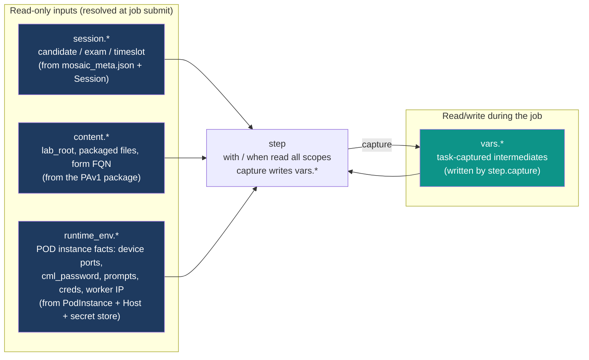

# ADR-058: Lifecycle Data-Flow & Variable Scopes

| Attribute | Value |
|-----------|-------|
| **Status** | Proposed |
| **Date** | 2026-06-13 |
| **Deciders** | Architecture Team |
| **Extends** | [ADR-057](./ADR-057-content-driven-lifecycle-dsl.md) (Content-Driven Lifecycle DSL) |
| **Related ADRs** | [ADR-044](./ADR-044-content-driven-lifecycle-engine.md), [ADR-049](./ADR-049-unified-workflow-dsl.md), [ADR-050](./ADR-050-definition-instance-duality.md), [ADR-053](./ADR-053-authorization-policy-model.md) |

---

## 1. Context

[ADR-057](./ADR-057-content-driven-lifecycle-dsl.md) defines the step shape — `with` (inputs),
`capture` (outputs), `when` (gating) — but **not where the values come from**. The legacy RCUv1
content references runtime facts through a tangle of incompatible, un-namespaced mechanisms, with
**secrets and ports hard-coded in content**:

| Legacy reference | Meaning | Problem |
|---|---|---|
| `${config.core.paths.lab_root}` | content root path | opaque global config namespace |
| `{files}` | a captured variable | brace syntax, flat namespace |
| `$(rtr01.show_int_loop0)` | a captured variable | paren syntax, **different** from `{}` |
| `port="5052"`, `--serial-port 5048` | a device PAT/serial port | **hard-coded** per pod |
| `--cml-password trackNMC50` | the control-node password | **secret hard-coded in content** |
| `prompt='rtr01#'`, `enablepassword='cisco'` | connector facts | duplicated across files |

There is **no data-flow or variable-scope model** anywhere in the ADRs or solution docs. Without
one, content is non-portable (ports/passwords baked in), insecure (secrets in the package), and
impossible to validate or generate (no declared namespace of available facts). This ADR defines an
explicit, namespaced, four-scope model and the interpolation rules over it.

## 2. Decision

### 2.1 Four scopes

Every value a step reads or writes lives in exactly one of four **namespaced, read/write-disciplined
scopes**. References use **jq expressions in `${ }`** (ADR-044 §2.8), evaluated against a single
merged context object whose top-level keys are the scope names.



| Scope | Lifetime | Writable by content? | Source | Holds |
|---|---|---|---|---|
| `session.*` | the job run | **No** (read-only) | `mosaic_meta.json` + the `Session`/`SessionPart` | candidate/exam/timeslot metadata |
| `content.*` | the job run | **No** (read-only) | the synced PAv1 package + blob store | lab-root path, packaged file handles, form FQN |
| `runtime_env.*` | the job run | **No** (read-only) | the `PodInstance` + bound `Host` + secret store | live POD facts: device ports, prompts, credentials, `cml_password`, worker IP, connector handles |
| `vars.*` | the job run | **Yes** | `step.capture` | task-captured intermediate values |

Only `vars.*` is writable. `session.*`, `content.*`, and `runtime_env.*` are **resolved at job
submission** and frozen for the run — they are the trusted, validated inputs the content reads but
cannot forge.

### 2.2 Scope contents (the declared namespace)

This is the namespace an author (or LLM) may reference. It is the **schema** the validator checks
`${ }` expressions against.

**`session.*`** — from `mosaic_meta.json` + the runtime `Session`:

```text
session.track            # "350-901 AUTOCOR"   (TrackLongName)
session.track_short      # "AUTOCOR"            (TrackShortName)
session.exam             # "350-901"            (ExamId/exam)
session.form             # "LAB-1.1.1"          (FormName / FQN leaf)
session.form_id          # "68b054a4…"          (FormId)
session.module           # module id
session.language         # "ENU"                (Language)
session.candidate_id     # the delivering candidate (Session)
session.timeslot.start   # ISO-8601            (Timeslot)
session.timeslot.end     # ISO-8601
```

**`content.*`** — from the synced PAv1 package:

```text
content.form_fqn         # six-token FQN
content.lab_root         # resolved package root (replaces ${config.core.paths.lab_root})
content.files.<name>     # a handle to a packaged file under PAv1/files/
                         #   e.g. content.files.desktop_package -> files/desktop_package.tgz
content.version          # content_version
```

**`runtime_env.*`** — from the `PodInstance` + bound `Host` + secret store:

```text
runtime_env.worker_ip                       # the CML worker IP
runtime_env.cml_password                    # SECRET — from the secret store, never the package
runtime_env.region                          # AWS region
runtime_env.lab_id                          # resolved CML lab id (also captured by cml.lab_resolve)
runtime_env.devices.<name>.serial_port      # e.g. 5045 (rtr01), 5048 (sw01)
runtime_env.devices.<name>.vnc_port         # e.g. 5051
runtime_env.devices.<name>.pat_port         # e.g. 5052 (-> 22)
runtime_env.devices.<name>.prompt           # e.g. "rtr01#"
runtime_env.devices.<name>.enable_password  # SECRET
runtime_env.devices.<name>.username         # connector cred
runtime_env.devices.<name>.password         # SECRET
runtime_env.control_node.serial_port        # the cmlctl-0 control-node port
```

`runtime_env.devices.*` is populated from `topology/ports.json` (ports) + `connectors.yaml`
(prompts/transports) + the secret store (credentials) at submit time. **No port or password is
ever literal in content.**

### 2.3 Interpolation & capture rules

- **Interpolation:** any `with`, `when`, or connector-model field may contain `${ <jq> }`. The
  expression is evaluated against the merged context `{ session, content, runtime_env, vars }`.
  Plain strings pass through unchanged.
- **Capture:** `capture: { <name>: <output-key> }` writes the named scenarioFunction output into
  `vars.<step_id>.<name>` (namespaced by step id to prevent collisions), and also as a flat
  `vars.<name>` alias when unambiguous. Example: an `exec` step `id: list_tmp` with
  `capture: { stdout: files }` makes both `vars.list_tmp.files` and `vars.files` available.
- **Gating:** `when: "${ vars.file_ok }"` skips the step when false — the direct replacement for
  legacy `if='file.OK'` after a `tVerify … set='file.OK'`.

**Worked extract** — the scoped `copy@v1` from
[`LAB-0.1/PAv1/jobs/post_init.yaml`](../solution/examples/LAB-0.1/README.md#jobspost_inityaml)
touches three scopes at once: `content.*` (the packaged payload), `runtime_env.*` (the PAT port),
and `vars.*` (the captured result):

```yaml
- id: push_package                                # was RCUv1 tScp
  uses: copy@v1
  target: workstation_22
  with:
    source: "${ content.files.desktop_package }"   # content.*  (was ${config.core.paths.lab_root}/…)
    dest: "/home/cisco/Desktop/tmp/desktop_package.tgz"
    via_port: "${ runtime_env.devices.workstation.pat_port }"  # runtime_env.*  (was port=5052)
  capture: { ok: scp_ok }                          # vars.push_package.ok / vars.scp_ok
```

### 2.4 Legacy → scoped reference mapping

The exact substitutions the `examples/LAB-1.1.1/` golden port (and the minimal
`examples/LAB-0.1/`) apply:

| Legacy reference | Scoped reference |
|---|---|
| `${config.core.paths.lab_root}/desktop_package.tgz` | `${ content.files.desktop_package }` |
| `port="5052"` (tScp PAT) | `${ runtime_env.devices.workstation.pat_port }` |
| `--serial-port 5048` | `${ runtime_env.devices.sw01.serial_port }` |
| `--cml-password trackNMC50` | `${ runtime_env.cml_password }` |
| `prompt='rtr01#'` | `${ runtime_env.devices.rtr01.prompt }` |
| `enablepassword='cisco'` | `${ runtime_env.devices.rtr01.enable_password }` |
| `string="{files}"` | `${ vars.files }` |
| `string='$(rtr01.show_int_loop0)'` | `${ vars.rtr01.show_int_loop0 }` |
| `set="file.OK"` / `if="file.OK"` | `capture: { passed: file_ok }` / `when: "${ vars.file_ok }"` |

### 2.5 Composite scope-frame (the isolation mechanism for `CompositeScenario`)

[ADR-057 §2.8](./ADR-057-content-driven-lifecycle-dsl.md) specifies a deferred, opt-in
`CompositeScenario` — a content-defined, parameterised group of _closed primitives_ invoked from a
step via `uses: composite:<name>@<ver>`. The data-flow model already supplies everything needed to
run one safely; this section names the rule rather than inventing a new mechanism.

A composite executes in an **isolated `vars.*` frame**:

- **Trusted scopes pass through unchanged.** `session.*`, `content.*`, and `runtime_env.*` remain
  the _same frozen, read-only_ objects inside the composite — a composite cannot see less or forge
  more than its caller. (`target:` likewise resolves against the same `connectors.yaml`.)
- **`vars.*` is a fresh frame.** The caller's `vars.*` is **not** visible inside the composite.
  At invocation the composite gets a new `vars.*` seeded **only** from its declared `parameters`
  (bound from the step's `with:`). This is the §2.2 namespace discipline applied recursively.
- **`export` is the only way out.** When the composite returns, **only** the keys named in its
  `export` schema are written back — into the caller's `vars.<step_id>.*` (and the flat
  `vars.<name>` alias when unambiguous), exactly as a primitive's `capture:` does. Everything else
  in the composite's frame is discarded.

```yaml
# caller step                              # composite: PAv1/composites/check_interface_up_up.yaml
- id: check_lo0                            #   parameters: { interface, ip }
  uses: composite:check_interface_up_up@v1 #   export:     { interface_name }
  target: rtr01                            #   (body = a §2.4 step DAG over closed primitives,
  with:  { interface: Loopback0,           #    running in its OWN vars.* frame)
           ip: "${ runtime_env.devices.rtr01.lo0_ip }" }
  capture: { interface_name: rtr01_lo_name }   # promoted from the composite's `export`
```

This makes a composite **indistinguishable from a primitive at the call site** for both the runtime
and the validator: same `with`/`capture` discipline, same scope visibility, same I/O-schema check
(ADR-057 §2.7). The `for_each` modifier (ADR-057 §2.8) is orthogonal — each iteration binds its
loop `var` into the _current_ `vars.*` frame before the (composite or primitive) call runs.

### 2.6 Security posture

- **Secrets never live in content.** `runtime_env.cml_password`, `*.enable_password`, `*.password`
  resolve from the platform secret store at submit time, injected into the job's `runtime_env`
  scope. The PAv1 package contains only _references_, never literals. This removes the legacy
  `--cml-password trackNMC50` / `enablepassword='cisco'` class of leak.
- **Content is read-only over trusted scopes.** A malicious or buggy package can read but not write
  `session.*`/`content.*`/`runtime_env.*`; it can only mutate `vars.*`, which is discarded at job
  end. This bounds the blast radius of generated content.
- **jq evaluation is sandboxed** to the merged context object (no filesystem/network builtins),
  consistent with the AuthorizationPolicy JQ usage in [ADR-053](./ADR-053-authorization-policy-model.md).

## 3. Consequences

**Positive**

- **Portable content.** The same PAv1 package runs on any pod — ports, IPs, prompts, and passwords
  are resolved per-instance from `runtime_env.*`, never baked in.
- **Validatable & generatable.** The four scopes are a declared namespace; the JSON Schema
  (ADR-057 §2.7) checks every `${ }` reference, and an LLM is handed the exact set of facts it may
  read.
- **Secure by construction.** Secrets out of content; content read-only over trusted inputs.
- **Terminology fixed.** _session / content / runtime_env / vars_ replace the legacy
  `${config…}`/`{}`/`$()` soup with one consistent syntax.

**Negative / trade-offs**

- The platform must **resolve `runtime_env.*` at submit time** — the SE/CPA seam must assemble
  device ports (from `ports.json`), connector facts (from `connectors.yaml`), and secrets (from the
  store) into the scope before the first step runs.
- jq-over-four-scopes is slightly more verbose than a flat variable bag — the cost of namespacing
  and validatability.

**Neutral**

- `vars.*` capture semantics mirror the existing `ScenarioContext` output flow (ADR-044 §2.9); only
  the **naming/namespacing** is formalised.
- The **composite scope-frame** (§2.5) reuses the same `vars.*` namespacing recursively — it adds no
  new scope, only an isolation rule for the deferred `CompositeScenario` (ADR-057 §2.8).

## 4. Related

- [ADR-057](./ADR-057-content-driven-lifecycle-dsl.md) — the step shape whose `with`/`capture`/`when`
  reference these scopes, and the deferred `CompositeScenario` + `for_each` extension (§2.8) whose
  isolation rule is defined here (§2.5).
- [generic-pattern.md](../solution/generic-pattern.md) — narrative description of the scopes.
- [examples/LAB-0.1/README.md](../solution/examples/LAB-0.1/README.md) — the minimal `PAv1/` package
  using these scopes (real files).
- [examples/LAB-1.1.1/README.md](../solution/examples/LAB-1.1.1/README.md) — every scoped reference
  applied to the real legacy content.
