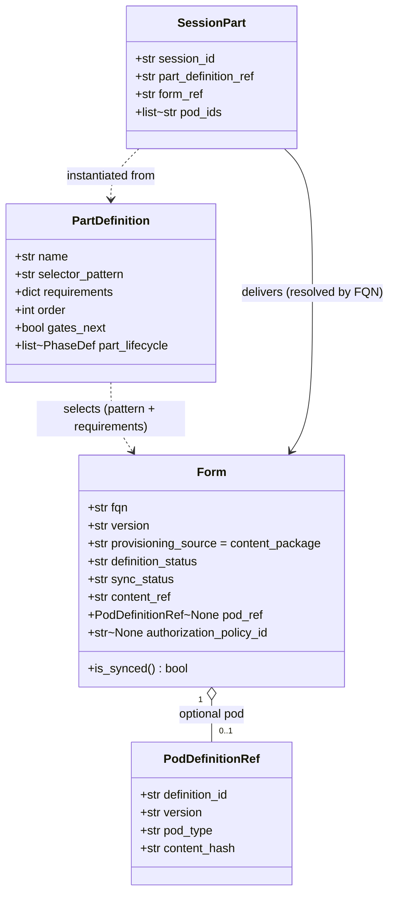
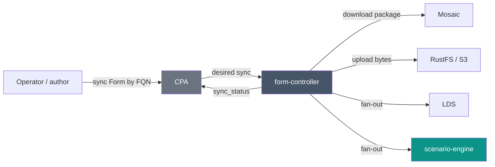

# ADR-059: Form as a First-Class Synced Resource

| Attribute | Value |
|-----------|-------|
| **Status** | Proposed |
| **Date** | 2026-06-16 |
| **Deciders** | Architecture Team |
| **Extends** | [ADR-050](./ADR-050-definition-instance-duality.md) (Definition/Instance Duality), [ADR-051](./ADR-051-provisioning-sources.md) (Provisioning Sources), [ADR-052](./ADR-052-content-authoring-taxonomy.md) (Content-Authoring Taxonomy) |
| **Supersedes** | the _"Form delivery — no synced Form, inert taxonomy leaf"_ stance of [ADR-052](./ADR-052-content-authoring-taxonomy.md) §Form-delivery and the `Form` row of the [ADR-050](./ADR-050-definition-instance-duality.md) §2.3 catalogue→runtime map; generalises [ADR-028](./ADR-028-definition-initial-status.md) (`LabletDefinition` `PENDING_SYNC`) |
| **Related ADRs** | [ADR-045](./ADR-045-multi-part-session-part-model.md) (Multi-part Session/Part), [ADR-046](./ADR-046-host-abstraction-and-pod-host-type-split.md) (Pod/Host split), [ADR-054](./ADR-054-controller-topology-resource-kind.md) (Controller topology — `form-controller`) |

---

## 1. Context

The platform must now deliver **four** use-cases, not one: `lablet`, `practicelab`,
`expertlab` (CCIE, 2 parts), and `expertdesign` (CCDE, 4 parts). The current model carries the
Lablet use-case through a `LabletDefinition` — a catalogue entry that, **uniquely**, owns a
**sync lifecycle** (`PENDING_SYNC → SYNCED`, ADR-028): it pulls content from Mosaic, lands it in
RustFS, and fans out to LDS + SE. Everything else in the content-authoring taxonomy
(`Track → Exam → Module → Formset → Form → FormItem`, ADR-052) is modelled as **inert**
`content_package` metadata, and a `Form` was declared _"delivered by `SessionPart` — no
instance"_.

That framing has two problems as we generalise:

1. **The synced unit is mis-named.** What actually _syncs_ (owns `sync_status`, RustFS bytes, and
   the LDS/SE fan-out) is the per-deliverable content unit — today the single-part
   `LabletDefinition`. In the generalized taxonomy that unit **is the `Form`**. Keeping a separate
   `LabletDefinition` "profile" beside an inert `Form` duplicates the concept and only works for
   single-part deliveries.
2. **The pod binding lives in the wrong place.** A pod is intrinsic to the _content_ a part runs
   (a `cml_on_aws` lab, a `proxmox` topology, or _none_ for a web/design form), yet `pod_ref`
   currently hangs off `PartDefinition`. A multi-part exam that reuses the same `Form` in different
   slots would have to re-declare the pod per part.

We want **one** synced unit, reused across every use-case, that a `SessionPart` simply references.

## 2. Decision

### 2.1 The `Form` is the synced content resource

Generalise the legacy `LabletDefinition` into the **`Form`**: a first-class **synced**
`content_package` `ResourceDefinition`. The `Form` is the **single reconciled (synced) unit** of
the content-authoring taxonomy — it owns the `sync_status`, points at the synced content-package
bytes in RustFS, and carries an **optional `PodDefinitionRef`**. `LabletDefinition` is retired as
a distinct type; a Lablet is just a single-part session whose one `Form` references a
`cml_on_aws` `PodDefinition`.

The rest of the taxonomy (`Track`, `Exam`, `Blueprint`, `Module`, `Formset`, `FormItem`) stays
**catalogue metadata** with a `definition_status` (`draft → published → deprecated`) but **no
sync loop**. Only the `Form` reconciles — it is the leaf that carries deliverable bytes + the
optional pod.

### 2.2 What does **not** change — no new timed instance

The `Form` is a **definition-plane** resource: it lives on the catalogue/sync plane, **not** in
the timed runtime tree (`Session → SessionPart → PodInstance → Host`). There is still **no
separate timed Form instance** — the **`SessionPart` remains the timed runtime** that delivers
the form. The change is that the `Form` is no longer _inert_: it is a reconciled resource whose
desired/actual is its **sync state**, exactly the asymmetry ADR-051 already grants
`content_package` definitions.

| Plane | Resource | Reconciles toward | Tier |
|---|---|---|---|
| **Catalogue / sync** | **`Form`** (this ADR) | `sync_status` (content present + fanned out) | definition (`content_package`) |
| **Timed runtime** | `SessionPart` | `desired_status` (delivery lifecycle) | L2 `TimedResource` |

### 2.3 Pod binding moves to the `Form`

`PodDefinitionRef` is owned by the **`Form`**, not the `PartDefinition`. A `PartDefinition`
selects a `Form` by **selector pattern + requirements** (unchanged — ADR-045); the **resolved
`Form` supplies the optional pod**. Web/design forms (CCDE `COR`, CCIE `DES`) carry **no**
`pod_ref`; lab forms carry one. `requirements.requires_pod` becomes an admissibility check
against the resolved `Form.pod_ref`, not a separate part field.

### 2.4 The `form-controller` owns Form sync

The Form sync loop (Mosaic → RustFS → LDS + SE fan-out) is owned by a dedicated
**`form-controller`** — the generalization of the content-sync half of the current
`lablet-controller` (what [ADR-054](./ADR-054-controller-topology-resource-kind.md) earlier called
`content-controller`). It reconciles every `Form` regardless of use-case; `seed` catalogue/config
definitions are still seeded by CPA and do not reconcile.

## 3. Consequences

**Positive**

- One synced unit (`Form`) reused across `lablet` / `practicelab` / `expertlab` / `expertdesign`;
  no single-part-only `LabletDefinition` special case.
- Pod binding lives with the content that needs it; a `Form` is a self-contained "content +
  optional pod" deliverable, reusable across parts and sessions.
- The catalogue stays inert except at the leaf; the sync surface is exactly one type.
- `form-controller` has a single, uniform contract (`Form.sync_status`).

**Negative / trade-offs**

- Re-homes `pod_ref` from `PartDefinition` to `Form` and retires `LabletDefinition` as a type —
  touches the catalogue model, session-model, and the seed format. Local-only, no migration
  window, so the cut is clean.
- A `Form` now mixes _authoring metadata_ (FQN, items) with a _sync lifecycle_; the L1/L2 instance
  model is unaffected because `Form` is definition-plane, not a timed instance.

**Persistence** — `Form` is a state-based Neuroglia `AggregateRoot` (`MotorRepository` +
`state_version`) like every other definition (ADR-051); the legacy `LabletDefinition` sync
behaviour is preserved as `@dispatch` reducers, only generalised.

## 4. Related

- [definition-catalog-model.md](../solution/definition-catalog-model.md) — Form sync + catalogue.
- [session-model.md](../solution/session-model.md) — how a `SessionPart` selects/delivers a `Form`.
- [resource-model.md](../solution/resource-model.md) — definition vs instance planes.
- [ADR-054](./ADR-054-controller-topology-resource-kind.md) — `form-controller` in the topology.
