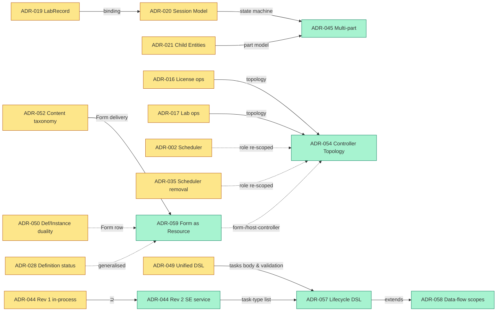

# Architecture Decision Records (ADRs)

This directory contains Architecture Decision Records (ADRs) for the Lablet Cloud Manager's Lablet Resource Manager expansion.

## ADR Index

> **Reading the supersession column.** `→ ADR-NNN` means _superseded (fully or partially) by_
> that ADR; `⊇ ADR-NNN` means _supersedes_ it. The current-model cluster (ADR-036, 044–054) is
> still **Proposed** — it is the north-star the [Solution Design](../solution/index.md) docs
> describe, pending ratification. See the [supersession chain](#supersession-chain) below.

| ADR | Title | Status | Date | Supersession |
|-----|-------|--------|------|--------------|
| [ADR-001](./ADR-001-api-centric-state-management.md) | API-Centric State Management | Accepted | 2026-01-15 | — |
| [ADR-002](./ADR-002-separate-resource-scheduler-service.md) | Separate Resource Scheduler Service | Accepted | 2026-01-15 | role re-scoped by → [054](./ADR-054-controller-topology-resource-kind.md) |
| [ADR-003](./ADR-003-cloudevents-for-integration.md) | CloudEvents for External Integration | Accepted | 2026-01-15 | — |
| [ADR-004](./ADR-004-port-allocation-per-worker.md) | Port Allocation per Worker | Accepted | 2026-01-15 | — |
| [ADR-005](./ADR-005-state-store-architecture.md) | Dual State Store Architecture (etcd + MongoDB) | Accepted | 2026-01-16 | — |
| [ADR-006](./ADR-006-resource-scheduler-ha-coordination.md) | Resource Scheduler High Availability Coordination | Accepted | 2026-01-16 | — |
| [ADR-007](./ADR-007-worker-template-seeding.md) | Worker Template Seeding and Management | Accepted | 2026-01-15 | — |
| [ADR-008](./ADR-008-worker-draining-state.md) | Worker Draining State for Scale-Down | Accepted | 2026-01-16 | — |
| [ADR-009](./ADR-009-shared-core-package.md) | Shared Core Package Architecture | Accepted | 2026-01-16 | — |
| [ADR-010](./ADR-010-service-unification-neuroglia.md) | Service Unification on Neuroglia Framework | Accepted | 2026-01-17 | — |
| [ADR-011](./ADR-011-apscheduler-removal.md) | APScheduler Removal and Controller Migration | Accepted | 2026-01-19 | — |
| [ADR-012](./ADR-012-dynamic-region-configuration.md) | Dynamic Region Configuration | Accepted | 2026-01-19 | — |
| [ADR-013](./ADR-013-sse-protocol-improvements.md) | SSE Protocol Improvements | Accepted | 2026-01-19 | — |
| [ADR-014](./ADR-014-worker-orphan-detection.md) | Worker Orphan Detection and Garbage Collection | Accepted | 2026-02-06 | — |
| [ADR-015](./ADR-015-control-plane-api-no-ec2.md) | Control Plane API Must Not Call AWS EC2 | Accepted | 2026-02-06 | — |
| [ADR-016](./ADR-016-license-operations-via-worker-controller.md) | License Operations via Worker-Controller | Accepted (Partially Superseded) | 2026-02-07 | topology → [054](./ADR-054-controller-topology-resource-kind.md) |
| [ADR-017](./ADR-017-lab-operations-via-lablet-controller.md) | Lab Operations via Lablet-Controller | Accepted (Partially Superseded) | 2026-02-07 | topology → [054](./ADR-054-controller-topology-resource-kind.md) |
| [ADR-018](./ADR-018-lds-integration.md) | Lab Delivery System (LDS) Integration | Accepted | 2025-02-10 | — |
| [ADR-019](./ADR-019-labrecord-independent-aggregate.md) | LabRecord as Independent AggregateRoot | Accepted (Partially Superseded) | 2026-02-10 | binding → [020](./ADR-020-session-entity-model.md) |
| [ADR-020](./ADR-020-session-entity-model.md) | Session Entity Model Redesign | Accepted (Partially Superseded) | 2026-02-18 | ⊇ [019](./ADR-019-labrecord-independent-aggregate.md) §binding · state machine → [045](./ADR-045-multi-part-session-part-model.md) |
| [ADR-021](./ADR-021-child-entity-architecture.md) | Child Entity Architecture for Session Tracking | Accepted (Partially Superseded) | 2026-02-18 | part model → [045](./ADR-045-multi-part-session-part-model.md) |
| [ADR-022](./ADR-022-cloudevent-ingestion-lablet-controller.md) | CloudEvent Ingestion via Lablet-Controller | Accepted | 2026-02-18 | — |
| [ADR-023](./ADR-023-content-sync-trigger.md) | Content Sync Trigger via Reactive etcd Watch | Accepted | 2026-02-25 | — |
| [ADR-024](./ADR-024-content-package-storage.md) | Content Package Storage in RustFS | Accepted | 2026-02-25 | — |
| [ADR-025](./ADR-025-content-metadata-storage.md) | Content Metadata Storage in MongoDB | Accepted | 2026-02-25 | — |
| [ADR-026](./ADR-026-upstream-notifier-pattern.md) | Extensible Upstream Notifier Pattern (Deferred) | Accepted | 2026-02-25 | — |
| [ADR-027](./ADR-027-content-version-auto-increment.md) | Version Auto-Increment on Content Change | Accepted | 2026-02-25 | — |
| [ADR-028](./ADR-028-definition-initial-status.md) | LabletDefinition Initial Status (PENDING_SYNC) | Accepted | 2026-02-25 | generalised by → [059](./ADR-059-form-as-first-class-synced-resource.md) |
| [ADR-029](./ADR-029-port-template-extraction-from-cml-yaml.md) | Port Template Extraction from CML YAML | Accepted | 2026-02-25 | — |
| [ADR-030](./ADR-030-resource-observation-learn-from-live.md) | Resource & Port Observation — "Learn from Live" | Accepted | 2026-02-28 | — |
| [ADR-031](./ADR-031-checkpoint-instantiation-pipeline.md) | Checkpoint-Based Instantiation Pipeline | Accepted | 2026-03-02 | — |
| [ADR-032](./ADR-032-port-allocation-labrecord-topology.md) | Port Allocation as LabRecord Topology Concern | Accepted | 2026-03-02 | — |
| [ADR-033](./ADR-033-cml-node-tag-sync.md) | CML Node Tag Sync with Allocated Ports | Accepted | 2026-03-02 | — |
| [ADR-034](./ADR-034-pipeline-executor-lifecycle-handlers.md) | Pipeline Executor & Lifecycle Phase Handlers | Proposed | 2026-03-02 | — |
| [ADR-035](./ADR-035-legacy-scheduler-service-removal.md) | Legacy SchedulerService Removal | Accepted | 2026-03-04 | role re-scoped by → [054](./ADR-054-controller-topology-resource-kind.md) |
| [ADR-036](./ADR-036-resource-management-abstraction-layer.md) | Resource Management Abstraction Layer | Accepted | 2026-03-10 | extended by [050](./ADR-050-definition-instance-duality.md) |
| [ADR-037](./ADR-037-timeslot-management.md) | Timeslot Management | Accepted | 2026-03-10 | — |
| [ADR-038](./ADR-038-step-handler-registry-and-reconciler-decomposition.md) | Step Handler Registry & Reconciler Decomposition | Accepted | 2026-03-18 | extended by [047](./ADR-047-generic-reconciliation-framework.md) |
| [ADR-039](./ADR-039-sse-race-condition-fix.md) | SSE Race Condition Fix | Accepted | 2026-04-10 | — |
| [ADR-040](./ADR-040-lds-cloudevent-direct-ingestion-cpa.md) | LDS CloudEvent Direct Ingestion via CPA | Accepted | 2026-04-10 | — |
| [ADR-041](./ADR-041-websocket-based-cml-worker-monitoring.md) | WebSocket-Based CML Worker Monitoring | Proposed | 2026-05-20 | — |
| [ADR-042](./ADR-042-command-handler-base-simplification.md) | CommandHandlerBase Dependency Simplification | Proposed | 2026-06-01 | — |
| [ADR-043](./ADR-043-startup-state-reconciliation.md) | Startup State Reconciliation and Discovery Separation | Accepted | 2026-06-04 | — |
| [ADR-044](./ADR-044-content-driven-lifecycle-engine.md) | ScenarioEngine — Pod Automation as a Separate Service | Proposed (Rev 2) | 2026-06-05 | ⊇ Rev 1 (in-process design) |
| [ADR-045](./ADR-045-multi-part-session-part-model.md) | Multi-part Session / Part Model with Selector-Resolved Content | Proposed | 2026-06-12 | ⊇ [020](./ADR-020-session-entity-model.md), [021](./ADR-021-child-entity-architecture.md) (session state machine → part level) |
| [ADR-046](./ADR-046-host-abstraction-and-pod-host-type-split.md) | Host Abstraction and PodType / HostType Split | Proposed | 2026-06-12 | extends [036](./ADR-036-resource-management-abstraction-layer.md) |
| [ADR-047](./ADR-047-generic-reconciliation-framework.md) | Generic Reconciliation Framework with Per-Type Managers | Proposed | 2026-06-12 | extends [036](./ADR-036-resource-management-abstraction-layer.md), [038](./ADR-038-step-handler-registry-and-reconciler-decomposition.md) |
| [ADR-048](./ADR-048-unified-resource-dashboard.md) | Unified Resource Dashboard and Shared `lcm-core` UI Components | Proposed | 2026-06-12 | — |
| [ADR-049](./ADR-049-unified-workflow-dsl.md) | Unified Workflow DSL for Lifecycle / Step / Task Definitions | Proposed | 2026-06-12 | inline `tasks` body & validation → [057](./ADR-057-content-driven-lifecycle-dsl.md); data-flow → [058](./ADR-058-lifecycle-data-flow-and-variable-scopes.md) |
| [ADR-050](./ADR-050-definition-instance-duality.md) | Definition/Instance Duality and Two-Tier Instance Layering | Proposed | 2026-06-12 | extends [036](./ADR-036-resource-management-abstraction-layer.md); Form row partially → [059](./ADR-059-form-as-first-class-synced-resource.md) |
| [ADR-051](./ADR-051-provisioning-sources.md) | Provisioning Sources and Asymmetric Definition Lifecycle | Proposed | 2026-06-12 | extends [050](./ADR-050-definition-instance-duality.md) |
| [ADR-052](./ADR-052-content-authoring-taxonomy.md) | Content-Authoring Taxonomy Import and Form Delivery | Proposed | 2026-06-12 | extends [050](./ADR-050-definition-instance-duality.md), [051](./ADR-051-provisioning-sources.md); Form-delivery stance → [059](./ADR-059-form-as-first-class-synced-resource.md) |
| [ADR-053](./ADR-053-authorization-policy-model.md) | Authorization Policy Model Port | Proposed | 2026-06-12 | extends [050](./ADR-050-definition-instance-duality.md) |
| [ADR-054](./ADR-054-controller-topology-resource-kind.md) | Controller Topology by Resource Kind | Proposed (Rev 2) | 2026-06-12 | ⊇ topology of [016](./ADR-016-license-operations-via-worker-controller.md), [017](./ADR-017-lab-operations-via-lablet-controller.md); re-scopes [002](./ADR-002-separate-resource-scheduler-service.md), [035](./ADR-035-legacy-scheduler-service-removal.md); Rev 2 adds form-/host-controller ([059](./ADR-059-form-as-first-class-synced-resource.md)) |
| [ADR-055](./ADR-055-per-resource-kind-lifecycle-state-machines.md) | Per-Resource-Kind Lifecycle State Machines | Proposed | 2026-06-13 | extends [047](./ADR-047-generic-reconciliation-framework.md), [050](./ADR-050-definition-instance-duality.md) |
| [ADR-056](./ADR-056-adr-lifecycle-and-supersession-conventions.md) | ADR Lifecycle & Supersession Conventions | Proposed | 2026-06-13 | — |
| [ADR-057](./ADR-057-content-driven-lifecycle-dsl.md) | Content-Driven Lifecycle DSL — Primitives, Phases & scenarioFunctions | Proposed | 2026-06-13 | ⊇ inline `tasks` body of [049](./ADR-049-unified-workflow-dsl.md) §2.1 & task-type list of [044](./ADR-044-content-driven-lifecycle-engine.md) §2.8; extends [049](./ADR-049-unified-workflow-dsl.md), [044](./ADR-044-content-driven-lifecycle-engine.md) |
| [ADR-058](./ADR-058-lifecycle-data-flow-and-variable-scopes.md) | Lifecycle Data-Flow & Variable Scopes | Proposed | 2026-06-13 | extends [057](./ADR-057-content-driven-lifecycle-dsl.md) |
| [ADR-059](./ADR-059-form-as-first-class-synced-resource.md) | Form as First-Class Synced Resource | Proposed | 2026-06-16 | ⊇ Form-delivery of [052](./ADR-052-content-authoring-taxonomy.md) & Form row of [050](./ADR-050-definition-instance-duality.md); generalises [028](./ADR-028-definition-initial-status.md); extends [051](./ADR-051-provisioning-sources.md); related [046](./ADR-046-host-abstraction-and-pod-host-type-split.md), [054](./ADR-054-controller-topology-resource-kind.md) |

> **Title note:** ADR-044's filename is `ADR-044-content-driven-lifecycle-engine.md` (and the
> mkdocs nav label still reads "Content-Driven Lifecycle Engine") but its current H1 is
> _"ScenarioEngine — Pod Automation as a Separate Service"_ (Rev 2). The table above uses the
> current H1; the filename is retained to avoid breaking links.

## Supersession chain



## Status Definitions

| Status | Meaning |
|--------|---------|
| **Proposed** | Under discussion, not yet approved |
| **Accepted** | Decision made and should be followed |
| **Superseded** | Replaced by another ADR |
| **Deprecated** | No longer relevant |

## ADR Template

When creating new ADRs, use this template:

```markdown
# ADR-NNN: Title

| Attribute | Value |
|-----------|-------|
| **Status** | Proposed |
| **Date** | YYYY-MM-DD |
| **Deciders** | Team/Person |
| **Related ADRs** | Links to related ADRs |

## Context

What is the issue that we're seeing that is motivating this decision or change?

## Decision

What is the change that we're proposing and/or doing?

## Rationale

Why is this decision being made? What alternatives were considered?

## Consequences

### Positive
- What becomes easier or possible?

### Negative
- What becomes harder or impossible?

### Risks
- What could go wrong?

## Implementation Notes

Technical details, code examples, configuration.
```

## Dependency Graph

```
ADR-001 (API-Centric)
    ├── ADR-002 (Scheduler) ─────┐
    │       └── ADR-006 (HA) ◄───┤
    │                            │
    ├── ADR-005 (State Store) ◄──┘
    │       └── ADR-006 (HA)
    │
    └── ADR-013 (SSE Improvements)
            └── no controller-direct Redis

ADR-003 (CloudEvents)
    └── ADR-004 (Ports)

ADR-007 (Templates) ← standalone

ADR-008 (Draining)
    └── ADR-002 (Scheduler)

ADR-009 (Shared Core)
    └── ADR-010 (Neuroglia Unification)

ADR-010 (Neuroglia Unification)
    ├── ADR-011 (APScheduler Removal)
    └── ADR-012 (Dynamic Region Config)

ADR-011 (APScheduler Removal)
    └── controller-based execution replaces jobs

ADR-012 (Dynamic Region Config)
    └── SystemSettings + WorkerReconciler._run_discovery_loop()

ADR-013 (SSE Improvements)
    └── batching, filtering, extended events

ADR-018 (LDS Integration)
    ├── ADR-017 (Lab Operations via Lablet-Controller)
    ├── ADR-020 (Session Entity Model) ← amends terminology
    └── ADR-022 (CloudEvent Ingestion) ← amends routing

ADR-019 (LabRecord)
    └── ADR-020 (Session Entity Model) ← supersedes binding model

ADR-020 (Session Entity Model)
    ├── ADR-018 (LDS Integration)
    ├── ADR-019 (LabRecord) ← partially supersedes
    └── ADR-021 (Child Entities)

ADR-021 (Child Entity Architecture)
    ├── ADR-020 (Session Entity Model)
    └── ADR-022 (CloudEvent Ingestion)

ADR-022 (CloudEvent Ingestion)
    ├── ADR-003 (CloudEvents)
    ├── ADR-015 (Control Plane API No External Calls)
    └── ADR-018 (LDS Integration) ← amends §7

# Content Synchronization cluster (ADR-023–028)
ADR-023 (Content Sync Trigger)
    ├── ADR-005 (Dual State Store) ← extends etcd key namespace
    ├── ADR-015 (CPA No External Calls)
    ├── ADR-017 (Lab Operations) ← extends reconciliation pattern
    ├── ADR-024 (Package Storage)
    ├── ADR-025 (Content Metadata)
    └── ADR-026 (Upstream Notifier)

ADR-024 (Package Storage in RustFS)
    └── ADR-025 (Content Metadata) ← complementary

ADR-025 (Content Metadata in MongoDB)
    ├── ADR-005 (Dual State Store)
    └── ADR-024 (Package Storage) ← complementary

ADR-026 (Upstream Notifier Pattern)
    └── ADR-018 (LDS Integration)

ADR-027 (Version Auto-Increment)
    ├── ADR-023 (Content Sync Trigger)
    └── ADR-028 (Definition Initial Status)

ADR-028 (Definition Initial Status)
    ├── ADR-023 (Content Sync Trigger)
    └── ADR-027 (Version Auto-Increment)

ADR-029 (Port Template Extraction)
    ├── ADR-025 (Content Metadata Storage)
    └── ADR-028 (Definition Initial Status)

ADR-030 (Resource & Port Observation — Learn from Live)
    ├── ADR-004 (Port Allocation per Worker)
    ├── ADR-017 (Lab Operations via Lablet-Controller)
    ├── ADR-020 (Session Entity Model)
    └── ADR-029 (Port Template Extraction)

# Instantiation Pipeline cluster (ADR-031–033)
ADR-031 (Checkpoint Pipeline)
    ├── ADR-004 (Port Allocation per Worker)
    ├── ADR-017 (Lab Operations via Lablet-Controller)
    ├── ADR-020 (Session Entity Model)
    ├── ADR-029 (Port Template Extraction)
    ├── ADR-030 (Resource Observation)
    ├── ADR-032 (Port Allocation on LabRecord)
    └── ADR-033 (CML Node Tag Sync)

ADR-032 (Port Allocation as LabRecord Topology)
    ├── ADR-004 (Port Allocation per Worker)
    ├── ADR-019 (LabRecord as AggregateRoot)
    ├── ADR-020 (Session Entity Model)
    ├── ADR-029 (Port Template Extraction)
    ├── ADR-031 (Checkpoint Pipeline)
    └── ADR-033 (CML Node Tag Sync)

ADR-033 (CML Node Tag Sync)
    ├── ADR-004 (Port Allocation per Worker)
    ├── ADR-017 (Lab Operations via Lablet-Controller)
    ├── ADR-029 (Port Template Extraction)
    ├── ADR-031 (Checkpoint Pipeline)
    └── ADR-032 (Port Allocation on LabRecord)

ADR-039 (SSE Race Condition Fix)
    ├── ADR-013 (SSE Protocol Improvements)
    └── ADR-001 (API-Centric State Management)

ADR-040 (LDS CloudEvent Direct Ingestion via CPA)
    ├── ADR-003 (CloudEvents)
    ├── ADR-015 (CPA No External Calls)
    ├── ADR-018 (LDS Integration)
    └── ADR-022 (CloudEvent Ingestion) ← amends (dual routing)

# Worker / runtime hardening (ADR-041–043)
ADR-041 (WebSocket-Based CML Worker Monitoring)
    └── ADR-013 (SSE Protocol Improvements)

ADR-042 (CommandHandlerBase Dependency Simplification)
    └── ADR-010 (Service Unification on Neuroglia)

ADR-043 (Startup State Reconciliation and Discovery Separation)
    ├── ADR-012 (Dynamic Region Configuration)
    └── ADR-014 (Worker Orphan Detection)

# Generalized resource-plane cluster (current model — ADR-036 + 044–054, all Proposed)
ADR-036 (Resource Management Abstraction Layer) ← layered state base
    ├── ADR-037 (Timeslot Management)
    ├── ADR-046 (Host / PodType–HostType Split) ← extends
    ├── ADR-047 (Generic Reconciliation Framework) ← extends (with ADR-038)
    └── ADR-050 (Definition/Instance Duality) ← extends

ADR-044 (ScenarioEngine — Pod Automation as a Separate Service, Rev 2)
    ├── supersedes Rev 1 (in-process design)
    └── ADR-049 (Unified Workflow DSL) ← job/step description

ADR-045 (Multi-part Session / Part Model)
    ├── ADR-036 (Resource Abstraction)
    ├── ADR-020 (Session Entity Model) ← supersedes (state machine → part level)
    ├── ADR-021 (Child Entity Architecture) ← supersedes (part model)
    ├── ADR-046 (Host / Type split)
    └── ADR-047 (Generic Reconciliation)

ADR-047 (Generic Reconciliation Framework)
    ├── ADR-036 (Resource Abstraction)
    ├── ADR-038 (Step Handler Registry) ← extends
    └── ADR-054 (Controller Topology) ← maps managers → services

ADR-050 (Definition/Instance Duality)
    ├── ADR-036 (Resource Abstraction) ← extends
    ├── ADR-051 (Provisioning Sources) ← extends
    ├── ADR-052 (Content-Authoring Taxonomy) ← extends
    └── ADR-053 (Authorization Policy Model) ← extends

ADR-051 (Provisioning Sources)
    ├── ADR-050 (Definition/Instance Duality)
    └── ADR-023–028 (Content Sync cluster) ← reconciles content_package source

ADR-052 (Content-Authoring Taxonomy)
    ├── ADR-050 / ADR-051
    ├── ADR-044 (Content-driven lifecycle / SE)
    └── ADR-045 (Multi-part — supplies the Forms parts select)

ADR-053 (Authorization Policy Model)
    ├── ADR-050 (Definition/Instance Duality)
    └── ADR-001 (API-Centric State Management)

ADR-054 (Controller Topology by Resource Kind)
    ├── ADR-047 (Per-type managers) ← extends
    ├── ADR-016 (License ops) ← supersedes topology
    ├── ADR-017 (Lab ops) ← supersedes topology
    ├── ADR-002 (Resource Scheduler) ← re-scopes role
    ├── ADR-035 (Legacy Scheduler Removal) ← re-scopes role
    └── ADR-046 (Host adapters live inside pod-controller)
```
