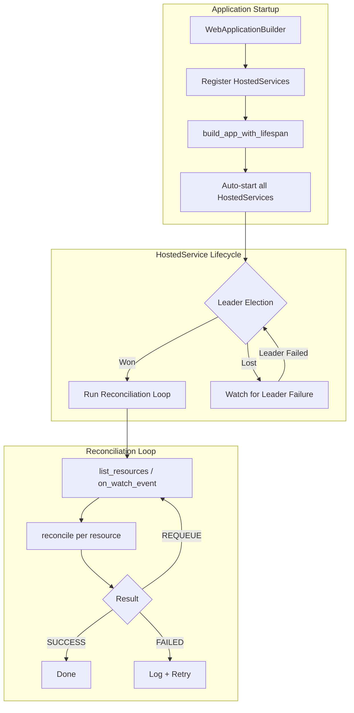

# Background Task Scheduling

**Version:** 2.0.0 (March 2026)
**Status:** Current Implementation

!!! warning "APScheduler Removed (ADR-011)"
    APScheduler was removed in January 2026 per [ADR-011](./adr/ADR-011-apscheduler-removal.md).
    All background operations now use **reconciliation loops** via Neuroglia `HostedService` pattern.

## Overview

The Lablet Cloud Manager implements background task scheduling through **HostedService reconciliation loops** — a pattern inspired by Kubernetes controllers. Each background operation runs as a leader-elected hosted service that:

- Watches etcd for state changes (reactive)
- Periodically polls the Control Plane API (fallback)
- Reconciles desired state vs. actual state
- Reports results back via the Control Plane API

## Architecture


```mermaid
graph TD
    subgraph "Application Startup"
        A[WebApplicationBuilder] --> B[Register HostedServices]
        B --> C[build_app_with_lifespan]
        C --> D[Auto-start all HostedServices]
    end

    subgraph "HostedService Lifecycle"
        D --> E{Leader Election}
        E -->|Won| F[Run Reconciliation Loop]
        E -->|Lost| G[Watch for Leader Failure]
        G -->|Leader Failed| E
    end

    subgraph "Reconciliation Loop"
        F --> H[list_resources / on_watch_event]
        H --> I[reconcile per resource]
        I --> J{Result}
        J -->|SUCCESS| K[Done]
        J -->|REQUEUE| H
        J -->|FAILED| L[Log + Retry]
    end
```

## HostedService Hierarchy

All background services extend from `lcm-core` base classes:

```
HostedService (Neuroglia)
└── ReconciliationHostedService[T] (lcm-core)
    ├── LeaderElectedHostedService[T] (lcm-core)
    │   ├── CleanupHostedService (resource-scheduler)
    │   ├── LabRecordReconciler (lablet-controller)
    │   └── ContentSyncService (lablet-controller)
    └── WatchTriggeredHostedService[T] (lcm-core)
        ├── SchedulerHostedService (resource-scheduler)
        ├── LabletReconciler (lablet-controller)
        └── WorkerReconciler (worker-controller)
```

### Base Class Features

| Base Class | Features |
|-----------|----------|
| `ReconciliationHostedService[T]` | Polling loop, per-resource `reconcile()`, metrics, stats |
| `LeaderElectedHostedService[T]` | + etcd leader election, only leader runs loop |
| `WatchTriggeredHostedService[T]` | + etcd watch for reactive triggering, debounce, dual-mode |

## Service Inventory

### Resource Scheduler

| Service | Base Class | Purpose | Interval |
|---------|-----------|---------|----------|
| `SchedulerHostedService` | `WatchTriggeredHostedService` | Schedule PENDING sessions to workers | 30s poll + watch |
| `CleanupHostedService` | `LeaderElectedHostedService` | Remove terminated worker records | 3600s (1 hour) |

### Worker Controller

| Service | Base Class | Purpose | Interval |
|---------|-----------|---------|----------|
| `WorkerReconciler` | `WatchTriggeredHostedService` | Reconcile CML workers vs EC2 | 60s poll + watch |

### Lablet Controller

| Service | Base Class | Purpose | Interval |
|---------|-----------|---------|----------|
| `LabletReconciler` | `WatchTriggeredHostedService` | Reconcile session lifecycle (pipeline execution) | 30s poll + watch |
| `LabRecordReconciler` | `LeaderElectedHostedService` | Sync lab records from CML | 1800s (30 min) |
| `ContentSyncService` | `LeaderElectedHostedService` | Sync content packages from upstream sources | On-demand |

## Configuration Pattern

Each hosted service is registered in `main.py` via a `configure()` static method:

```python
# In main.py::create_app()
SchedulerHostedService.configure(builder.services, settings)

# Register as HostedService for automatic lifecycle management
def scheduler_factory(sp) -> HostedService:
    return sp.get_required_service(SchedulerHostedService)

builder.services.add_singleton(HostedService, implementation_factory=scheduler_factory)
```

### ReconciliationConfig

```python
ReconciliationConfig(
    interval_seconds=30,           # Polling interval
    initial_delay_seconds=5.0,     # Delay before first poll
    polling_enabled=True,          # Enable/disable polling mode
    max_concurrent_reconciles=10,  # Parallel reconciliation limit
    service_name="resource-scheduler",
)
```

### LeaderElectionConfig

```python
LeaderElectionConfig(
    etcd_endpoints=["localhost:2379"],
    lease_ttl_seconds=15,
    service_name="resource-scheduler",
)
```

### WatchConfig

```python
WatchConfig(
    enabled=True,
    prefix="/sessions/",    # etcd key prefix to watch
    debounce_seconds=0.5,   # Debounce rapid events
)
```

## ReconciliationResult

Each `reconcile()` call returns a structured result:

```python
class ReconciliationResult:
    status: ReconciliationStatus  # SUCCESS, REQUEUE, FAILED
    message: str
    exception: Exception | None
    after_seconds: float | None   # Delay before requeue

    @staticmethod
    def success(message: str) -> ReconciliationResult: ...

    @staticmethod
    def requeue(message: str, after_seconds: float = None) -> ReconciliationResult: ...

    @staticmethod
    def failed(message: str, exception: Exception = None) -> ReconciliationResult: ...
```

## Lifecycle Management

### Startup

1. `WebApplicationBuilder` registers hosted services as singletons
2. `build_app_with_lifespan()` creates ASGI lifespan that starts all `HostedService` instances
3. Each service campaigns for leadership via etcd
4. Leader starts reconciliation loop; standbys watch for leader failure

### Shutdown

1. ASGI lifespan shutdown signal received
2. Each `HostedService.stop_async()` called
3. Running reconciliations complete gracefully
4. etcd leases revoked (leadership released)
5. Clean shutdown completed

### Failover

1. Leader's etcd lease expires (TTL, typically 15s)
2. Standbys receive watch notification (key deleted)
3. First standby to campaign wins leadership
4. New leader starts reconciliation loop
5. Failover time: ~TTL/3 to TTL seconds

## Observability

Each hosted service inherits metrics from the base classes:

| Metric | Description |
|--------|-------------|
| Reconciliation count | Total `reconcile()` calls |
| Success/failure counts | Per-resource outcomes |
| Reconciliation duration | Time spent in `reconcile()` |
| Leader status | Is this instance the leader? |
| Watch events processed | etcd watch events handled |

Services add custom metrics via `infrastructure/observability/` (OpenTelemetry).

## Migration from APScheduler (Historical)

Per [ADR-011](./adr/ADR-011-apscheduler-removal.md), the original APScheduler-based system was replaced:

| Original (APScheduler) | Current (HostedService) |
|------------------------|------------------------|
| `AutoImportWorkersJob` | `WorkerReconciler._run_discovery_loop()` |
| `WorkerMetricsCollectionJob` | `WorkerReconciler._collect_and_report_metrics()` |
| `ActivityDetectionJob` | `WorkerReconciler._detect_activity()` |
| `LabsRefreshJob` | `LabRecordReconciler` |
| `LicenseRegistrationJob` | `RegisterWorkerLicenseCommand` (on-demand) |
| `OnDemandWorkerDataRefreshJob` | `RefreshWorkerDataCommand` (on-demand) |

### Benefits of Migration

- **Single paradigm**: All continuous operations use reconciliation loops
- **ADR-001 compliance**: Controllers never access repositories directly
- **Simplified deployment**: No separate background worker process
- **Better observability**: Consistent logging/tracing through reconcilers

## Related Documentation

- [Resource Scheduler Architecture](./components/resource-scheduler/index.md)
- [Worker Controller](./components/worker-controller/) — worker reconciliation
- [Lablet Controller](./components/lablet-controller/) — session lifecycle reconciliation
- [ADR-011: APScheduler Removal](./adr/ADR-011-apscheduler-removal.md)
