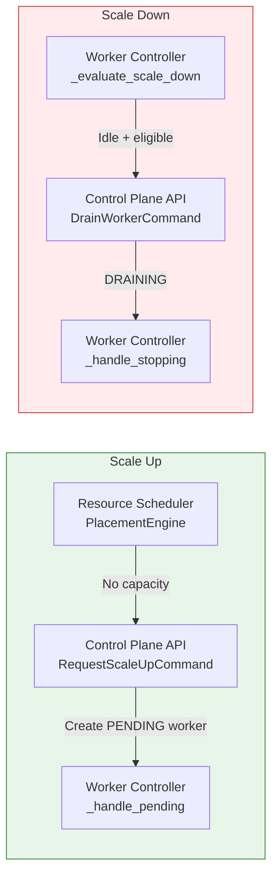
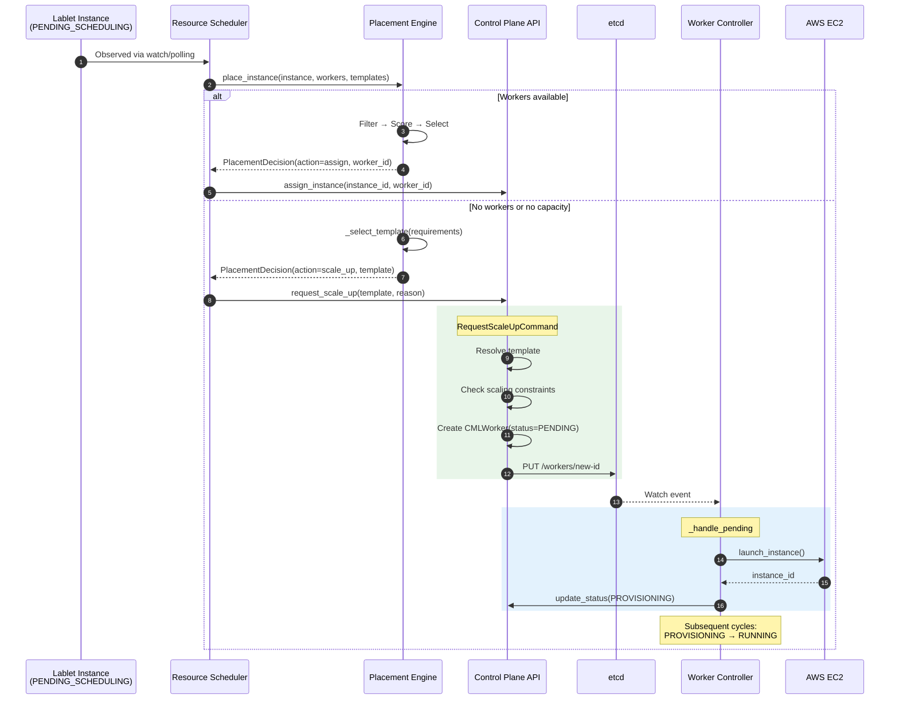
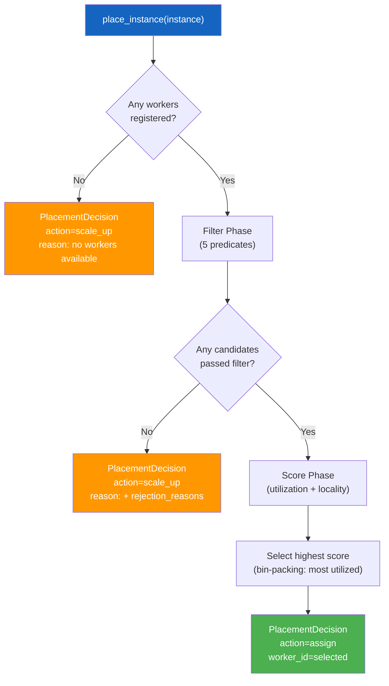
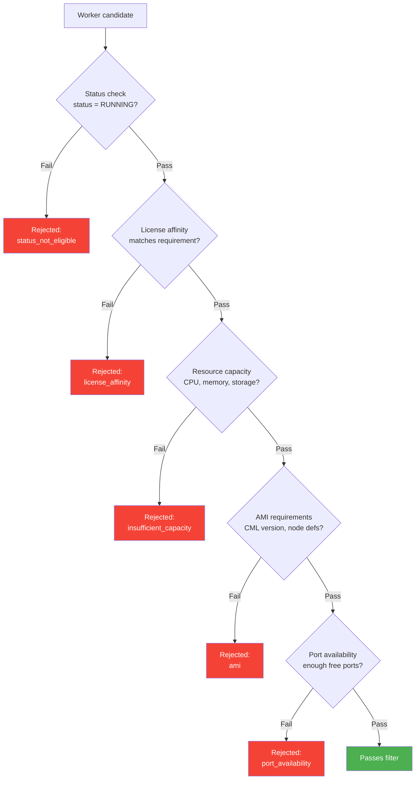
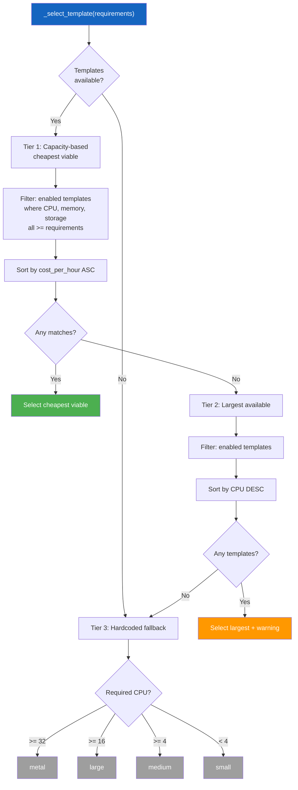
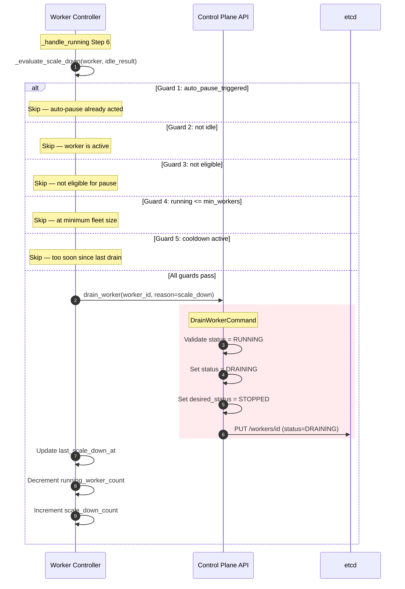
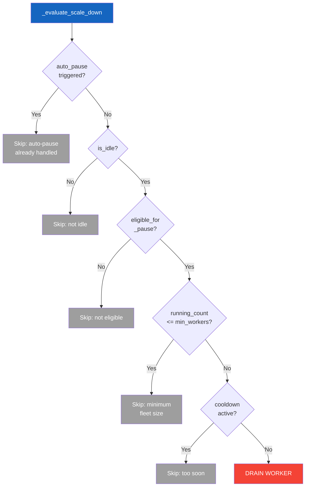
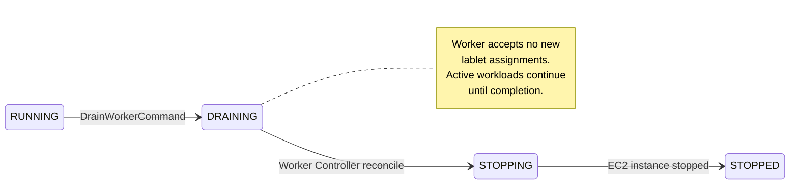
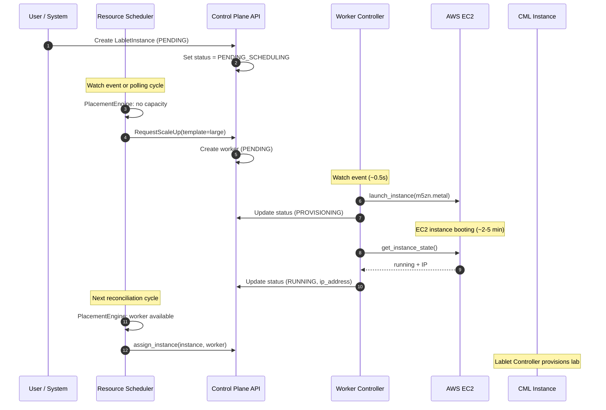

# Auto-Scaling Architecture

**Version:** 1.0.0 (February 2026)
**Scope:** Cross-cutting — spans Resource Scheduler, Control Plane API, and Worker Controller
**Phase:** Phase 3 - Auto-Scaling

!!! note "Related Documentation"
    - [Worker Lifecycle](worker-controller/worker-lifecycle.md) — state transitions during scaling
    - [Worker Discovery](worker-controller/worker-discovery.md) — how controllers observe changes
    - [Idle Detection](control-plane-api/idle-detection.md) — activity tracking for scale-down
    - [Worker Templates](resource-scheduler/worker-templates.md) — template selection and capacity

---

## 1. Overview

LCM auto-scaling automatically adjusts the CML worker fleet based on workload demand. It operates in two directions:

| Direction | Trigger | Service Chain | Goal |
|-----------|---------|---------------|------|
| **Scale Up** | Insufficient capacity for pending lablet instances | Resource Scheduler → Control Plane API → Worker Controller | Add workers |
| **Scale Down** | Workers idle beyond threshold | Worker Controller → Control Plane API | Remove workers |

---

## 2. Scale-Up Flow

When the Resource Scheduler cannot find a suitable worker for a pending lablet instance, it triggers a scale-up:

### Scaling Constraints

Before creating a new worker, `RequestScaleUpCommand` validates:

| Constraint | Check | Default | Behavior on Violation |
|-----------|-------|---------|----------------------|
| **Max workers per region** | `active_count < max_workers_per_region` | `10` | Reject with 409 Conflict |
| **Pending workers** | Check for existing PENDING workers | — | Log warning (does not block) |
| **Constraint check failure** | Exception during validation | — | **Fail open** — allows scale-up |

!!! warning "Fail-Open Design"
    If the constraint check itself fails (e.g., database error), the scale-up is **allowed** to proceed. This prevents a cascading failure where infrastructure issues also prevent scaling.

---

## 3. Placement Algorithm

The `PlacementEngine` implements a **Filter → Score → Select** pattern inspired by the Kubernetes scheduler:

### Filter Predicates (5 checks)

Each worker must pass **all** predicates to be eligible:

| # | Predicate | Data Source | Logic |
|---|-----------|------------|-------|
| 1 | **Status** | Worker state | Must be `RUNNING` (not DRAINING, STOPPING, etc.) |
| 2 | **License** | Instance requirements | If instance specifies license types, worker's license must match |
| 3 | **Capacity** | etcd (preferred) or worker state | Available CPU ≥ required, memory ≥ required, storage ≥ required |
| 4 | **AMI** | Instance requirements | CML version in min/max range, required node definitions present |
| 5 | **Ports** | Worker state + allocated ports | `max_ports - allocated_ports ≥ required_ports` |

!!! tip "Real-Time Capacity via etcd"
    The placement engine **prefers etcd** for capacity data (updated every 30s by workers) over MongoDB state, which may be stale. Capacity keys: `/lcm/workers/{id}/capacity`.

### Scoring Formula

Workers that pass filtering are scored to select the **most utilized** (bin-packing strategy):

$$
\text{score} = \frac{\text{cpu\_utilization} + \text{memory\_utilization}}{2} + \text{locality\_bonus}
$$

Where:

- $\text{cpu\_utilization} = \frac{\text{allocated\_cpu}}{\text{declared\_cpu}}$
- $\text{memory\_utilization} = \frac{\text{allocated\_memory}}{\text{declared\_memory}}$
- $\text{locality\_bonus} = \min(0.05, \text{instance\_count} \times 0.01)$ — small bonus for co-locating instances

**Higher score = preferred** — the algorithm packs workloads onto the most utilized workers first, keeping other workers available for larger workloads or scale-down.

---

## 4. Template Selection

When the placement engine decides to scale up, it selects the optimal worker template:

See [Worker Templates](resource-scheduler/worker-templates.md) for template definitions and capacity model.

---

## 5. Scale-Down Flow

Scale-down is evaluated during the Worker Controller's `_handle_running` reconciliation (Step 6), after idle detection has run:

### Safety Guards (5 checks, in order)

The `_evaluate_scale_down` method applies five sequential guards before draining:

| # | Guard | Condition to Skip | Audit Label | Purpose |
|---|-------|-------------------|-------------|---------|
| 1 | **Auto-pause** | `auto_pause_triggered` is true | `skipped_auto_pause` | Avoid double-action with auto-pause |
| 2 | **Idle check** | `is_idle` is false | `skipped_not_idle` | Only drain idle workers |
| 3 | **Eligibility** | `eligible_for_pause` is false | `skipped_not_eligible` | Respects snooze, per-worker flags |
| 4 | **Min workers** | `running_count <= min_workers` | `skipped_min_workers` | Maintain minimum fleet |
| 5 | **Cooldown** | `elapsed < cooldown_seconds` | `skipped_cooldown` | Prevent rapid succession drains |

### Running Worker Count Tracking

After a successful drain, the reconciler **decrements `_running_worker_count`** locally. This ensures that if multiple idle workers are evaluated in the same reconciliation cycle, the `min_workers` guard remains accurate without waiting for the next API refresh.

---

## 6. DRAINING State (ADR-008)

The `DRAINING` status provides a graceful transition between `RUNNING` and `STOPPING`:

The `DrainWorkerCommand` handler:

1. Validates the worker is in `RUNNING` status (returns 409 Conflict otherwise)
2. Sets `status = DRAINING`
3. Sets `desired_status = STOPPED`
4. Records scaling audit event

The Worker Controller's `_handle_stopping` method handles both `STOPPING` and `DRAINING` statuses with the same EC2 stop logic.

---

## 7. End-to-End Scale-Up Timeline

---

## 8. Observability

### Scaling Audit Events

All scaling decisions are recorded via `record_scaling_event()` for observability:

| Event | Service | Description |
|-------|---------|-------------|
| `scale_up_accepted` | Control Plane API | New worker created from template |
| `scale_up_rejected` | Control Plane API | Constraint violation or error |
| `provisioned` | Worker Controller | EC2 instance launched |
| `scale_down_initiated` | Worker Controller | Drain command sent |
| `scale_down_failed` | Worker Controller | Drain command failed |
| `skipped_auto_pause` | Worker Controller | Scale-down skipped (auto-pause acted) |
| `skipped_not_idle` | Worker Controller | Scale-down skipped (worker active) |
| `skipped_not_eligible` | Worker Controller | Scale-down skipped (not eligible) |
| `skipped_min_workers` | Worker Controller | Scale-down skipped (min fleet) |
| `skipped_cooldown` | Worker Controller | Scale-down skipped (cooldown) |
| `drained` | Worker Controller | Worker successfully drained |

---

## 9. Configuration Reference

### Scale-Up Settings (Control Plane API)

| Setting | Env Variable | Default | Description |
|---------|-------------|---------|-------------|
| `max_workers_per_region` | `MAX_WORKERS_PER_REGION` | `10` | Maximum active workers per AWS region |

### Scale-Down Settings (Worker Controller)

| Setting | Env Variable | Default | Description |
|---------|-------------|---------|-------------|
| `scale_down_enabled` | `SCALE_DOWN_ENABLED` | `False` | Enable automatic scale-down |
| `min_workers` | `MIN_WORKERS` | `0` | Minimum running workers to maintain |
| `scale_down_cooldown_seconds` | `SCALE_DOWN_COOLDOWN_SECONDS` | `600` | Cooldown between drains (10 min) |

### Scheduler Settings (Resource Scheduler)

| Setting | Env Variable | Default | Description |
|---------|-------------|---------|-------------|
| `scheduling_interval` | `RECONCILE_INTERVAL` | `30` | Seconds between scheduling cycles |
| `max_retries` | `MAX_RETRIES` | `35` | Max retries for failed placements |
| `scheduling_polling_enabled` | `SCHEDULING_POLLING_ENABLED` | `True` | Enable polling-based scheduling |

!!! warning "Scale-Down Disabled by Default"
    `scale_down_enabled` defaults to `False`. Enable it only after validating idle detection thresholds and min_workers settings for your environment.
