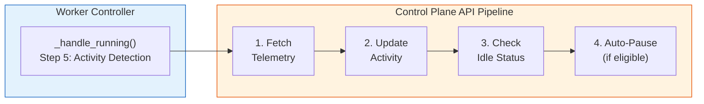
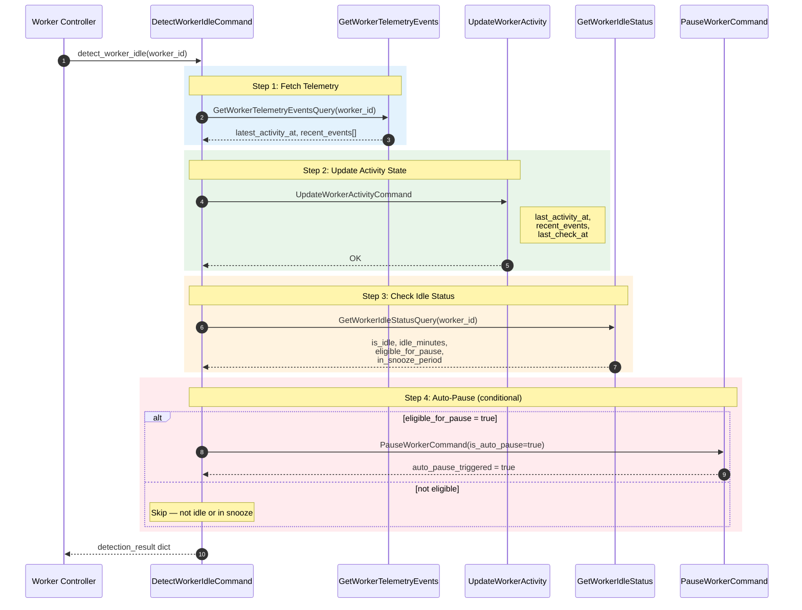
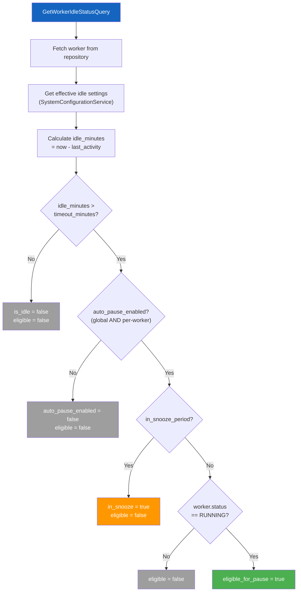
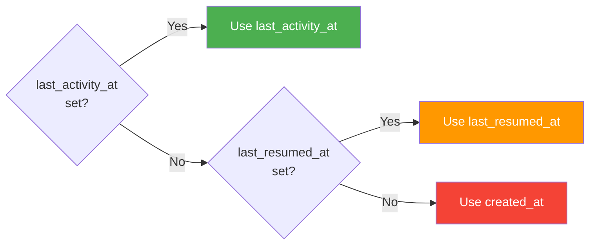
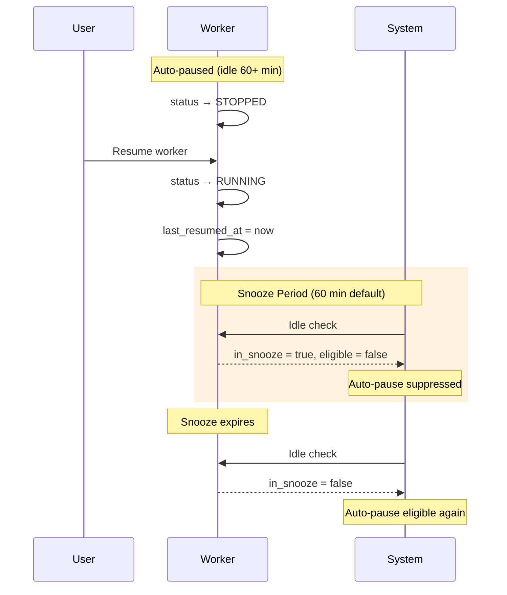
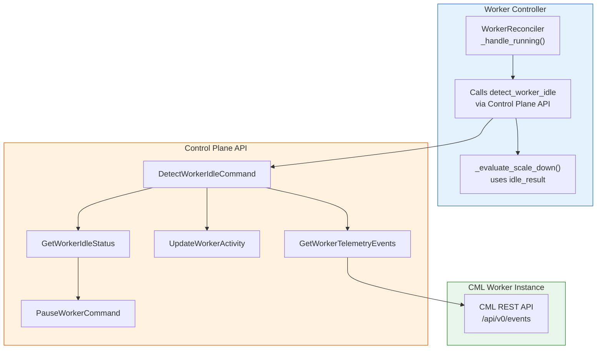

# Idle Detection & Auto-Pause

**Version:** 1.0.0 (February 2026)
**Component:** Control Plane API (orchestration), Worker Controller (trigger)
**Source:** `src/control-plane-api/application/commands/worker/detect_worker_idle_command.py`

!!! note "Related Documentation"
    - [Worker Lifecycle](../worker-controller/worker-lifecycle.md) — reconciliation step 5 triggers idle detection
    - [Auto-Scaling](../auto-scaling.md) — scale-down uses idle detection results
    - [Worker Discovery](../worker-controller/worker-discovery.md) — observation patterns

---

## 1. Overview

LCM automatically detects idle workers and pauses them to reduce cloud costs. The idle detection system operates as a **4-step pipeline** orchestrated by the `DetectWorkerIdleCommand`, which is triggered by the Worker Controller during each `RUNNING` reconciliation cycle.

---

## 2. Detection Pipeline

The `DetectWorkerIdleCommandHandler` orchestrates four sequential steps. Each step can fail independently — the pipeline returns early with partial results if any step fails.

### Detection Result

The pipeline returns a comprehensive result dictionary:

| Field | Type | Description |
|-------|------|-------------|
| `worker_id` | `str` | Worker identifier |
| `checked_at` | `datetime` | UTC timestamp of check |
| `telemetry_fetched` | `bool` | Step 1 completed |
| `activity_updated` | `bool` | Step 2 completed |
| `idle_check_performed` | `bool` | Step 3 completed |
| `auto_pause_triggered` | `bool` | Step 4 executed |
| `is_idle` | `bool` | Worker is idle (exceeds threshold) |
| `idle_minutes` | `float` | Minutes since last activity |
| `eligible_for_pause` | `bool` | Meets all auto-pause criteria |
| `in_snooze_period` | `bool` | Recently resumed, snooze active |
| `error` | `str?` | Error message if pipeline failed early |

---

## 3. Telemetry Sources (Step 1)

Telemetry events are fetched from the **CML REST API** on the worker instance. The `GetWorkerTelemetryEventsQuery` connects to the worker's CML API and retrieves recent activity events.

### Relevant Activity Categories

The system filters CML events by categories that indicate meaningful user activity:

| Category | Description |
|----------|-------------|
| `start_lab` | User started a lab |
| `stop_lab` | User stopped a lab |
| `create_lab` | User created a new lab |
| `import_lab` | Lab imported to worker |
| `wipe_lab` | Lab data wiped |
| `delete_lab` | Lab deleted |
| `start_node` | Individual node started |
| `stop_node` | Individual node stopped |

!!! info "Why CML Telemetry?"
    CloudWatch metrics (CPU, memory) cannot reliably distinguish between an idle worker and one running static labs with minimal resource usage. CML telemetry events provide **user-intent signals** — if a user is actively interacting with labs, the worker is not idle.

---

## 4. Idle Status Evaluation (Step 3)

The `GetWorkerIdleStatusQueryHandler` evaluates four conditions to determine idle eligibility:

### Eligibility Formula

A worker is eligible for auto-pause when **all four conditions** are true:

$$
\text{eligible} = \text{is\_idle} \wedge \text{auto\_pause\_enabled} \wedge \neg\text{in\_snooze} \wedge (\text{status} = \text{RUNNING})
$$

Where:

- **is_idle**: `idle_minutes > timeout_minutes` (default threshold: 60 minutes)
- **auto_pause_enabled**: Global setting AND per-worker `is_idle_detection_enabled` flag
- **in_snooze**: Worker was resumed within the snooze window (default: 60 minutes)
- **status = RUNNING**: Only running workers can be paused

### Last Activity Fallback Chain

The `IdleDetectionService` uses a 3-step fallback to determine the "last activity" timestamp:

This ensures every worker has a meaningful baseline — even newly created workers that have never had user activity.

---

## 5. Snooze Period

After a worker is **manually resumed**, auto-pause is temporarily suppressed to prevent a frustrating loop of pause → resume → immediate pause:

### Snooze Calculation

$$
\text{in\_snooze} = (\text{now} - \text{last\_resumed\_at}) < \text{snooze\_minutes}
$$

Default snooze duration: **60 minutes** (configurable via `worker_auto_pause_snooze_minutes`).

---

## 6. Activity Tracking Fields

The `CMLWorkerState` aggregate tracks comprehensive activity data:

| Field | Type | Updated By | Purpose |
|-------|------|-----------|---------|
| `last_activity_at` | `datetime?` | UpdateWorkerActivity | Last meaningful user event |
| `last_activity_check_at` | `datetime?` | UpdateWorkerActivity | When telemetry was last checked |
| `recent_activity_events` | `list` | UpdateWorkerActivity | Last N activity events |
| `auto_pause_count` | `int` | PauseWorkerCommand | Total auto-pauses for this worker |
| `manual_pause_count` | `int` | StopWorkerCommand | Total manual stops |
| `auto_resume_count` | `int` | ResumeWorkerCommand | Total auto-resumes |
| `manual_resume_count` | `int` | StartWorkerCommand | Total manual starts |
| `last_paused_at` | `datetime?` | PauseWorkerCommand | Timestamp of last pause |
| `last_resumed_at` | `datetime?` | ResumeWorkerCommand | Timestamp of last resume (snooze anchor) |
| `last_paused_by` | `str?` | PauseWorkerCommand | Who triggered the pause |
| `pause_reason` | `str?` | PauseWorkerCommand | "idle_timeout", "manual", "external" |
| `next_idle_check_at` | `datetime?` | GetWorkerIdleStatus | Scheduled next check time |
| `target_pause_at` | `datetime?` | GetWorkerIdleStatus | Estimated pause time |
| `is_idle_detection_enabled` | `bool` | Per-worker setting | Per-worker toggle (default: `True`) |

---

## 7. Cross-Service Interaction

Idle detection spans two services with clear responsibility boundaries:

| Responsibility | Service | Why |
|---------------|---------|-----|
| **Trigger detection** | Worker Controller | Runs during reconciliation loop, knows worker IP |
| **Fetch CML telemetry** | Control Plane API | Has CML API client, domain logic |
| **Evaluate idle status** | Control Plane API | Owns worker aggregate, settings, domain services |
| **Execute pause** | Control Plane API | CQRS command updates aggregate state |
| **Act on scale-down** | Worker Controller | Makes EC2 infrastructure decisions |

---

## 8. Configuration Reference

### Control Plane API Settings

| Setting | Env Variable | Default | Description |
|---------|-------------|---------|-------------|
| `worker_idle_timeout_minutes` | `WORKER_IDLE_TIMEOUT_MINUTES` | `60` | Minutes of inactivity before idle |
| `worker_auto_pause_enabled` | `WORKER_AUTO_PAUSE_ENABLED` | `True` | Global auto-pause toggle |
| `worker_auto_pause_snooze_minutes` | `WORKER_AUTO_PAUSE_SNOOZE_MINUTES` | `60` | Snooze after resume |
| `worker_activity_detection_enabled` | `WORKER_ACTIVITY_DETECTION_ENABLED` | `True` | Enable activity tracking |
| `worker_activity_detection_interval` | `WORKER_ACTIVITY_DETECTION_INTERVAL` | `1800` | Seconds between activity checks |

### Worker Controller Settings

| Setting | Env Variable | Default | Description |
|---------|-------------|---------|-------------|
| `idle_detection_interval` | `IDLE_DETECTION_INTERVAL` | `300` | Min seconds between per-worker idle checks |
| `scale_down_enabled` | `SCALE_DOWN_ENABLED` | `False` | Enable scale-down after idle detection |

### Per-Worker Override

Each worker has an `is_idle_detection_enabled` flag (default: `True`) that can disable idle detection individually without affecting global settings.
