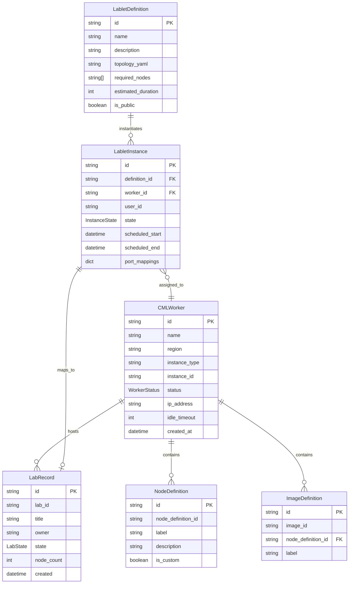
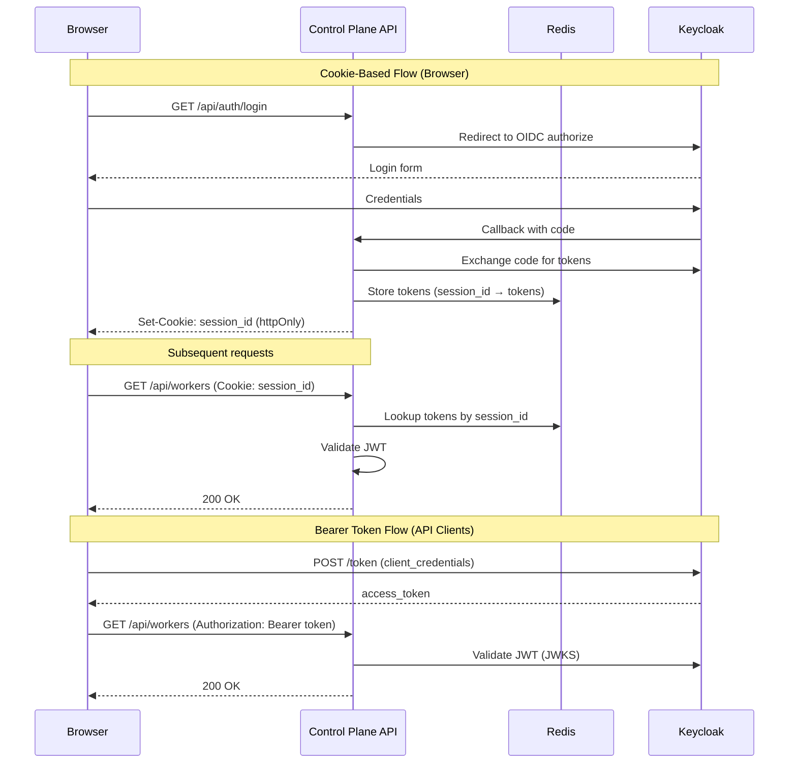
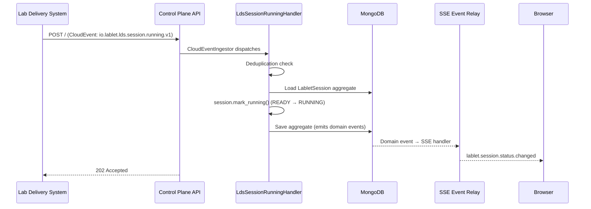

# Control Plane API Architecture

**Version:** 1.3.0 (April 2026)
**Status:** Current Implementation

!!! note "Related Documentation"
    For development workflows and Makefile commands, see the [Development Guide](../../../development/ai-agent-guide.md).

---

## Revision History

| Version | Date | Changes |
|---------|---------|-------|
| 1.3.0 | 2026-04 | SSE race condition fix (ADR-039), LDS CloudEvent direct ingestion (ADR-040), LDS integration settings |
| 1.2.0 | 2026-02 | Added CloudEvent ingestion endpoint, CollectAndGrade command, etcd state publishing (ADR-018) |
| 1.1.0 | 2026-02 | Added dual auth architecture, SSE event relay |
| 1.0.0 | 2026-01 | Initial architecture documentation |

---

## 1. Overview

The **Control Plane API** is the central gateway for the Lablet Cloud Manager system. It serves as the Backend-for-Frontend (BFF) providing:

- **REST API** for LabletDefinition, LabletInstance, and Worker CRUD operations
- **Bootstrap 5 SPA** with Server-Side Events (SSE) for real-time updates
- **OAuth2/OIDC Authentication** via Keycloak
- **CQRS Pattern** with Commands (writes) and Queries (reads) via Mediator
- **CloudEvents Publishing** for external system integration (fire-and-forget)
- **etcd State Publishing** for controller watches

!!! important "CQRS Location & Persistence Pattern"
    **Control Plane API is the ONLY service that implements CQRS commands/queries.**
    Controllers (resource-scheduler, worker-controller, lablet-controller) use Reconciliation Loops, not CQRS.

    **Event-Driven State-Based Persistence:**
    The system uses a hybrid persistence pattern where:

    - **State-Based Storage**: Aggregates are persisted as current state in MongoDB (not event-sourced)
    - **Domain Events**: AggregateRoot emits domain events on state changes for in-process side effects
    - **CloudEvents**: Domain events are automatically published to external event bus (fire-and-forget)
    - **etcd Publishing**: State changes are published to etcd for controller watching

!!! warning "ADR-015: No External API Calls"
    Control Plane API MUST NOT make external API calls (AWS, CML).
    It only interacts with MongoDB, etcd, and Redis (sessions).
    All external operations are delegated to controllers via state/intent in the database.

## 2. Entity Hierarchy



## 3. Storage Strategy

| Entity | Storage | Access Pattern |
|--------|---------|----------------|
| **CMLWorker** | MongoDB | State-based aggregate with optimistic concurrency |
| **LabRecord** | MongoDB | Denormalized snapshot from CML API |
| **LabletDefinition** | MongoDB | Immutable versioned entity (see note below) |
| **LabletInstance** | MongoDB | State-based aggregate with status machine |
| **NodeDefinition** | MongoDB | Cached from CML Worker discovery |
| **ImageDefinition** | MongoDB | Cached from CML Worker discovery |
| **Sessions** | Redis | User session tokens (httpOnly cookies) |
| **State Keys** | etcd | Worker/instance state for controller watches |

!!! warning "LabletDefinition Versioning (Decision Pending)"
    LabletDefinition MUST be versioned so that LabletInstance always refers to a specific version.
    When a command "changes" a definition's state, it MUST create a **new entity** in the database
    (maintaining old versions while enabling automatic cleanup over time).

    **Design Decision Required:**

    - Version numbering scheme (semantic versioning vs auto-increment)
    - Retention policy for old versions
    - Migration strategy for existing data

    This will be documented in a separate ADR.

## 4. Layer Architecture

```
control-plane-api/
├── api/                          # HTTP Layer
│   ├── controllers/              # REST endpoints (auto-prefixed)
│   │   ├── workers_controller.py
│   │   ├── lablet_definitions_controller.py
│   │   ├── lablet_instances_controller.py
│   │   └── auth_controller.py
│   ├── dependencies.py           # DI for auth, sessions
│   └── services/
│       └── auth.py               # DualAuthService (Cookie + JWT)
│
├── application/                  # Business Logic Layer
│   ├── commands/                 # Write operations (self-contained)
│   │   ├── create_worker_command.py
│   │   ├── start_worker_command.py
│   │   └── create_lablet_instance_command.py
│   ├── queries/                  # Read operations (self-contained)
│   │   ├── get_workers_query.py
│   │   └── get_lablet_instances_query.py
│   ├── dtos/                     # Data Transfer Objects
│   ├── services/                 # Application services
│   │   ├── worker_monitoring_scheduler.py
│   │   └── sse_event_relay.py
│   ├── jobs/                     # Background tasks
│   │   ├── worker_metrics_collection_job.py
│   │   └── labs_refresh_job.py
│   └── settings.py               # Configuration (Pydantic Settings)
│
├── domain/                       # Core Domain Layer
│   ├── entities/                 # Aggregates
│   │   ├── cml_worker.py
│   │   ├── lab_record.py
│   │   ├── lablet_definition.py
│   │   └── lablet_instance.py
│   ├── events/                   # Domain events (@cloudevent)
│   ├── enums/                    # Value objects
│   │   ├── worker_status.py
│   │   └── instance_state.py
│   └── repositories/             # Abstract interfaces
│
├── integration/                  # External Service Adapters
│   ├── repositories/             # MongoDB implementations
│   │   ├── mongo_worker_repository.py
│   │   └── mongo_lablet_instance_repository.py
│   └── services/
│       ├── aws_ec2_api_client.py
│       ├── cml_api_client.py
│       └── control_plane_api_client.py
│
├── infrastructure/               # Technical Adapters
│   └── session_store.py          # Redis/InMemory session storage
│
├── ui/                           # Frontend Assets
│   ├── src/                      # Parcel source (JS, SCSS)
│   └── package.json
│
└── observability/                # Instrumentation
    └── otel_config.py
```

## 5. Authentication Architecture

The Control Plane API implements **Dual Authentication** supporting both browser-based and API-based access:



### Security Model

| Aspect | Implementation |
|--------|---------------|
| **Session Storage** | Redis (production) or in-memory (dev) |
| **Token Exposure** | Never exposed to browser JS (httpOnly cookies) |
| **CSRF Protection** | SameSite cookie attribute |
| **Token Refresh** | Server-side refresh before expiry |
| **RBAC** | Keycloak realm roles mapped to permissions |

## 6. Background Services

The Control Plane API runs several background services:

### Worker Monitoring Scheduler

Coordinates per-worker metrics collection:

```python
class WorkerMonitoringScheduler:
    """
    Lifecycle:
    1. On startup: Query active workers
    2. For each worker: Schedule WorkerMetricsCollectionJob
    3. On worker state change: Add/remove jobs dynamically
    """

    async def start_async(self):
        workers = await self._get_active_workers()
        for worker in workers:
            self._scheduler.add_job(
                WorkerMetricsCollectionJob(worker.id),
                trigger='interval',
                seconds=self._settings.metrics_poll_interval
            )
```

### SSE Event Relay

Broadcasts real-time updates to connected clients:

```python
class SSEEventRelay:
    """
    - Clients subscribe with optional filters (worker_ids, event_types)
    - Events broadcast to all matching subscribers
    - Common events: worker_status, worker_metrics, lab_status
    """
```

## 7. API Design

### Controller Routing

Neuroglia auto-generates route prefixes from controller class names:

| Controller Class | Route Prefix |
|-----------------|--------------|
| `WorkersController` | `/workers/*` |
| `LabletDefinitionsController` | `/lablet-definitions/*` |
| `LabletInstancesController` | `/lablet-instances/*` |
| `AuthController` | `/auth/*` |

!!! warning "Prefix Convention"
    Do NOT add prefix in `@route` decorators - the controller name IS the prefix.

    ```python
    # ✅ Correct
    @route(HttpMethod.GET, "/{worker_id}")  # → GET /workers/{worker_id}

    # ❌ Wrong (double prefix)
    @route(HttpMethod.GET, "/workers/{worker_id}")  # → GET /workers/workers/{worker_id}
    ```

### CQRS Pattern

All operations use the Mediator pattern:

```python
# In controller
result = await self.mediator.execute_async(
    GetWorkersQuery(status_filter=WorkerStatus.RUNNING)
)
return self.process(result)

# In handler
class GetWorkersQueryHandler(QueryHandler[GetWorkersQuery, OperationResult[list[WorkerDto]]]):
    async def handle_async(self, request, cancellation_token=None):
        workers = await self._repository.get_all_async(cancellation_token)
        return self.ok([WorkerDto.from_entity(w) for w in workers])
```

## 8. External Integrations

### AWS EC2 Client

```python
class AwsEc2Client:
    """
    Singleton service with boto3 client pooling.

    Operations:
    - describe_instances() - Query instance state
    - start_instances() - Start stopped instances
    - stop_instances() - Stop running instances
    - terminate_instances() - Terminate instances
    - get_cloudwatch_metrics() - CPU, memory, network, disk
    """
```

### CML API Client

```python
class CMLApiClient:
    """
    Per-worker client for CML REST API.

    Endpoints:
    - /api/v0/system_information - No auth, worker info
    - /api/v0/system_stats - Auth required, resource usage
    - /api/v0/labs - Lab lifecycle operations
    - /api/v0/node_definitions - Available node types
    """
```

### CloudEvent Ingestion (LDS Integration — ADR-040)

The Control Plane API receives CloudEvents from external systems via its `CloudEventMiddleware` (mounted on the main app). Per [ADR-040](../../adr/ADR-040-lds-cloudevent-direct-ingestion-cpa.md), CPA handles **simple state-transition** CloudEvents directly, while complex orchestration events are routed to lablet-controller per [ADR-022](../../adr/ADR-022-cloudevent-ingestion-lablet-controller.md).



#### Supported LDS CloudEvent Types

| Event Type | Handler | Action | State Transition |
|------------|---------|--------|------------------|
| `io.lablet.lds.session.running.v1` | `LdsSessionRunningHandler` | Mark session running | READY → RUNNING |
| `io.lablet.lds.session.paused.v1` | `LdsSessionPausedHandler` | Informational log | — |
| `io.lablet.lds.session.ended.v1` | `LdsSessionEndedHandler` | Informational log | — |

!!! note "Dual Routing Model"
    Events requiring external calls (e.g., `lds.session.user-finished` → GradingSPI) are routed
    to lablet-controller per ADR-022. Only simple aggregate mutations are handled directly by CPA.

#### LDS Integration Settings

| Variable | Description | Default |
|----------|-------------|---------|
| `LDS_CLOUDEVENT_SOURCE` | Expected CloudEvent source URI | `https://labs.lcm.io` |
| `LDS_CLOUDEVENT_TYPE_PREFIX` | CloudEvent type prefix for LDS | `io.lablet.lds` |
| `LDS_CLOUDEVENT_ENABLED` | Feature toggle for LDS event processing | `true` |

## 9. CQRS Commands Reference

Key commands implemented in Control Plane API:

| Command | Purpose | Outcome |
|---------|---------|---------|
| `CreateWorkerCommand` | Register new CML worker | Worker in PENDING state |
| `StartWorkerCommand` | Request worker startup | desired_state = RUNNING |
| `StopWorkerCommand` | Request worker stop | desired_state = STOPPED |
| `CreateLabletInstanceCommand` | Create new instance | Instance in PENDING state |
| `ScheduleLabletInstanceCommand` | Assign worker to instance | Instance in SCHEDULED state |
| `InstantiateLabletInstanceCommand` | Import/start lab on worker | Instance in INSTANTIATING/READY |
| `CollectAndGradeCommand` | Trigger grading workflow | Instance in GRADED state |
| `TerminateLabletInstanceCommand` | Cleanup and terminate | Instance in TERMINATED state |

### CollectAndGrade Command (FR-2.2.7)

Triggers the grading workflow for a running lablet instance:

```python
@dataclass
class CollectAndGradeCommand(Command[OperationResult[GradingResultDto]]):
    """Collect lab state and submit for grading."""
    instance_id: str
    grading_criteria: dict | None = None  # Optional custom criteria


class CollectAndGradeCommandHandler(CommandHandler):
    async def handle_async(self, request, cancellation_token=None):
        # 1. Get instance from repository
        instance = await self._repository.get_by_id_async(request.instance_id)

        if not instance:
            return self.not_found("LabletInstance", f"Instance {request.instance_id} not found")

        if instance.state.status != LabletInstanceStatus.RUNNING:
            return self.bad_request("Instance must be RUNNING to collect and grade")

        # 2. Trigger grading (publishes domain event)
        instance.collect_and_grade(request.grading_criteria)

        # 3. Persist
        await self._repository.update_async(instance, cancellation_token)

        return self.accepted(GradingResultDto(instance_id=request.instance_id, status="GRADING"))
```

## 10. Configuration

Key environment variables:

| Variable | Description | Default |
|----------|-------------|---------|
| `KEYCLOAK_URL` | Keycloak server URL | Required |
| `KEYCLOAK_REALM` | OIDC realm | `lablet-cloud-manager` |
| `CONNECTION_STRINGS` | MongoDB connection | Required |
| `REDIS_URL` | Redis URL (sessions) | Optional |
| `WORKER_MONITORING_ENABLED` | Enable background monitoring | `true` |
| `WORKER_METRICS_POLL_INTERVAL` | Metrics collection interval (sec) | `300` |
| `ETCD_ENDPOINTS` | etcd cluster endpoints | `localhost:2379` |
| `LDS_CLOUDEVENT_SOURCE` | Expected LDS CloudEvent source URI | `https://labs.lcm.io` |
| `LDS_CLOUDEVENT_TYPE_PREFIX` | LDS CloudEvent type prefix | `io.lablet.lds` |
| `LDS_CLOUDEVENT_ENABLED` | Enable LDS CloudEvent processing | `true` |

## 11. Related Documentation

- [Authentication Flows](../../../security/authentication-flows.md)
- [Worker Monitoring](../worker-monitoring.md)
- [Real-Time Updates](../realtime-updates.md)
- [CML Worker Domain Model](../cml-worker-domain-model.md)
- [ADR-018: Lab Delivery System Integration](../../../architecture/decisions/ADR-018-lab-delivery-system-integration.md)
