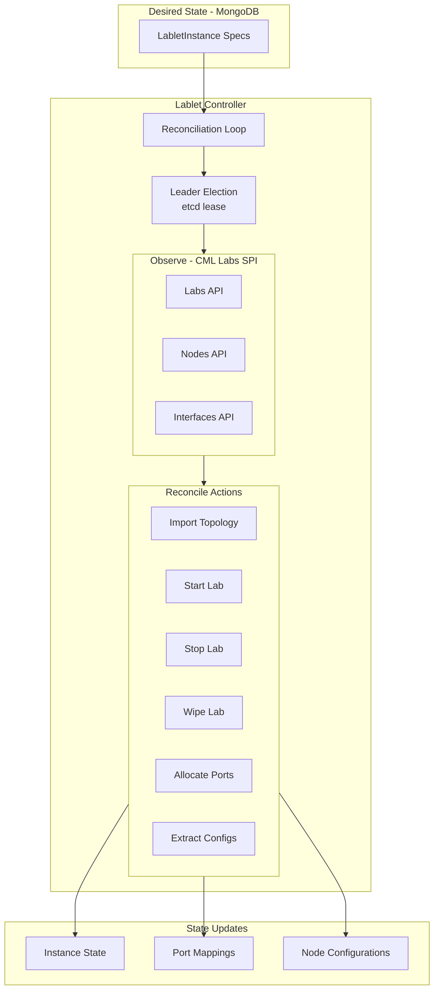
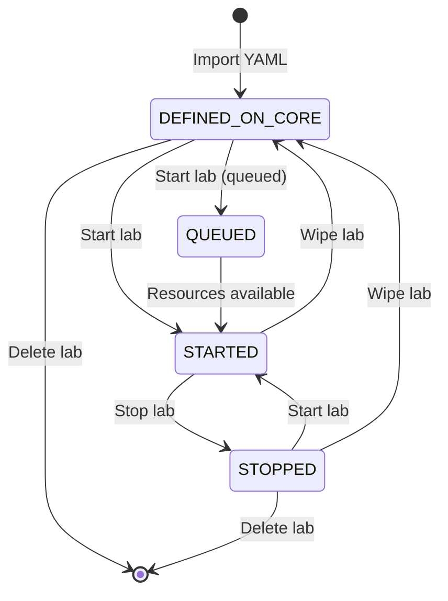
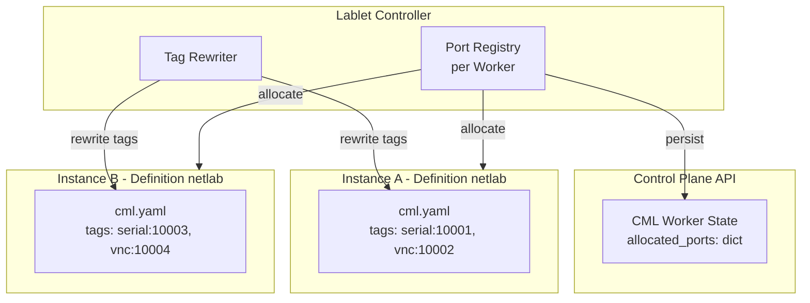
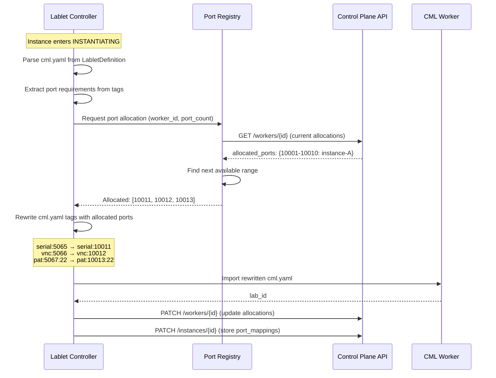
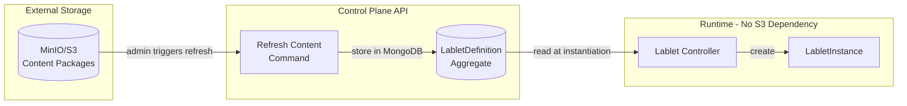
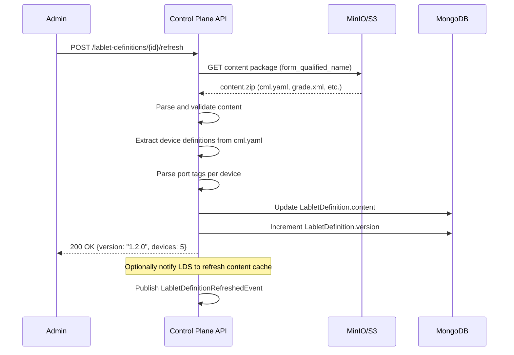
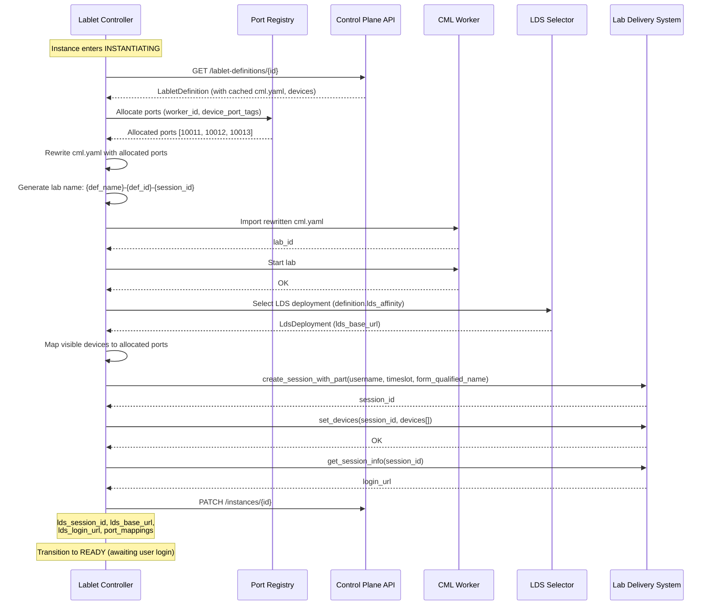

# Lablet Controller Architecture

**Version:** 1.2.0 (February 2026)
**Status:** Current Implementation

!!! note "Related Documentation"
    For scheduling and placement details, see the [Resource Scheduler Architecture](../resource-scheduler/index.md).

---

## Revision History

| Version | Date | Changes |
|---------|------|---------|
| 1.2.0 | 2026-02 | Enhanced port allocation (dynamic registry, tag rewriting), LabletDefinition content refresh, LDS deployment selection |
| 1.1.0 | 2026-02 | Added LDS integration (LabDeliverySPI), READY state, etcd watch pattern |
| 1.0.0 | 2026-01 | Initial architecture documentation |

---

## 1. Overview

The **Lablet Controller** is responsible for **LabletInstance reconciliation** - managing the workload lifecycle by reconciling desired instance state (spec) against actual CML lab state, AND provisioning the corresponding LabSession in LDS (Lab Delivery System).

A **LabletInstance** is a composite entity consisting of:

- **CML Lab**: The network topology running on a CML Worker
- **LabSession**: The user-facing interface in LDS for interacting with lab devices and viewing tasks

It operates at the **Application Layer**, talking to:

- **CML Labs SPI** - Lab lifecycle (create, start, stop, wipe, delete)
- **LabDelivery SPI** - Session lifecycle (create, set devices, archive)

!!! important "Application Layer Separation"
    The Lablet Controller manages **workloads** (CML labs + LDS sessions). It does NOT manage EC2 instances or infrastructure - that is the Worker Controller's responsibility.

## 2. Reconciliation Pattern

The Lablet Controller follows the **Kubernetes Controller Pattern**:

```
┌─────────────────────────────────────────────────────────────────────────────┐
│                LABLET CONTROLLER - RECONCILIATION PATTERN                    │
├─────────────────────────────────────────────────────────────────────────────┤
│                                                                              │
│   ┌──────────────────┐     ┌──────────────────┐     ┌──────────────────┐   │
│   │       SPEC       │     │     OBSERVE      │     │       ACT        │   │
│   │   (Desired)      │     │    (Actual)      │     │   (Reconcile)    │   │
│   └────────┬─────────┘     └────────┬─────────┘     └────────┬─────────┘   │
│            │                        │                        │              │
│            ▼                        ▼                        ▼              │
│   ┌──────────────────┐     ┌──────────────────┐     ┌──────────────────┐   │
│   │ LabletInstance   │     │ CML Lab State    │     │ • Import lab     │   │
│   │ • state=RUNNING  │     │ • state=DEFINED  │     │ • Start nodes    │   │
│   │ • worker_id=W1   │ ←→  │ • nodes stopped  │  →  │ • Allocate ports │   │
│   │ • ports={...}    │     │ • no ports       │     │ • Update state   │   │
│   └──────────────────┘     └──────────────────┘     └──────────────────┘   │
│                                                                              │
│   Source: MongoDB         Source: CML Labs API       Target: Both          │
│   (via Control Plane)     (direct observation)       (via Control Plane)   │
│                                                                              │
└─────────────────────────────────────────────────────────────────────────────┘
```

## 3. Domain Separation

| Service | Abstraction Layer | SPI (Service Provider Interface) |
|---------|-------------------|----------------------------------|
| **Lablet Controller** | Application (Workload) | CML Labs SPI (Labs, Nodes, Interfaces, Links API) |
| **Lablet Controller** | Application (UX) | LabDelivery SPI (Sessions, Devices, Content) |
| **Worker Controller** | Infrastructure (Compute) | Cloud Provider SPI (EC2, CloudWatch, CML System API) |

Both controllers follow the same reconciliation pattern but at different abstraction layers.

## 4. Core Responsibilities



## 5. Reconciliation Examples

| Desired (Spec) | Actual (Observed) | Action |
|----------------|-------------------|--------|
| `state=INSTANTIATING` | Lab not imported | Import topology, allocate ports |
| `state=INSTANTIATING` | Lab imported, not started | Start lab, provision LDS session |
| `state=INSTANTIATING` | Lab started, LDS ready | Transition to READY |
| `state=READY` | Awaiting user login | No action (event-driven → RUNNING) |
| `state=RUNNING` | Lab `state=STARTED` | No action (converged) |
| `state=COLLECTING` | Collection not started | Extract configs, collect artifacts |
| `state=COLLECTING` | Collection complete | Transition to GRADING |
| `state=STOPPED` | Lab `state=STARTED` | Stop lab nodes |
| `state=TERMINATED` | Lab exists | Archive LDS session, wipe and delete lab |
| Any | Lab error state | Attempt recovery or mark FAILED |

!!! info "READY State"
    The READY → RUNNING transition is **event-driven** (not reconciliation).
    LDS emits `session.started` CloudEvent when user logs in; control-plane-api handles it.

## 6. Layer Architecture

!!! note "No CQRS Pattern"
    Lablet-controller uses **Reconciliation Loops** via HostedServices, NOT CQRS commands/queries.
    CQRS is implemented only in control-plane-api. Controllers interact with Control Plane API via REST.

```
lablet-controller/
├── api/                          # HTTP Layer (minimal - health/admin only)
│   └── controllers/
│       ├── health_controller.py  # /health, /ready, /info
│       ├── admin_controller.py   # /admin/trigger-reconcile, /admin/stats
│       └── labs_controller.py    # /labs/{id}/download (BFF for DownloadLabCommand)
│
├── application/                  # Business Logic Layer
│   ├── hosted_services/          # Reconciliation loops (NOT commands!)
│   │   ├── lablet_reconciler.py  # LeaderElectedHostedService
│   │   └── labs_refresh_service.py  # HostedService
│   ├── services/
│   │   ├── port_allocation_service.py  # Port allocation for instances
│   │   └── lab_observer.py
│   ├── dtos/
│   │   └── reconciliation_result.py
│   └── settings.py
│
├── integration/                  # SPI Implementations
│   └── services/
│       ├── cml_labs_spi.py       # CMLLabsSPI implementation
│       └── cml_nodes_spi.py      # Node configuration extraction
│
└── main.py                       # Neuroglia WebApplicationBuilder
```

!!! warning "CML API Restriction"
    Lablet-controller uses **CML Labs API ONLY** (labs, nodes, interfaces, links).
    It MUST NOT import or call CML System API. System operations are worker-controller's responsibility.

!!! info "Port Allocation Responsibility"
    Port allocation for LabletInstances is performed by lablet-controller, not control-plane-api.
    The controller queries Control Plane API for worker/instance information, allocates ports,
    and reports allocations back via the internal API.

## 7. CML Labs SPI

### Labs API

```python
class CmlLabsClient:
    """
    CML Lab lifecycle management.

    Base endpoint: /api/v0/labs
    """

    async def list_labs(
        self,
        worker_ip: str,
        auth_token: str
    ) -> list[CmlLabInfo]:
        """List all labs on worker."""

    async def get_lab(
        self,
        worker_ip: str,
        lab_id: str,
        auth_token: str
    ) -> CmlLabDetail:
        """Get detailed lab information."""

    async def import_lab(
        self,
        worker_ip: str,
        topology_yaml: str,
        auth_token: str
    ) -> str:
        """Import YAML topology, return lab_id."""

    async def start_lab(
        self,
        worker_ip: str,
        lab_id: str,
        auth_token: str
    ) -> None:
        """Start all nodes in lab."""

    async def stop_lab(
        self,
        worker_ip: str,
        lab_id: str,
        auth_token: str
    ) -> None:
        """Stop all nodes in lab."""

    async def wipe_lab(
        self,
        worker_ip: str,
        lab_id: str,
        auth_token: str
    ) -> None:
        """Wipe lab state (reset to initial)."""

    async def delete_lab(
        self,
        worker_ip: str,
        lab_id: str,
        auth_token: str
    ) -> None:
        """Delete lab permanently."""
```

### Nodes API

```python
class CmlNodesClient:
    """
    CML Node management.

    Base endpoint: /api/v0/labs/{lab_id}/nodes
    """

    async def list_nodes(
        self,
        worker_ip: str,
        lab_id: str,
        auth_token: str
    ) -> list[CmlNodeInfo]:
        """List all nodes in lab."""

    async def get_node_state(
        self,
        worker_ip: str,
        lab_id: str,
        node_id: str,
        auth_token: str
    ) -> CmlNodeState:
        """Get node state (BOOTED, STOPPED, etc)."""

    async def extract_config(
        self,
        worker_ip: str,
        lab_id: str,
        node_id: str,
        auth_token: str
    ) -> str:
        """Extract running configuration from node."""
```

### Interfaces API

```python
class CmlInterfacesClient:
    """
    CML Interface and console port management.

    Base endpoint: /api/v0/labs/{lab_id}/nodes/{node_id}
    """

    async def get_console_ports(
        self,
        worker_ip: str,
        lab_id: str,
        auth_token: str
    ) -> dict[str, int]:
        """Get console port mappings for all nodes."""

    async def get_vnc_url(
        self,
        worker_ip: str,
        lab_id: str,
        node_id: str,
        auth_token: str
    ) -> str:
        """Get VNC access URL for graphical nodes."""
```

## 8. Lab State Machine

CML labs have a complex state machine:



### State Mapping

| CML Lab State | LabletInstance State | Description |
|---------------|---------------------|-------------|
| `DEFINED_ON_CORE` | `INSTANTIATING` | Lab imported, nodes not started |
| `QUEUED` | `INSTANTIATING` | Lab start queued (waiting resources) |
| `STARTED` | `RUNNING` | All nodes booted |
| `STOPPED` | `STOPPED` | Nodes stopped, state preserved |
| (deleted) | `TERMINATED` | Lab removed from CML |

## 9. Dynamic Port Allocation

The Lablet Controller manages a **private port registry per CML worker** to enable multiple lablet-instances on a single worker. Ports defined in the LabletDefinition's `cml.yaml` are **dynamically rewritten** before the lab is created in CML.

!!! important "Why Dynamic Port Allocation?"
    A LabletDefinition contains a static `cml.yaml` with hardcoded port numbers in device tags.
    Without dynamic allocation, only ONE instance of that definition could run per worker.
    By rewriting ports at instantiation time, we enable **concurrent instances** on the same worker.

### 9.1 Port Registry Architecture



### 9.2 Port Tags in cml.yaml

Device nodes in `cml.yaml` define required ports via **tags**:

```yaml
# Example device node with port tags
- id: n5
  label: workstation
  node_definition: ubuntu-desktop-24-04-v2
  image_definition: lablet-desktop-v0.1.1
  tags:
    - serial:5065      # Serial console on port 5065
    - vnc:5066         # VNC access on port 5066
    - pat:5067:22      # PAT: external 5067 → internal 22 (SSH)
  interfaces:
    - id: i0
      label: ens3
      type: physical
```

**Tag Format:**

| Tag Pattern | Description | Example |
|-------------|-------------|---------|
| `serial:<port>` | Serial console access | `serial:5065` |
| `vnc:<port>` | VNC graphical access | `vnc:5066` |
| `pat:<ext>:<int>` | Port Address Translation | `pat:5067:22` |
| `http:<port>` | HTTP/HTTPS web access | `http:8080` |

### 9.3 Dynamic Rewriting Flow



### 9.4 Lab Naming Convention

CML lab names must be unique per worker. The controller generates names using:

```
{definition_name}-{definition_id}-{session_id}
```

**Example:**

```
netlab-fundamentals-def123-sess456
```

This ensures:

- Multiple instances of the same definition can coexist
- Labs are traceable back to their definition and session
- No naming collisions even with concurrent instantiation

### 9.5 Port Registry Configuration

| Variable | Description | Default |
|----------|-------------|---------|
| `PORT_RANGE_START` | Start of allocatable port range | `10000` |
| `PORT_RANGE_END` | End of allocatable port range | `20000` |
| `PORTS_PER_INSTANCE_MAX` | Maximum ports per instance | `50` |

!!! warning "Port Range Must Match CML Configuration"
    The port range configured in LCM **must match** the CML system's external port range.
    CML exposes these ports externally; LCM only tracks allocation.

### 9.6 Port Allocation Data Model

```python
class PortAllocation:
    """Tracks allocated ports for a lablet instance."""
    instance_id: str
    worker_id: str
    allocated_ports: list[int]           # [10011, 10012, 10013]
    port_mappings: dict[str, PortInfo]   # {"workstation": PortInfo(...)}
    allocated_at: datetime
    released_at: datetime | None


class PortInfo:
    """Port mapping for a single device."""
    device_label: str      # "workstation"
    original_port: int     # 5065 (from definition)
    allocated_port: int    # 10011 (dynamically assigned)
    protocol: str          # "serial", "vnc", "pat", "http"
    internal_port: int | None  # For PAT: 22
```

### 9.7 Port Release on Termination

When an instance reaches `TERMINATED`, ports are released:

```python
async def release_ports(self, instance_id: str, worker_id: str) -> None:
    """
    Release allocated ports back to the pool.

    Called during TERMINATED reconciliation after lab deletion.
    """
    allocation = await self._get_allocation(instance_id)
    await self._port_registry.release(worker_id, allocation.allocated_ports)
    await self._control_plane.update_worker_allocations(worker_id)
```

## 9A. LabletDefinition Content Refresh

LabletDefinition content (cml.yaml, device specs) is refreshed **on-demand** by admin action, NOT automatically. This ensures content changes don't impact production unexpectedly.

!!! important "Separation of Concerns"
    Content refresh is a **separate process** from lablet instance instantiation.
    Instantiation reads from MongoDB only - no runtime dependency on MinIO/S3.

### 9A.1 Content Storage Strategy



**Design Rationale:**

| Approach | Pros | Cons |
|----------|------|------|
| **Store in MongoDB (chosen)** | No runtime S3 dependency, fast instantiation, atomic with definition | Larger documents |
| Store in S3, pull per-instance | Smaller MongoDB docs | S3 availability impacts instantiation, slower |

### 9A.2 Content Package Structure

A LabletDefinition stores the following content (downloaded from S3 on refresh):

```python
class LabletDefinitionContent:
    """Content payload stored in LabletDefinition aggregate."""

    cml_yaml: str                    # Full CML topology YAML
    device_definitions: list[DeviceDefinition]  # Parsed device specs
    grade_xml: str | None            # Grading criteria (optional)
    pod_xml: str | None              # Pod configuration (optional, TBD)
    content_version: str             # Version from S3 metadata
    form_qualified_name: str         # S3 path identifier
    refreshed_at: datetime           # Last refresh timestamp
    refreshed_by: str                # Admin user who triggered refresh


class DeviceDefinition:
    """Device extracted from cml.yaml for LDS mapping."""

    label: str                       # "workstation", "R1", "SW1"
    node_definition: str             # "ubuntu-desktop-24-04-v2"
    image_definition: str            # "lablet-desktop-v0.1.1"
    port_tags: list[PortTag]         # Parsed from tags array
    is_user_visible: bool            # Whether LDS should expose this device
    access_credentials: Credentials | None  # Default username/password
```

### 9A.3 Refresh Trigger Flow

Content refresh is triggered via **Control Plane API** by an admin:



!!! warning "No Automatic Refresh"
    Content refresh is **never automatic**. Content in S3 may be partially edited
    or in draft state. Only explicit admin action triggers refresh to production.

### 9A.4 Device Visibility for LDS

Not all CML nodes are user-visible in LDS. The controller determines visibility:

```python
def determine_device_visibility(node: CmlNode) -> bool:
    """
    Determine if a CML node should be exposed to LDS.

    Rules:
    1. Nodes with 'hidden' tag are NOT visible
    2. Nodes without port tags are NOT visible (no access method)
    3. Infrastructure nodes (e.g., 'external_connector') are NOT visible
    4. All others ARE visible
    """
    if "hidden" in node.tags:
        return False
    if not any(is_port_tag(t) for t in node.tags):
        return False
    if node.node_definition in INFRASTRUCTURE_NODE_TYPES:
        return False
    return True
```

**Example:**

| CML Node | Tags | LDS Visible? | Reason |
|----------|------|--------------|--------|
| workstation | `serial:5065, vnc:5066` | ✅ Yes | Has port tags |
| R1 | `serial:5070` | ✅ Yes | Has port tag |
| external_connector | (none) | ❌ No | Infrastructure node |
| management_server | `hidden, serial:5099` | ❌ No | Hidden tag |

### 9A.5 Refresh Command

```python
@dataclass
class RefreshLabletDefinitionContentCommand(Command[OperationResult[RefreshResultDto]]):
    """Refresh content from S3 for a LabletDefinition."""
    definition_id: str
    force: bool = False  # Refresh even if version unchanged


class RefreshLabletDefinitionContentCommandHandler(CommandHandler):
    async def handle_async(self, request, cancellation_token=None):
        definition = await self._repository.get_by_id_async(request.definition_id)
        if not definition:
            return self.not_found("LabletDefinition", request.definition_id)

        # Download from S3
        content_package = await self._s3_client.download(
            definition.state.form_qualified_name
        )

        # Parse and validate
        parsed = self._content_parser.parse(content_package)

        # Update aggregate
        definition.refresh_content(
            cml_yaml=parsed.cml_yaml,
            device_definitions=parsed.devices,
            grade_xml=parsed.grade_xml,
            content_version=parsed.version,
            refreshed_by=self._current_user.id,
        )

        await self._repository.update_async(definition, cancellation_token)

        return self.ok(RefreshResultDto(
            definition_id=request.definition_id,
            version=parsed.version,
            device_count=len(parsed.devices),
        ))
```

## 10. LDS Integration (Lab Delivery System)

The Lablet Controller is the **ONLY** LCM component that interacts with LDS. It provisions LabSessions during the `INSTANTIATING` state and archives them on `TERMINATED`.

!!! info "LDS State Decoupling"
    LDS session states (`EMPTY`, `PENDING`, `PRELAUNCH`, `RUNNING`, `PAUSED`, `USER_FINISHED`, `ARCHIVED`) do NOT map 1:1 to LabletInstance states. States like `PRELAUNCH` and `PAUSED` are used for other LDS lab types and are not applicable to Lablets.

### 10.1 LabletInstance LDS Attributes

Each LabletInstance stores critical LDS integration keys:

```python
class LabletInstanceState:
    """LabletInstance aggregate state (partial)."""

    # ... existing fields ...

    # LDS Integration Keys
    lds_session_id: str | None       # LDS session identifier (set on provisioning)
    lds_base_url: str | None         # LDS deployment URL (selected at instantiation)
    lds_login_url: str | None        # User login URL (from LDS after provisioning)

    # Port Allocation
    port_mappings: dict[str, PortInfo]  # {device_label: PortInfo}
```

!!! important "External Key: lds_session_id"
    The `lds_session_id` is a **critical external key** linking the LabletInstance to its
    LDS session. This enables:
    - CloudEvent correlation (`session.started`, `session.ended`)
    - Session archival on termination
    - Response/feedback collection

### 10.2 LDS Deployment Selection

LCM supports **multiple LDS deployments** for load distribution and regional affinity:

```python
class LdsDeployment:
    """LDS deployment configuration."""
    id: str                    # "lds-us-west", "lds-eu-central"
    base_url: str              # "https://lds-us-west.example.com"
    region: str                # "us-west-2"
    capacity: int              # Max concurrent sessions
    priority: int              # Selection priority (lower = preferred)
    enabled: bool              # Whether deployment is active
```

**System Configuration:**

```yaml
# config/lds_deployments.yaml
lds_deployments:
  - id: lds-us-west
    base_url: https://lds-us-west.cisco.com
    region: us-west-2
    capacity: 500
    priority: 1
    enabled: true

  - id: lds-eu-central
    base_url: https://lds-eu-central.cisco.com
    region: eu-central-1
    capacity: 300
    priority: 2
    enabled: true
```

**Selection Logic:**

```python
class LdsDeploymentSelector:
    """
    Select LDS deployment for a LabletInstance.

    Strategy:
    1. If LabletDefinition has lds_affinity, use that deployment
    2. Otherwise, round-robin across enabled deployments (weighted by priority)
    """

    async def select_deployment(
        self,
        definition: LabletDefinition,
        instance: LabletInstance,
    ) -> LdsDeployment:
        # Check for affinity override
        if definition.state.lds_affinity:
            deployment = self._get_by_id(definition.state.lds_affinity)
            if deployment and deployment.enabled:
                return deployment
            logger.warning(f"LDS affinity {definition.state.lds_affinity} unavailable")

        # Round-robin selection
        return await self._round_robin_select()

    async def _round_robin_select(self) -> LdsDeployment:
        """Select next deployment using weighted round-robin."""
        enabled = [d for d in self._deployments if d.enabled]
        enabled.sort(key=lambda d: d.priority)

        # Simple round-robin with priority weighting
        selected = enabled[self._counter % len(enabled)]
        self._counter += 1
        return selected
```

| Variable | Description | Default |
|----------|-------------|---------|
| `LDS_DEPLOYMENTS_CONFIG` | Path to LDS deployments config | `config/lds_deployments.yaml` |
| `LDS_DEFAULT_TIMEOUT` | API timeout (seconds) | `30` |
| `LDS_SELECTION_STRATEGY` | Selection strategy (`round-robin`, `priority`) | `round-robin` |

### 10.3 LDS Provisioning Flow



!!! info "READY → RUNNING Transition"
    The lablet-controller transitions to READY, not RUNNING.
    RUNNING is triggered by LDS CloudEvent `session.started` when the user logs in.
    This event is handled by **control-plane-api** (not lablet-controller).
    See [ADR-018 Section 7](../../adr/ADR-018-lds-integration.md#7-cloudevent-integration).

### 10.4 LabDelivery SPI

```python
class LabDeliverySPI(Protocol):
    """
    Abstract interface for Lab Delivery System integration.

    Implementation: LdsApiClient in integration/services/
    """

    async def create_session_with_part(
        self,
        username: str,
        timeslot_start: datetime,
        timeslot_end: datetime,
        form_qualified_name: str,
    ) -> LabSessionInfo:
        """
        Create a LabSession with initial LabSessionPart.

        The form_qualified_name identifies content in S3/MinIO.
        LDS uses this to load tasks and device definitions.
        """
        ...

    async def set_devices(
        self,
        session_id: str,
        devices: list[DeviceAccessInfo],
    ) -> None:
        """
        Provision device access info for the session.

        Each device includes:
        - name: Device label (matches content.xml device_label)
        - protocol: Access protocol (ssh, telnet, vnc, http)
        - host: CML worker IP address
        - port: Allocated external port
        - uri: Full connection URI
        - username/password: Device credentials
        """
        ...

    async def get_session_info(self, session_id: str) -> LabSessionInfo:
        """Get session details including login URL."""
        ...

    async def get_login_url(self, session_id: str) -> str:
        """Get user login URL for the session."""
        ...

    async def archive_session(self, session_id: str) -> None:
        """Archive completed session (on TERMINATED)."""
        ...

    async def refresh_content(self, form_qualified_name: str) -> ContentMetadata:
        """
        Trigger LDS to refresh content from S3/MinIO.

        Called when a LabletDefinition is versioned.
        Synchronous - LDS pulls content package and returns metadata.
        """
        ...

    # Future extensions
    async def collect_responses(self, session_id: str) -> ResponseData:
        """Collect user responses from session."""
        ...

    async def collect_user_feedback_by_session(self, session_id: str) -> FeedbackData:
        """Collect user feedback for specific session."""
        ...

    async def collect_user_feedback_by_form(self, form_qualified_name: str) -> FeedbackData:
        """Collect user feedback for all sessions of a form."""
        ...
```

### 10.5 Device Mapping (No S3 Dependency)

The controller maps devices from the **cached LabletDefinition** to allocated ports:

```python
async def map_devices_to_ports(
    self,
    definition: LabletDefinition,
    allocated_ports: dict[str, int],
    worker_ip: str,
) -> list[DeviceAccessInfo]:
    """
    Map cached device definitions to LDS access info.

    NOTE: Uses cached content from MongoDB - NO S3 access at instantiation.

    1. Get device_definitions from LabletDefinition.content
    2. Filter to user-visible devices only
    3. Get protocol from port_tags
    4. Lookup allocated port for each device
    5. Build DeviceAccessInfo with worker_ip as host
    """
```

**Example Device to LDS Mapping:**

Given a device in the cached LabletDefinition:

```python
DeviceDefinition(
    label="workstation",
    node_definition="ubuntu-desktop-24-04-v2",
    port_tags=[
        PortTag(type="serial", port=5065),
        PortTag(type="vnc", port=5066),
    ],
    is_user_visible=True,
)
```

And allocated ports `{"workstation_serial": 10011, "workstation_vnc": 10012}`:

**Resulting DeviceAccessInfo:**

```python
[
    DeviceAccessInfo(
        name="workstation",
        protocol="vnc",         # Primary access method
        host="10.0.1.50",       # Worker IP
        port=10012,             # Dynamically allocated port
        uri="vnc://10.0.1.50:10012",
        username="cisco",
        password="cisco",
    ),
]
```

### 10.6 LDS Content Notification

When a LabletDefinition content is refreshed (via admin command), LDS may be notified:

```python
async def on_definition_content_refreshed(
    self,
    definition_id: str,
    form_qualified_name: str,
) -> None:
    """
    Called when LabletDefinition content is refreshed by admin.

    Optionally triggers LDS to refresh its content cache.
    This is separate from the LCM content refresh - LDS maintains its own cache.
    """
    # Notify all configured LDS deployments
    for deployment in self._lds_deployments:
        try:
            await deployment.client.refresh_content(form_qualified_name)
            logger.info(f"LDS {deployment.id} notified of content refresh")
        except Exception as e:
            logger.warning(f"Failed to notify LDS {deployment.id}: {e}")
```

!!! note "LDS Content Independence"
    LDS maintains its own content cache (pulled from S3/MinIO).
    The notification is optional - LDS can also poll for content updates.
    LCM's cached content is authoritative for port allocation and device mapping.

### 10.7 Session Archival

When a LabletInstance reaches `TERMINATED`, the controller archives the LDS session:

```python
async def on_instance_terminated(
    self,
    instance: LabletInstance,
) -> None:
    """Archive LDS session on instance termination."""
    if instance.lds_session_id:
        await self.lds_spi.archive_session(instance.lds_session_id)
        logger.info(f"LDS session archived: {instance.lds_session_id}")
```

The controller can extract running configurations from nodes:

```python
async def extract_all_configs(
    self,
    instance: LabletInstance
) -> dict[str, str]:
    """
    Extract configurations from all nodes in lab.

    Returns: {node_label: config_text}

    Use cases:
    - Backup before termination
    - Grading/assessment
    - Configuration comparison
    """
```

## 11. Configuration

Key environment variables:

| Variable | Description | Default |
|----------|-------------|---------|
| `ETCD_HOST` | etcd server host | `localhost` |
| `ETCD_PORT` | etcd server port | `2379` |
| `CONTROL_PLANE_API_URL` | Control Plane API URL | `http://localhost:8080` |
| `LABLET_CONTROLLER_INSTANCE_ID` | Unique instance ID | Auto-generated |
| `LEADER_LEASE_TTL` | Leader lease TTL (seconds) | `15` |
| `RECONCILE_INTERVAL` | Reconciliation interval (seconds) | `30` |
| `LAB_START_TIMEOUT` | Max time to wait for lab start (seconds) | `300` |
| `CONFIG_EXTRACT_ON_STOP` | Extract configs before stopping | `true` |
| `LDS_API_URL` | Lab Delivery System API URL | `http://localhost:8081` |
| `LDS_API_TIMEOUT` | LDS API timeout (seconds) | `30` |
| `S3_ENDPOINT` | S3/MinIO endpoint for content | `http://localhost:9000` |
| `S3_ACCESS_KEY` | S3/MinIO access key | - |
| `S3_SECRET_KEY` | S3/MinIO secret key | - |

## 12. Observability

### Metrics Exported

| Metric | Type | Labels |
|--------|------|--------|
| `instance_reconciliation_duration_seconds` | Histogram | `instance_id` |
| `instance_state_transitions_total` | Counter | `from_state`, `to_state` |
| `lab_start_duration_seconds` | Histogram | `worker_id` |
| `lab_nodes_booted` | Gauge | `instance_id`, `lab_id` |

### Health Check

```
GET /health

Response:
{
    "status": "healthy",
    "is_leader": true,
    "instance_id": "lablet-ctrl-abc123",
    "last_reconciliation": "2026-01-17T10:30:00Z",
    "instances_managed": 12,
    "instances_running": 8
}
```

## 13. Related Documentation

- [Resource Scheduler](../resource-scheduler/index.md) - Placement decisions
- [Worker Controller](../worker-controller/index.md) - Infrastructure layer counterpart
- [CML Feature Requests](../../../cml-feature-requests.md) - CML API limitations
- [Lablet Resource Manager Architecture](../lablet-resource-manager-architecture.md) - Overall design
