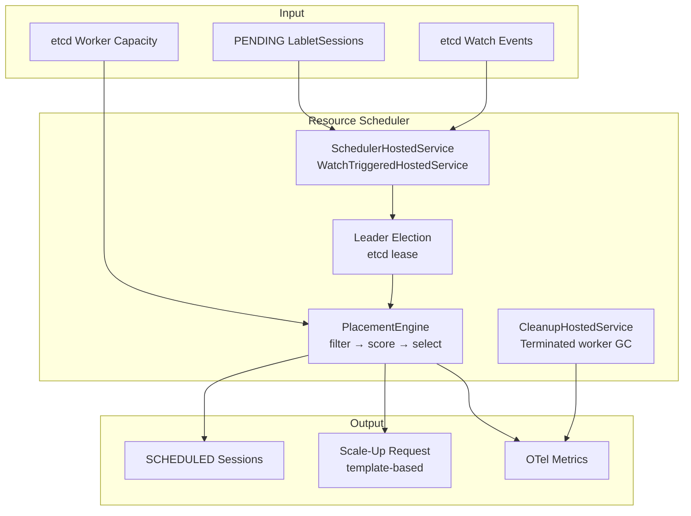
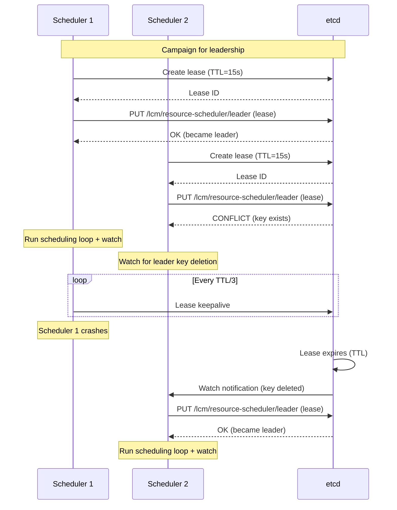
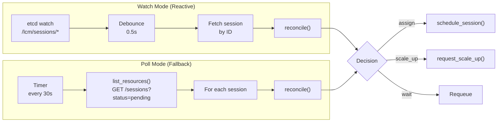
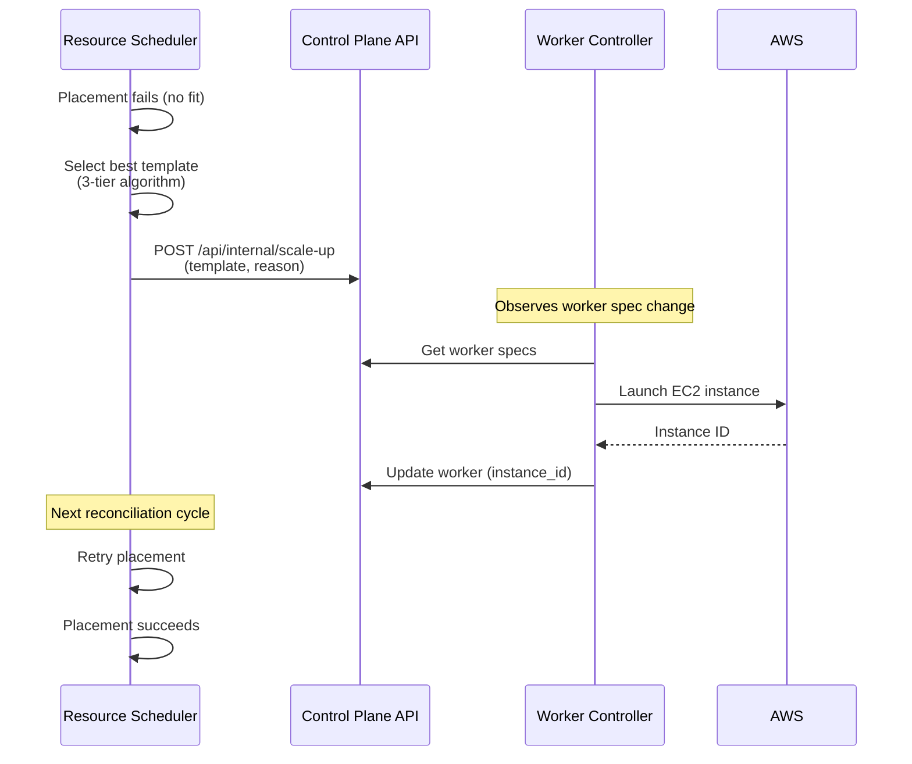
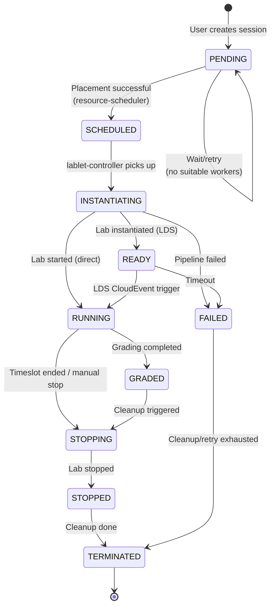

# Resource Scheduler Architecture

**Version:** 2.0.0 (March 2026)
**Status:** Current Implementation

git add . && git commit -m "Major update: LabletSession, LabRecord, CmlWorker, PipelineExecutor"! note "Related Documentation"
    - [Lablet Resource Manager Architecture](../../lablet-resource-manager-architecture.md) — system-wide architecture
    - [Worker Templates](./worker-templates.md) — capacity model and template selection
    - [ADR-002: Separate Resource Scheduler Service](../../adr/ADR-002-separate-resource-scheduler-service.md)
    - [ADR-006: Resource Scheduler HA Coordination](../../adr/ADR-006-resource-scheduler-ha-coordination.md)
    - [ADR-035: Legacy SchedulerService Removal](../../adr/ADR-035-legacy-scheduler-service-removal.md)

---

## Revision History

| Version | Date | Changes |
|---------|------|---------|
| 2.0.0 | 2026-03 | Major rewrite: reflects actual implementation. SchedulerHostedService (WatchTriggeredHostedService), LabletSession naming, dual-mode scheduling, CleanupHostedService, SchedulingController preview, OTel metrics. Removed references to deprecated SchedulerService and TimeslotManager. |
| 1.1.0 | 2026-01 | Added READY, GRADED states; updated state machine for LDS integration (ADR-018) |
| 1.0.0 | 2025-12 | Initial architecture documentation |

---

## 1. Overview

The **Resource Scheduler** is a **stateless, leader-elected** microservice responsible for placement decisions and scheduling queue management for `LabletSessions`, `LabRecords`, `CmlWorkers` **Resources**. It implements:

- **Dual-Mode Scheduling**: etcd watch (reactive) + periodic polling (fallback)
- **Leader Election** via etcd leases for high availability
- **Placement Algorithm** (filter → score → select) for optimal worker assignment
- **Scale-Up Signaling** when capacity is exhausted (template-based selection)
- **Dry-Run Preview** endpoint for placement analysis without execution
- **Terminated Worker Cleanup** via periodic background job

```
git add . && git commit -m "Major update: LabletSession, LabRecord, CmlWorker, PipelineExecutor"! important "Stateless Design (ADR-002)"
    The Resource Scheduler has **no database of its own**. It reads state from Control Plane API and etcd, makes placement decisions, and writes results back via Control Plane API REST calls.

git add . && git commit -m "Major update: LabletSession, LabRecord, CmlWorker, PipelineExecutor"! important "Single Leader Design (ADR-006)"
    Only one Resource Scheduler instance is active at any time. Leader election via etcd ensures exactly-once processing of scheduling decisions.
```

## 2. Core Responsibilities



## 3. Leader Election

The Resource Scheduler uses etcd leases for leader election (ADR-006):



### Leader Election Configuration

| Parameter | Description | Default |
|-----------|-------------|---------|
| `LEADER_LEASE_TTL` | Lease time-to-live (seconds) | `15` |
| `LEADER_KEY` | etcd key for leader election | `/lcm/resource-scheduler/leader` |
| `RECONCILE_INTERVAL` | Scheduling loop interval (seconds) | `30` |

## 4. Dual-Mode Scheduling

The `SchedulerHostedService` extends `WatchTriggeredHostedService` from lcm-core (ADR-011) providing two scheduling modes:



| Mode | Trigger | Latency | Purpose |
|------|---------|---------|---------|
| **Watch** | etcd PUT on `/lcm/sessions/{id}/state` = `pending` | ~500ms | Immediate scheduling on session creation |
| **Poll** | Timer every `RECONCILE_INTERVAL` seconds | ≤30s | Catch missed watch events, retry failed placements |

git add . && git commit -m "Major update: LabletSession, LabRecord, CmlWorker, PipelineExecutor"! tip "Watch-Only Mode"
    Set `RECONCILE_POLLING_ENABLED=false` to disable polling and rely entirely on etcd watch events. Useful for testing or low-latency deployments.

## 5. Placement Algorithm

The `PlacementEngine` implements a **filter → score → select** pattern:

```mermaid
flowchart LR
    subgraph Filter ["1. Filter Phase"]
        F1[Worker Status<br/>NOT DRAINING/STOPPED]
        F2[License Affinity<br/>tier-based compatibility]
        F3[Resource Capacity<br/>CPU/memory/storage]
        F4[AMI Compatibility<br/>CML version/node defs]
        F5[Port Availability<br/>enough for template]
    end

    subgraph Score ["2. Score Phase"]
        S1[Bin-Packing Score<br/>weight: 0.6]
        S2[Locality Score<br/>weight: 0.2]
        S3[Load Balance Score<br/>weight: 0.2]
    end

    subgraph Select ["3. Select Phase"]
        SEL[Highest Scoring Worker]
    end

    Workers([All RUNNING Workers]) --> Filter
    Filter --> Score
    Score --> Select
    Select --> Decision([SchedulingDecision])
```



### Filter Predicates

| Predicate | Description | Rejection Category |
|-----------|-------------|-------------------|
| **Worker Status** | Worker must be RUNNING (not DRAINING/STOPPING/STOPPED/TERMINATED) | `status` |
| **License Affinity** | Worker license tier must satisfy definition requirements (enterprise ⊇ personal) | `license` |
| **Resource Capacity** | Worker has CPU/memory/storage headroom for the definition's requirements | `capacity` |
| **AMI Compatibility** | Worker AMI supports required CML version and node definitions | `ami` |
| **Port Availability** | Enough ports available for the definition's port template | `ports` |

### Scoring Functions

| Scorer | Weight | Description |
|--------|--------|-------------|
| **Bin-Packing** | 0.6 | Prefer workers with less remaining capacity (consolidate workloads) |
| **Locality** | 0.2 | Prefer workers with session co-location bonus |
| **Load Balance** | 0.2 | Prefer workers with lower active session count |

### Data Sources for Placement

| Data | Source | Purpose |
|------|--------|---------|
| Pending sessions | CPA REST API | Sessions to schedule |
| Running workers | CPA REST API | Candidate hosts |
| Worker capacity (real-time) | etcd `/workers/{id}/capacity` | Accurate utilization for scoring |
| Worker templates | CPA REST API | Scale-up template selection |
| Lablet definitions | CPA REST API (cached per cycle) | Resource requirements |

### SchedulingDecision

```python
@dataclass
class SchedulingDecision:
    action: Literal["assign", "scale_up", "wait"]
    worker_id: str | None = None        # When action="assign"
    worker_template: str | None = None   # When action="scale_up"
    reason: str = ""
    rejection_summary: dict[str, int] | None = None  # {"status": 2, "capacity": 3}
```

### Dry-Run Preview

The `POST /api/scheduling/preview` endpoint runs the full placement algorithm without executing the decision, returning:

- **Candidates**: Ranked list of eligible workers with scores
- **Rejections**: Per-worker rejection details (why each worker was filtered out)
- **Utilization Forecast**: Estimated CPU/memory/storage after placement

## 6. Scale-Up Signaling

When no workers can satisfy a placement request, the scheduler selects the best-fit worker template and signals the Control Plane API for provisioning:



### Template Selection (3-Tier Algorithm)

1. **Exact match**: Template whose capacity exactly satisfies requirements
2. **Smallest fit**: Smallest template that satisfies requirements (cost optimization)
3. **Largest available**: Fallback to the largest template when requirements exceed all templates

See [Worker Templates](./worker-templates.md) for the full capacity model.

## 7. Retry and Escalation

The scheduler tracks retry counts per session to prevent tight failure loops:

| Retry Count | Behavior |
|-------------|----------|
| 1–4 | Normal requeue (next reconcile cycle, ~30s) |
| 5 (max) | Extended backoff (5-minute delay), error logged |
| Subsequent | Continues with 5-minute backoff until manual intervention |

## 8. Cleanup Service

The `CleanupHostedService` is a leader-elected background job (ADR-014) that periodically removes terminated worker records:

| Parameter | Description | Default |
|-----------|-------------|---------|
| `CLEANUP_ENABLED` | Enable/disable cleanup | `true` |
| `CLEANUP_INTERVAL_SECONDS` | Cleanup frequency | `3600` (1 hour) |
| `CLEANUP_RETENTION_DAYS` | Terminated worker retention (days) | `30` |

## 9. Layer Architecture

```
resource-scheduler/
├── api/                              # HTTP Layer
│   ├── controllers/
│   │   ├── admin_controller.py       # /admin/trigger-reconcile, /admin/stats, /admin/leader-status, /admin/resign-leadership
│   │   └── scheduling_controller.py  # /scheduling/preview (dry-run placement)
│   ├── dependencies.py               # Auth dependencies (get_current_user, require_admin)
│   └── services/
│       ├── auth_service.py           # DualAuthService (cookie + JWT)
│       └── openapi_config.py         # Swagger UI OAuth2 config
│
├── application/                      # Business Logic Layer
│   ├── hosted_services/
│   │   ├── scheduler_hosted_service.py  # WatchTriggeredHostedService (leader-elected)
│   │   └── cleanup_hosted_service.py    # Periodic terminated worker cleanup
│   ├── services/
│   │   └── placement_engine.py          # Filter → Score → Select algorithm
│   ├── commands/                        # (unused — stateless service)
│   ├── queries/                         # (unused — stateless service)
│   ├── dtos/                            # (unused — stateless service)
│   └── settings.py                      # Configuration (Pydantic Settings)
│
├── domain/                           # (unused — stateless service, uses lcm-core models)
│
├── infrastructure/
│   ├── observability/                # OTel metrics (counters, histograms)
│   └── session_store.py              # In-memory/Redis session storage
│
├── integration/                      # (uses lcm-core clients directly)
│
├── ui/                               # Admin dashboard (minimal)
│   └── controllers/
│       └── ui_controller.py          # Serves static UI or placeholder
│
└── main.py                           # Neuroglia WebApplicationBuilder
```

git add . && git commit -m "Major update: LabletSession, LabRecord, CmlWorker, PipelineExecutor"! info "No CQRS Pattern"
    Resource-scheduler uses **reconciliation loops** via `WatchTriggeredHostedService` for scheduling and `LeaderElectedHostedService` for cleanup. CQRS commands/queries are implemented only in control-plane-api. The `commands/`, `queries/`, `dtos/` directories exist as scaffold but are intentionally unused — this is a stateless decision-making service.

## 10. State Machine

The scheduler participates in LabletSession state transitions (see full lifecycle in [Lablet Session Lifecycle](../../lablet-session-lifecycle-flow.md)):



git add . && git commit -m "Major update: LabletSession, LabRecord, CmlWorker, PipelineExecutor"! note "Scheduler Scope"
    The resource-scheduler is responsible **only** for the `PENDING → SCHEDULED` transition. All subsequent transitions are managed by the lablet-controller.

## 11. Observability

### OpenTelemetry Metrics

| Metric | Type | Labels | Purpose |
|--------|------|--------|---------|
| `lcm_scheduler_decisions_total` | Counter | `action` | Scheduling decision breakdown |
| `lcm_scheduler_successes_total` | Counter | `worker_id` | Successful placements |
| `lcm_scheduler_failures_total` | Counter | `error` | Failed placements |
| `lcm_scheduler_decision_duration_seconds` | Histogram | `action` | Placement algorithm latency |
| `lcm_scheduler_e2e_duration_seconds` | Histogram | — | End-to-end scheduling latency |
| `lcm_scheduler_etcd_capacity_fetches_total` | Counter | `success` | etcd capacity fetch outcomes |
| `lcm_scheduler_scale_up_requests_total` | Counter | `template` | Scale-up requests by template |
| `lcm_scheduler_retries_total` | Counter | — | Scheduling retry count |
| `lcm_scheduler_max_retries_total` | Counter | — | Max retries exhausted |

### Standard Endpoints

| Endpoint | Purpose |
|----------|---------|
| `GET /api/health` | Liveness probe |
| `GET /api/ready` | Readiness probe (checks CPA connectivity) |
| `GET /api/info` | Service info + leader status + stats |
| `GET /api/metrics` | Prometheus-compatible metrics |

## 12. Configuration

Key environment variables:

| Variable | Description | Default |
|----------|-------------|---------|
| `ETCD_HOST` | etcd server host | `localhost` |
| `ETCD_PORT` | etcd server port | `2379` |
| `ETCD_WATCH_ENABLED` | Enable etcd watch for reactive scheduling | `true` |
| `CONTROL_PLANE_API_URL` | Control Plane API URL | `http://localhost:8020` |
| `CONTROL_PLANE_API_KEY` | API key for internal auth | — |
| `LEADER_LEASE_TTL` | Leader lease TTL (seconds) | `15` |
| `RECONCILE_INTERVAL` | Reconciliation interval (seconds) | `30` |
| `RECONCILE_POLLING_ENABLED` | Enable polling mode (fallback) | `true` |
| `TIMESLOT_LEAD_TIME_MINUTES` | Instantiation lead time | `35` |
| `CLEANUP_ENABLED` | Enable terminated worker cleanup | `true` |
| `CLEANUP_INTERVAL_SECONDS` | Cleanup frequency (seconds) | `3600` |
| `CLEANUP_RETENTION_DAYS` | Terminated worker retention (days) | `30` |

## 13. API Endpoints

### Admin Endpoints (require admin role)

| Method | Path | Description |
|--------|------|-------------|
| `POST` | `/api/admin/trigger-reconcile` | Trigger immediate reconciliation cycle |
| `POST` | `/api/admin/resign-leadership` | Resign leadership (maintenance) |
| `GET` | `/api/admin/leader-status` | Current leader election status |
| `GET` | `/api/admin/stats` | Scheduling statistics |

### Scheduling Endpoints (all authenticated users)

| Method | Path | Description |
|--------|------|-------------|
| `POST` | `/api/scheduling/preview` | Dry-run placement preview |

## 14. Related Documentation

- [Lablet Resource Manager Architecture](../../lablet-resource-manager-architecture.md) — system-wide design
- [Worker Templates](./worker-templates.md) — capacity model
- [Worker Controller](../worker-controller/) — scale-up execution
- [Lablet Controller](../lablet-controller/) — session lifecycle management
- [Architecture Overview](../../index.md) — microservice landscape
