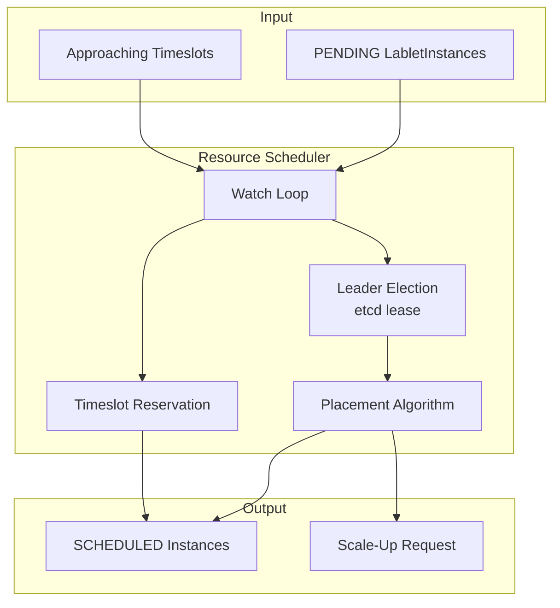
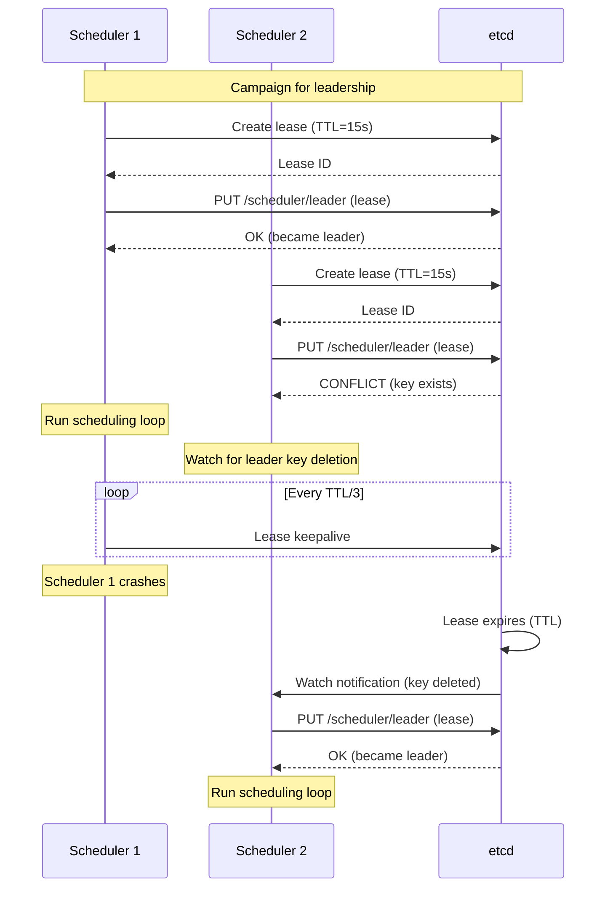
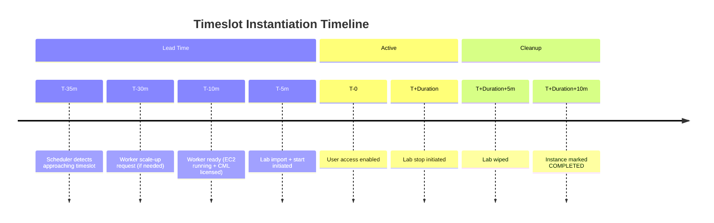
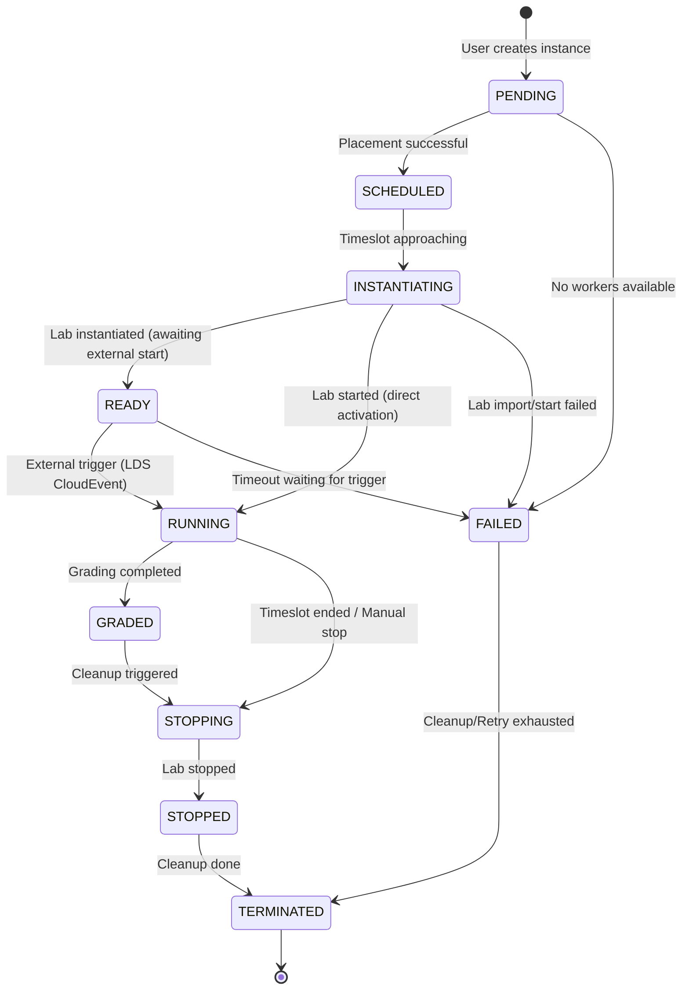
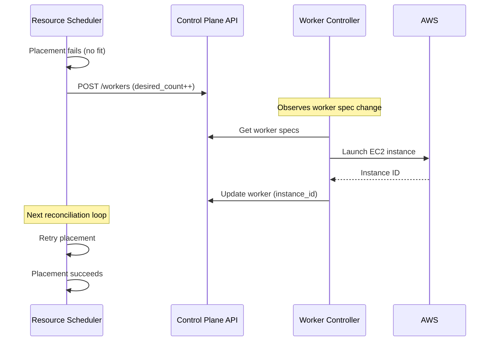

# Resource Scheduler Architecture

**Version:** 1.1.0 (January 2026)
**Status:** Current Implementation

!!! note "Related Documentation"
    For the placement algorithm details, see the [Lablet Resource Manager Architecture](../lablet-resource-manager-architecture.md).

---

## Revision History

| Version | Date | Changes |
|---------|------|---------|
| 1.1.0 | 2026-01 | Added READY, GRADED states; updated state machine for LDS integration (ADR-018) |
| 1.0.0 | 2025-12 | Initial architecture documentation |

---

## 1. Overview

The **Resource Scheduler** is responsible for placement decisions and scheduling queue management for LabletInstances. It implements:

- **Leader Election** via etcd leases for high availability
- **Placement Algorithm** (filter → score → select) for optimal worker assignment
- **Timeslot Management** with lead-time buffers for proactive provisioning
- **Scale-Up Signaling** to Worker Controller when capacity is needed

!!! important "Single Leader Design"
    Only one Resource Scheduler instance is active at any time. The leader election via etcd ensures exactly-once processing of scheduling decisions.

## 2. Core Responsibilities



## 3. Leader Election

The Resource Scheduler uses etcd leases for leader election:



### Leader Election Configuration

| Parameter | Description | Default |
|-----------|-------------|---------|
| `LEADER_LEASE_TTL` | Lease time-to-live (seconds) | `15` |
| `RESOURCE_SCHEDULER_INSTANCE_ID` | Unique instance identifier | Auto-generated UUID |
| `RECONCILE_INTERVAL` | Scheduling loop interval (seconds) | `30` |

## 4. Placement Algorithm

The placement algorithm follows a **filter → score → select** pattern:

```mermaid
flowchart LR
    subgraph Filter ["1. Filter Phase"]
        F1[License Affinity]
        F2[Resource Requirements]
        F3[AMI Compatibility]
        F4[Capacity Check]
        F5[Port Availability]
        F6[NOT DRAINING]
    end

    subgraph Score ["2. Score Phase"]
        S1[Bin-Packing Score]
        S2[Locality Score]
        S3[Load Balance Score]
    end

    subgraph Select ["3. Select Phase"]
        SEL[Highest Scoring Worker]
    end

    Workers([All Workers]) --> Filter
    Filter --> Score
    Score --> Select
    Select --> Assigned([Assigned Worker])
```



### Filter Predicates

| Predicate | Description | Rejection Reason |
|-----------|-------------|------------------|
| **License Affinity** | Worker has required CML license tier | `InsufficientLicense` |
| **Resource Requirements** | Worker has CPU/memory/storage headroom | `InsufficientResources` |
| **AMI Compatibility** | Worker AMI supports required node types | `IncompatibleAMI` |
| **Capacity Check** | Worker can accept additional labs | `AtCapacity` |
| **Port Availability** | Required ports are available | `PortConflict` |
| **Drain Status** | Worker is not marked for draining | `WorkerDraining` |

### Scoring Functions

| Scorer | Weight | Description |
|--------|--------|-------------|
| **Bin-Packing** | 0.6 | Prefer workers with less remaining capacity (consolidate) |
| **Locality** | 0.2 | Prefer workers in same region as user |
| **Load Balance** | 0.2 | Prefer workers with lower active lab count |

### Placement Decision

```python
class PlacementEngine:
    async def place_instance(
        self,
        instance: LabletInstance,
        workers: list[CMLWorker]
    ) -> PlacementResult:
        # 1. Filter
        candidates = [w for w in workers if self._passes_filters(w, instance)]

        if not candidates:
            return PlacementResult.no_fit(reason="No workers pass filters")

        # 2. Score
        scored = [(w, self._calculate_score(w, instance)) for w in candidates]

        # 3. Select
        best = max(scored, key=lambda x: x[1])
        return PlacementResult.success(worker=best[0], score=best[1])
```

## 5. Timeslot Management

LabletInstances can have scheduled timeslots. The scheduler monitors approaching timeslots and triggers instantiation proactively:



### Lead Time Configuration

| Parameter | Description | Default |
|-----------|-------------|---------|
| `TIMESLOT_LEAD_TIME_MINUTES` | How far ahead to trigger instantiation | `35` |
| `WORKER_BOOT_TIME_MINUTES` | Expected EC2 + CML boot duration | `25` |
| `LAB_START_TIME_MINUTES` | Expected lab import + start duration | `5` |

## 6. Layer Architecture

!!! note "No CQRS Pattern"
    Resource-scheduler uses **Reconciliation Loops** via HostedServices, NOT CQRS commands/queries.
    CQRS is implemented only in control-plane-api. Controllers interact with Control Plane API via REST.

```
resource-scheduler/
├── api/                          # HTTP Layer (minimal - health/admin only)
│   └── controllers/
│       ├── health_controller.py  # /health, /ready, /info
│       └── admin_controller.py   # /admin/trigger-reconcile, /admin/stats, /admin/leader-status
│
├── application/                  # Business Logic Layer
│   ├── hosted_services/          # Reconciliation loops (NOT commands!)
│   │   └── scheduler_hosted_service.py  # LeaderElectedHostedService
│   ├── services/
│   │   ├── scheduler_service.py  # Orchestrates scheduling workflow
│   │   ├── placement_engine.py   # Filter → Score → Select algorithm
│   │   └── timeslot_manager.py   # Timeslot monitoring
│   ├── dtos/
│   │   ├── scheduling_decision.py
│   │   └── placement_result.py
│   └── settings.py
│
├── integration/                  # External Service Adapters
│   └── services/
│       └── control_plane_api_client.py  # From lcm_core
│
└── main.py                       # Neuroglia WebApplicationBuilder
```

!!! info "Stateless Design"
    Resource-scheduler is **stateless**. It reads state from Control Plane API and etcd,
    makes placement decisions, and posts results back to Control Plane API.
    No direct database access.

## 7. State Machine

The scheduler manages instance state transitions:



!!! note "READY State (FR-2.2.1)"
    The **READY** state was added to support Lab Delivery System (LDS) integration.
    When a lablet instance is created for LDS-managed sessions, it enters READY state
    after lab instantiation and waits for a CloudEvent (`com.cisco.lds.session.started`)
    to trigger the transition to RUNNING. See [ADR-018: Lab Delivery System Integration](../../../architecture/decisions/ADR-018-lab-delivery-system-integration.md).

## 8. Scale-Up Signaling

When no workers can satisfy a placement request, the scheduler signals for scale-up:



## 9. Configuration

Key environment variables:

| Variable | Description | Default |
|----------|-------------|---------|
| `ETCD_HOST` | etcd server host | `localhost` |
| `ETCD_PORT` | etcd server port | `2379` |
| `CONTROL_PLANE_API_URL` | Control Plane API URL | `http://localhost:8080` |
| `RESOURCE_SCHEDULER_INSTANCE_ID` | Unique instance ID | Auto-generated |
| `LEADER_LEASE_TTL` | Leader lease TTL (seconds) | `15` |
| `RECONCILE_INTERVAL` | Reconciliation interval (seconds) | `30` |
| `TIMESLOT_LEAD_TIME_MINUTES` | Instantiation lead time | `35` |

## 10. Health Check

The scheduler exposes a health endpoint:

```
GET /health

Response:
{
    "status": "healthy",
    "is_leader": true,
    "instance_id": "scheduler-abc123",
    "last_reconciliation": "2026-01-17T10:30:00Z",
    "pending_instances": 3
}
```

## 11. Related Documentation

- [Lablet Resource Manager Architecture](../lablet-resource-manager-architecture.md)
- [Background Scheduling](../background-scheduling.md)
- [Worker Controller](../worker-controller/index.md) - Scale-up execution
- [Lablet Controller](../lablet-controller/index.md) - Instance lifecycle
