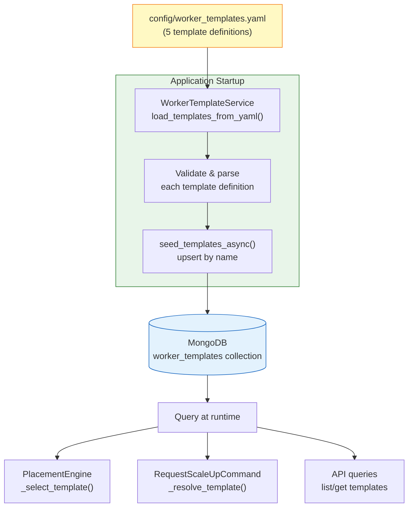
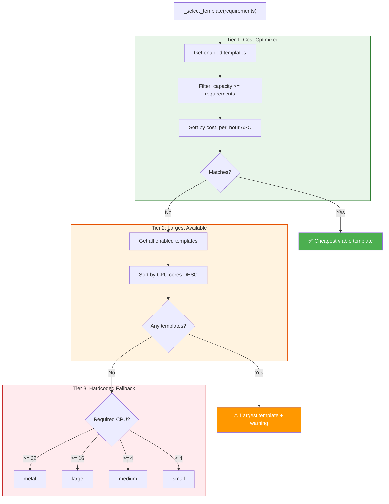
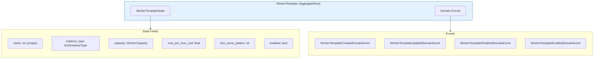

# Worker Templates

**Version:** 1.0.0 (February 2026)
**Scope:** Resource Scheduler (template selection) + Control Plane API (template management)
**Phase:** Phase 3 - Auto-Scaling

!!! note "Related Documentation"
    - [Auto-Scaling](../auto-scaling.md) — how templates are used in scaling decisions
    - [ADR-007: Worker Template Seeding](../../adr/ADR-007-worker-template-seeding.md)
    - [Worker Lifecycle](../worker-controller/worker-lifecycle.md) — instance provisioning from templates

---

## 1. Overview

Worker templates define **predefined EC2 instance configurations** for CML workers. They serve as the capacity model for:

- **Placement decisions** — matching lablet instances to appropriately-sized workers
- **Scale-up provisioning** — selecting which EC2 instance type to launch
- **Cost optimization** — choosing the cheapest template that satisfies requirements

Templates are managed as **configuration** (not user-created entities) per ADR-007. They are loaded from YAML on startup and seeded to MongoDB.

---

## 2. Template Lifecycle



### Startup Seeding (WorkerTemplateSeederHostedService)

The `WorkerTemplateSeederHostedService` runs during application startup:

1. Reads `config/worker_templates.yaml`
2. Parses each template definition into `WorkerTemplate` aggregates
3. **Upserts by name** — existing templates are updated, new ones created
4. Logs count of seeded templates

!!! info "Resilient Startup"
    Template seeding failures are **logged but do not fail startup**. Templates can be added later via API or by restarting with corrected YAML.

---

## 3. Capacity Model

### Template Definitions

| Template | Instance Type | CPU | Memory | Storage | Max Nodes | Cost/hr (USD) | Use Case |
|----------|--------------|-----|--------|---------|-----------|---------------|----------|
| **micro** | `t3.micro` | 2 | 1 GB | 20 GB | 2 | $0.0104 | Testing, development |
| **small** | `t3.small` | 2 | 2 GB | 50 GB | 5 | $0.0208 | Simple labs (≤5 nodes) |
| **medium** | `t3.medium` | 2 | 4 GB | 100 GB | 15 | $0.0416 | Moderate workloads |
| **large** | `t3.large` | 2 | 8 GB | 200 GB | 30 | $0.0832 | Complex labs |
| **metal** | `m5zn.metal` | 48 | 192 GB | 1000 GB | 200 | $3.9641 | Production, nested virt |

!!! warning "Metal Instances"
    The `metal` template uses `m5zn.metal` instances which are **significantly more expensive** ($3.96/hr vs $0.08/hr for large) and **slower to provision** (2-5 min boot time). They support nested virtualization required for certain CML node types.

### WorkerCapacity Value Object

The `WorkerCapacity` dataclass is an immutable value object used to represent and compare capacity:

```python
@dataclass(frozen=True)
class WorkerCapacity:
    cpu_cores: int
    memory_gb: int
    storage_gb: int
    max_nodes: int | None = None
```

Key operations:

| Method | Purpose |
|--------|---------|
| `can_fit(required)` | Check if required capacity fits within this capacity |
| `subtract(other)` | Calculate remaining capacity (clamps to 0) |
| `zero()` | Create zero-capacity instance for initialization |
| `from_dict(data)` | Deserialize from dictionary (CloudEvent-compatible) |

---

## 4. Template Selection Algorithm

The placement engine uses a **3-tier fallback** strategy to select a template for scale-up:



### TemplateSelection Result

The `select_optimal_template_async` method returns a `TemplateSelection` dataclass:

```python
@dataclass
class TemplateSelection:
    template: WorkerTemplate        # Selected template
    match_reason: str               # Why this template was chosen
    excess_capacity: WorkerCapacity  # Unused capacity above requirements
    cost_ranking: int               # 0 = cheapest matching option
```

### Headroom Selection

For workloads expecting spikes, `select_template_with_headroom_async` adds a capacity buffer:

$$
\text{adjusted\_capacity} = \text{required\_capacity} \times \left(1 + \frac{\text{headroom\%}}{100}\right)
$$

Default headroom is **20%**, meaning a requirement of 10 CPU cores would search for templates with ≥ 12 cores.

---

## 5. Domain Model

### WorkerTemplate Aggregate



### Event-Sourced State Transitions

| Event | Handler | State Changes |
|-------|---------|---------------|
| `Created` | Sets id, name, instance_type, capacity, cost | New template registered |
| `Updated` | Applies change dict to modified fields | Template configuration changed |
| `Disabled` | Sets `enabled = False` | Template excluded from selection |
| `Enabled` | Sets `enabled = True` | Template available for selection |

### Ec2InstanceType Enum

Instance type mapping from friendly names:

| Friendly Name | AWS Instance Type | In Template |
|---------------|-------------------|-------------|
| `MICRO` | `t3.micro` | micro |
| `SMALL` | `t3.small` | small |
| `MEDIUM` | `t3.medium` | medium |
| `LARGE` | `t3.large` | large |
| `METAL` | `m5zn.metal` | metal |

---

## 6. WorkerTemplateService API

### Service Methods

| Method | Arguments | Returns | Description |
|--------|-----------|---------|-------------|
| `load_templates_from_yaml` | `config_path: str` | `list[WorkerTemplate]` | Parse YAML into entities |
| `load_templates_from_dict` | `templates_data: list[dict]` | `list[WorkerTemplate]` | Parse dicts (for tests) |
| `seed_templates_async` | `templates: list` | `int` (count) | Upsert to MongoDB by name |
| `get_template_by_name_async` | `name: str` | `WorkerTemplate` | Lookup by name |
| `list_enabled_templates_async` | — | `list[WorkerTemplate]` | All enabled, ordered by cost |
| `list_all_templates_async` | — | `list[WorkerTemplate]` | All templates |
| `select_optimal_template_async` | `required_capacity` | `TemplateSelection` | Cheapest viable template |
| `select_template_with_headroom_async` | `capacity, headroom%` | `TemplateSelection` | With capacity buffer |
| `find_all_matching_templates_async` | `required_capacity` | `list[TemplateSelection]` | All viable, ranked by cost |

### Custom Exceptions

| Exception | When Raised | Handling |
|-----------|-------------|----------|
| `TemplateLoadError` | YAML file missing, empty, or unparseable | Startup continues with warning |
| `TemplateValidationError` | Invalid template definition (missing fields, bad types) | Startup fails for that template |
| `TemplateNotFoundError` | `get_template_by_name_async` with unknown name | 404 in API responses |
| `NoMatchingTemplateError` | No template can satisfy capacity requirements | Triggers Tier 2/3 fallback |

---

## 7. YAML Configuration Format

Templates are defined in `config/worker_templates.yaml`:

```yaml
templates:
  - name: medium                     # Unique identifier
    description: Medium worker...    # Human-readable description
    instance_type: medium            # Friendly name or AWS type
    ami_name_pattern: 'CML-*'        # AMI name filter pattern
    capacity:
      cpu_cores: 2                   # Logical CPU cores
      memory_gb: 4                   # Memory in GB
      storage_gb: 100                # Root volume in GB
      max_nodes: 15                  # Soft limit on CML nodes
    cost_per_hour_usd: 0.0416       # Approximate hourly cost
    enabled: true                    # Available for provisioning
```

### Instance Type Resolution

The `_create_template_from_dict` method resolves instance types through a 3-step chain:

1. **Friendly name** → `micro`, `small`, `medium`, `large`, `metal` → mapped to `Ec2InstanceType` enum
2. **AWS instance type** → `t3.small`, `m5zn.metal` → parsed as enum value
3. **Fallback mapping** → `m5.xlarge` → mapped to closest enum member

---

## 8. Configuration Reference

| Setting | Env Variable | Default | Description |
|---------|-------------|---------|-------------|
| `worker_templates_auto_seed` | `WORKER_TEMPLATES_AUTO_SEED` | `True` | Auto-seed templates on startup |
| `worker_templates_config_path` | `WORKER_TEMPLATES_CONFIG_PATH` | `config/worker_templates.yaml` | Path to YAML file |
