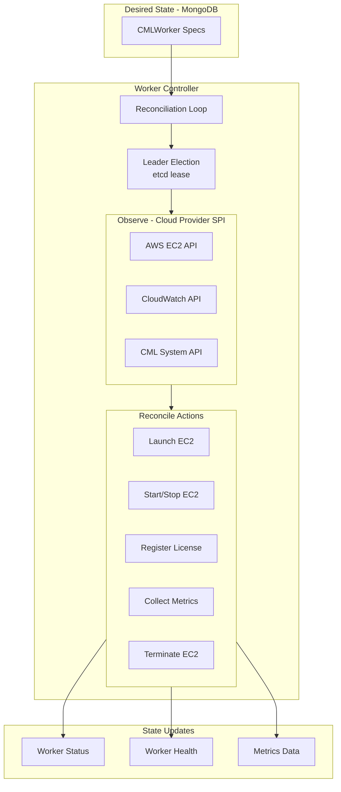
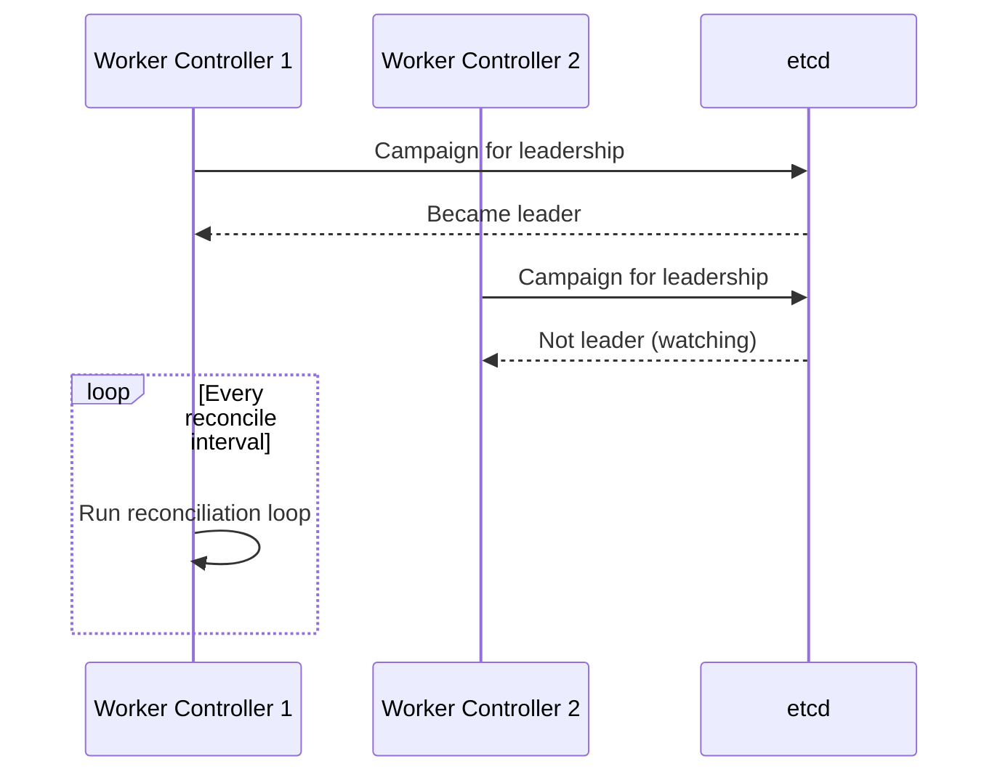
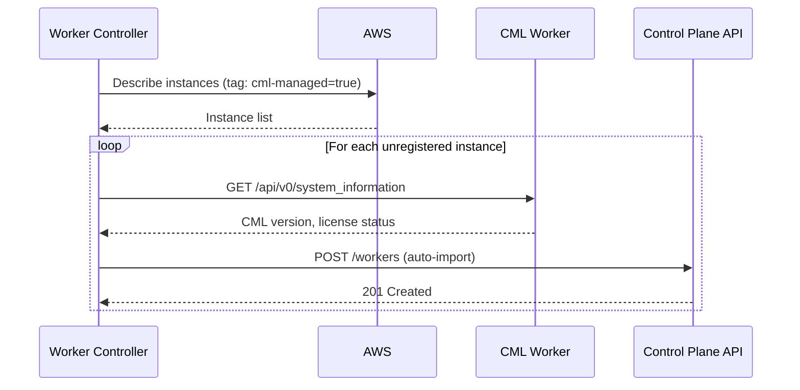

# Worker Controller Architecture

**Version:** 1.1.0 (February 2026)
**Status:** Current Implementation

!!! note "Related Documentation"
    For infrastructure metrics patterns, see the [Worker Monitoring Architecture](../worker-monitoring.md).

---

## Revision History

| Version | Date | Changes |
|---------|------|---------|
| 1.1.0 | 2026-02 | Added etcd watch pattern, dual observation mode |
| 1.0.0 | 2026-01 | Initial architecture documentation |

---

## 1. Overview

The **Worker Controller** is responsible for **CML Worker reconciliation** - managing the infrastructure lifecycle of CML workers by reconciling desired worker state (spec) against actual cloud infrastructure state.

It operates at the **Infrastructure Layer**, talking exclusively to the **Cloud Provider SPI**:

- **AWS EC2 API** - Instance lifecycle (describe, start, stop, terminate)
- **AWS CloudWatch API** - Infrastructure metrics (CPU, memory, network, disk)
- **CML System API** - Worker-level system information and license management

!!! important "Infrastructure Layer Separation"
    The Worker Controller manages **compute infrastructure** (EC2 instances, licenses). It does NOT manage labs or workloads - that is the Lablet Controller's responsibility.

## 2. Reconciliation Pattern

The Worker Controller follows the **Kubernetes Controller Pattern** with **etcd-based state observation**:

```
┌─────────────────────────────────────────────────────────────────────────────┐
│                WORKER CONTROLLER - RECONCILIATION PATTERN                    │
├─────────────────────────────────────────────────────────────────────────────┤
│                                                                              │
│   ┌──────────────────┐     ┌──────────────────┐     ┌──────────────────┐   │
│   │       SPEC       │     │     OBSERVE      │     │       ACT        │   │
│   │   (Desired)      │     │    (Actual)      │     │   (Reconcile)    │   │
│   └────────┬─────────┘     └────────┬─────────┘     └────────┬─────────┘   │
│            │                        │                        │              │
│            ▼                        ▼                        ▼              │
│   ┌──────────────────┐     ┌──────────────────┐     ┌──────────────────┐   │
│   │ CMLWorker        │     │ EC2 + CML State  │     │ • Launch EC2     │   │
│   │ • status=RUNNING │     │ • EC2 running    │     │ • Register lic.  │   │
│   │ • license=ENT    │ ←→  │ • CML ready      │  →  │ • Update status  │   │
│   │ • region=us-e-1  │     │ • No license     │     │ • Collect metrics│   │
│   └──────────────────┘     └──────────────────┘     └──────────────────┘   │
│                                                                              │
│   Source: MongoDB         Source: AWS + CML API      Target: Both          │
│   (via Control Plane)     (direct observation)       (via Control Plane)   │
│                                                                              │
└─────────────────────────────────────────────────────────────────────────────┘
```

## 3. Domain Separation

| Service | Abstraction Layer | SPI (Service Provider Interface) |
|---------|-------------------|----------------------------------|
| **Worker Controller** | Infrastructure (Compute) | Cloud Provider SPI (EC2, CloudWatch, CML System API) |
| **Lablet Controller** | Application (Workload) | CML Labs SPI (Labs, Nodes, Interfaces, Links API) |

Both controllers follow the same reconciliation pattern but at different abstraction layers.

## 4. Core Responsibilities



## 5. Reconciliation Examples

| Desired (Spec) | Actual (Observed) | Action |
|----------------|-------------------|--------|
| `status=RUNNING` | EC2 stopped | Start EC2 instance |
| `status=RUNNING` | EC2 running, CML unlicensed | Register CML license |
| `status=RUNNING` | EC2 running, CML licensed | Update metrics, no action |
| `status=STOPPED` | EC2 running | Stop EC2 instance |
| `status=TERMINATED` | EC2 exists | Terminate EC2 instance |
| `status=RUNNING` | EC2 not found | Launch new EC2 instance |

## 6. Layer Architecture

!!! note "No CQRS Pattern"
    Worker-controller uses **Reconciliation Loops** via HostedServices, NOT CQRS commands/queries.
    CQRS is implemented only in control-plane-api. Controllers interact with Control Plane API via REST.

```
worker-controller/
├── api/                          # HTTP Layer (minimal - health/admin only)
│   └── controllers/
│       ├── health_controller.py  # /health, /ready, /info
│       └── admin_controller.py   # /admin/trigger-reconcile, /admin/stats
│
├── application/                  # Business Logic Layer
│   ├── hosted_services/          # Reconciliation loops (NOT commands!)
│   │   └── worker_reconciler.py  # LeaderElectedHostedService (includes discovery loop)
│   ├── services/
│   │   ├── metrics_collector.py
│   │   └── orphan_detector.py
│   ├── dtos/
│   │   └── reconciliation_result.py
│   └── settings.py
│
├── integration/                  # SPI Implementations
│   └── services/
│       ├── aws_ec2_spi.py        # CloudProviderSPI implementation
│       ├── aws_cloudwatch_spi.py # MetricsSPI implementation
│       └── cml_system_spi.py     # CMLSystemSPI implementation
│
└── main.py                       # Neuroglia WebApplicationBuilder
```

!!! warning "CML API Restriction"
    Worker-controller uses **CML System API ONLY** (health, license, system info).
    It MUST NOT import or call CML Labs API. Lab operations are lablet-controller's responsibility.

## 7. Cloud Provider SPI

### AWS EC2 API

```python
class AwsEc2Client:
    """
    EC2 instance lifecycle management.
    """

    async def describe_instance(self, instance_id: str) -> Ec2InstanceState:
        """Get current instance state and metadata."""

    async def launch_instance(
        self,
        ami_id: str,
        instance_type: str,
        security_group_id: str,
        subnet_id: str,
        tags: dict[str, str]
    ) -> str:
        """Launch new EC2 instance, return instance_id."""

    async def start_instance(self, instance_id: str) -> None:
        """Start a stopped instance."""

    async def stop_instance(self, instance_id: str) -> None:
        """Stop a running instance."""

    async def terminate_instance(self, instance_id: str) -> None:
        """Terminate an instance permanently."""
```

### AWS CloudWatch API

```python
class AwsCloudWatchClient:
    """
    Infrastructure metrics collection.
    """

    async def get_cpu_utilization(
        self,
        instance_id: str,
        period_minutes: int = 5
    ) -> float:
        """Get average CPU utilization percentage."""

    async def get_memory_utilization(
        self,
        instance_id: str
    ) -> float:
        """Get memory utilization (requires CW agent)."""

    async def get_network_io(
        self,
        instance_id: str
    ) -> tuple[float, float]:
        """Get network bytes in/out."""

    async def get_disk_io(
        self,
        instance_id: str
    ) -> tuple[float, float]:
        """Get disk read/write bytes."""
```

### CML System API

```python
class CmlSystemClient:
    """
    CML worker-level system information.

    Endpoints:
    - /api/v0/system_information - No auth required
    - /api/v0/system_stats - Auth required
    """

    async def get_system_information(
        self,
        worker_ip: str
    ) -> CmlSystemInfo:
        """
        Get CML version, license status, node counts.
        No authentication required.
        """

    async def get_system_stats(
        self,
        worker_ip: str,
        auth_token: str
    ) -> CmlSystemStats:
        """
        Get CPU, memory, storage usage from CML perspective.
        Authentication required.
        """

    async def register_license(
        self,
        worker_ip: str,
        license_token: str
    ) -> None:
        """Register CML license on worker."""

    async def deregister_license(
        self,
        worker_ip: str
    ) -> None:
        """Remove CML license from worker."""
```

## 8. Leader Election

Same pattern as Resource Scheduler - only one controller instance is active:



## 9. Auto-Import Feature

The Worker Controller can discover unmanaged EC2 instances and create worker records:



### Auto-Import Tags

| Tag | Purpose |
|-----|---------|
| `cml-managed=true` | Include in auto-discovery |
| `cml-environment=production` | Environment classification |
| `cml-region=us-east-1` | Logical region assignment |

## 10. Configuration

Key environment variables:

| Variable | Description | Default |
|----------|-------------|---------|
| `ETCD_HOST` | etcd server host | `localhost` |
| `ETCD_PORT` | etcd server port | `2379` |
| `CONTROL_PLANE_API_URL` | Control Plane API URL | `http://localhost:8080` |
| `WORKER_CONTROLLER_INSTANCE_ID` | Unique instance ID | Auto-generated |
| `LEADER_LEASE_TTL` | Leader lease TTL (seconds) | `15` |
| `RECONCILE_INTERVAL` | Reconciliation interval (seconds) | `30` |
| `METRICS_COLLECT_INTERVAL` | Metrics polling interval (seconds) | `60` |
| `AUTO_IMPORT_ENABLED` | Enable auto-discovery | `true` |

## 11. Observability

### Metrics Exported

| Metric | Type | Labels |
|--------|------|--------|
| `worker_reconciliation_duration_seconds` | Histogram | `worker_id` |
| `worker_drift_detected_total` | Counter | `worker_id`, `drift_type` |
| `worker_ec2_state` | Gauge | `worker_id`, `state` |
| `worker_cml_license_status` | Gauge | `worker_id`, `tier` |

### Health Check

```
GET /health

Response:
{
    "status": "healthy",
    "is_leader": true,
    "instance_id": "worker-ctrl-abc123",
    "last_reconciliation": "2026-01-17T10:30:00Z",
    "workers_managed": 5,
    "workers_with_drift": 1
}
```

## 12. Related Documentation

- [Worker Monitoring](../worker-monitoring.md) - Metrics collection architecture
- [AWS IAM Setup](../../../security/aws-iam-setup.md) - Required AWS permissions
- [CML Worker Domain Model](../cml-worker-domain-model.md) - Entity specifications
- [Lablet Controller](../lablet-controller/index.md) - Workload layer counterpart
