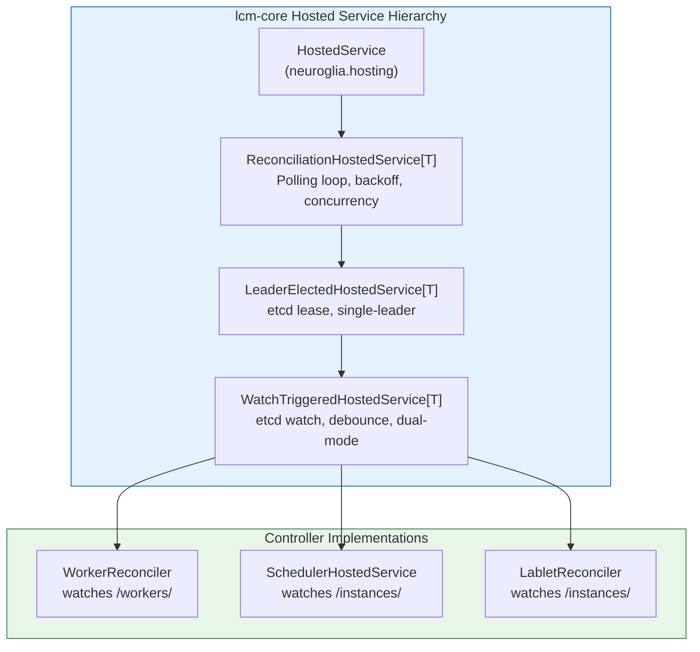
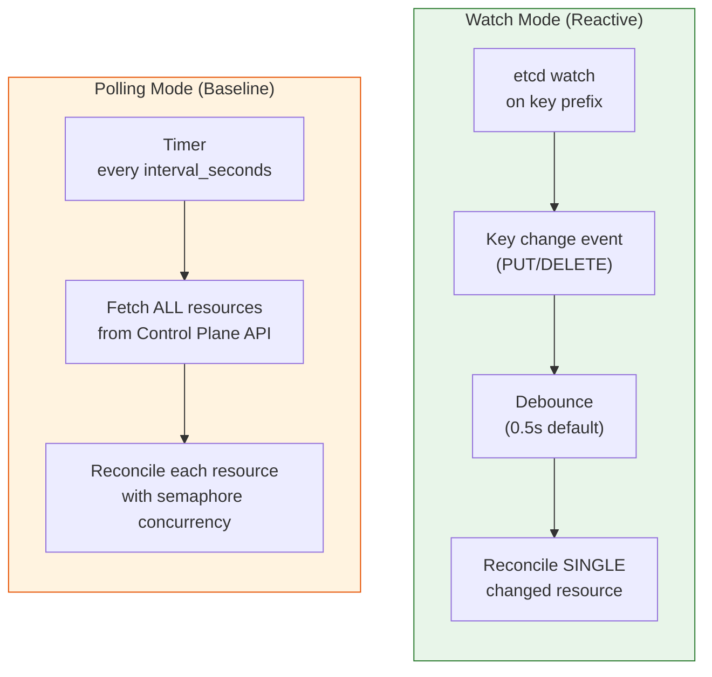
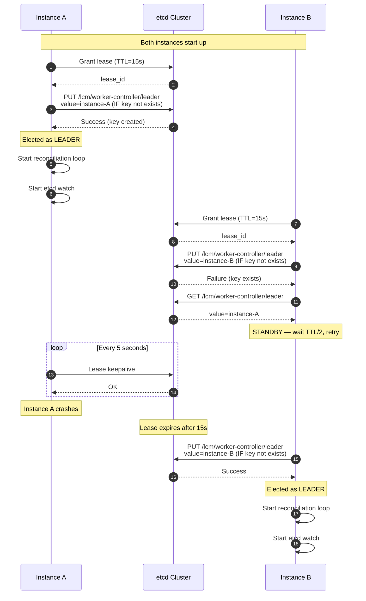
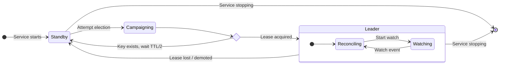
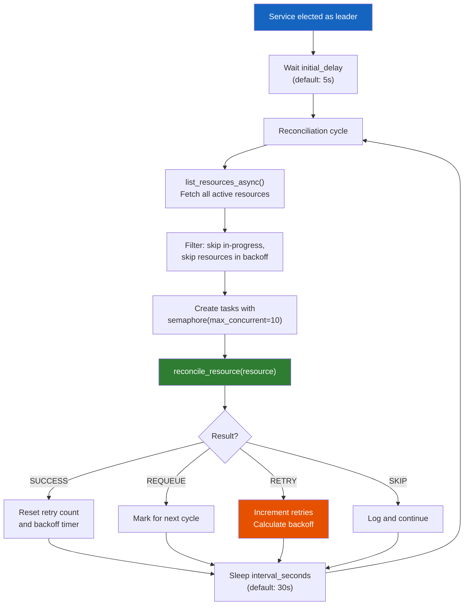
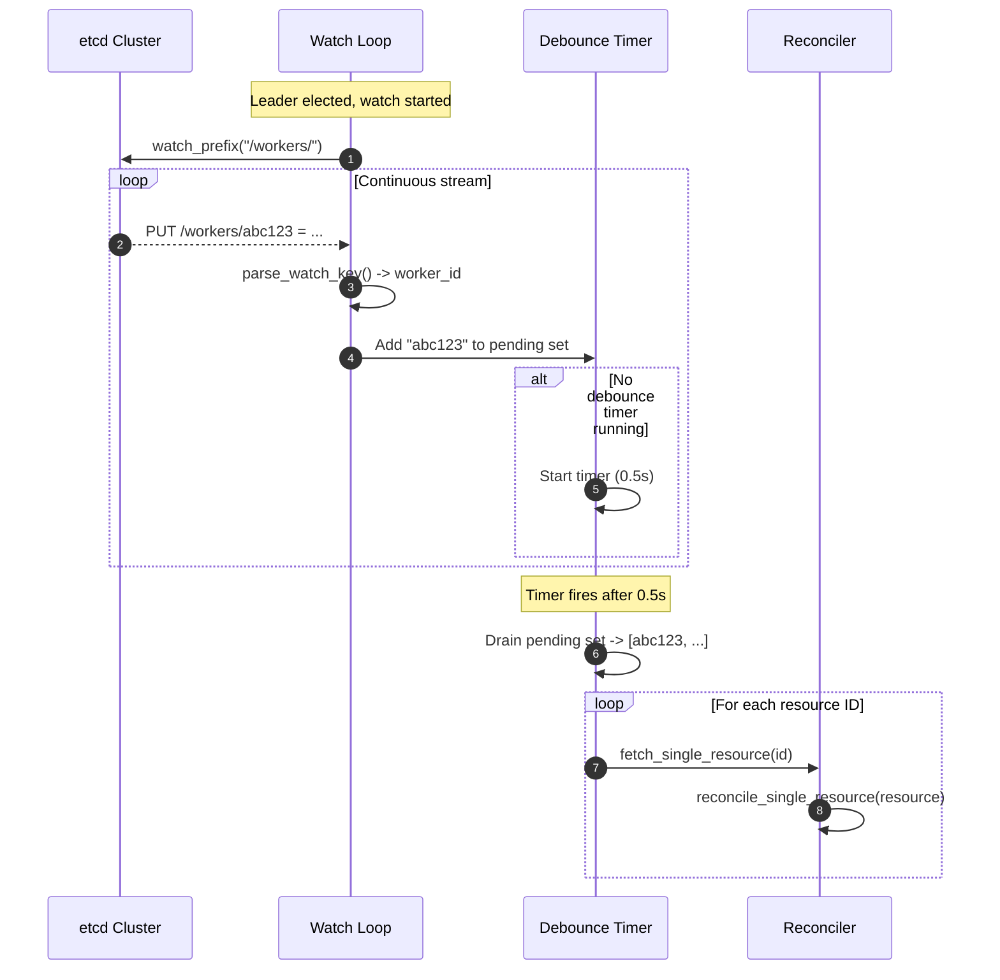
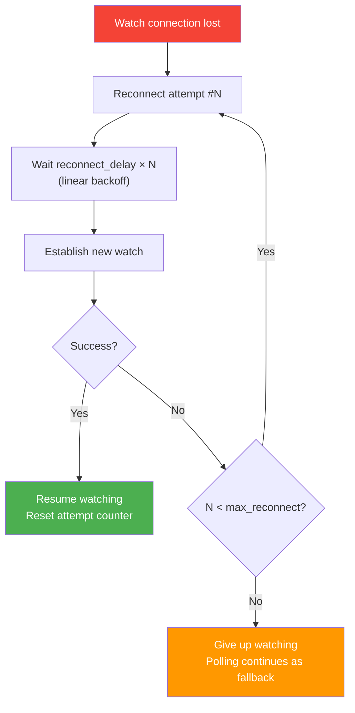
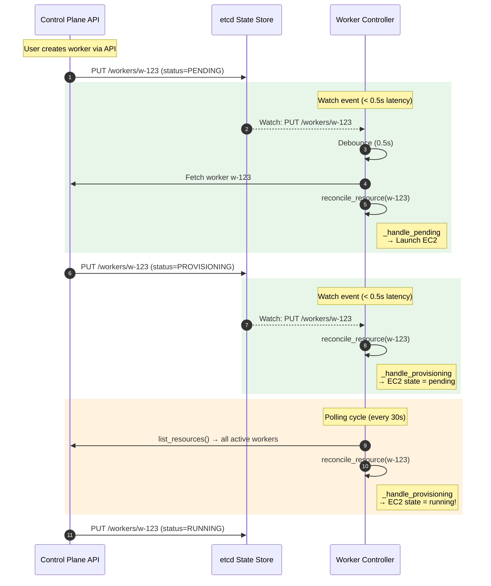

# Worker Discovery & Observation

**Version:** 1.0.0 (February 2026)
**Component:** Worker Controller (core patterns shared with Resource Scheduler and Lablet Controller)
**Source:** `src/core/lcm_core/infrastructure/hosted_services/`

!!! note "Related Documentation"
    - [Worker Lifecycle](worker-lifecycle.md) — what happens after a worker is discovered
    - [Auto-Scaling](../auto-scaling.md) — scale-up/down automation
    - [Background Scheduling](../../background-scheduling.md) — general scheduling patterns

---

## 1. Overview

All LCM controllers (Worker Controller, Resource Scheduler, Lablet Controller) share the same **observation and reconciliation infrastructure** provided by the `lcm-core` package. This architecture implements the Kubernetes-style **controller pattern** with three layers:

1. **Reconciliation** — periodic polling loop with concurrency control and backoff
2. **Leader Election** — etcd-based single-leader guarantee for HA
3. **Watch-Triggered** — reactive etcd watch for near-instant response

---

## 2. Dual-Mode Observation

Each controller operates in **dual mode** — combining baseline polling with reactive watching for optimal balance between reliability and responsiveness:

| Aspect | Polling | Watch |
|--------|---------|-------|
| **Trigger** | Timer (configurable interval) | etcd key change event |
| **Scope** | All active resources | Single changed resource |
| **Latency** | Up to `interval_seconds` (default: 30s) | ~0.5s (debounce window) |
| **Reliability** | High — full state resync every cycle | Depends on etcd connection |
| **Purpose** | Catch drift, ensure consistency | Fast reaction to state changes |
| **Failure mode** | Graceful — exponential backoff | Auto-reconnect with linear backoff |

!!! tip "Why Dual-Mode?"
    Polling alone creates up to 30-second latency for state changes. Watching alone risks missing changes during etcd disconnections. Dual-mode guarantees both **fast response** and **eventual consistency**.

---

## 3. Leader Election

Only one controller instance should be actively reconciling at any time. LCM uses **etcd leases** for leader election:

### Election Key Prefixes

Each controller uses a unique election key to ensure independent leadership:

| Controller | Election Key | Port |
|------------|-------------|------|
| Worker Controller | `/lcm/worker-controller/leader` | 8083 |
| Resource Scheduler | `/lcm/resource-scheduler/leader` | 8081 |
| Lablet Controller | `/lcm/lablet-controller/leader` | 8082 |

### Leader Lifecycle

### Mock Mode

When no etcd client is configured (local development), the service immediately assumes leadership without election — useful for single-instance development environments.

---

## 4. Reconciliation Loop

The base `ReconciliationHostedService` provides a polling loop with concurrency control and exponential backoff:

### Exponential Backoff Formula

When a resource reconciliation returns `RETRY`, the backoff delay is calculated as:

$$
\text{delay} = \min(\text{base} \times \text{multiplier}^{\text{retries}}, \text{max\_backoff})
$$

With defaults: $\text{base} = 1.0s$, $\text{multiplier} = 2.0$, $\text{max\_backoff} = 60.0s$

| Retry # | Delay |
|---------|-------|
| 0 | 1s |
| 1 | 2s |
| 2 | 4s |
| 3 | 8s |
| 4 | 16s |
| 5 | 32s |
| 6+ | 60s (capped) |

### Resource State Tracking

Each resource gets a `ResourceState` record tracking:

| Field | Purpose |
|-------|---------|
| `resource_id` | Unique identifier |
| `status` | Current reconciliation status (PENDING, IN_PROGRESS, SUCCESS, FAILED) |
| `retry_count` | Consecutive failures |
| `next_retry_at` | Earliest next attempt (backoff timer) |
| `last_reconciled_at` | Timestamp of last successful reconciliation |

---

## 5. Watch Event Processing

The `WatchTriggeredHostedService` layer adds reactive observation via etcd watches:

### Watch Configuration

| Setting | Default | Description |
|---------|---------|-------------|
| `watch_enabled` | `True` | Enable etcd watch mode |
| `watch_prefix` | varies | etcd key prefix to watch |
| `reconnect_delay` | `1.0s` | Delay between reconnect attempts |
| `max_reconnect_attempts` | `10` | Max reconnect attempts before giving up |
| `debounce_seconds` | `0.5s` | Debounce window for batching watch events |

### Watch Prefixes by Controller

| Controller | Watch Prefix | Event Type | Trigger Condition |
|------------|-------------|------------|-------------------|
| Worker Controller | `/workers/` | PUT | Any worker state change |
| Resource Scheduler | `/instances/` | PUT | Instance status = `PENDING_SCHEDULING` |
| Lablet Controller | `/instances/` | PUT | Instance status changes |

### Reconnection Strategy

If the etcd watch connection drops, the service automatically reconnects:

!!! info "Graceful Degradation"
    If the watch connection is permanently lost, the controller continues operating in **polling-only mode**. The reconciliation loop remains active and catches all state changes within the polling interval.

---

## 6. Worker Discovery Service

In addition to reconciling known workers, the Worker Controller has a **discovery service** that finds unmanaged EC2 instances:

| Setting | Default | Description |
|---------|---------|-------------|
| `worker_discovery_enabled` | `True` | Enable auto-discovery |
| `discovery_interval` | `300s` (5 min) | Seconds between discovery scans |
| `worker_discovery_tag_filter` | `None` | EC2 tag filter for discovery |
| `worker_discovery_ami_filter` | `""` | AMI name filter for discovery |

The discovery service scans AWS EC2 for instances matching the configured tags (e.g., `cml-managed=true`) and creates worker records in the Control Plane API for any instances not already tracked.

---

## 7. Full Observation Timeline

This diagram shows how polling and watching interact during a typical scale-up scenario:

---

## 8. Prometheus Metrics

The reconciliation infrastructure exposes several Prometheus metrics:

| Metric | Type | Description |
|--------|------|-------------|
| `reconcile_total` | Counter | Total reconciliations (by result) |
| `reconcile_duration_seconds` | Histogram | Reconciliation duration |
| `active_reconciles` | Gauge | Currently in-progress reconciliations |
| `resources_pending` | Gauge | Resources awaiting reconciliation |

These are initialized lazily on first use and tagged with the `metric_prefix` from `ReconciliationConfig` (e.g., `reconciliation_reconcile_total`).

---

## 9. Configuration Reference

### ReconciliationConfig

| Field | Type | Default | Description |
|-------|------|---------|-------------|
| `interval_seconds` | `float` | `30.0` | Seconds between polling cycles |
| `initial_delay` | `float` | `5.0` | Startup delay before first cycle |
| `polling_enabled` | `bool` | `True` | Enable polling mode |
| `max_concurrent` | `int` | `10` | Max concurrent reconciliations |
| `backoff_base` | `float` | `1.0` | Base delay for exponential backoff |
| `max_backoff` | `float` | `60.0` | Maximum backoff delay |
| `backoff_multiplier` | `float` | `2.0` | Backoff multiplier |
| `metric_prefix` | `str` | `"reconciliation"` | Prometheus metric prefix |

### LeaderElectionConfig

| Field | Type | Default | Description |
|-------|------|---------|-------------|
| `etcd_endpoints` | `list[str]` | `["localhost:2379"]` | etcd cluster endpoints |
| `election_key_prefix` | `str` | `"/elections"` | Base path for election keys |
| `lease_ttl` | `int` | `15` | Leader lease TTL in seconds |
| `retry_interval` | `float` | `5.0` | Election retry interval |
| `instance_id` | `str` | auto-generated | Unique instance identifier |
| `service_name` | `str` | `"service"` | Service name for election key |

### WatchConfig

| Field | Type | Default | Description |
|-------|------|---------|-------------|
| `enabled` | `bool` | `True` | Enable etcd watch mode |
| `prefix` | `str` | `""` | etcd key prefix to watch |
| `reconnect_delay` | `float` | `1.0` | Base reconnect delay |
| `max_reconnect_attempts` | `int` | `10` | Max reconnect tries |
| `debounce_seconds` | `float` | `0.5` | Event debounce window |
