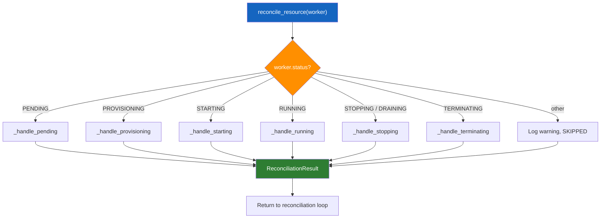
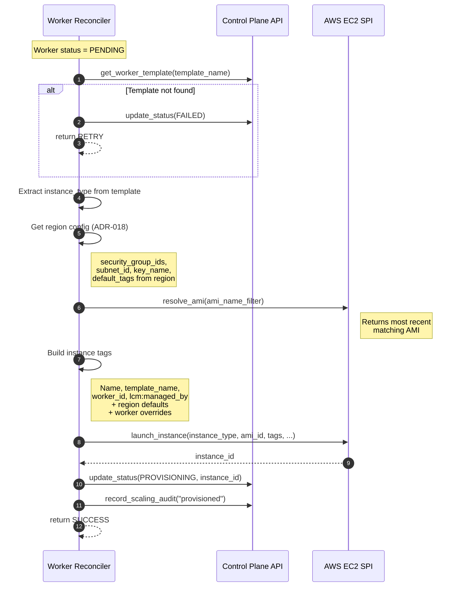
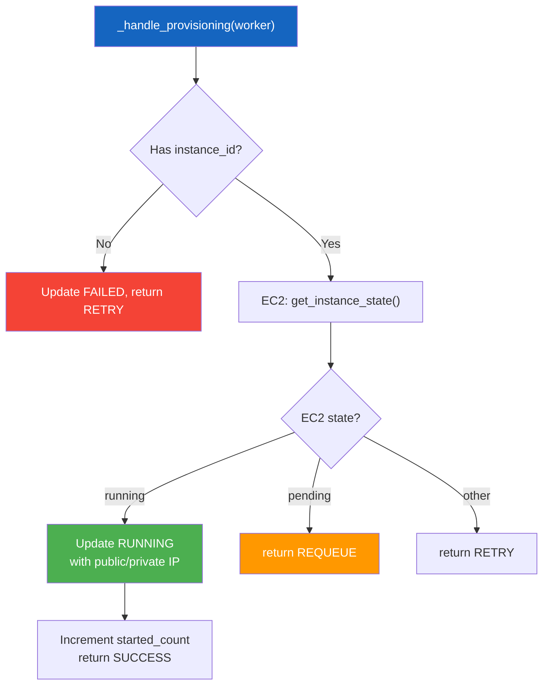
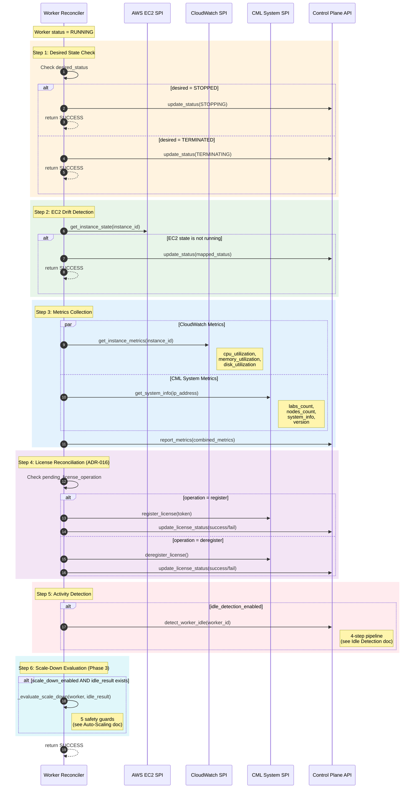
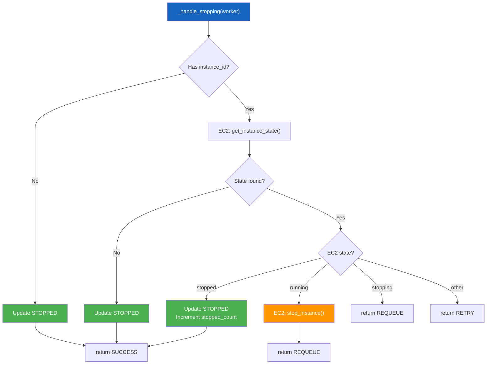
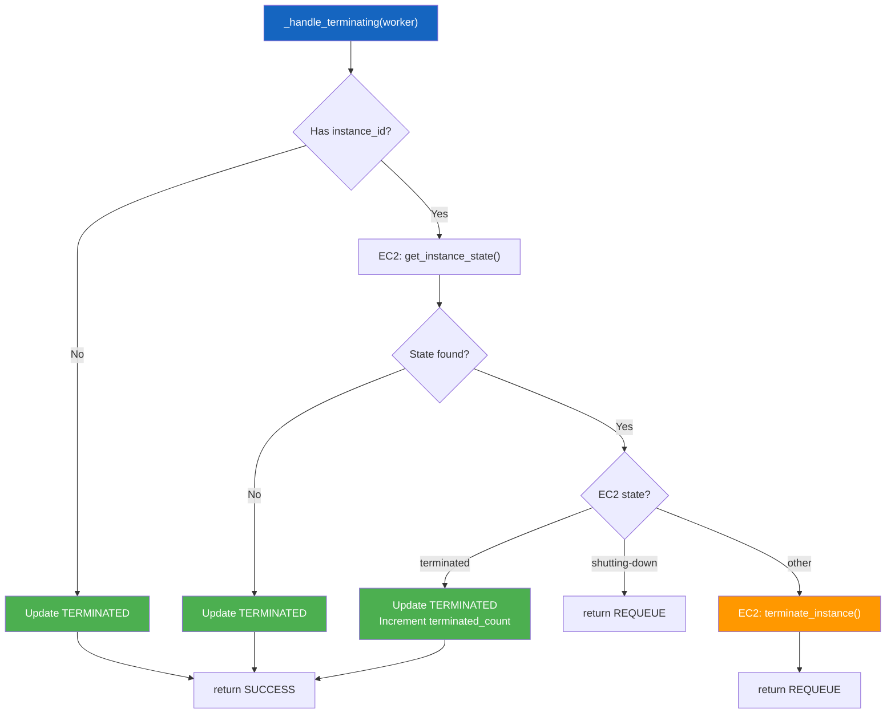
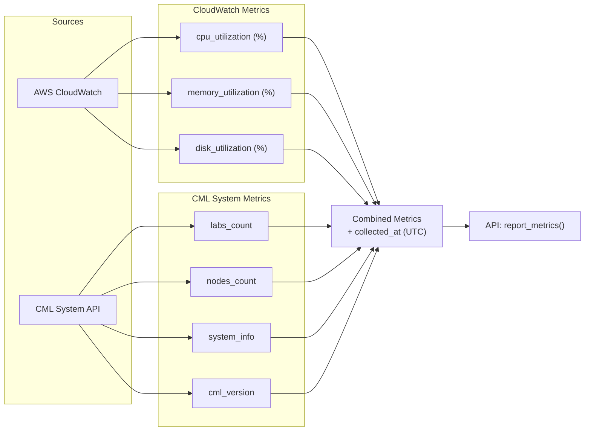
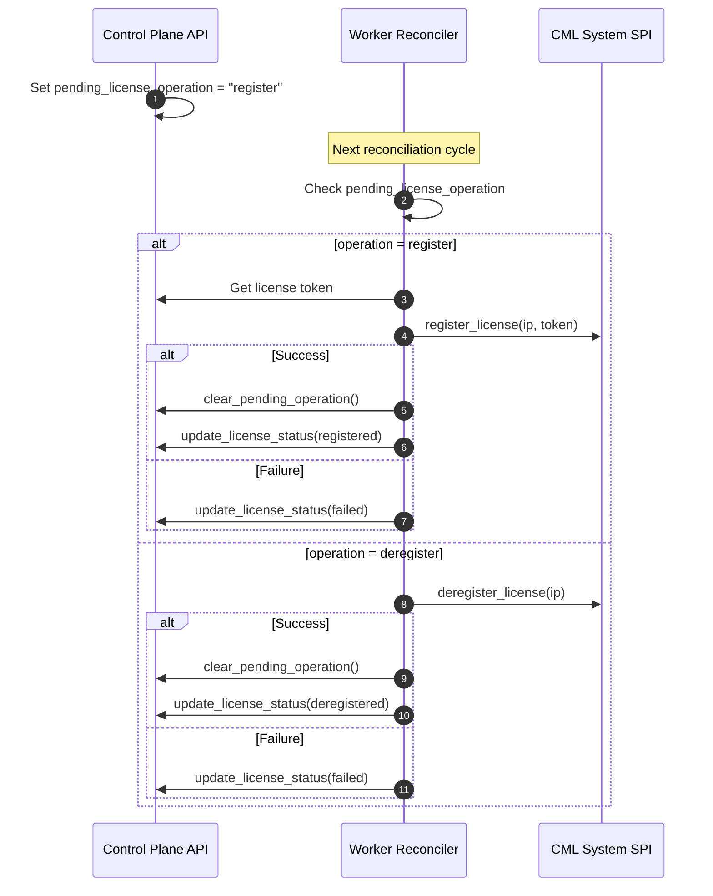

# Worker Lifecycle & Reconciliation

**Version:** 1.0.0 (February 2026)
**Component:** Worker Controller
**Source:** `src/worker-controller/application/hosted_services/worker_reconciler.py`

!!! note "Related Documentation"
    - [Worker Discovery & Observation](worker-discovery.md) — how changes are detected
    - [Auto-Scaling](../auto-scaling.md) — scale-up/down automation
    - [Idle Detection](../control-plane-api/idle-detection.md) — activity tracking
    - [Worker Templates](../resource-scheduler/worker-templates.md) — capacity definitions

---

## 1. Worker State Machine

Every CML Worker progresses through a well-defined set of statuses. The **Worker Reconciler** drives transitions by comparing the desired state (spec in MongoDB) with the actual cloud infrastructure state (EC2 + CML API).

```mermaid
stateDiagram-v2
    direction LR

    [*] --> PENDING: Worker created
    PENDING --> PROVISIONING: EC2 launched
    PENDING --> FAILED: Launch error

    PROVISIONING --> STARTING: EC2 instance running
    PROVISIONING --> FAILED: EC2 timeout

    STARTING --> RUNNING: EC2 + IP confirmed
    STARTING --> FAILED: Start error

    state running_state <<choice>>
    RUNNING --> running_state: Desired state check
    running_state --> STOPPING: desired = STOPPED
    running_state --> DRAINING: Scale-down drain
    running_state --> TERMINATING: desired = TERMINATED

    DRAINING --> STOPPING: Drain complete
    STOPPING --> STOPPED: EC2 stopped

    STOPPED --> STARTING: desired = RUNNING
    STOPPED --> TERMINATING: desired = TERMINATED

    TERMINATING --> TERMINATED: EC2 terminated
    TERMINATED --> [*]

    FAILED --> TERMINATING: Cleanup
    FAILED --> [*]: Abandoned

    classDef active fill:#4CAF50,color:white
    classDef warning fill:#FF9800,color:white
    classDef danger fill:#f44336,color:white
    classDef neutral fill:#9E9E9E,color:white
    classDef draining fill:#2196F3,color:white

    class RUNNING active
    class PENDING,PROVISIONING,STARTING warning
    class FAILED,TERMINATING danger
    class STOPPED,TERMINATED neutral
    class DRAINING draining
```



### Status Descriptions

| Status | Description | EC2 State |
|--------|-------------|-----------|
| **PENDING** | Worker record created, awaiting EC2 launch | — |
| **PROVISIONING** | EC2 instance launched, waiting for it to reach `running` | `pending` |
| **STARTING** | EC2 confirmed running, waiting for IP assignment | `running` |
| **RUNNING** | Fully operational — metrics collection, idle detection, license management active | `running` |
| **DRAINING** | Scale-down initiated — accepting no new workloads, transitioning to STOPPED | `running` → `stopping` |
| **STOPPING** | EC2 stop command issued, waiting for instance to stop | `stopping` |
| **STOPPED** | EC2 instance stopped (cost-saving state, EBS preserved) | `stopped` |
| **TERMINATING** | EC2 terminate command issued, waiting for termination | `shutting-down` |
| **TERMINATED** | EC2 instance fully terminated, resources released | `terminated` |
| **FAILED** | An error occurred during provisioning or lifecycle management | varies |

---

## 2. Reconciliation Dispatch

The `WorkerReconciler.reconcile_resource()` method dispatches each worker to the appropriate handler based on its current status:



Each handler returns a `ReconciliationResult` with one of four outcomes:

| Result | Meaning | Backoff |
|--------|---------|---------|
| `SUCCESS` | Convergence achieved, reset retry state | None |
| `REQUEUE` | Not yet converged, retry next cycle | None |
| `RETRY` | Transient error, retry with exponential backoff | 1s × 2^n (max 60s) |
| `SKIP` | No action needed or unknown status | None |

---

## 3. EC2 Provisioning Flow (_handle_pending)

When a worker is in `PENDING` status, the reconciler launches a new EC2 instance through a 6-step provisioning flow:



### Region Configuration (ADR-018)

Each AWS region has its own infrastructure configuration loaded from settings:

```yaml
# Example region config
aws_region_configs:
  us-east-1:
    region: us-east-1
    security_group_ids: ["sg-abc123"]
    subnet_id: "subnet-xyz789"
    key_name: "cml-workers"
    default_tags:
      environment: "production"
      team: "networking"
```

The reconciler resolves region config by:

1. Worker's explicit `aws_region` field
2. Settings default region (`aws_default_region`)

---

## 4. Instance Readiness (_handle_provisioning)

After EC2 launch, the reconciler polls for the instance to reach `running`:



---

## 5. Steady-State Management (_handle_running)

The `RUNNING` handler is the most complex — it performs six sequential checks every reconciliation cycle:



### EC2-to-Worker Status Mapping

When EC2 state drifts from expected, the reconciler maps EC2 states to worker statuses:

| EC2 State | Mapped Worker Status |
|-----------|---------------------|
| `pending` | PROVISIONING |
| `running` | RUNNING |
| `stopping` | STOPPING |
| `stopped` | STOPPED |
| `shutting-down` | TERMINATING |
| `terminated` | TERMINATED |
| _other_ | UNKNOWN |

---

## 6. Shutdown Flow (_handle_stopping)

Handles both `STOPPING` and `DRAINING` statuses with the same EC2 stop logic:



---

## 7. Termination Flow (_handle_terminating)



---

## 8. Metrics Collection

The reconciler collects metrics from two independent sources during each `RUNNING` cycle:



Each source has independent error handling — one failing does not block the other. Both require the worker to have the relevant identifiers (`ec2_instance_id` for CloudWatch, `ip_address` for CML API).

---

## 9. License Reconciliation (ADR-016)

License operations are performed **exclusively by the Worker Controller** via the CML System API. The Control Plane API sets a `pending_license_operation` on the worker, and the reconciler executes it:



---

## 10. Reconciler Counters & Observability

The `WorkerReconciler` tracks 12 operational counters for observability:

| Counter | Description |
|---------|-------------|
| `provisioned_count` | EC2 instances successfully launched |
| `started_count` | EC2 instances confirmed running |
| `stopped_count` | EC2 instances confirmed stopped |
| `terminated_count` | EC2 instances confirmed terminated |
| `metrics_collected_count` | Metrics collection cycles completed |
| `idle_detection_count` | Idle detection checks performed |
| `auto_pause_count` | Auto-pauses triggered |
| `license_registered_count` | License registrations completed |
| `license_deregistered_count` | License deregistrations completed |
| `scale_down_drain_count` | Scale-down drains initiated |
| `running_worker_count` | Current running workers (updated each cycle) |

These counters are available via the `/admin/stats` endpoint and are included in the reconciler's `stats` property for Prometheus exposition.

---

## 11. Configuration Reference

| Setting | Env Variable | Default | Description |
|---------|-------------|---------|-------------|
| `reconcile_interval` | `RECONCILE_INTERVAL` | `30` | Seconds between reconciliation cycles |
| `reconcile_polling_enabled` | `RECONCILE_POLLING_ENABLED` | `True` | Enable polling-based reconciliation |
| `idle_detection_interval` | `IDLE_DETECTION_INTERVAL` | `300` | Min seconds between idle checks per worker |
| `cml_default_username` | `CML_DEFAULT_USERNAME` | `"admin"` | Default CML API username |
| `cml_default_password` | `CML_DEFAULT_PASSWORD` | `""` | Default CML API password |
| `scale_down_enabled` | `SCALE_DOWN_ENABLED` | `False` | Enable automatic scale-down |
| `min_workers` | `MIN_WORKERS` | `0` | Minimum running workers to maintain |
| `scale_down_cooldown_seconds` | `SCALE_DOWN_COOLDOWN_SECONDS` | `600` | Cooldown between scale-down actions |

See also: [Worker Discovery](worker-discovery.md) for etcd and leader election settings.
