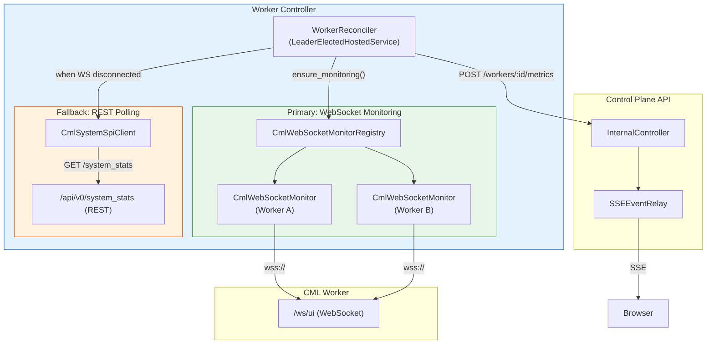
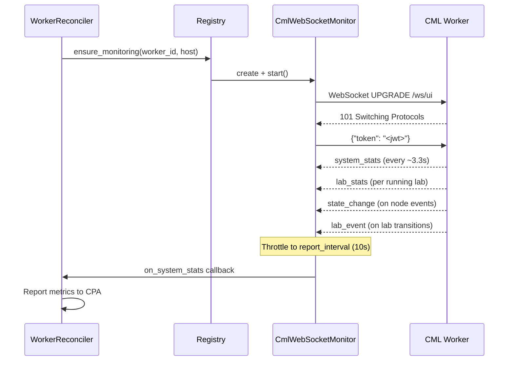
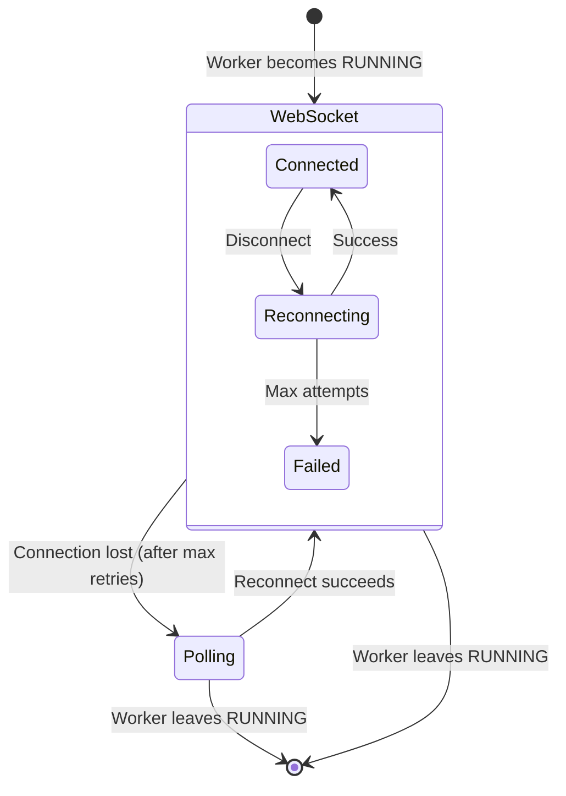

# Worker Monitoring (Dual-Mode)

**Version:** 2.0.0 (May 2026 — ADR-041: WebSocket Monitoring)
**Component:** Worker Controller
**Source:** `src/worker-controller/integration/services/cml_websocket_monitor.py`, `src/worker-controller/application/hosted_services/worker_reconciler.py`

!!! note "Related Documentation"
    - [Worker Lifecycle](./worker-lifecycle.md) — reconciliation triggers monitoring
    - [Worker Discovery](./worker-discovery.md) — how workers are found
    - [Idle Detection](../control-plane-api/idle-detection.md) — consumes activity signals
    - [Worker Monitoring (Architecture)](../../worker-monitoring.md) — system-level overview
    - [ADR-041](../../adr/ADR-041-websocket-based-cml-worker-monitoring.md) — design decision

---

## 1. Overview

The Worker Controller implements a **dual-mode monitoring system** that collects metrics and activity signals from CML workers:

| Mode | Transport | Latency | Use Case |
|------|-----------|---------|----------|
| **WebSocket** (primary) | Persistent `wss://<host>/ws/ui` | < 5s | Real-time system stats, lab events, activity |
| **REST Polling** (fallback) | HTTP `GET /api/v0/system_stats` | 60s | Degraded connectivity, older CML versions |

The system gracefully degrades: if a WebSocket connection fails, the reconciler automatically falls back to REST polling until the connection is restored.



---

## 2. WebSocket Monitoring (Primary)

### Architecture

Each RUNNING worker gets a dedicated `CmlWebSocketMonitor` instance managed by the `CmlWebSocketMonitorRegistry`:

- **Lifecycle**: Created when worker transitions to RUNNING; destroyed on STOPPING/STOPPED/TERMINATED
- **Cardinality**: One monitor per RUNNING worker (N instances, not a singleton)
- **Leader-aware**: Only the leader replica runs monitors (reconciler handles this)

### Connection Flow



### Authentication

CML's `/ws/ui` endpoint uses **message-based authentication**:

1. Connect without auth (101 handshake succeeds)
2. Send `{"token": "<jwt>"}` as first message within 10 seconds
3. Receive events after successful auth
4. On auth failure: CLOSE frame with code `3000` ("Unauthorized")

The JWT is obtained via the existing `CmlSystemSpiClient._authenticate()` method (same credentials as REST).

### Event Types

| Event Type | Frequency | Data | Used For |
|------------|-----------|------|----------|
| `system_stats` | ~3.3s | CPU, memory, disk, dominfo | Metrics reporting |
| `lab_stats` | ~3.3s per lab | Node/link counts per lab | Lab monitoring |
| `state_change` | On event | Node/interface transitions | Activity detection |
| `lab_event` | On event | Lab lifecycle changes | Activity detection |

### Throttling

To prevent overwhelming the Control Plane API, `CmlWebSocketMonitor` throttles outbound metrics reporting:

- `system_stats` arrives every ~3.3s from CML
- Reports are sent at most every `CML_WEBSOCKET_METRICS_REPORT_INTERVAL` seconds (default: 10)
- Latest stats are always available via `monitor.latest_system_stats` property

### Reconnection

On disconnection (network error, CML restart, auth expiry):

1. Exponential backoff: 1s → 2s → 4s → ... → `CML_WEBSOCKET_RECONNECT_MAX_INTERVAL` (30s)
2. Re-authenticate on reconnect (token may have expired)
3. After `CML_WEBSOCKET_MAX_RECONNECT_ATTEMPTS` consecutive failures → mark as FAILED
4. Reconciler detects FAILED state → falls back to REST polling
5. Next reconciliation cycle retries WebSocket connection

---

## 3. REST Polling (Fallback)

When WebSocket is unavailable (disabled, disconnected, or CML version too old):

```python
# In WorkerReconciler._handle_running():
if not monitor or not monitor.is_connected:
    # Fallback to REST polling
    cml_stats = await self._cml_client.get_system_stats(worker.ip_address)
    await self._report_metrics(worker.id, cml_stats)
```

Polling runs at `METRICS_POLL_INTERVAL` (default: 60s) during reconciliation cycles.

---

## 4. Graceful Degradation

The system transitions seamlessly between modes:



| State | Metrics Source | Activity Source | SSE Event |
|-------|---------------|----------------|-----------|
| WS Connected | WebSocket `system_stats` | WebSocket `state_change`/`lab_event` | `worker.ws.connected` |
| WS Reconnecting | REST polling (fallback) | REST polling | — |
| WS Failed | REST polling | REST polling | `worker.ws.disconnected` |
| WS Disabled | REST polling only | REST polling only | — |

---

## 5. OpenTelemetry Metrics

The WebSocket monitoring system exports the following OTel metrics:

| Metric | Type | Labels | Description |
|--------|------|--------|-------------|
| `lcm.worker.websocket.connected` | Gauge | `worker_id` | 1 if connected, 0 otherwise |
| `lcm.worker.websocket.messages_total` | Counter | `worker_id`, `event_type` | Total messages received |
| `lcm.worker.websocket.reconnects_total` | Counter | `worker_id` | Total reconnection attempts |
| `lcm.worker.websocket.activity_events_total` | Counter | `worker_id` | Activity events for idle detection |
| `lcm.worker.websocket.last_message_age_seconds` | Gauge | `worker_id` | Seconds since last message |

---

## 6. Configuration Reference

| Variable | Default | Description |
|----------|---------|-------------|
| `CML_WEBSOCKET_ENABLED` | `true` | Enable WebSocket monitoring (set `false` for REST-only) |
| `CML_WEBSOCKET_METRICS_REPORT_INTERVAL` | `10` | Max frequency of metrics reports to CPA (seconds) |
| `CML_WEBSOCKET_RECONNECT_MAX_INTERVAL` | `30` | Max reconnect backoff cap (seconds) |
| `CML_WEBSOCKET_MAX_RECONNECT_ATTEMPTS` | `3` | Consecutive failures before FAILED state |
| `CML_WEBSOCKET_HEALTH_TIMEOUT` | `60` | No-message timeout before unhealthy |
| `METRICS_POLL_INTERVAL` | `60` | REST polling interval when WS unavailable (seconds) |

---

## 7. Troubleshooting

### WebSocket Not Connecting

1. Verify CML version supports `/ws/ui` (CML ≥ 2.9)
2. Check `CML_WORKER_API_USERNAME` / `CML_WORKER_API_PASSWORD` are valid
3. Confirm network path allows outbound WebSocket (same as REST — port 443)
4. Check logs for `CLOSE 3000` (auth failure) vs timeout (network issue)

### Falling Back to Polling Frequently

1. Check `CML_WEBSOCKET_HEALTH_TIMEOUT` — increase if CML is slow to send
2. Verify CML worker is not overloaded (high CPU may delay WS frames)
3. Check for network instability between worker-controller and CML instances

### Metrics Appear Stale

1. Verify `CML_WEBSOCKET_METRICS_REPORT_INTERVAL` (lower = more frequent)
2. Check `lcm.worker.websocket.last_message_age_seconds` gauge in Grafana
3. If > `CML_WEBSOCKET_HEALTH_TIMEOUT`, connection may be zombie — will auto-reconnect

---

## 8. References

- [ADR-041: WebSocket-Based CML Worker Monitoring](../../adr/ADR-041-websocket-based-cml-worker-monitoring.md)
- [ADR-041 Implementation Plan](../../implementation/ADR-041-implementation-plan.md)
- [Worker Monitoring (Architecture-level)](../../worker-monitoring.md)
- [Idle Detection](../control-plane-api/idle-detection.md)
- [Real-Time Updates](../../realtime-updates.md)
