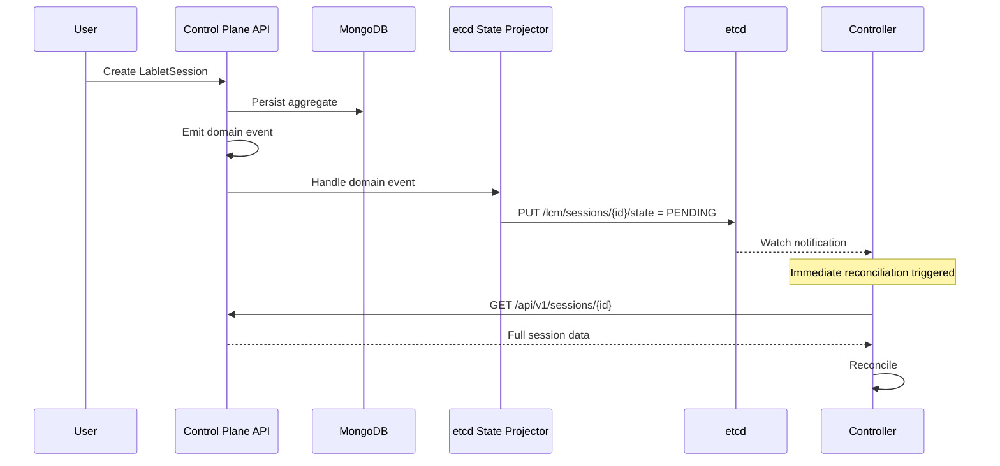
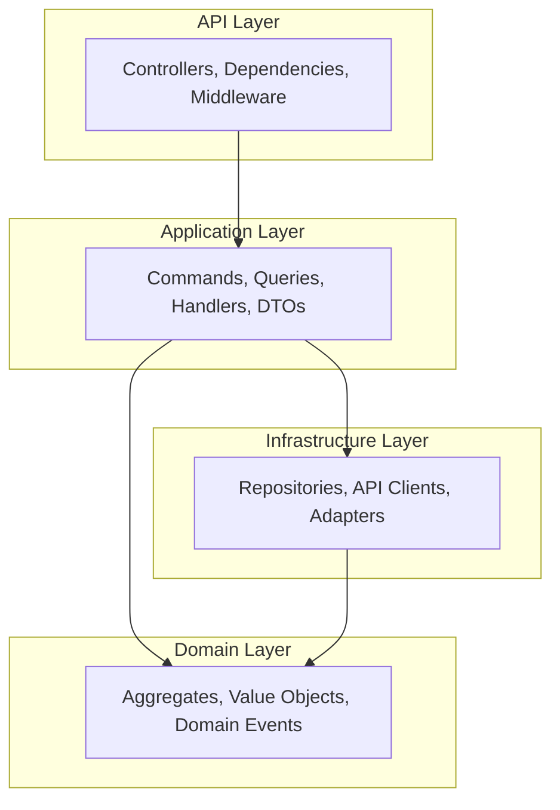
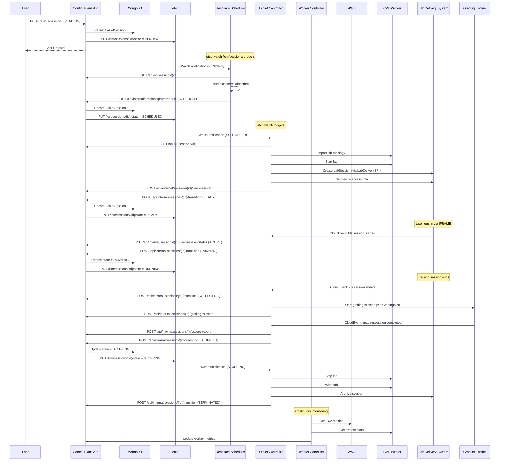

# Architecture Overview

**Version:** 1.3.0 (February 2026)
**Status:** Current Implementation

---

## Revision History

| Version | Date | Changes |
|---------|------|---------|
| 1.3.0 | 2026-02 | Renamed LabletInstance→LabletSession (AD-38), added GradingEngine SPI, child entities, updated etcd keys and data flow |
| 1.2.0 | 2026-02 | Added etcd Watch Architecture section, updated Data Flow with READY state and LDS integration |
| 1.1.0 | 2026-01 | Added LDS integration, LabDeliverySPI |
| 1.0.0 | 2025-12 | Initial architecture documentation |

---

The **Lablet Cloud Manager (LCM)** is a distributed system of specialized microservices designed to manage **Cisco Modeling Lab (CML)** infrastructure on AWS. It follows the **Kubernetes Controller Pattern** for declarative resource management while leveraging the **Neuroglia** framework to implement Clean Architecture based on Domain-Driven Design (DDD) and CQRS.

## High-Level Architecture

The system is composed of four primary service responsibilities following a **Control Plane + Controllers** pattern:

```mermaid
graph TD
    %% Actors and External Systems
    User([User<br/>Instructor/Student/Admin])
    Keycloak[Keycloak<br/>Identity Provider]
    AWS[AWS<br/>EC2 + CloudWatch]
    CMLSystem[CML System API<br/>License + Health]
    CMLLabs[CML Labs API<br/>Lab Lifecycle]
    LDS[LDS<br/>Lab Delivery System<br/>User UI + Tasks]
    GradingEngine[Grading Engine<br/>Assessment + Scoring]
    MongoDB[(MongoDB<br/>Spec Store)]
    etcd[(etcd<br/>State Store<br/>+ Leader Election)]
    EventBus[CloudEvents Bus<br/>External Integration]
    S3[(S3/MinIO<br/>Content Storage)]

    %% LCM Platform Boundary
    subgraph LCM_Platform [Lablet Cloud Manager Platform]
        direction TB
        ControlPlane[Control Plane API<br/>The Gateway: REST API + UI<br/>CQRS Commands/Queries]
        ResourceScheduler[Resource Scheduler<br/>The Scheduler: Placement Decisions<br/>Reconciliation Loop]
        WorkerController[Worker Controller<br/>The Infrastructure: EC2 Lifecycle<br/>Reconciliation Loop]
        LabletController[Lablet Controller<br/>The Workload: Lab Lifecycle<br/>+ LDS + GradingEngine<br/>Reconciliation Loop]
        Core[LCM Core<br/>Shared Domain Models + SPI]
    end

    %% User/Auth
    User -- HTTPS --> ControlPlane
    User -- Lab Session --> LDS
    ControlPlane -- OIDC --> Keycloak

    %% Control Plane API is the ONLY service that writes to MongoDB (ADR-015)
    ControlPlane <--> MongoDB
    ControlPlane --> etcd
    ControlPlane -.-> EventBus

    %% Controllers read state from etcd watches and call Control Plane API (ADR-015)
    ResourceScheduler -- REST API --> ControlPlane
    WorkerController -- REST API --> ControlPlane
    LabletController -- REST API --> ControlPlane

    %% etcd for leader election + state watches
    ResourceScheduler --> etcd
    WorkerController --> etcd
    LabletController --> etcd

    %% External Integrations via SPI
    WorkerController --> AWS
    WorkerController --> CMLSystem
    LabletController --> CMLLabs
    LabletController --> LDS
    LabletController --> GradingEngine
    LabletController --> S3

    %% LDS reads content from S3
    LDS --> S3

    %% Shared Core
    ControlPlane --> Core
    ResourceScheduler --> Core
    WorkerController --> Core
    LabletController --> Core

    %% Styling
    classDef service fill:#e1f5fe,stroke:#01579b,stroke-width:2px;
    classDef storage fill:#fff3e0,stroke:#e65100,stroke-width:2px;
    classDef external fill:#f3e5f5,stroke:#4a148c,stroke-width:2px,stroke-dasharray: 5 5;
    classDef person fill:#e8f5e9,stroke:#1b5e20,stroke-width:2px;
    classDef core fill:#fce4ec,stroke:#880e4f,stroke-width:2px;
    classDef eventbus fill:#e3f2fd,stroke:#0d47a1,stroke-width:1px,stroke-dasharray: 3 3;
    classDef lds fill:#e8eaf6,stroke:#1a237e,stroke-width:2px;

    class ControlPlane,ResourceScheduler,WorkerController,LabletController service;
    class etcd,MongoDB,S3 storage;
    class Keycloak,AWS,CMLSystem,CMLLabs external;
    class User person;
    class Core core;
    class EventBus eventbus;
    class LDS,GradingEngine lds;
```



!!! important "ADR-015: API-Centric State Management"
    **Control Plane API is the ONLY component that reads/writes to MongoDB.** Controllers observe state via etcd watches and interact with Control Plane API via REST for all state mutations. This ensures a single source of truth and clean separation of concerns.

## Core Design Principles

### 1. Kubernetes Controller Pattern

All controllers follow the **Reconciliation Loop** pattern:

```
SPEC (Desired State) → OBSERVE (Actual State) → ACT (Reconcile Drift)
```

- **Declarative**: Users specify _what_ they want, not _how_ to achieve it
- **Eventually Consistent**: Controllers continuously reconcile toward desired state
- **Leader Election**: etcd-based election ensures single active controller per type

### 2. Neuroglia Framework

All microservices are built on the **neuroglia-python** framework, ensuring consistent patterns for:

- **Clean Architecture**: Strict separation of Domain, Application, and Infrastructure layers
- **CQRS**: Writes (Commands) are separated from Reads (Queries) — **only in Control Plane API**
- **Mediator Pattern**: Decoupled in-process message dispatching
- **Repository Pattern**: Abstract persistence contracts

!!! note "CQRS Location"
    **CQRS Commands and Queries are implemented ONLY in control-plane-api.** Controllers (resource-scheduler, worker-controller, lablet-controller) use **Reconciliation Loops** via HostedServices, not CQRS patterns. They interact with Control Plane API via REST for state queries and mutations.

### 3. Event-Driven State-Based Persistence

The system uses a **hybrid persistence pattern** called **Event-Driven State-Based Persistence**:

- **State-Based Storage**: Aggregates are persisted as current state in MongoDB (not event-sourced)
- **Domain Events**: AggregateRoot emits domain events on state changes for in-process side effects
- **CloudEvents**: Domain events are automatically published as CloudEvents to external event bus
- **etcd Projection**: Domain events trigger state key publication to etcd for controller watches
- **Eventual Consistency**: Controllers react to state changes via etcd watches, with optional API polling for assurance

```
┌─────────────────────────────────────────────────────────────────────────────┐
│                   Event-Driven State-Based Persistence                       │
├─────────────────────────────────────────────────────────────────────────────┤
│                                                                              │
│   ┌───────────────┐    ┌───────────────┐    ┌───────────────────────────┐   │
│   │ Aggregate     │───▶│ Domain Events │───▶│ CloudEvents (External)    │   │
│   │ State Change  │    │ (In-Process)  │    │ Fire-and-Forget to Bus    │   │
│   └───────┬───────┘    └───────┬───────┘    └───────────────────────────┘   │
│           │                    │                                             │
│           ▼                    ▼                                             │
│   ┌───────────────┐    ┌───────────────┐                                     │
│   │ MongoDB       │    │ etcd State    │──▶ Controllers watch for changes   │
│   │ (Full State)  │    │ Projector     │    (reactive notifications)        │
│   └───────────────┘    └───────────────┘                                     │
│                                                                              │
└─────────────────────────────────────────────────────────────────────────────┘
```

This pattern provides:

- **Simplicity**: No event store or event replay complexity
- **Actionability**: Domain events trigger side effects and external integrations
- **Auditability**: CloudEvents published for external audit/analytics systems
- **Reactivity**: etcd watches enable immediate controller reconciliation
- **Reliability**: Optional API polling provides convergence assurance

### 4. etcd State Projection & Watch Architecture

Controllers observe state changes via **etcd watches**, enabling reactive reconciliation without polling MongoDB directly.

#### State Projection Flow



#### etcd Key Structure (ADR-005)

| Key Pattern | Content | Publisher | Watchers |
|-------------|---------|-----------|----------|
| `/lcm/workers/{id}/state` | Worker status (RUNNING, STOPPED, etc.) | control-plane-api | worker-controller |
| `/lcm/workers/{id}/desired_state` | Desired worker status (spec) | control-plane-api | worker-controller |
| `/lcm/workers/{id}/license` | Pending license operation | control-plane-api | worker-controller |
| `/lcm/sessions/{id}/state` | Session lifecycle state | control-plane-api | lablet-controller, resource-scheduler |
| `/lcm/sessions/{id}/metadata` | Scheduling metadata (worker_id, ports) | control-plane-api | lablet-controller |
| `/lcm/scheduler/leader` | Leader election lock | resource-scheduler | resource-scheduler instances |
| `/lcm/worker-controller/leader` | Leader election lock | worker-controller | worker-controller instances |
| `/lcm/lablet-controller/leader` | Leader election lock | lablet-controller | lablet-controller instances |

#### Watch Patterns

Each controller watches specific key prefixes:

```python
# worker-controller watches
etcd.watch_prefix("/lcm/workers/")

# lablet-controller watches
etcd.watch_prefix("/lcm/sessions/")

# resource-scheduler watches both
etcd.watch_prefix("/lcm/workers/")
etcd.watch_prefix("/lcm/sessions/")
```

#### Dual Observation Pattern

Controllers use a **dual observation pattern** for reliability:

1. **Primary (Reactive)**: etcd watch for immediate notifications
2. **Secondary (Polling)**: Optional API polling for convergence assurance

```
┌─────────────────────────────────────────────────────────────────────────────┐
│                       DUAL OBSERVATION PATTERN                               │
├─────────────────────────────────────────────────────────────────────────────┤
│                                                                              │
│   ┌─────────────────┐                                                        │
│   │  etcd Watch     │ ─────────────────────────────────────────────────────┐│
│   │  (Reactive)     │  Fast: Immediate notification on state change        ││
│   └─────────────────┘                                                       ││
│           │                                                                 ▼│
│           │                                                    ┌─────────────┤
│           ▼                                                    │ Reconcile   │
│   ┌─────────────────┐                                          │ Loop        │
│   │  API Polling    │ ─────────────────────────────────────────│             │
│   │  (Assurance)    │  Slow: Catch any missed notifications    └─────────────┤
│   └─────────────────┘                                                        │
│                                                                              │
└─────────────────────────────────────────────────────────────────────────────┘
```

!!! note "Design Decision Pending"
    The optimal balance between reactive-only vs hybrid patterns is being evaluated.
    See tracked task: "Design: Reactive vs Hybrid State Observation Pattern"

- **Simplicity**: No event store or event replay complexity
- **Actionability**: Domain events trigger side effects and external integrations
- **Auditability**: CloudEvents published for external audit/analytics systems
- **Reactivity**: etcd watches enable controller reconciliation

### 4. Domain Separation & SPI Architecture

The system maintains strict separation between abstraction layers, with each controller owning a specific **Service Provider Interface (SPI)**:

| Controller | Layer | SPI (Abstract Interface) | Implementation |
|------------|-------|-------------------------|----------------|
| **Worker Controller** | Infrastructure | `CloudProviderSPI` | AWS EC2 SPI, CloudWatch SPI |
| **Worker Controller** | Infrastructure | `CMLSystemSPI` | CML System API (health, license) |
| **Lablet Controller** | Application | `CMLLabsSPI` | CML Labs API (lifecycle, nodes, interfaces) |
| **Lablet Controller** | Application | `LabDeliverySPI` | LDS API (sessions, devices, content) |
| **Lablet Controller** | Application | `GradingSPI` | Grading Engine API (scoring, assessment) |
| **Resource Scheduler** | Scheduling | `PlacementSPI` | Placement Engine |
| **Control Plane API** | Gateway | N/A | User-facing REST + UI |

!!! warning "CML API Separation (ADR-016, ADR-017)"
    **Worker Controller** uses **CML System API ONLY** (health checks, license registration).
    It MUST NOT call CML Labs API.

    **Lablet Controller** uses **CML Labs API** (lab import, start, stop, wipe, delete, nodes, interfaces).
    It MUST NOT call CML System API.

    This separation ensures clean ownership and future extensibility.

!!! info "LDS + GradingEngine Integration (ADR-018, AD-41)"
    **Lablet Controller** is the ONLY component that interacts with LDS and GradingEngine.
    It provisions LabSessions during the `INSTANTIATING` state, transitions to `READY` when complete,
    orchestrates grading via `GradingSPI`, and archives sessions on `TERMINATED`.

    **Lablet Controller** also hosts a **CloudEventIngestor** (`@dispatch` pattern) to receive
    inbound CloudEvents from LDS (`lds.session.started`, `lds.session.ended`) and
    GradingEngine (`grading.session.completed`) — triggering state transitions on LabletSession.

#### LabDeliverySPI Interface

The `LabDeliverySPI` abstraction provides session management for the Lab Delivery System:

```python
class LabDeliverySPI(Protocol):
    """Abstract interface for Lab Delivery System integration."""

    async def create_session_with_part(
        self,
        username: str,
        timeslot_start: datetime,
        timeslot_end: datetime,
        form_qualified_name: str,
    ) -> LabSessionInfo:
        """Create LabSession with initial LabSessionPart."""
        ...

    async def set_devices(
        self,
        session_id: str,
        devices: list[DeviceAccessInfo],
    ) -> None:
        """Provision device access info for the session."""
        ...

    async def get_session_info(self, session_id: str) -> LabSessionInfo:
        """Get session details including login URL."""
        ...

    async def get_login_url(self, session_id: str) -> str:
        """Get user login URL for the session."""
        ...

    async def archive_session(self, session_id: str) -> None:
        """Archive completed session."""
        ...

    async def refresh_content(self, form_qualified_name: str) -> ContentMetadata:
        """Trigger LDS to refresh content from S3/MinIO."""
        ...

    # Future extensions
    async def collect_responses(self, session_id: str) -> ResponseData:
        """Collect user responses from session."""
        ...

    async def collect_user_feedback_by_session(self, session_id: str) -> FeedbackData:
        """Collect user feedback for specific session."""
        ...

    async def collect_user_feedback_by_form(self, form_qualified_name: str) -> FeedbackData:
        """Collect user feedback for all sessions of a form."""
        ...
```

#### SPI Design Pattern

All external integrations MUST be implemented via abstract SPI interfaces:

```python
# Abstract SPI (in lcm_core)
class CloudProviderSPI(ABC):
    @abstractmethod
    async def launch_instance(self, template: WorkerTemplate) -> str: ...

    @abstractmethod
    async def stop_instance(self, instance_id: str) -> None: ...

    @abstractmethod
    async def terminate_instance(self, instance_id: str) -> None: ...

# Concrete Implementation (in worker-controller)
class AwsEc2Spi(CloudProviderSPI):
    async def launch_instance(self, template: WorkerTemplate) -> str:
        # AWS-specific implementation
        ...
```

This enables:

- **Testability**: Mock SPIs for unit testing
- **Extensibility**: Swap implementations without changing controllers
- **Multi-Provider**: Future support for Azure, GCP, or on-prem CML

### 5. Communication Patterns

| Pattern | Usage | Implementation |
|---------|-------|----------------|
| **Synchronous** | Control Plane ↔ User | REST API (FastAPI) |
| **Asynchronous** | Controllers watching state | etcd watches + MongoDB polling |
| **Leader Election** | Controller HA | etcd leases |
| **Real-time Updates** | UI notifications | Server-Sent Events (SSE) |

## Component Overview

### Control Plane API ("The Gateway")

**Responsibility**: User Interaction, State Management & API Gateway

- Serves REST API for all CRUD operations (the **ONLY** service with direct MongoDB access)
- Implements **CQRS pattern** with Commands (writes) and Queries (reads) via Mediator
- Provides Bootstrap 5 SPA with SSE for real-time updates
- Manages authentication via Keycloak (OAuth2/OIDC)
- Publishes CloudEvents to external event bus for audit/integration
- Writes state changes to etcd for controller watching
- **Pattern**: CQRS + Mediator
- **Infrastructure**: FastAPI, MongoDB, etcd, Redis (Sessions)

### Resource Scheduler ("The Scheduler")

**Responsibility**: Placement Decisions & Scheduling Queue

- Runs as **LeaderElectedHostedService** (reconciliation loop, not CQRS)
- Watches etcd for PENDING LabletSessions
- Executes placement algorithm (filter → score → select)
- Manages timeslot reservations with lead-time buffers
- Signals controllers when scale-up is needed
- **Pattern**: Reconciliation Loop (Leader-Elected)
- **Infrastructure**: etcd (Leader Election + Watches), Control Plane API (REST)

### Worker Controller ("The Infrastructure")

**Responsibility**: CML Worker Lifecycle Management

- Runs as **LeaderElectedHostedService** (reconciliation loop, not CQRS)
- Reconciles desired worker state with actual EC2/CML state
- Manages EC2 instance lifecycle (start/stop/terminate) via `CloudProviderSPI`
- Collects infrastructure metrics via `CloudWatchSPI` + `CMLSystemSPI`
- Handles license registration/deregistration via `CMLSystemSPI`
- Detects and garbage-collects orphaned workers (ADR-014)
- **Pattern**: Reconciliation Loop (Leader-Elected)
- **SPI**: AWS EC2, AWS CloudWatch, **CML System API ONLY** (no Labs API)

### Lablet Controller ("The Workload")

**Responsibility**: Lab Session Lifecycle Management + LDS/GradingEngine Integration

- Runs as **LeaderElectedHostedService** (reconciliation loop, not CQRS)
- Reconciles desired session state with actual CML lab state
- Manages lab lifecycle (import/start/stop/wipe/delete) via `CMLLabsSPI`
- Provisions LabSessions in LDS during INSTANTIATING state via `LabDeliverySPI`
- Maps device access info (host, port, protocol) from allocated ports to LDS devices
- Orchestrates grading via `GradingSPI` (collection, scoring, reports)
- Hosts CloudEventIngestor for LDS + GradingEngine event reception (AD-41)
- Allocates console ports for external access (port allocation service)
- Archives LabSessions on session termination
- Triggers content refresh on LabletDefinition versioning
- **Pattern**: Reconciliation Loop (Leader-Elected)
- **SPI**: **CML Labs API ONLY** (no System API), `LabDeliverySPI`, `GradingSPI`

### LCM Core ("The Foundation")

**Responsibility**: Shared Domain Models & Infrastructure Abstractions

- Domain read models (CMLWorkerReadModel, LabletSessionReadModel, LabletDefinitionReadModel)
- Abstract SPI interfaces (CloudProviderSPI, CMLSystemSPI, CMLLabsSPI)
- Shared infrastructure (LeaderElectedHostedService, ControlPlaneApiClient, EtcdClient)
- **Pattern**: Shared Library (domain-driven)
- **Infrastructure**: MongoDB read models, etcd client abstractions

## Layered Architecture (Per Service)

Each service follows the Neuroglia Clean Architecture layering:



- **Domain**: Pure Python implementation of business logic. No external dependencies.
- **Application**: Orchestration logic. Commands/Queries with handlers.
- **Infrastructure**: Concrete implementations (MongoDB, AWS, CML clients).
- **API**: FastAPI controllers and HTTP concerns.

## Data Flow

The following diagram illustrates the complete data flow including LDS integration and etcd-based reactivity:



### Key Data Flow Patterns

1. **Reactive Notifications**: Controllers watch etcd for state changes, avoiding MongoDB polling
2. **etcd State Projection**: Control Plane publishes state keys on aggregate changes
3. **CloudEvent Ingestion**: LDS and GradingEngine CloudEvents received by lablet-controller's CloudEventIngestor (AD-41)
4. **SPI Abstraction**: Controllers use SPIs for external system interaction (CML, AWS, LDS, GradingEngine)
5. **Child Entity Management**: UserSession, GradingSession, ScoreReport created as child entities of LabletSession

## External Dependencies

| Dependency | Purpose | Version |
|------------|---------|---------|
| **MongoDB** | Document store for all aggregates | 6.0+ |
| **etcd** | Leader election, distributed locks | 3.5+ |
| **Keycloak** | OAuth2/OIDC identity provider | 22.0+ |
| **AWS EC2** | CML worker compute instances | API v2 |
| **AWS CloudWatch** | Infrastructure metrics | API v2 |
| **CML** | Cisco Modeling Lab instances | 2.6+ |

## Related Documentation

- [CQRS Pattern](cqrs-pattern.md) - Command/Query separation details
- [Data Layer](data-layer.md) - MongoDB integration patterns
- [Worker Monitoring](worker-monitoring.md) - Metrics collection architecture
- [Background Scheduling](background-scheduling.md) - Job scheduling patterns

## Component Deep Dives

For detailed architecture of each component:

- [Control Plane API](components/control-plane-api/index.md)
- [Resource Scheduler](components/resource-scheduler/index.md)
- [Worker Controller](components/worker-controller/index.md)
- [Lablet Controller](components/lablet-controller/index.md)
