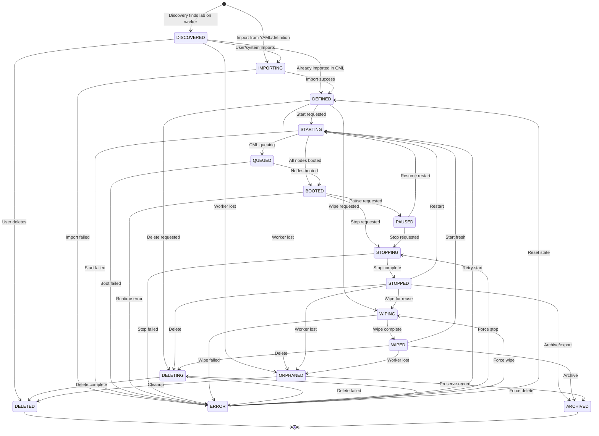

# LabRecord as Independent Aggregate — Architecture Design

| Attribute | Value |
|-----------|-------|
| **Document Version** | 1.0.0 |
| **Status** | Proposed |
| **Created** | 2026-02-10 |
| **Author** | Architecture Team |
| **Related** | [Lablet Instance Lifecycle](lablet-instance-lifecycle-flow.md), [Resource Manager Architecture](lablet-resource-manager-architecture.md), [CML Telemetry Remediation](../plans/CML_TELEMETRY_REMEDIATION.md) |
| **ADR** | ADR-019: LabRecord as Independent AggregateRoot (see [ADR-019](adr/ADR-019-labrecord-independent-aggregate.md)) |

---

## Table of Contents

1. [Executive Summary](#1-executive-summary)
2. [Problem Statement](#2-problem-statement)
3. [Domain Model](#3-domain-model)
   - 3.1 [Core Entities](#31-core-entities)
   - 3.2 [Value Objects](#32-value-objects)
   - 3.3 [Domain Events](#33-domain-events)
   - 3.4 [LabletRecordRun — Cross-Aggregate Runtime Execution Mapping](#34-labletrecordrun--cross-aggregate-runtime-execution-mapping)
   - 3.5 [Entity Relationship Diagram](#35-entity-relationship-diagram)
4. [LabRecord Aggregate Design](#4-labrecord-aggregate-design)
5. [Relationship Model: LabRecord ↔ LabletInstance](#5-relationship-model-labrecord--labletinstance)
6. [LabRecord Lifecycle State Machine](#6-labrecord-lifecycle-state-machine)
7. [Discovery & Synchronisation](#7-discovery--synchronisation)
8. [Backend API Design](#8-backend-api-design)
   - 8.1 [Public API (BFF — `/api/lab-records/`)](#81-public-api-bff--apilab-records)
   - 8.2 [Internal API (Controller-to-CPA)](#82-internal-api-controller-to-cpa--apiinternallab-records)
   - 8.3 [LabletInstance API Extensions](#83-labletinstance-api-extensions)
   - 8.4 [Worker API Extensions](#84-worker-api-extensions)
   - 8.5 [CQRS Commands & Queries](#85-cqrs-commands--queries)
   - 8.6 [SSE Events](#86-sse-events)
   - 8.7 [LabletRecordRun API](#87-labletrecordrun-api-bff--apilablet-record-runs)
   - 8.8 [LDS Session API](#88-lds-session-api-bff--via-labletrecordrun)
   - 8.9 [Grading API](#89-grading-api-bff--via-labletrecordrun)
   - 8.10 [LabletRecordRun CQRS Commands & Queries](#810-labletrecordrun-cqrs-commands--queries)
   - 8.11 [Extended SSE Events (Run, LDS, Grading)](#811-extended-sse-events-labletrecordrun-lds-grading)
9. [Frontend Design](#9-frontend-design)
   - 9.1 [Session-Centric Navigation & Information Architecture](#91-session-centric-navigation--information-architecture)
   - 9.2 [Sessions Page (`/sessions`)](#92-sessions-page-sessions--primary-experience-view)
   - 9.3 [Session Detail Page](#93-session-detail-page--master-detail-layout)
   - 9.4 [Labs Management Page (`/labs`)](#94-labs-management-page-labs)
   - 9.5 [LDS Session Integration (IFRAME)](#95-lds-session-integration-iframe)
   - 9.6 [Grading Integration](#96-grading-integration)
   - 9.7 [LabletRecordRun Lifecycle in the UI](#97-labletrecordrun-lifecycle-in-the-ui)
   - 9.8 [New Web Components](#98-new-web-components)
   - 9.9 [State Management Extensions](#99-state-management-extensions)
   - 9.10 [SSE Integration](#910-sse-integration)
   - 9.11 [UI API Client Extensions](#911-ui-api-client-extensions)
10. [Implementation Gaps & Roadmap](#10-implementation-gaps--roadmap)
11. [Migration Strategy](#11-migration-strategy)

- [Appendix A: CML Lab API Reference (v2.9)](#appendix-a-cml-lab-api-reference-v29)
- [Appendix B: Topology YAML Schema Reference](#appendix-b-topology-yaml-schema-reference)
- [Appendix C: Files to Create/Modify](#appendix-c-files-to-createmodify)
- [Appendix D: External Domain Models Reference](#appendix-d-external-domain-models-reference)
  - [D.1 Session Domain](#d1-session-domain-session-manager)
  - [D.2 Pod Domain](#d2-pod-domain-pod-manager)
  - [D.3 Schedule Domain](#d3-schedule-domain-schedule-manager)
  - [D.4 Form Content Packages](#d4-form-content-packages-lds)
  - [D.5 Cross-Domain Relationship Map](#d5-cross-domain-relationship-map)
  - [D.6 Grading Domain](#d6-grading-domain-grading-engine)

---

## 1. Executive Summary

Runtime Environment = `LabRecord` <-> `LabletInstance` = Experience' Timeslot

This document proposes elevating **LabRecord** from a passive sync-snapshot of CML labs to a **first-class, independent AggregateRoot** with its own lifecycle, versioning, runtime abstraction, and many-to-many relationship with `LabletInstance`.

### Key Benefits

| Benefit | Impact |
|---------|--------|
| **Decoupled lab lifecycle** | Labs exist independently of lablet timeslots — dramatically reduces initialization delay |
| **Lab reuse across timeslots** | Wipe-and-reset a warm lab in ~10s vs cold-import in ~90s (≈9× faster) |
| **Multi-lab sessions** | One LabletInstance can reference multiple interconnected labs (multi-site topologies) |
| **Runtime abstraction** | Labs can run on CML, Kubernetes pods, or bare-metal — common interface |
| **Independent discovery** | Labs discovered on workers automatically, linkable to lablet instances on demand |
| **Version history** | Track topology revisions, config drift, and operational history per lab |

### Architectural Decision

> **ADR-018:** LabRecord SHALL be an independent AggregateRoot with its own repository,
> lifecycle state machine, and API surface. Its relationship to LabletInstance is
> managed through a join entity (`LabletLabBinding`), not through foreign keys on
> either aggregate. This preserves aggregate boundaries per DDD principles.

---

## 2. Problem Statement

### Current State

```
LabletDefinition (template)
        │  1:N
        ▼
LabletInstance (runtime lifecycle)
        │  owns exactly 1 cml_lab_id (string FK)
        ▼
LabRecord (passive snapshot, synced by LabsRefreshService every 30 min)
        │  scoped to a single worker_id
        ▼
CML Lab (external, on a CML worker)
```

**Problems:**

1. **Tight coupling** — `LabletInstance.state.cml_lab_id` is a bare string. The lab's own lifecycle (state, topology, nodes) is invisible to the lablet until the next 30-min sync.

2. **No lab reuse** — Every LabletInstance cold-imports a fresh lab from YAML. On `m5zn.metal` instances, this takes 60–120s. For classes with 50 students running the same topology, that's 50 redundant imports.

3. **Single-lab assumption** — Multi-site labs (e.g., campus + branch + datacenter) require multiple CML labs with inter-lab links. The current model can't represent this.

4. **No runtime abstraction** — LabRecord assumes CML. Future runtimes (containerized labs on K8s, cloud-hosted pods) have no model.

5. **Discovery is fire-and-forget** — `LabsRefreshService` syncs labs as dicts, but discovered labs can't be adopted by lablet instances without manual intervention.

6. **No versioning** — Topology changes (node additions, config updates) aren't tracked. No diff, no rollback.

### Desired State

```
LabletDefinition (template, immutable topology YAML)
        │  1:N
        ▼
LabletInstance (workload lifecycle: scheduling, grading, LDS)
        │  M:N  via LabletLabBinding
        ▼
LabRecord (independent lab lifecycle: import, start, stop, wipe, version)
        │  1:1
        ▼
RuntimeEnvironment (CML worker, K8s pod, bare-metal)
```

---

## 3. Domain Model

### 3.1 Ubiquitous Language

| Term | Definition |
|------|-----------|
| **LabRecord** | An AggregateRoot representing a network lab topology instantiated in a runtime environment. It has its own lifecycle independent of any LabletInstance. |
| **LabTopologySpec** | Value Object — the declarative YAML/JSON topology definition (nodes, links, annotations, metadata). Immutable per version. |
| **RuntimeEnvironmentType** | Enum — the type of compute platform: `CML`, `POD`, `K8S`, `BARE_METAL` |
| **RuntimeBinding** | Value Object — locates a lab in its runtime: `CmlWorker(worker_id, lab_id)`, `KubernetesPod(cluster, namespace, pod)`, etc. |
| **LabletLabBinding** | Join Entity — formalises the M:N relationship between LabletInstance and LabRecord, with role and lifecycle tracking. |
| **ExternalInterface** | Value Object — a protocol/port pair exposed by a lab node to the outside world (e.g., `serial:5041`, `vnc:5044`, `ssh:22`). |
| **LabRevision** | Value Object — a numbered revision of a LabRecord's topology with timestamp and changelog. |
| **LabRunRecord** | Value Object — historical record of a single "run" (start→stop cycle) with duration, operator, and outcome. |

### 3.2 Session (Parent Container) Model

The UI and domain model should treat **Session** as the top-level experience container, aligning with other microservices that manage Sessions, SessionParts, Pods, and Content. A `LabletInstance` becomes an optional **child** component bound to **SessionItems** within a SessionPart.

```
Session (parent container)
    ├── SessionPart (content-scoped segment)
    │     ├── SessionItem (activity/unit within the part)
    │     │     ├── optional LabletInstance (lab runtime child)
    │     │     └── optional LabRecord binding(s)
    │     └── workflows (initial_state, item_transition, collect_and_grade, validate_score_report)
    └── metadata (owner, timeslot, hosting site, location)
```

**Core concepts:**

| Concept | Definition | Notes |
|---------|------------|-------|
| **Session** | Top-level runtime experience container that spans one or more SessionParts | Owned by Session microservice; LCM consumes via API/events |
| **SessionPart** | A content-scoped segment (e.g., module or track) | Linked to external content definitions |
| **SessionItem** | Atomic activity within a SessionPart | May map to a lab, quiz, or external activity |
| **LabletInstance** | Optional lab runtime child bound to one or more SessionItems | Timeslot + grading lifecycle remains in LCM |
| **LabRecord** | Independent lab asset; can be bound to SessionItems via LabletInstance | Enables reuse across SessionParts |

**Implication:** The user-facing nav should emphasize **Sessions** (not Lablets), and lab bindings should be expressed in SessionItem context (e.g., "Session Item → LabletInstance → LabRecord(s)").

**Integration Note:** Sessions, SessionParts, Pods, and Content are managed by separate microservices with rich OpenAPI and CloudEvents. LCM should consume these APIs/events to resolve Session metadata (timeslot, hosting site, location) and to publish lab lifecycle updates back into the session event stream.

### 3.3 Aggregate Boundaries

```
┌─────────────────────────────────────────────────────────────────────────────┐
│  LabRecord Aggregate                                                         │
│                                                                              │
│  LabRecordState                                                              │
│  ├── id: str (globally unique, e.g., UUID)                                  │
│  ├── title: str                                                              │
│  ├── description: str                                                        │
│  ├── status: LabRecordStatus (enum - own lifecycle)                         │
│  │                                                                           │
│  ├── ─── Topology ───                                                        │
│  │   ├── topology_spec: LabTopologySpec (current version)                   │
│  │   ├── node_count: int                                                     │
│  │   ├── link_count: int                                                     │
│  │   └── external_interfaces: list[ExternalInterface]                       │
│  │                                                                           │
│  ├── ─── Runtime ───                                                         │
│  │   ├── runtime_type: RuntimeEnvironmentType                               │
│  │   ├── runtime_binding: RuntimeBinding (worker_id + runtime-specific ref) │
│  │   └── runtime_lab_id: str (CML lab ID, pod name, etc.)                  │
│  │                                                                           │
│  ├── ─── Versioning ───                                                      │
│  │   ├── revision: int (monotonic)                                           │
│  │   ├── revision_history: list[LabRevision] (max 50)                       │
│  │   └── based_on_definition_id: str | None (if created from definition)   │
│  │                                                                           │
│  ├── ─── Ownership & Provenance ───                                          │
│  │   ├── owner_username: str                                                 │
│  │   ├── source: str ("discovery", "import", "clone", "lablet-controller")  │
│  │   ├── first_seen_at: datetime                                             │
│  │   └── last_synced_at: datetime                                            │
│  │                                                                           │
│  ├── ─── Operational ───                                                     │
│  │   ├── run_history: list[LabRunRecord] (max 100)                          │
│  │   ├── pending_action: str | None                                          │
│  │   ├── pending_action_at: datetime | None                                  │
│  │   └── pending_action_error: str | None                                    │
│  │                                                                           │
│  └── ─── Sync Metadata ───                                                   │
│      ├── cml_created_at: datetime                                            │
│      ├── cml_modified_at: datetime                                           │
│      ├── groups: list[str]                                                   │
│      └── notes: str                                                          │
│                                                                              │
└─────────────────────────────────────────────────────────────────────────────┘

┌─────────────────────────────────────────────────────────────────────────────┐
│  LabletInstance Aggregate (EXISTING — modifications highlighted)             │
│                                                                              │
│  LabletInstanceState                                                         │
│  ├── id, definition_id, definition_name, definition_version                 │
│  ├── owner_id, reservation_id, timeslot_start, timeslot_end                 │
│  ├── status: LabletInstanceStatus (unchanged state machine)                 │
│  ├── state_history: list[StateTransition]                                    │
│  ├── worker_id, allocated_ports                                              │
│  │                                                                           │
│  ├── cml_lab_id: str | None  ← DEPRECATED (kept for backward compat)       │
│  ├── lab_bindings: list[str]  ← NEW: list of LabletLabBinding IDs          │
│  │                                                                           │
│  ├── lds_session_id, lds_login_url                                           │
│  ├── grading_score, grading_rules_uri                                        │
│  └── timestamps...                                                           │
│                                                                              │
└─────────────────────────────────────────────────────────────────────────────┘

┌─────────────────────────────────────────────────────────────────────────────┐
│  LabletLabBinding (Join Entity — stored in its own collection)              │
│                                                                              │
│  ├── id: str (UUID)                                                          │
│  ├── lablet_instance_id: str (FK → LabletInstance)                          │
│  ├── lab_record_id: str (FK → LabRecord)                                    │
│  ├── role: BindingRole ("primary", "secondary", "auxiliary")                │
│  ├── bound_at: datetime                                                      │
│  ├── unbound_at: datetime | None                                             │
│  ├── is_active: bool                                                         │
│  └── metadata: dict                                                          │
│                                                                              │
└─────────────────────────────────────────────────────────────────────────────┘
```

### 3.4 LabletRecordRun — The Runtime Execution Mapping

A **LabletRecordRun** captures the _operational intersection_ between a `LabletInstance` (timeslot/experience) and a `LabRecord` (runtime lab) within the context of a `SessionPart`. It is the concrete runtime execution record that links:

- **Who** — which LabletInstance (scheduled timeslot)
- **What** — which LabRecord (CML lab with topology and nodes)
- **When** — start/end of the actual runtime window within the timeslot
- **Where** — which CML Worker, with resolved port mappings
- **Why** — which SessionPart + FormQualifiedName drove the instantiation
- **How** — the LDS Session provisioned, grading sessions triggered, score reports produced

```
┌─────────────────────────────────────────────────────────────────────────────┐
│  LabletRecordRun (Join Value Object / Mapping Entity)                       │
│                                                                              │
│  ├── id: str (UUID)                                                          │
│  │                                                                           │
│  ├── ─── Identity References ───                                             │
│  │   ├── lablet_instance_id: str (FK → LabletInstance)                      │
│  │   ├── lab_record_id: str (FK → LabRecord)                                │
│  │   ├── lab_binding_id: str (FK → LabletLabBinding)                        │
│  │   ├── session_part_id: str | None (FK → external SessionPart)            │
│  │   └── form_qualified_name: str | None (content/form reference)           │
│  │                                                                           │
│  ├── ─── Runtime Window ───                                                  │
│  │   ├── started_at: datetime (lab BOOTED + binding ACTIVE)                 │
│  │   ├── ended_at: datetime | None (lab STOPPED or binding RELEASED)        │
│  │   └── duration_seconds: int | None (computed)                             │
│  │                                                                           │
│  ├── ─── Resolved Port Mapping ───                                           │
│  │   └── allocated_ports: dict[str, PortAllocation]                         │
│  │       # node_label → {protocol, external_port, internal_port, host}      │
│  │       # Frozen at run start for LDS/grading stability                    │
│  │                                                                           │
│  ├── ─── LDS Session Integration ───                                         │
│  │   ├── lds_session_id: str | None                                          │
│  │   ├── lds_session_status: LdsSessionStatus | None                        │
│  │   │   # (provisioned → active → paused → ended → expired)               │
│  │   ├── lds_login_url: str | None                                           │
│  │   └── lds_last_event_at: datetime | None                                  │
│  │                                                                           │
│  ├── ─── Grading Integration ───                                             │
│  │   ├── grading_session_id: str | None (FK → GradingEngine Session)        │
│  │   ├── grading_status: GradingStatus | None                               │
│  │   │   # (pending → collecting → grading → reviewing → submitted → faulted)│
│  │   ├── grading_score: int | None                                           │
│  │   ├── grading_max_score: int | None                                       │
│  │   ├── grading_submitted_at: datetime | None                               │
│  │   └── grading_report_url: str | None (proxy URL for IFRAME)              │
│  │                                                                           │
│  └── ─── Audit ───                                                           │
│      ├── created_by: str (user or system)                                    │
│      ├── status: LabletRecordRunStatus                                       │
│      │   # (provisioning → active → paused → ending → ended → faulted)      │
│      └── status_reason: str | None                                           │
│                                                                              │
└─────────────────────────────────────────────────────────────────────────────┘
```

**Why not just LabletLabBinding + LabRunRecord?**

| Concept | Scope | Lifecycle | Purpose |
|---------|-------|-----------|---------|
| `LabletLabBinding` | Structural M:N link | Bind/release | "This instance uses this lab" |
| `LabRunRecord` | Single start→stop cycle | Start/stop | "This lab ran from T1 to T2" (lab-centric) |
| `LabletRecordRun` | Cross-aggregate execution context | Provision→grade→end | "This timeslot ran this lab for this session part, with these ports, this LDS session, and this grading result" |

`LabletRecordRun` is the **operational join** — the single source of truth for "what happened when this candidate used this lab during this timeslot." It enriches the binding with LDS state, grading state, and resolved runtime details that neither aggregate owns alone.

```python
class LabletRecordRunStatus(CaseInsensitiveStrEnum):
    """Lifecycle of a runtime execution mapping."""
    PROVISIONING = "provisioning"  # Lab starting, ports resolving
    ACTIVE = "active"              # Lab BOOTED, LDS provisioned, candidate can work
    PAUSED = "paused"              # LDS session paused (break, timeout)
    ENDING = "ending"              # LDS session ended, grading may be in progress
    ENDED = "ended"                # All complete — final state
    FAULTED = "faulted"            # Error during execution

class LdsSessionStatus(CaseInsensitiveStrEnum):
    """Status of the LDS session within a run."""
    PROVISIONED = "provisioned"    # LDS session created, not yet accessed
    ACTIVE = "active"              # Candidate logged in, session running
    PAUSED = "paused"              # Session paused (timer paused)
    ENDED = "ended"                # Session ended (by user or timer)
    EXPIRED = "expired"            # Timeslot expired, session auto-ended

class GradingStatus(CaseInsensitiveStrEnum):
    """Status of grading within a run."""
    PENDING = "pending"            # Grading not yet triggered
    COLLECTING = "collecting"      # Output collection in progress (ROC)
    GRADING = "grading"            # Rule evaluation in progress
    REVIEWING = "reviewing"        # Graded, under review
    SUBMITTED = "submitted"        # Score submitted and locked
    FAULTED = "faulted"            # Grading failed
```

### 3.5 Entity Relationship Diagram

```
┌─────────────────┐       1:N        ┌─────────────────┐
│ LabletDefinition │ ────────────────▶│ LabletInstance   │
│ (template)       │                  │ (workload)       │
└─────────────────┘                  └────────┬────────┘
                                              │
                                         M:N  │  via LabletLabBinding
                                              │
                                     ┌────────┴────────┐
                                     │                   │
┌─────────────────┐       0:N        │   LabRecord       │       1:1        ┌──────────────────┐
│ CML Worker      │ ◀────────────────│   (lab lifecycle) │ ────────────────▶│ RuntimeBinding    │
│ (compute host)  │                  │                   │                  │ (CML/K8s/Pod/BM) │
└─────────────────┘                  └───────────────────┘                  └──────────────────┘
                                              │
                                         1:N  │
                                              ▼
                                     ┌───────────────────┐
                                     │  LabRunRecord      │
                                     │  (historical run)  │
                                     └───────────────────┘

                           LabletRecordRun (cross-aggregate execution mapping)

┌──────────────┐  1:N   ┌─────────────────────┐  N:1   ┌──────────────┐
│LabletInstance │───────▶│  LabletRecordRun     │◀───────│  LabRecord   │
│ (timeslot)    │        │                     │        │  (lab)        │
└──────────────┘        │  ├── session_part_id │        └──────────────┘
                         │  ├── form_qname     │
                         │  ├── allocated_ports│
                         │  ├── lds_session_*  │──────▶ LDS Session (ext)
                         │  ├── grading_*      │──────▶ GradingEngine (ext)
                         │  └── status         │
                         └─────────────────────┘
```

---

## 4. LabRecord Aggregate Design

### 4.1 Value Objects

#### RuntimeEnvironmentType (Enum)

```python
class RuntimeEnvironmentType(CaseInsensitiveStrEnum):
    """Type of compute platform hosting a lab."""
    CML = "cml"           # Cisco Modeling Lab on EC2
    POD = "pod"           # Containerized lab pod
    K8S = "kubernetes"    # Kubernetes-managed lab
    BARE_METAL = "bare_metal"  # Physical lab equipment
```

#### RuntimeBinding (Value Object)

```python
@dataclass(frozen=True)
class RuntimeBinding:
    """Locates a lab instance within its runtime environment.

    Abstract binding that polymorphically represents different runtime targets.
    """
    runtime_type: RuntimeEnvironmentType
    worker_id: str          # Hosting entity ID (CML worker, cluster, rack)
    runtime_lab_id: str     # Platform-specific lab identifier
    endpoint: str | None    # Access endpoint (IP, URL)

    # Runtime-specific extensions (optional, stored as dict)
    extra: dict[str, Any] = field(default_factory=dict)
    # CML: {"cml_lab_id": "abc-123", "cml_worker_ip": "10.0.0.5"}
    # K8s: {"cluster": "prod", "namespace": "labs", "pod": "lab-xyz"}
    # Pod: {"dc": "SJC", "rack": "R42", "slot": 3}
```

#### ExternalInterface (Value Object)

```python
@dataclass(frozen=True)
class ExternalInterface:
    """An externally reachable interface on a lab node.

    Maps to CML node tags like ["serial:5041", "vnc:5044"].
    Used by LDS for device access provisioning.
    """
    node_label: str         # CML node label (e.g., "iosv-0")
    protocol: str           # "serial", "vnc", "ssh", "web", "telnet"
    port: int               # External port number
    host: str | None = None # Override host (defaults to worker IP)
    password: str | None = None  # Device access password (VNC)
```

#### LabTopologySpec (Value Object)

```python
@dataclass(frozen=True)
class LabTopologySpec:
    """Immutable snapshot of a lab topology definition.

    Represents the YAML canvas: nodes, links, annotations, metadata.
    Each revision of a LabRecord gets a new LabTopologySpec.
    """
    version: str            # Topology schema version (e.g., "0.3.0")
    title: str
    description: str
    notes: str
    nodes: list[dict]       # Serialized node definitions
    links: list[dict]       # Serialized link definitions
    annotations: list[dict] # Canvas annotations (labels, shapes)
    metadata: dict[str, Any]  # Custom metadata
    raw_yaml: str           # Original YAML source (for re-import)

    @property
    def node_count(self) -> int:
        return len(self.nodes)

    @property
    def link_count(self) -> int:
        return len(self.links)

    def checksum(self) -> str:
        """SHA-256 of raw_yaml for diff detection."""
        import hashlib
        return hashlib.sha256(self.raw_yaml.encode()).hexdigest()
```

**TopologySpec Detail (CML schema-aligned):**

| Field | Source | Notes |
|-------|--------|-------|
| `nodes[].id` | CML `nodes[].id` | Stable node ID (e.g., `n0`) |
| `nodes[].label` | CML `nodes[].label` | Display name (e.g., `iosv-0`) |
| `nodes[].node_definition` | CML `nodes[].node_definition` | Node type (e.g., `iosv`) |
| `nodes[].image_definition` | CML `nodes[].image_definition` | Optional image override |
| `nodes[].configuration[]` | CML `nodes[].configuration` | Files (name/content) |
| `nodes[].tags[]` | CML `nodes[].tags` | Encodes `protocol:port` for external interfaces |
| `nodes[].interfaces[]` | CML `nodes[].interfaces` | Interface metadata (id, label, slot, type) |
| `links[].id` | CML `links[].id` | Stable link ID (e.g., `l0`) |
| `links[].n1/n2` | CML `links[].n1/n2` | Node endpoints |
| `links[].i1/i2` | CML `links[].i1/i2` | Interface endpoints |
| `links[].label` | CML `links[].label` | Human-readable edge label |
| `annotations[]` | CML `annotations` | Canvas metadata (text, shapes, images) |
| `lab.title/description/notes/version` | CML `lab.*` | Topology metadata |

**Derived Fields:**

- `external_interfaces` derived from node tags (`serial:4567`, `vnc:4568`)
- `node_count` and `link_count` from nodes/links arrays

#### LabRevision (Value Object)

```python
@dataclass(frozen=True)
class LabRevision:
    """A numbered revision of a lab topology."""
    revision: int
    topology_checksum: str       # SHA-256 of the topology YAML
    created_at: datetime
    created_by: str              # "discovery", "user:alice", "system"
    change_summary: str | None   # Human-readable changelog
    node_count: int
    link_count: int
```

#### LabRunRecord (Value Object)

```python
@dataclass(frozen=True)
class LabRunRecord:
    """Historical record of a single lab execution cycle."""
    run_id: str                  # UUID
    started_at: datetime
    stopped_at: datetime | None
    duration_seconds: int | None
    started_by: str              # "lablet:abc-123", "user:admin", "system"
    stop_reason: str | None      # "timeslot_ended", "user_stop", "error"
    lablet_instance_id: str | None  # If run was for a lablet
    final_state: str             # "STOPPED", "WIPED", "ERROR"
```

### 4.2 LabRecordStatus (Enum)

```python
class LabRecordStatus(CaseInsensitiveStrEnum):
    """Lifecycle states for a LabRecord.

    Independent of LabletInstance lifecycle.
    Reflects the lab's own operational state.

    State Machine:
        DISCOVERED → IMPORTING → DEFINED → STARTING → BOOTED → STOPPING → STOPPED
                                         ↘ WIPING → WIPED ↗
                                                           ↘ DELETING → DELETED
                                                    (from any) → ERROR
                                                    (from any) → ORPHANED
    """
    # Discovery & Import
    DISCOVERED = "discovered"       # Found on worker, not yet imported/tracked
    IMPORTING = "importing"         # Topology being imported to runtime
    DEFINED = "defined"             # Imported but not started (CML: DEFINED_ON_CORE)

    # Running States
    STARTING = "starting"           # Lab start initiated
    QUEUED = "queued"               # CML is queuing the lab start
    BOOTED = "booted"               # All nodes booted, lab is running
    PAUSED = "paused"               # Lab paused (future: save/restore state)

    # Shutdown States
    STOPPING = "stopping"           # Lab stop initiated
    STOPPED = "stopped"             # All nodes stopped, topology preserved
    WIPING = "wiping"               # Node configs being wiped
    WIPED = "wiped"                 # Nodes wiped, ready for fresh start

    # Cleanup States
    DELETING = "deleting"           # Lab being deleted from runtime
    DELETED = "deleted"             # Lab removed from runtime (terminal)
    ARCHIVED = "archived"          # Lab exported/saved, removed from runtime

    # Error States
    ERROR = "error"                 # Lab in error state (needs intervention)
    ORPHANED = "orphaned"           # Runtime binding lost (worker terminated)
```

### 4.3 Valid Transitions

```python
LAB_RECORD_VALID_TRANSITIONS: dict[LabRecordStatus, list[LabRecordStatus]] = {
    LabRecordStatus.DISCOVERED: [IMPORTING, DEFINED, DELETED, ORPHANED],
    LabRecordStatus.IMPORTING:  [DEFINED, ERROR],
    LabRecordStatus.DEFINED:    [STARTING, WIPING, DELETING, ORPHANED, ERROR],
    LabRecordStatus.STARTING:   [QUEUED, BOOTED, ERROR],
    LabRecordStatus.QUEUED:     [BOOTED, ERROR],
    LabRecordStatus.BOOTED:     [STOPPING, PAUSED, ERROR],
    LabRecordStatus.PAUSED:     [STARTING, STOPPING, ERROR],  # Resume = re-start
    LabRecordStatus.STOPPING:   [STOPPED, ERROR],
    LabRecordStatus.STOPPED:    [STARTING, WIPING, DELETING, ARCHIVED, ORPHANED, ERROR],
    LabRecordStatus.WIPING:     [WIPED, ERROR],
    LabRecordStatus.WIPED:      [STARTING, DELETING, ARCHIVED, ORPHANED],
    LabRecordStatus.DELETING:   [DELETED, ERROR],
    LabRecordStatus.DELETED:    [],  # Terminal
    LabRecordStatus.ARCHIVED:   [],  # Terminal
    LabRecordStatus.ERROR:      [STARTING, STOPPING, WIPING, DELETING, DEFINED],  # Recovery
    LabRecordStatus.ORPHANED:   [DELETED, ARCHIVED],  # Cleanup only
}
```

### 4.4 Domain Events

| Event | Trigger | Key Data |
|-------|---------|----------|
| `LabRecordDiscoveredDomainEvent` | New lab found on worker by discovery | worker_id, runtime_lab_id, title, topology_snapshot |
| `LabRecordImportedDomainEvent` | Lab imported from YAML | definition_id, topology_spec |
| `LabRecordStartedDomainEvent` | Lab start confirmed (BOOTED) | runtime_binding, boot_duration |
| `LabRecordStoppedDomainEvent` | Lab stopped | stop_reason, run_duration |
| `LabRecordWipedDomainEvent` | Lab wiped (nodes reset) | — |
| `LabRecordDeletedDomainEvent` | Lab deleted from runtime | — |
| `LabRecordArchivedDomainEvent` | Lab exported and archived | archive_location |
| `LabRecordClonedDomainEvent` | Lab cloned to new LabRecord | source_lab_id, clone_lab_id |
| `LabRecordRevisionCreatedDomainEvent` | Topology updated, new revision | old_checksum, new_checksum, revision |
| `LabRecordBoundToLabletDomainEvent` | Linked to a LabletInstance | lablet_instance_id, role |
| `LabRecordUnboundFromLabletDomainEvent` | Unlinked from a LabletInstance | lablet_instance_id |
| `LabRecordErrorDomainEvent` | Error occurred | error_message, from_state |
| `LabRecordOrphanedDomainEvent` | Worker terminated, lab unreachable | worker_id |
| `LabRecordActionRequestedDomainEvent` | User requests action via BFF | action (start/stop/wipe/delete) |
| `LabRecordActionCompletedDomainEvent` | Controller completed action | action |
| `LabRecordActionFailedDomainEvent` | Controller action failed | action, error_message |

---

## 5. Relationship Model: LabRecord ↔ LabletInstance

### 5.1 Design Rationale

The relationship between LabRecord and LabletInstance is **many-to-many** with temporal semantics:

- **One LabletInstance may use multiple LabRecords** — multi-lab topologies (e.g., a campus network + branch office as separate CML labs interconnected via OOB management).
- **One LabRecord may serve multiple LabletInstances over time** — after one lablet's timeslot ends, the lab can be wiped and reused by the next lablet, avoiding cold-import. Only one lablet should be _actively using_ a lab at any given time.
- **Orphan labs exist** — labs discovered on workers that aren't associated with any lablet (admin labs, test labs, forgotten imports).

### 5.2 LabletLabBinding

```python
class BindingRole(CaseInsensitiveStrEnum):
    """Role of a LabRecord within a LabletInstance."""
    PRIMARY = "primary"       # Main lab topology
    SECONDARY = "secondary"   # Additional lab (multi-lab setup)
    AUXILIARY = "auxiliary"    # Support lab (e.g., management network)

class BindingStatus(CaseInsensitiveStrEnum):
    """Status of a lab-lablet binding."""
    ACTIVE = "active"         # Lab is currently serving this lablet
    RELEASED = "released"     # Lablet released the lab (timeslot ended)
    FAILED = "failed"         # Binding failed (lab unavailable)

@dataclass
class LabletLabBinding:
    """Join entity formalizing the LabRecord ↔ LabletInstance relationship."""
    id: str
    lablet_instance_id: str
    lab_record_id: str
    role: BindingRole
    status: BindingStatus
    bound_at: datetime
    unbound_at: datetime | None
    metadata: dict[str, Any]  # Extra context (port mappings, etc.)
```

### 5.3 Lifecycle Integration Matrix

This matrix shows how LabletInstance and LabRecord lifecycles interact:

| LabletInstance Status | LabRecord Action | Expected LabRecord Status | Binding Status |
|-----------------------|------------------|---------------------------|----------------|
| PENDING | — | (no lab yet) | (no binding) |
| SCHEDULED | Resolve lab: reuse existing OR plan import | STOPPED/WIPED or (pending import) | — |
| INSTANTIATING | Import lab if new; Start lab | IMPORTING → DEFINED → STARTING → BOOTED | ACTIVE |
| READY | Verify lab BOOTED, provision LDS | BOOTED | ACTIVE |
| RUNNING | Sync check, maintain heartbeat | BOOTED | ACTIVE |
| COLLECTING | (Lab still running for data collection) | BOOTED | ACTIVE |
| GRADING | (Lab may still be running) | BOOTED | ACTIVE |
| STOPPING | Stop lab if no other active bindings | STOPPING → STOPPED | RELEASED |
| STOPPED | Wipe lab (prepare for reuse) | WIPING → WIPED | RELEASED |
| ARCHIVED | (Lab preserved or deleted) | STOPPED/WIPED/DELETED | RELEASED |
| TERMINATED | Force-stop if orphaned | STOPPED/DELETED | RELEASED |

### 5.4 Lab Reuse Strategy

When a new LabletInstance needs a lab identical to one that already exists on the target worker:

```
1. Resource Scheduler assigns LabletInstance to Worker W
2. Lablet Controller checks: does Worker W have a LabRecord
   matching the LabletDefinition topology?
   a. YES and status=WIPED → Bind lablet to existing LabRecord, start lab
   b. YES and status=STOPPED → Wipe first, then start
   c. NO → Import fresh from LabletDefinition.topology_yaml
3. Create LabletLabBinding(role=PRIMARY, status=ACTIVE)
4. On timeslot end: Release binding, wipe lab (don't delete → available for reuse)
```

**Performance Impact:**

| Scenario | Time | Savings |
|----------|------|---------|
| Cold import + start | ~90s | — |
| Reuse wiped lab (start only) | ~20s | 78% faster |
| Reuse stopped lab (wipe + start) | ~30s | 67% faster |

---

## 6. LabRecord Lifecycle State Machine



---

## 7. Discovery & Synchronisation

### 7.1 Lab Discovery (lablet-controller)

The existing `LabsRefreshService` evolves into a **LabDiscoveryService** that creates proper LabRecord aggregates:

```
┌──────────────┐     GET /api/v0/labs      ┌──────────────┐
│ CML Worker   │ ◀─────────────────────── │ lablet-       │
│ (SPI)        │ ──────────────────────▶  │ controller    │
│              │     lab list + details    │              │
└──────────────┘                           └──────┬───────┘
                                                   │
                          POST /api/internal/       │
                          lab-records/discover      │
                                                   ▼
                                          ┌──────────────┐
                                          │ Control      │
                                          │ Plane API    │
                                          └──────────────┘
```

**Discovery Flow:**

1. **Scan** — For each running worker, fetch all labs from CML API
2. **Diff** — Compare against existing LabRecords for that worker
3. **Create** — New labs → `LabRecordDiscoveredDomainEvent` → status=DISCOVERED
4. **Update** — Known labs → sync state, detect topology changes → new revision if changed
5. **Orphan** — Labs in DB but not on CML → mark ORPHANED (don't auto-delete)
6. **Emit** — SSE events for UI real-time updates

### 7.2 Topology Change Detection

On every sync, compute SHA-256 checksum of the lab topology YAML. If changed:

1. Create new `LabRevision` with incremented revision number
2. Emit `LabRecordRevisionCreatedDomainEvent`
3. Store old topology checksum for diff capability

### 7.3 Reconciliation (lablet-controller)

The existing `LabletReconciler` gains a **lab resolution phase** before instantiation:

```python
async def _handle_instantiating(self, instance):
    # Phase 0 (NEW): Resolve lab — reuse or import
    lab_record = await self._resolve_lab_for_instance(instance)

    # Phase 1: If lab needs importing, import it
    if lab_record.status == LabRecordStatus.IMPORTING:
        await self._import_lab(lab_record, instance)
        return ReconciliationResult.requeue("Lab importing")

    # Phase 2: Start lab if not running
    if lab_record.status in (DEFINED, STOPPED, WIPED):
        await self._start_lab(lab_record)
        return ReconciliationResult.requeue("Lab starting")

    # Phase 3: Lab is BOOTED — bind + provision LDS
    if lab_record.status == LabRecordStatus.BOOTED:
        await self._bind_lab_to_instance(lab_record, instance)
        return await self._provision_lds_session(instance)
```

### 7.4 MVP Import Pipeline (CML → Generic Concepts)

MVP must support importing CML YAML/JSON into **generic runtime concepts** consumed by Session and Workflow microservices.

**Input:** CML topology YAML/JSON (`nodes`, `links`, `annotations`, `lab` metadata)

**Output:** Generic artifacts

| Generic Concept | Source (CML) | Notes |
|-----------------|--------------|-------|
| **Device** | `nodes[]` | Node label/type → device name/type; configs → device config files |
| **Pod** | `lab` + `nodes[]` | Pod groups devices for a SessionItem (logical lab container) |
| **Connection** | `links[]` | Link endpoints map to device interfaces |
| **ExternalInterface** | `nodes[].tags[]` | `protocol:port` pairs → access endpoints |
| **TopologySpec** | `nodes/links/annotations/lab` | Normalized spec for LabRecord |
| **initial_state_workflow-definition** | topology defaults | Derived initial device states |
| **item_transition_workflow-definition** | SessionItem transitions | External references to SessionItem IDs |
| **collect_and_grade_workflow-definition** | Assessment metadata | Triggers grading pipeline |
| **validate_score_report_workflow-definition** | Score schema | Validation/normalization steps |

**Key requirement:** The import must be **lossless** with respect to CML topology; all fields needed to reconstruct the lab in CML must be preserved in `TopologySpec.raw_yaml` and normalized fields.

---

## 8. Backend API Design

### 8.1 Public API (BFF — `/api/lab-records/`)

These endpoints are called by the frontend (Bootstrap SPA) via the BFF pattern with cookie auth.

| Method | Path | Description | Auth |
|--------|------|-------------|------|
| GET | `/api/lab-records` | List all lab records (filterable by worker, status, owner) | Cookie |
| GET | `/api/lab-records/{id}` | Get lab record details with topology, revisions, run history | Cookie |
| GET | `/api/lab-records/{id}/topology` | Get current topology YAML | Cookie |
| GET | `/api/lab-records/{id}/revisions` | Get revision history | Cookie |
| GET | `/api/lab-records/{id}/runs` | Get run history | Cookie |
| GET | `/api/lab-records/{id}/bindings` | Get session/lablet bindings (current and historical) | Cookie |
| POST | `/api/lab-records/{id}/start` | Request lab start (pending action → reconciliation) | Cookie |
| POST | `/api/lab-records/{id}/stop` | Request lab stop | Cookie |
| POST | `/api/lab-records/{id}/wipe` | Request lab wipe (reset nodes) | Cookie |
| POST | `/api/lab-records/{id}/delete` | Request lab delete | Cookie |
| POST | `/api/lab-records/{id}/clone` | Clone lab to new LabRecord on same/different worker | Cookie |
| POST | `/api/lab-records/{id}/export` | Export lab topology YAML | Cookie |
| POST | `/api/lab-records/{id}/archive` | Archive lab (export + delete) | Cookie |
| POST | `/api/lab-records/{id}/bind` | Bind to a LabletInstance | Cookie |
| POST | `/api/lab-records/{id}/unbind` | Unbind from a LabletInstance | Cookie |
| POST | `/api/lab-records/import` | Import lab from YAML to a specific worker | Cookie |

### 8.2 Internal API (Controller-to-CPA — `/api/internal/lab-records/`)

These endpoints are called by lablet-controller using X-API-Key authentication.

| Method | Path | Description | Auth |
|--------|------|-------------|------|
| POST | `/api/internal/lab-records/discover` | Batch create/update from discovery scan | X-API-Key |
| POST | `/api/internal/lab-records/sync` | Legacy: bulk sync (backward compat) | X-API-Key |
| PUT | `/api/internal/lab-records/{id}/status` | Update lab status after reconciliation | X-API-Key |
| PUT | `/api/internal/lab-records/{id}/topology` | Update topology (new revision) | X-API-Key |
| POST | `/api/internal/lab-records/{id}/run-completed` | Record a completed run | X-API-Key |
| POST | `/api/internal/lab-records/{id}/complete-action` | Mark pending action as completed | X-API-Key |
| POST | `/api/internal/lab-records/{id}/fail-action` | Mark pending action as failed | X-API-Key |
| PUT | `/api/internal/lab-records/{id}/runtime-binding` | Update runtime binding info | X-API-Key |
| POST | `/api/internal/lab-records/{id}/mark-orphaned` | Mark lab as orphaned (worker lost) | X-API-Key |

### 8.3 LabletInstance API Extensions

| Method | Path | Description |
|--------|------|-------------|
| GET | `/api/lablet-instances/{id}/labs` | Get all LabRecords bound to this instance |
| POST | `/api/lablet-instances/{id}/labs/bind` | Bind a LabRecord to this instance |
| DELETE | `/api/lablet-instances/{id}/labs/{lab_id}/unbind` | Unbind a LabRecord |

### 8.4 Worker API Extensions

| Method | Path | Description |
|--------|------|-------------|
| GET | `/api/workers/{id}/labs` | Get all LabRecords on this worker |
| POST | `/api/workers/{id}/labs/discover` | Trigger immediate lab discovery for this worker |
| GET | `/api/workers/{id}/labs/stats` | Lab count/status summary for this worker |

### 8.5 CQRS Commands & Queries

#### Commands (self-contained: request + handler in same file)

| File | Command | Handler |
|------|---------|---------|
| `discover_lab_records_command.py` | `DiscoverLabRecordsCommand` | Creates/updates LabRecords from discovery scan |
| `import_lab_record_command.py` | `ImportLabRecordCommand` | Creates LabRecord from YAML import |
| `start_lab_record_command.py` | `StartLabRecordCommand` | Sets pending_action=start |
| `stop_lab_record_command.py` | `StopLabRecordCommand` | Sets pending_action=stop |
| `wipe_lab_record_command.py` | `WipeLabRecordCommand` | Sets pending_action=wipe |
| `delete_lab_record_command.py` | `DeleteLabRecordCommand` | Sets pending_action=delete |
| `clone_lab_record_command.py` | `CloneLabRecordCommand` | Creates new LabRecord from existing |
| `archive_lab_record_command.py` | `ArchiveLabRecordCommand` | Exports and marks archived |
| `bind_lab_to_lablet_command.py` | `BindLabToLabletCommand` | Creates LabletLabBinding |
| `unbind_lab_from_lablet_command.py` | `UnbindLabFromLabletCommand` | Releases binding |
| `update_lab_record_status_command.py` | `UpdateLabRecordStatusCommand` | Internal: controller status updates |
| `complete_lab_action_command.py` | `CompleteLabActionCommand` | Internal: mark action completed |
| `fail_lab_action_command.py` | `FailLabActionCommand` | Internal: mark action failed |
| `update_lab_topology_command.py` | `UpdateLabTopologyCommand` | Internal: new revision on topology change |
| `record_lab_run_command.py` | `RecordLabRunCommand` | Internal: record run completion |
| `sync_lab_records_command.py` | (existing) | Legacy sync — delegates to discover |

#### Queries

| File | Query | Handler |
|------|-------|---------|
| `get_lab_records_query.py` | `GetLabRecordsQuery` | List with filters (worker, status, owner, bound/unbound) |
| `get_lab_record_query.py` | `GetLabRecordQuery` | Single lab record with full details |
| `get_lab_record_topology_query.py` | `GetLabRecordTopologyQuery` | Current topology YAML |
| `get_lab_record_revisions_query.py` | `GetLabRecordRevisionsQuery` | Revision history |
| `get_lab_record_runs_query.py` | `GetLabRecordRunsQuery` | Run history |
| `get_lab_record_bindings_query.py` | `GetLabRecordBindingsQuery` | Session/lablet bindings |
| `get_worker_labs_query.py` | `GetWorkerLabsQuery` | All labs on a worker |
| `get_lablet_labs_query.py` | `GetLabletLabsQuery` | All labs bound to a lablet |

### 8.6 SSE Events

| Event Type | Payload | Trigger |
|------------|---------|---------|
| `lab.discovered` | `{lab_record_id, worker_id, title, status}` | Discovery finds new lab |
| `lab.status.updated` | `{lab_record_id, old_status, new_status}` | Any status transition |
| `lab.topology.updated` | `{lab_record_id, revision, node_count, link_count}` | Topology revision |
| `lab.bound` | `{lab_record_id, lablet_instance_id, role}` | Lab bound to lablet |
| `lab.unbound` | `{lab_record_id, lablet_instance_id}` | Lab unbound from lablet |
| `lab.action.requested` | `{lab_record_id, action}` | User requested action |
| `lab.action.completed` | `{lab_record_id, action}` | Controller completed action |
| `lab.action.failed` | `{lab_record_id, action, error}` | Controller action failed |
| `lab.run.completed` | `{lab_record_id, run_id, duration}` | Run cycle completed |
| `worker.labs.synced` | `{worker_id, synced, created, updated, orphaned}` | Discovery scan complete |

### 8.7 LabletRecordRun API (BFF — `/api/lablet-record-runs/`)

The LabletRecordRun represents the **runtime execution join** between a LabletInstance and a LabRecord. These endpoints manage the run lifecycle including LDS provisioning and grading.

| Method | Path | Description | Auth |
|--------|------|-------------|------|
| GET | `/api/lablet-record-runs` | List runs (filter by instance, lab, session_part, status) | Cookie |
| GET | `/api/lablet-record-runs/{id}` | Get run details (ports, LDS state, grading state) | Cookie |
| POST | `/api/lablet-record-runs` | Create a run (binds instance+lab+session_part at runtime) | Cookie |
| POST | `/api/lablet-record-runs/{id}/end` | End a run (triggers cleanup sequence) | Cookie |

### 8.8 LDS Session API (BFF — via LabletRecordRun)

LDS operations are scoped to a LabletRecordRun — each run has at most one LDS session.

| Method | Path | Description | Auth |
|--------|------|-------------|------|
| POST | `/api/lablet-record-runs/{id}/lds/provision` | Provision LDS session (form_qname + ports → lds_session_id + login_url) | Cookie |
| POST | `/api/lablet-record-runs/{id}/lds/start` | Start/activate the LDS session | Cookie |
| POST | `/api/lablet-record-runs/{id}/lds/pause` | Pause the LDS session (freeze timer) | Cookie |
| POST | `/api/lablet-record-runs/{id}/lds/resume` | Resume a paused LDS session | Cookie |
| POST | `/api/lablet-record-runs/{id}/lds/end` | End the LDS session | Cookie |
| GET | `/api/lablet-record-runs/{id}/lds/status` | Get current LDS session status | Cookie |

### 8.9 Grading API (BFF — via LabletRecordRun)

Grading operations are scoped to a LabletRecordRun. The LCM BFF proxies requests to the GradingEngine, translating the LabletRecordRun context into the GradingEngine's Session/SessionPart model.

| Method | Path | Description | Auth |
|--------|------|-------------|------|
| POST | `/api/lablet-record-runs/{id}/grade` | Trigger grading (collect + evaluate) | Cookie |
| GET | `/api/lablet-record-runs/{id}/grade/report/summary` | Get inline score summary (JSON) | Cookie |
| GET | `/api/lablet-record-runs/{id}/grade/report` | Get full report URL (for IFRAME) | Cookie |
| POST | `/api/lablet-record-runs/{id}/grade/submit` | Submit/lock final score | Cookie |
| POST | `/api/lablet-record-runs/{id}/grade/reread` | Request re-grading (unlock score) | Cookie |

### 8.10 LabletRecordRun CQRS Commands & Queries

#### Commands

| File | Command | Handler |
|------|---------|---------|
| `create_lablet_record_run_command.py` | `CreateLabletRecordRunCommand` | Creates run, resolves port mapping, sets status=PROVISIONING |
| `provision_lds_session_command.py` | `ProvisionLdsSessionCommand` | Calls LDS adapter, stores lds_session_id + login_url |
| `start_lds_session_command.py` | `StartLdsSessionCommand` | Activates LDS session |
| `pause_lds_session_command.py` | `PauseLdsSessionCommand` | Pauses LDS session timer |
| `resume_lds_session_command.py` | `ResumeLdsSessionCommand` | Resumes LDS session timer |
| `end_lds_session_command.py` | `EndLdsSessionCommand` | Ends LDS session, updates run status |
| `trigger_grading_command.py` | `TriggerGradingCommand` | Calls GradingEngine API, updates grading_status |
| `submit_grade_command.py` | `SubmitGradeCommand` | Locks final score in GradingEngine |
| `request_reread_command.py` | `RequestRereadCommand` | Unlocks score for re-evaluation |
| `end_lablet_record_run_command.py` | `EndLabletRecordRunCommand` | Ends run, cleanup sequence |
| `update_lablet_record_run_status_command.py` | `UpdateLabletRecordRunStatusCommand` | Internal: event-driven status updates |

#### Queries

| File | Query | Handler |
|------|-------|---------|
| `get_lablet_record_runs_query.py` | `GetLabletRecordRunsQuery` | List with filters |
| `get_lablet_record_run_query.py` | `GetLabletRecordRunQuery` | Single run with full details |
| `get_run_grading_report_query.py` | `GetRunGradingReportQuery` | Proxies to GradingEngine for report |
| `get_run_lds_status_query.py` | `GetRunLdsStatusQuery` | Current LDS session status |

### 8.11 Extended SSE Events (LabletRecordRun, LDS, Grading)

| Event Type | Payload | Trigger |
|------------|---------|---------|
| `run.created` | `{run_id, lablet_instance_id, lab_record_id, session_part_id, status}` | Run created |
| `run.status.updated` | `{run_id, old_status, new_status}` | Any run status transition |
| `run.lds.provisioned` | `{run_id, lds_session_id, lds_login_url}` | LDS session provisioned |
| `run.lds.active` | `{run_id, lds_session_id}` | LDS session started/resumed |
| `run.lds.paused` | `{run_id, lds_session_id}` | LDS session paused |
| `run.lds.ended` | `{run_id, lds_session_id, reason}` | LDS session ended |
| `run.grading.started` | `{run_id, grading_session_id}` | Grading triggered |
| `run.grading.collecting` | `{run_id, progress}` | ROC collecting device outputs |
| `run.grading.completed` | `{run_id, score, max_score, generation}` | Grading complete |
| `run.grading.faulted` | `{run_id, error}` | Grading failed |
| `run.grading.submitted` | `{run_id, final_score}` | Score submitted/locked |
| `run.grading.reread` | `{run_id}` | Score unlocked for re-evaluation |

---

## 9. Frontend Design

The frontend follows the established LCM stack: **Bootstrap 5 SPA** with **Web Components** extending `BaseComponent` (from `@neuroglia/ui-core`), **EventBus** singleton for pub/sub, **StateStore** with slices for state management, **SSEClient** for real-time updates, and **Parcel** for bundling. All pages use the existing Light DOM + template literal rendering pattern.

### 9.1 Session-Centric Navigation & Information Architecture

The UI should treat **Session** as the primary navigation concept, with LabletInstances, LabRecords, and Grading as contextual detail within Sessions. Labs also have an independent management page for admin operations.

```
┌─────────────────────────────────────────────────────────────────────────────┐
│  ☰ Overview │ 👷 Workers │ 🧪 Labs │ 🎛️ Sessions │ 📅 Schedule │ ⚙️ System│
└─────────────────────────────────────────────────────────────────────────────┘
                                        │
        ┌───────────────────────────────┤
        ▼                               ▼
   Sessions List Page             Session Detail Page
   (all sessions, filterable)     (single session context)
        │                               │
        │                     ┌─────────┼─────────────────┐
        │                     ▼         ▼                 ▼
        │              SessionPart   SessionPart     Metadata
        │              (Tab/Accordion)               (timeslot, location)
        │                     │
        │            ┌────────┼────────┐
        │            ▼                 ▼
        │     LabletInstance      LabletRecordRun
        │     (lifecycle card)   (runtime execution)
        │            │                 │
        │       ┌────┼────┐       ┌────┼────────┐
        │       ▼         ▼       ▼              ▼            ▼
        │   LabRecord  Worker   LDS Session    Grading     CML Dashboard
        │   (detail)   (link)   (IFRAME)     (IFRAME/panel) (IFRAME)
        │
        ▼
   Labs Management Page
   (standalone admin view of all LabRecords across workers)
```

### 9.2 Sessions Page (`/sessions`) — Primary Experience View

Replaces the current "Lablets" page concept. Shows all Sessions with their lifecycle state, combining data from the session-manager (consumed via API/events) and LCM's own LabletInstance/LabRecord domain.

```
┌─────────────────────────────────────────────────────────────────────────────┐
│  🎛️ Sessions                                        [+ New Session ▾]     │
│                                                                             │
│  ┌────────────────────────────────────────────────────────────────────────┐ │
│  │ Filter: [All States ▾] [All Locations ▾] [Date Range 📅]             │ │
│  │         [🔍 Search by candidate / session ID...]                      │ │
│  └────────────────────────────────────────────────────────────────────────┘ │
│                                                                             │
│  ┌──────────────────────────────────────────────────────────────────────┐  │
│  │ Session          │ Candidate │ Location │ Timeslot       │ Status   │  │
│  ├──────────────────┼───────────┼──────────┼────────────────┼──────────┤  │
│  │ CCIE-ENT-2026-01 │ J. Smith  │ SJC-2    │ Feb 10 08-16h  │ 🟢 ACTIV│  │
│  │ CCIE-SEC-2026-02 │ A. Jones  │ RTP-1    │ Feb 10 09-17h  │ 🟡 PROV │  │
│  │ CCNP-LAB-2026-03 │ B. Chen   │ BGL-3    │ Feb 11 10-14h  │ ⚪ SCHED│  │
│  │ CCIE-DC-2026-04  │ M. Patel  │ SJC-2    │ Feb 09 08-16h  │ ✅ ENDED│  │
│  └──────────────────┴───────────┴──────────┴────────────────┴──────────┘  │
│                                                                             │
│  📊 Today: 12 Active │ 3 Provisioning │ 8 Scheduled │ 5 Ended             │
└─────────────────────────────────────────────────────────────────────────────┘
```

**Data sources:**

- Session metadata (candidate, location, timeslot, exam track) — from session-manager via SPI or cached read model
- LabletInstance status, worker assignment — from LCM domain
- LDS session status — from LabletRecordRun.lds_session_status

### 9.3 Session Detail Page — Master Detail Layout

Clicking a session row opens the **Session Detail Page**, which is the central operational view. It contains tabs/accordions for each `SessionPart`, with nested LabletInstance and LabletRecordRun details.

```
┌─────────────────────────────────────────────────────────────────────────────┐
│  ← Sessions  │  🎛️ Session: CCIE-ENT-2026-01                   ×          │
├─────────────────────────────────────────────────────────────────────────────┤
│                                                                             │
│  Candidate:  John Smith (cisco_id: JSMITH01)                               │
│  Track:      CCIE Enterprise Infrastructure v1.1                           │
│  Location:   SJC-2  │  Timeslot: Feb 10, 08:00 – 16:00 PST               │
│  Status:     🟢 Active  │  LDS: ✅ Active  │  Grading: ⏳ Pending        │
│                                                                             │
├── Session Parts ────────────────────────────────────────────────────────────┤
│                                                                             │
│  ┌─ Part 1: CCIE-ENT-DES-1.1 ──────────────────────────── [▼ Expand] ──┐  │
│  │                                                                       │  │
│  │  Form: Exam CCIE Enterprise DES 1.1                                   │  │
│  │  Status: 🟢 Active  │  Score: 78/100 (grading: reviewing)            │  │
│  │                                                                       │  │
│  │  ┌─ LabletInstance: inst-abc-123 ─────────────────────────────────┐   │  │
│  │  │  Definition: CCIE-ENT-DES-1.1-topology                        │   │  │
│  │  │  Worker: worker-i-01a2b3c (10.0.1.5)                          │   │  │
│  │  │  Status: 🟢 RUNNING  │  Lab: 🟢 BOOTED (TEST-LAB-DES-1.1)   │   │  │
│  │  │                                                                │   │  │
│  │  │  [▶ Start Lab] [⏸ Pause LDS] [🔄 Wipe Lab] [📊 Grade]       │   │  │
│  │  └────────────────────────────────────────────────────────────────┘   │  │
│  │                                                                       │  │
│  │  ┌─ Runtime Details (LabletRecordRun) ────────────────────────────┐   │  │
│  │  │  Run ID: run-xyz-789                                           │   │  │
│  │  │  Started: Feb 10 08:15  │  Duration: 2h 45m (running)         │   │  │
│  │  │  LDS Session: lds-session-456  │  Status: 🟢 Active           │   │  │
│  │  │  Grading Session: gs-789  │  Status: ⏳ Pending                │   │  │
│  │  │                                                                │   │  │
│  │  │  Port Mapping:                                                 │   │  │
│  │  │   iosv-0:  serial → :5041  │  vnc → :5044                    │   │  │
│  │  │   ubuntu:  web → :5045     │  ssh → :5046                    │   │  │
│  │  └────────────────────────────────────────────────────────────────┘   │  │
│  │                                                                       │  │
│  │  ┌─ 🖥️ Lab Session ──────────────────────── [↗ Open in Tab] ──── ┐   │  │
│  │  │  ╔════════════════════════════════════════════════════════════╗ │   │  │
│  │  │  ║                                                          ║ │   │  │
│  │  │  ║         LDS Session IFRAME                               ║ │   │  │
│  │  │  ║         (candidate lab experience)                       ║ │   │  │
│  │  │  ║                                                          ║ │   │  │
│  │  │  ║  src="{lds_login_url}" (auto-mapped port endpoints)     ║ │   │  │
│  │  │  ║                                                          ║ │   │  │
│  │  │  ╚════════════════════════════════════════════════════════════╝ │   │  │
│  │  └────────────────────────────────────────────────────────────────┘   │  │
│  │                                                                       │  │
│  │  ┌─ 📊 Score Report ──────────────────────── [↗ Open in Tab] ──── ┐  │  │
│  │  │  ╔════════════════════════════════════════════════════════════╗ │  │  │
│  │  │  ║                                                          ║ │  │  │
│  │  │  ║         Grading Engine Score Report IFRAME               ║ │  │  │
│  │  │  ║         (or inline score panel if simple)                ║ │  │  │
│  │  │  ║                                                          ║ │  │  │
│  │  │  ╚════════════════════════════════════════════════════════════╝ │  │  │
│  │  └────────────────────────────────────────────────────────────────┘   │  │
│  │                                                                       │  │
│  │  ┌─ 🔧 CML Dashboard ────────────────────── [↗ Open in Tab] ──── ┐   │  │
│  │  │  ╔════════════════════════════════════════════════════════════╗ │   │  │
│  │  │  ║                                                          ║ │   │  │
│  │  │  ║         CML Worker Dashboard IFRAME                      ║ │   │  │
│  │  │  ║         (admin lab view: topology, node status, console) ║ │   │  │
│  │  │  ║                                                          ║ │   │  │
│  │  │  ║  src="https://{worker_ip}/lab/{cml_lab_id}"              ║ │   │  │
│  │  │  ║                                                          ║ │   │  │
│  │  │  ╚════════════════════════════════════════════════════════════╝ │   │  │
│  │  └────────────────────────────────────────────────────────────────┘   │  │
│  │                                                                       │  │
│  └───────────────────────────────────────────────────────────────────────┘  │
│                                                                             │
│  ┌─ Part 2: CCIE-ENT-IMPL-1.1 ─────────────────────── [▶ Expand] ──────┐  │
│  │  Form: Exam CCIE Enterprise IMPL 1.1  │  Status: ⚪ Pending         │  │
│  └───────────────────────────────────────────────────────────────────────┘  │
│                                                                             │
├── Timeline ─────────────────────────────────────────────────────────────────┤
│  08:00 ━━━━━━━━━━━━━━━━━━━━━━━━━━━━━━━━━━━━━━━━━━━━━━━━━━━━━━━━ 16:00  │
│  ▐█████████████████▌░░░░░░░░░░░░░░░░░░░░░░░░░░░░░░░░░░░░░░░░░░░        │
│  Part 1 (08:00-10:45)  ▐████████████████████████████▌                    │
│                          Part 2 (10:45-16:00)                              │
└─────────────────────────────────────────────────────────────────────────────┘
```

### 9.4 Labs Management Page (`/labs`)

Independent admin page for managing all LabRecords across workers — unchanged from §9.1 in previous version. This page exists alongside Sessions for operational management of lab assets.

```
┌─────────────────────────────────────────────────────────────────────────────┐
│  🧪 Lab Records                                         [Import Lab ▾]    │
│                                                                             │
│  ┌──────────────────────────────────────────────────────────────────────┐  │
│  │ Filter: [All Workers ▾] [All States ▾] [Bound/Unbound ▾]            │  │
│  │         [🔍 Search by title...]                                      │  │
│  └──────────────────────────────────────────────────────────────────────┘  │
│                                                                             │
│  ┌──────────────────────────────────────────────────────────────────────┐  │
│  │ Title        │ Worker    │ Status  │ Nodes │ Links │ Active Run    │  │
│  ├──────────────┼───────────┼─────────┼───────┼───────┼───────────────┤  │
│  │ TEST-LAB-1.1 │ worker-01 │ 🟢 BOOT │  3    │  2    │ run-abc (act) │  │
│  │ CCNA-Base    │ worker-01 │ ⚪ WIPED│  5    │  4    │ —             │  │
│  │ SD-WAN-Lab   │ worker-02 │ 🔵 STOP │  12   │  15   │ —             │  │
│  │ ENCOR-v2     │ worker-02 │ 🟢 BOOT │  8    │  7    │ run-xyz (act) │  │
│  └──────────────┴───────────┴─────────┴───────┴───────┴───────────────┘  │
│                                                                             │
│  Labs: 42 total │ 12 booted │ 8 stopped │ 15 wiped │ 7 other              │
└─────────────────────────────────────────────────────────────────────────────┘
```

Lab Detail Modal (accessible from Labs page or from Session Detail):

```
┌─────────────────────────────────────────────────────────────────────────────┐
│  ℹ️ Lab Record: TEST-LAB-1.1                                    ×          │
├─────────────────────────────────────────────────────────────────────────────┤
│  📋 Overview  │  🗺️ Topology  │  📜 Revisions  │  🔗 Bindings/Runs  │   │
│               │               │  📊 Run History │  ⚡ Events          │   │
├─────────────────────────────────────────────────────────────────────────────┤
│                                                                             │
│  ID:       abc-123-def-456                                                 │
│  Worker:   worker-i-019159ed0b8bbfb33                                      │
│  Status:   🟢 BOOTED                                                       │
│  Runtime:  CML (lab_id: 7a4b2c)                                            │
│  Revision: #3 (updated 2h ago)                                             │
│  Source:   discovery                                                        │
│                                                                             │
│  ┌─ Active LabletRecordRun ────────────────────────────────────────────┐   │
│  │  Run: run-abc-789  │  Instance: inst-A  │  Session: CCIE-ENT-01    │   │
│  │  Started: 08:15  │  LDS: 🟢 Active  │  Grading: ⏳ Pending        │   │
│  │  [View Session Detail →]                                            │   │
│  └─────────────────────────────────────────────────────────────────────┘   │
│                                                                             │
│  ┌─ Topology Summary ──────────────────────────────────────────────────┐   │
│  │  Nodes: 3  │  Links: 2  │  Interfaces: serial(2), vnc(1)           │   │
│  └─────────────────────────────────────────────────────────────────────┘   │
│                                                                             │
├─────────────────────────────────────────────────────────────────────────────┤
│  [🟢 Start] [🔴 Stop] [🔄 Wipe] [📋 Clone] [💾 Export]       [Close]    │
└─────────────────────────────────────────────────────────────────────────────┘
```

### 9.5 LDS Session Integration (IFRAME)

The LDS lab experience is embedded directly in the Session Detail page via an IFRAME, following the established `LcmGrafanaPanel` pattern (loading states, error handling, theme sync, retry).

#### 9.5.1 IFRAME Architecture

```
┌─────────────────────────────────────────────────────────────────────────────┐
│  LCM Frontend (parent window)                                               │
│                                                                              │
│  LcmLdsSessionPanel (Web Component extends BaseComponent)                   │
│  ├── Props: runId, ldsSessionId, ldsLoginUrl                                │
│  ├── State: loading | ready | error | ended                                 │
│  │                                                                           │
│  │  ┌──────────────────────────────────────────────────────────────────┐    │
│  │  │  IFRAME (sandbox="allow-scripts allow-same-origin allow-forms") │    │
│  │  │  src="{lds_login_url}"                                          │    │
│  │  │                                                                  │    │
│  │  │  ┌─ LDS Application ─────────────────────────────────────────┐  │    │
│  │  │  │  Auto-login with lab_password + port mappings              │  │    │
│  │  │  │  Device consoles via allocated ports (serial, vnc, web)    │  │    │
│  │  │  │  Content sections from form_qualified_name                 │  │    │
│  │  │  │  Timer tracking (timeslot_start → timeslot_end)            │  │    │
│  │  │  └────────────────────────────────────────────────────────────┘  │    │
│  │  └──────────────────────────────────────────────────────────────────┘    │
│  │                                                                           │
│  ├── postMessage API (bidirectional):                                        │
│  │   Parent → LDS:  { type: "lcm:pause" | "lcm:resume" | "lcm:end" }      │
│  │   LDS → Parent:  { type: "lds:status", status: "active|paused|ended" }  │
│  │   LDS → Parent:  { type: "lds:grade_request", part_id: "..." }          │
│  │   LDS → Parent:  { type: "lds:timer_update", remaining_seconds: N }     │
│  │                                                                           │
│  └── Actions:                                                                │
│      [↗ Open in Tab]  [⏸ Pause]  [▶ Resume]  [🛑 End Session]             │
│                                                                              │
└─────────────────────────────────────────────────────────────────────────────┘
```

#### 9.5.2 LDS Session Lifecycle (from LCM perspective)

```
1. LabletRecordRun created (lab BOOTED, binding ACTIVE)
       │
       ▼
2. LCM provisions LDS Session:
   POST /api/lablet-record-runs/{runId}/lds/provision
       │  Body: { form_qualified_name, candidate_id, allocated_ports }
       ▼
3. LDS returns session_id + login_url
   LabletRecordRun.lds_session_status = PROVISIONED
       │
       ▼
4. UI renders IFRAME with lds_login_url
   Candidate accesses lab environment
   LDS posts status events → LCM listens
   LabletRecordRun.lds_session_status = ACTIVE
       │
       ├── [Pause] → postMessage("lcm:pause") → LDS pauses timer
       │              LabletRecordRun.lds_session_status = PAUSED
       │
       ├── [Resume] → postMessage("lcm:resume") → LDS resumes
       │               LabletRecordRun.lds_session_status = ACTIVE
       │
       ▼
5. Session ends (user clicks End, timer expires, or admin ends):
   postMessage("lcm:end") or LDS auto-ends
   LabletRecordRun.lds_session_status = ENDED
       │
       ▼
6. Post-session: Lab may remain BOOTED for grading output collection
```

#### 9.5.3 Port Mapping Resolution

When LDS provisions a session, it needs the **device access endpoints** (hostname:port) for each device in the lab. These come from the `LabletRecordRun.allocated_ports` which are resolved from:

1. **LabRecord.external_interfaces** — parsed from CML node tags (`serial:5041`)
2. **CML Worker IP** — the EC2 instance's reachable IP address
3. **LabletInstance.allocated_ports** — historically maintained port mapping

```python
# Resolved port mapping frozen at run start
allocated_ports = {
    "iosv-0": {
        "serial": {"host": "10.0.1.5", "port": 5041, "protocol": "telnet"},
        "vnc":    {"host": "10.0.1.5", "port": 5044, "protocol": "vnc"},
    },
    "ubuntu-desktop": {
        "web":    {"host": "10.0.1.5", "port": 5045, "protocol": "https"},
        "ssh":    {"host": "10.0.1.5", "port": 5046, "protocol": "ssh"},
    },
    "vmanage-mock": {
        "web":    {"host": "10.0.1.5", "port": 5047, "protocol": "https"},
    }
}
```

These map directly to the GradingEngine's `Pod.Devices[].Interfaces[]` structure (see Appendix D.6).

#### 9.5.4 CML Dashboard IFRAME

In addition to the LDS Session IFRAME (candidate-facing), the Session Detail page embeds a **CML Worker Dashboard IFRAME** — this provides the **admin/proctor view** of the underlying CML lab. It follows the same `LcmGrafanaPanel` pattern (loading, error, theme sync, retry).

**Purpose:** Operators and proctors need direct visibility into the CML lab topology, node statuses, console access, and resource utilisation without leaving the Session context. This is especially useful for:

- **Troubleshooting** — diagnosing node boot failures, interface issues, or resource exhaustion
- **Proctoring** — monitoring candidate activity at the network layer
- **Manual intervention** — accessing node consoles when automated remediation isn't sufficient

**Component: `LcmCmlDashboardPanel`**

```
┌─────────────────────────────────────────────────────────────────────────────┐
│  LcmCmlDashboardPanel (Web Component extends BaseComponent)                 │
│  ├── Props: runId, workerId, workerIp, cmlLabId                             │
│  ├── State: loading | ready | error | unavailable                           │
│  │                                                                           │
│  │  ┌──────────────────────────────────────────────────────────────────┐    │
│  │  │  IFRAME (sandbox="allow-scripts allow-same-origin")             │    │
│  │  │  src="https://{worker_ip}/lab/{cml_lab_id}"                     │    │
│  │  │                                                                  │    │
│  │  │  ┌─ CML Dashboard ───────────────────────────────────────────┐  │    │
│  │  │  │  Topology canvas (nodes, links, status indicators)        │  │    │
│  │  │  │  Node console access (serial, VNC)                        │  │    │
│  │  │  │  Resource gauges (CPU, memory per node)                   │  │    │
│  │  │  │  Lab lifecycle controls (start/stop/wipe — if permitted)  │  │    │
│  │  │  └────────────────────────────────────────────────────────────┘  │    │
│  │  └──────────────────────────────────────────────────────────────────┘    │
│  │                                                                           │
│  ├── Auth: CML admin credentials injected via URL params or session cookie  │
│  ├── Visibility: Only shown when LabletRecordRun is ACTIVE or PAUSED        │
│  │               (lab must be BOOTED on the worker)                          │
│  │               Hidden after run ENDED (lab may be wiped)                   │
│  │                                                                           │
│  └── Actions:                                                                │
│      [↗ Open in Tab]  [🔄 Refresh]                                          │
│                                                                              │
└─────────────────────────────────────────────────────────────────────────────┘
```

**Key differences from LDS IFRAME:**

| Aspect | LDS Session IFRAME | CML Dashboard IFRAME |
|--------|--------------------|----------------------|
| **Audience** | Candidate (end-user) | Operator / Proctor (admin) |
| **Source URL** | `lds_login_url` (from LDS service) | `https://{worker_ip}/lab/{cml_lab_id}` (CML native) |
| **Auth model** | Lab password + port mapping | CML admin credentials (injected) |
| **postMessage** | Bidirectional (pause/resume/grade) | None (read-only observation) |
| **Visibility** | ACTIVE, PAUSED states | ACTIVE, PAUSED states (while lab BOOTED) |
| **Controls** | Pause, Resume, End Session | Open in Tab, Refresh |

### 9.6 Grading Integration

#### 9.6.1 Grading Triggers

Grading can be triggered in three ways, all resulting in the same backend flow:

| Trigger | Source | Mechanism |
|---------|--------|-----------|
| **On-demand** | User clicks "📊 Grade" button in Session Detail | `POST /api/lablet-record-runs/{runId}/grade` |
| **LDS event** | LDS posts `lds:grade_request` via postMessage | EventBus → API call (same endpoint) |
| **Auto-trigger** | LDS session ends → auto-grade if configured | SSE event handler in `sseAdapter.js` |

```
Grade Request → LCM API
    │
    ▼
POST /api/lablet-record-runs/{runId}/grade
    │  (Command: TriggerGradingCommand)
    ▼
LCM resolves: Session + SessionPart + Pod (from LabletRecordRun)
    │
    ▼
LCM calls GradingEngine API:
    POST /grading-engine/sessions/{gradingSessionId}/parts/{partId}/grade
    │  Body: { pod: { id, devices: [...] }, recollect: true }
    │  (Pod.Devices populated from LabletRecordRun.allocated_ports)
    ▼
GradingEngine:
    1. ROC collects outputs from devices (LDS ROC + IOS ROC)
    2. Evaluates GradingRuleset (from grade.xml)
    3. Produces SessionPartScoreReport
    4. Emits CloudEvent: grading.completed / grading.faulted
    │
    ▼
LCM receives CloudEvent → Updates LabletRecordRun:
    grading_status = REVIEWING | FAULTED
    grading_score = 78
    grading_max_score = 100
    │
    ▼
SSE → UI updates Score Report panel
```

#### 9.6.2 Score Report Display

The score report can be displayed in two modes:

**Mode A: IFRAME (full GradingEngine UI):**

```
┌─ 📊 Score Report ───────────────────────────── [↗ Open in Tab] ────────┐
│  ╔══════════════════════════════════════════════════════════════════════╗│
│  ║  GradingEngine Score Report UI (IFRAME)                            ║│
│  ║  src="/api/lablet-record-runs/{runId}/grade/report"                ║│
│  ║                                                                    ║│
│  ║  • Section-by-section breakdown                                    ║│
│  ║  • Item-level pass/fail indicators                                 ║│
│  ║  • Collected outputs with rule match results                       ║│
│  ║  • Edit capabilities for rereads                                   ║│
│  ╚══════════════════════════════════════════════════════════════════════╝│
│                                                                         │
│  [🔄 Re-grade] [✏️ Reread] [✅ Submit Score] [📥 Export PDF]          │
└─────────────────────────────────────────────────────────────────────────┘
```

**Mode B: Inline Summary Panel (lightweight):**

```
┌─ 📊 Score Report ─────────────────────────────────────────────────────┐
│                                                                        │
│  Overall: 78/100 (78%)  │  Cut Score: 80  │  Status: ⚠️ REVIEWING    │
│                                                                        │
│  ┌─ Section Scores ───────────────────────────────────────────────┐   │
│  │  § Content Understanding .............. 22/25 (88%) ✅        │   │
│  │  § Network Configuration .............. 18/25 (72%) ⚠️        │   │
│  │  § Troubleshooting .................... 20/25 (80%) ✅        │   │
│  │  § Automation & Scripting ............. 18/25 (72%) ⚠️        │   │
│  └────────────────────────────────────────────────────────────────┘   │
│                                                                        │
│  Generation: 2  │  Revision: 1  │  Ruleset: LAB-1.1-v3               │
│  Last Graded: Feb 10 10:42  │  Duration: 45s                         │
│                                                                        │
│  [🔄 Re-grade] [✏️ Reread] [✅ Submit] [📊 Full Report →]           │
└────────────────────────────────────────────────────────────────────────┘
```

The UI renders Mode B by default (inline summary from `LabletRecordRun.grading_*` fields + a `GET /api/lablet-record-runs/{runId}/grade/report/summary` call). The "Full Report →" button opens Mode A (IFRAME or new tab).

#### 9.6.3 Grading Lifecycle Events

The UI subscribes to grading events via SSE for real-time updates:

| SSE Event | UI Action |
|-----------|-----------|
| `run.grading.started` | Show spinner on Grade button, update status badge |
| `run.grading.collecting` | Show "Collecting outputs..." progress |
| `run.grading.completed` | Refresh score panel, show toast notification |
| `run.grading.faulted` | Show error alert with retry button |
| `run.grading.submitted` | Lock score panel, update status to "Submitted" |
| `run.grading.reread` | Unlock score panel, reset status to "Reviewing" |

### 9.7 LabletRecordRun Lifecycle in the UI

The `LabletRecordRun` status drives the UI state of the Session Detail page:

```
┌─────────────────────────────────────────────────────────────────────┐
│ LabletRecordRun Status │ UI State                                    │
├─────────────────────────┼───────────────────────────────────────────┤
│ PROVISIONING            │ Spinner + "Preparing lab environment..."   │
│                         │ Lab status badge, worker assignment shown  │
│                         │ No IFRAME yet                              │
├─────────────────────────┼───────────────────────────────────────────┤
│ ACTIVE                  │ Full UI: LDS IFRAME visible               │
│                         │ CML Dashboard IFRAME visible (admin)      │
│                         │ Action bar: [Pause] [Grade] [End]         │
│                         │ Port mapping table visible                 │
│                         │ Timer countdown (if timeslot-bounded)     │
├─────────────────────────┼───────────────────────────────────────────┤
│ PAUSED                  │ LDS IFRAME dimmed with "Paused" overlay   │
│                         │ CML Dashboard IFRAME still visible        │
│                         │ Action bar: [Resume] [Grade] [End]        │
│                         │ Timer paused                               │
├─────────────────────────┼───────────────────────────────────────────┤
│ ENDING                  │ IFRAME hidden or read-only                 │
│                         │ "Session ending..." status                │
│                         │ Grade button active (final grade)          │
├─────────────────────────┼───────────────────────────────────────────┤
│ ENDED                   │ No IFRAME                                  │
│                         │ Score report panel (Mode B or Mode A)     │
│                         │ Run summary with duration                  │
│                         │ Action bar: [Re-grade] [Reread] [Submit]  │
├─────────────────────────┼───────────────────────────────────────────┤
│ FAULTED                 │ Error alert with details                   │
│                         │ [Retry] [Force End] buttons               │
└─────────────────────────┴───────────────────────────────────────────┘
```

### 9.8 New Web Components

Following the established `BaseComponent` → custom element pattern:

| Component | Tag | Responsibility |
|-----------|-----|----------------|
| `SessionsPage` | `<sessions-page>` | Top-level sessions list with filters, stats, SSE |
| `SessionDetailPage` | `<session-detail-page>` | Single session view with SessionParts |
| `SessionPartPanel` | `<session-part-panel>` | Expandable part with LabletInstance + LabletRecordRun |
| `LabletRecordRunCard` | `<lablet-record-run-card>` | Runtime details: ports, LDS status, grading status |
| `LcmLdsSessionPanel` | `<lcm-lds-session-panel>` | LDS IFRAME wrapper (mirrors LcmGrafanaPanel pattern) |
| `LcmGradingPanel` | `<lcm-grading-panel>` | Score report display (inline summary + IFRAME mode) |
| `LcmCmlDashboardPanel` | `<lcm-cml-dashboard-panel>` | CML Worker Dashboard IFRAME (admin topology/console view) |
| `LabsPage` | `<labs-page>` | Standalone lab records management page |
| `LabDetailModal` | `<lab-detail-modal>` | Lab record detail modal with tabs |
| `PortMappingTable` | `<port-mapping-table>` | Device port allocation display |
| `RunTimeline` | `<run-timeline>` | Visual timeline of session parts and runs |

**Component hierarchy:**

```
<sessions-page>
  └─ <session-detail-page session-id="...">
       ├─ Session metadata header
       ├─ <session-part-panel part-id="..." form-qname="...">  (per part)
       │    ├─ <lablet-record-run-card run-id="...">
       │    │    └─ <port-mapping-table>
       │    ├─ <lcm-lds-session-panel run-id="..." lds-url="...">
       │    ├─ <lcm-grading-panel run-id="..." grading-session-id="...">
       │    └─ <lcm-cml-dashboard-panel run-id="..." worker-ip="..." cml-lab-id="...">
       └─ <run-timeline session-id="...">
```

### 9.9 State Management Extensions

#### New StateStore Slices

```javascript
// slices/sessionsSlice.js
export const sessionsSlice = {
    name: 'sessions',
    initialState: {
        byId: {},           // Session read models (from session-manager SPI)
        allIds: [],
        selectedId: null,   // Currently viewed session
        loading: false,
        filters: { status: null, location: null, dateRange: null },
    },
    reducers: {
        setSessions: (state, sessions) => { /* bulk set */ },
        upsertSession: (state, session) => { /* single upsert */ },
        selectSession: (state, sessionId) => { /* set selected */ },
        setFilters: (state, filters) => { /* update filters */ },
    },
};

// slices/runsSlice.js
export const runsSlice = {
    name: 'runs',
    initialState: {
        byId: {},           // LabletRecordRun entities
        bySessionPartId: {},// Index: sessionPartId → [runId, ...]
        byLabRecordId: {},  // Index: labRecordId → [runId, ...]
        loading: false,
    },
    reducers: {
        upsertRun: (state, run) => { /* single upsert */ },
        updateRunLds: (state, { runId, ldsStatus, ldsSessionId }) => { /* LDS update */ },
        updateRunGrading: (state, { runId, gradingStatus, score }) => { /* grading update */ },
    },
};
```

#### New EventTypes (extends `LcmEventTypes`)

```javascript
// app/eventTypes.js additions
export const SessionEventTypes = {
    // Session lifecycle
    SESSION_CREATED: 'session.created',
    SESSION_UPDATED: 'session.updated',

    // LabletRecordRun lifecycle
    RUN_CREATED: 'run.created',
    RUN_STATUS_UPDATED: 'run.status.updated',

    // LDS session
    RUN_LDS_PROVISIONED: 'run.lds.provisioned',
    RUN_LDS_ACTIVE: 'run.lds.active',
    RUN_LDS_PAUSED: 'run.lds.paused',
    RUN_LDS_ENDED: 'run.lds.ended',

    // Grading
    RUN_GRADING_STARTED: 'run.grading.started',
    RUN_GRADING_COLLECTING: 'run.grading.collecting',
    RUN_GRADING_COMPLETED: 'run.grading.completed',
    RUN_GRADING_FAULTED: 'run.grading.faulted',
    RUN_GRADING_SUBMITTED: 'run.grading.submitted',
    RUN_GRADING_REREAD: 'run.grading.reread',
};
```

### 9.10 SSE Integration

#### SSE Event Map Extensions

```javascript
// sse/eventMap.js additions
export const sessionEventMap = {
    // LabletRecordRun lifecycle
    'run.created':          { busEvent: SessionEventTypes.RUN_CREATED,
                              storeAction: { slice: 'runs', action: 'upsertRun' } },
    'run.status.updated':   { busEvent: SessionEventTypes.RUN_STATUS_UPDATED,
                              storeAction: { slice: 'runs', action: 'upsertRun' } },

    // LDS session events
    'run.lds.provisioned':  { busEvent: SessionEventTypes.RUN_LDS_PROVISIONED,
                              storeAction: { slice: 'runs', action: 'updateRunLds' } },
    'run.lds.active':       { busEvent: SessionEventTypes.RUN_LDS_ACTIVE,
                              storeAction: { slice: 'runs', action: 'updateRunLds' },
                              toast: { type: 'info', msg: 'LDS session active' } },
    'run.lds.paused':       { busEvent: SessionEventTypes.RUN_LDS_PAUSED,
                              storeAction: { slice: 'runs', action: 'updateRunLds' } },
    'run.lds.ended':        { busEvent: SessionEventTypes.RUN_LDS_ENDED,
                              storeAction: { slice: 'runs', action: 'updateRunLds' },
                              toast: { type: 'warning', msg: 'LDS session ended' } },

    // Grading events
    'run.grading.started':  { busEvent: SessionEventTypes.RUN_GRADING_STARTED,
                              storeAction: { slice: 'runs', action: 'updateRunGrading' } },
    'run.grading.completed':{ busEvent: SessionEventTypes.RUN_GRADING_COMPLETED,
                              storeAction: { slice: 'runs', action: 'updateRunGrading' },
                              toast: { type: 'success', msg: 'Grading complete' } },
    'run.grading.faulted':  { busEvent: SessionEventTypes.RUN_GRADING_FAULTED,
                              storeAction: { slice: 'runs', action: 'updateRunGrading' },
                              toast: { type: 'danger', msg: 'Grading failed' } },
    'run.grading.submitted':{ busEvent: SessionEventTypes.RUN_GRADING_SUBMITTED,
                              storeAction: { slice: 'runs', action: 'updateRunGrading' },
                              toast: { type: 'success', msg: 'Score submitted' } },
    'run.grading.reread':   { busEvent: SessionEventTypes.RUN_GRADING_REREAD,
                              storeAction: { slice: 'runs', action: 'updateRunGrading' } },
};
```

### 9.11 UI API Client Extensions

```javascript
// api/sessions.js (NEW)
import { apiRequest } from './client.js';

export async function listSessions(filters = {}) { /* GET /api/sessions */ }
export async function getSession(sessionId) { /* GET /api/sessions/{id} */ }
export async function getSessionParts(sessionId) { /* GET /api/sessions/{id}/parts */ }

// api/lablet-record-runs.js (NEW)
export async function listRuns(filters = {}) { /* GET /api/lablet-record-runs */ }
export async function getRun(runId) { /* GET /api/lablet-record-runs/{id} */ }
export async function getRunsByInstance(instanceId) {
    /* GET /api/lablet-record-runs?lablet_instance_id={id} */ }

// LDS Session Operations
export async function provisionLdsSession(runId, data) {
    /* POST /api/lablet-record-runs/{runId}/lds/provision */ }
export async function pauseLdsSession(runId) {
    /* POST /api/lablet-record-runs/{runId}/lds/pause */ }
export async function resumeLdsSession(runId) {
    /* POST /api/lablet-record-runs/{runId}/lds/resume */ }
export async function endLdsSession(runId) {
    /* POST /api/lablet-record-runs/{runId}/lds/end */ }

// Grading Operations
export async function triggerGrading(runId, options = {}) {
    /* POST /api/lablet-record-runs/{runId}/grade */ }
export async function getGradingReportSummary(runId) {
    /* GET /api/lablet-record-runs/{runId}/grade/report/summary */ }
export async function getGradingReportUrl(runId) {
    /* GET /api/lablet-record-runs/{runId}/grade/report */ }
export async function submitGradingScore(runId) {
    /* POST /api/lablet-record-runs/{runId}/grade/submit */ }
export async function requestReread(runId) {
    /* POST /api/lablet-record-runs/{runId}/grade/reread */ }

// api/lab-records.js (existing — extended)
export async function getLabRecords(filters) { /* GET /api/lab-records */ }
export async function getLabRecord(id) { /* GET /api/lab-records/{id} */ }
export async function getLabRecordTopology(id) { /* GET /api/lab-records/{id}/topology */ }
export async function getLabRecordRevisions(id) { /* GET /api/lab-records/{id}/revisions */ }
export async function getLabRecordRuns(id) { /* GET /api/lab-records/{id}/runs */ }
export async function getLabRecordBindings(id) { /* GET /api/lab-records/{id}/bindings */ }
export async function startLab(id) { /* POST /api/lab-records/{id}/start */ }
export async function stopLab(id) { /* POST /api/lab-records/{id}/stop */ }
export async function wipeLab(id) { /* POST /api/lab-records/{id}/wipe */ }
export async function deleteLab(id) { /* POST /api/lab-records/{id}/delete */ }
export async function cloneLab(id, targetWorkerId) { /* POST /api/lab-records/{id}/clone */ }
export async function exportLabTopology(id) { /* POST /api/lab-records/{id}/export */ }
export async function importLabToWorker(workerId, topologyYaml) {
    /* POST /api/lab-records/import */ }
export async function discoverWorkerLabs(workerId) {
    /* POST /api/workers/{workerId}/labs/discover */ }
```

---

## 10. Implementation Gaps & Roadmap

### 10.1 Gap Analysis

| # | Gap | Current State | Target State | Priority | Effort |
|---|-----|---------------|--------------|----------|--------|
| G1 | LabRecord has no lifecycle state machine | Passive sync snapshot | Full state machine with events | 🔴 Critical | L |
| G2 | No RuntimeBinding abstraction | `worker_id` + `lab_id` strings | `RuntimeBinding` VO | 🟡 Medium | M |
| G3 | No LabletLabBinding entity | `cml_lab_id` on LabletInstance | Join entity with role/status | 🔴 Critical | L |
| G4 | No discovery-to-adoption flow | Discovery creates orphan records | Discovery → UI link → bind | 🔴 Critical | L |
| G5 | No lab reuse logic | Always cold-import | Resolve existing → wipe → start | 🟢 High | M |
| G6 | No versioning/revisions | No change tracking | Revision history with checksums | 🟡 Medium | M |
| G7 | No run history | No execution tracking | LabRunRecord per start→stop cycle | 🟡 Medium | S |
| G8 | No ExternalInterface VO | Tags parsed ad-hoc in reconciler | Structured VO on LabRecord | 🟡 Medium | S |
| G9 | No Labs management page in UI | Labs only visible in Worker modal | Dedicated top-level page | 🔴 Critical | L |
| G10 | No lab-lablet binding UI | cml_lab_id shown as string | Binding cards with actions | 🟢 High | M |
| G11 | No multi-lab support | 1 lab per instance | M:N via LabletLabBinding | 🟡 Medium | L |
| G12 | No lab clone/export API | Not implemented | Clone, export, archive commands | 🟡 Medium | M |
| G13 | LabRecordStatus enum missing | No enum, raw CML states | `LabRecordStatus` in lcm_core | 🔴 Critical | S |
| G14 | No SSE events for lab lifecycle | Only `worker.labs.updated` | Full lab event taxonomy | 🟢 High | M |
| G15 | Reconciler doesn't resolve labs | Always imports fresh | Lab resolution phase in reconciler | 🟢 High | M |
| G16 | No LabRecord read model in lcm_core | Not needed previously | `LabRecordReadModel` for controllers | 🟢 High | S |
| G17 | No LabRecord repository interface | Only `LabRecordRepository` in CPA | Abstract interface in domain | 🟡 Medium | S |
| G18 | No LabletRecordRun entity | No runtime execution join | Cross-aggregate mapping with LDS/grading state | 🔴 Critical | L |
| G19 | No Sessions page in UI | Sessions only in LabletInstance context | Top-level session-centric page with detail view | 🔴 Critical | L |
| G20 | No LDS IFRAME integration | LDS login shown as external link | Embedded LDS IFRAME with postMessage API | 🟢 High | L |
| G21 | No grading IFRAME/panel | Grading triggered via simple POST | Score report IFRAME + inline summary panel | 🟢 High | M |
| G22 | No port mapping resolution | Ports extracted ad-hoc | Structured allocation frozen at run start | 🔴 Critical | M |
| G23 | No session-part concept in UI | Flat instance view | SessionPart accordion with nested instances | 🟢 High | M |
| G24 | No LabletRecordRun SSE events | No real-time run lifecycle | Full run/LDS/grading event taxonomy | 🟢 High | M |
| G25 | No grading trigger from LDS events | Manual grading only | Auto-grade on LDS session end + on-demand | 🟡 Medium | M |
| G26 | No LDS postMessage bridge | No LDS-to-LCM communication | postMessage API for pause/resume/grade_request | 🟡 Medium | M |

### 10.2 Implementation Phases

#### Phase A: Domain Foundation (Sprint 1 — ~2 weeks)

**Goal:** Establish LabRecord as a first-class aggregate with proper domain model.

| Task | Files | Gap |
|------|-------|-----|
| Create `LabRecordStatus` enum in lcm_core | `lcm_core/domain/enums/lab_record_status.py` | G13 |
| Create `RuntimeEnvironmentType` enum | `lcm_core/domain/enums/runtime_environment_type.py` | G2 |
| Create Value Objects | `control-plane-api/domain/value_objects/` | G2, G8 |
| Refactor LabRecord aggregate with state machine | `control-plane-api/domain/entities/lab_record.py` | G1 |
| Create LabRecord domain events | `control-plane-api/domain/events/lab_record_events.py` | G1 |
| Create LabletLabBinding entity | `control-plane-api/domain/entities/lablet_lab_binding.py` | G3 |
| Create LabRecordReadModel in lcm_core | `lcm_core/domain/entities/read_models/lab_record_read_model.py` | G16 |
| Create LabletLabBindingRepository | `control-plane-api/domain/repositories/` | G3 |
| MongoDB implementations | `control-plane-api/integration/repositories/` | G3, G17 |
| Unit tests for LabRecord aggregate | `control-plane-api/tests/domain/` | — |

#### Phase B: API & Commands (Sprint 2 — ~2 weeks)

**Goal:** Full CQRS command/query surface for LabRecord management.

| Task | Files | Gap |
|------|-------|-----|
| Create CQRS commands (15 commands) | `control-plane-api/application/commands/lab/` | G1, G4, G5, G12 |
| Create CQRS queries (8 queries) | `control-plane-api/application/queries/lab/` | G1 |
| Create LabRecordsController (BFF) | `control-plane-api/api/controllers/lab_records_controller.py` | G9 |
| Extend InternalController | `control-plane-api/api/controllers/internal_controller.py` | G4 |
| Extend ControlPlaneApiClient | `lcm_core/integration/clients/control_plane_client.py` | G4 |
| SSE event emission | `control-plane-api/application/services/` | G14 |
| Integration tests | `control-plane-api/tests/api/` | — |

#### Phase C: Controller Intelligence (Sprint 3 — ~1.5 weeks)

**Goal:** Lab discovery, reuse, and binding in lablet-controller.

| Task | Files | Gap |
|------|-------|-----|
| Evolve LabsRefreshService → LabDiscoveryService | `lablet-controller/application/hosted_services/` | G4 |
| Add lab resolution to LabletReconciler | `lablet-controller/application/hosted_services/lablet_reconciler.py` | G5, G15 |
| Add binding management to reconciler | Same | G3 |
| Add topology change detection | `lablet-controller/integration/services/cml_labs_spi.py` | G6 |
| Run history recording | Same | G7 |
| Unit tests for reconciler changes | `lablet-controller/tests/` | — |

#### Phase D: Frontend (Sprint 4 — ~2 weeks)

**Goal:** Full UI coverage for lab management.

| Task | Files | Gap |
|------|-------|-----|
| Labs page component | `lcm_ui/src/components/labsPage/` or `control-plane-api/ui/` | G9 |
| Lab Detail modal | Same | G9 |
| Lab Record table with filters | Same | G9 |
| Update Worker Detail Modal Labs tab | Existing workerDetailsModal | G10 |
| Update Session detail view with lab bindings | Existing labletsPage | G10, G11 |
| Add "Labs" nav item | Navigation component | G9 |
| SSE subscriptions for lab events | sseService | G14 |
| API client extensions | apiClient | G9 |
| UI unit tests (vitest) | `lcm_ui/tests/` | — |

#### Phase E: Sessions, LDS & Grading Integration (Sprint 5 — ~3 weeks)

**Goal:** Session-centric UX with LDS IFRAME and grading pipeline.

| Task | Files | Gap |
|------|-------|-----|
| Create LabletRecordRun entity + repository | `control-plane-api/domain/entities/lablet_record_run.py` | G18 |
| Create LabletRecordRun status enums in lcm_core | `lcm_core/domain/enums/` | G18 |
| Create CQRS commands for run lifecycle (11) | `control-plane-api/application/commands/run/` | G18 |
| Create CQRS queries for run (4) | `control-plane-api/application/queries/run/` | G18 |
| Create LabletRecordRunController (BFF) | `control-plane-api/api/controllers/` | G18 |
| Port mapping resolution service | `control-plane-api/application/services/` | G22 |
| LDS adapter integration | `control-plane-api/integration/services/lds_adapter.py` | G20 |
| GradingEngine adapter integration | `control-plane-api/integration/services/grading_adapter.py` | G21, G25 |
| SSE events for run/LDS/grading lifecycle | `control-plane-api/application/services/` | G24 |
| Sessions page Web Component | `lcm_ui/src/components/sessionsPage/` or `control-plane-api/ui/` | G19 |
| Session Detail page + SessionPart panels | Same | G19, G23 |
| LcmLdsSessionPanel (IFRAME) | Same | G20, G26 |
| LcmGradingPanel (IFRAME + summary) | Same | G21 |
| LabletRecordRunCard component | Same | G18 |
| PortMappingTable component | Same | G22 |
| State store slices (sessions, runs) | `store.js` / slices/ | G19 |
| SSE event map extensions | `sse/eventMap.js` | G24 |
| API client modules (sessions, runs) | `api/sessions.js`, `api/lablet-record-runs.js` | G19, G18 |
| Unit tests | `tests/` | — |

#### Phase F: Advanced Features (Sprint 6+ — optional)

| Task | Gap |
|------|-----|
| Multi-lab lablet support (UI for binding multiple labs) | G11 |
| Lab clone across workers | G12 |
| Topology diff viewer (revision comparison) | G6 |
| Lab topology canvas visualisation (vis.js or d3) | G9 |
| Kubernetes runtime provider | G2 |
| Lab resource quotas and capacity planning | — |

---

## 11. Migration Strategy

### 11.1 Backward Compatibility

The existing `SyncLabRecordsCommand` continues to work. The new `DiscoverLabRecordsCommand` is an evolution, not a replacement — it calls the same repository methods but adds:

- Status tracking via `LabRecordStatus`
- Topology change detection
- Event emission

### 11.2 Data Migration

1. **Existing LabRecords** — Add `status` field defaulting to the mapped CML state:
   - CML `DEFINED_ON_CORE` → `LabRecordStatus.DEFINED`
   - CML `STARTED`/`BOOTED` → `LabRecordStatus.BOOTED`
   - CML `STOPPED` → `LabRecordStatus.STOPPED`
   - CML `QUEUED` → `LabRecordStatus.QUEUED`

2. **Existing LabletInstances with `cml_lab_id`** — Create `LabletLabBinding` records:
   - For each LabletInstance with a non-null `cml_lab_id`:
     - Find or create LabRecord matching `(worker_id, lab_id)`
     - Create `LabletLabBinding(role=PRIMARY, status=ACTIVE)`

3. **Deprecate `LabletInstance.state.cml_lab_id`** — Keep for read-only backward compatibility, but new code reads from `LabletLabBinding`.

### 11.3 Feature Flags

| Flag | Default | Purpose |
|------|---------|---------|
| `LAB_RECORD_LIFECYCLE_ENABLED` | `false` | Enable new LabRecord state machine |
| `LAB_REUSE_ENABLED` | `false` | Enable lab reuse in reconciler |
| `LAB_DISCOVERY_V2_ENABLED` | `false` | Enable new discovery with status tracking |
| `MULTI_LAB_ENABLED` | `false` | Enable M:N lab-session bindings |

---

## Appendix A: CML Lab API Reference (v2.9)

Key endpoints used by the LabRecord lifecycle:

| Endpoint | Method | Purpose | Auth |
|----------|--------|---------|------|
| `/api/v0/labs` | GET | List all lab IDs | Bearer |
| `/api/v0/labs/{id}` | GET | Get lab details | Bearer |
| `/api/v0/labs/{id}/topology` | GET | Get full topology | Bearer |
| `/api/v0/labs/{id}/state` | GET | Get lab state | Bearer |
| `/api/v0/labs/{id}/start` | PUT | Start lab | Bearer |
| `/api/v0/labs/{id}/stop` | PUT | Stop lab | Bearer |
| `/api/v0/labs/{id}/wipe` | PUT | Wipe lab nodes | Bearer |
| `/api/v0/labs/{id}` | DELETE | Delete lab | Bearer |
| `/api/v0/import` | POST | Import lab from YAML | Bearer |
| `/api/v0/labs/{id}/download` | GET | Export lab YAML | Bearer |
| `/api/v0/labs/{id}/nodes` | GET | List nodes | Bearer |
| `/api/v0/labs/{id}/nodes/{nid}` | GET | Get node details | Bearer |

## Appendix B: Topology YAML Schema Reference

See [TEST-LAB-1.1.yaml](../../src/control-plane-api/data/cml_labs/TEST-LAB-1.1.yaml) for a complete example.

```yaml
nodes:
  - id: n0
    label: PC
    node_definition: ubuntu-desktop-24-04-v2
    tags: ["serial:4567", "vnc:4568"]
    interfaces:
      - id: i0, label: ens3, type: physical, slot: 0
    configuration:
      - name: ios_config.txt
        content: |
          hostname gateway
          ...

links:
  - id: l0
    n1: n0     # source node
    n2: n1     # target node
    i1: i0     # source interface
    i2: i1     # target interface
    label: ubuntu-desktop-0-ens3<->iosv-0-GigabitEthernet0/0

lab:
  title: "Lab at Wed 19:40 PM"
  description: ""
  notes: ""
  version: "0.3.0"
```

## Appendix C: Files to Create/Modify

### New Files

| Path | Description |
|------|-------------|
| `lcm_core/domain/enums/lab_record_status.py` | `LabRecordStatus` enum + valid transitions |
| `lcm_core/domain/enums/runtime_environment_type.py` | `RuntimeEnvironmentType` enum |
| `lcm_core/domain/entities/read_models/lab_record_read_model.py` | `LabRecordReadModel` dataclass |
| `control-plane-api/domain/value_objects/runtime_binding.py` | `RuntimeBinding` VO |
| `control-plane-api/domain/value_objects/external_interface.py` | `ExternalInterface` VO |
| `control-plane-api/domain/value_objects/lab_topology_spec.py` | `LabTopologySpec` VO |
| `control-plane-api/domain/value_objects/lab_revision.py` | `LabRevision` VO |
| `control-plane-api/domain/value_objects/lab_run_record.py` | `LabRunRecord` VO |
| `control-plane-api/domain/entities/lablet_lab_binding.py` | `LabletLabBinding` entity |
| `control-plane-api/domain/repositories/lablet_lab_binding_repository.py` | Abstract repository |
| `control-plane-api/integration/repositories/mongo_lablet_lab_binding_repository.py` | MongoDB impl |
| `control-plane-api/api/controllers/lab_records_controller.py` | BFF controller |
| `control-plane-api/application/commands/lab/discover_lab_records_command.py` | Discovery command |
| `control-plane-api/application/commands/lab/import_lab_record_command.py` | Import command |
| `control-plane-api/application/commands/lab/bind_lab_to_lablet_command.py` | Bind command |
| `control-plane-api/application/commands/lab/unbind_lab_from_lablet_command.py` | Unbind command |
| `control-plane-api/application/commands/lab/clone_lab_record_command.py` | Clone command |
| `control-plane-api/application/commands/lab/archive_lab_record_command.py` | Archive command |
| `control-plane-api/application/commands/lab/update_lab_topology_command.py` | Topology update command |
| `control-plane-api/application/commands/lab/record_lab_run_command.py` | Run record command |
| `control-plane-api/application/queries/lab/get_lab_records_query.py` | List query |
| `control-plane-api/application/queries/lab/get_lab_record_query.py` | Detail query |
| `control-plane-api/application/queries/lab/get_lab_record_bindings_query.py` | Bindings query |
| `control-plane-api/application/queries/lab/get_lab_record_revisions_query.py` | Revisions query |
| `control-plane-api/application/queries/lab/get_lab_record_runs_query.py` | Runs query |

### Modified Files

| Path | Changes |
|------|---------|
| `lcm_core/domain/enums/__init__.py` | Export new enums |
| `lcm_core/domain/entities/__init__.py` | Export `LabRecordReadModel` |
| `lcm_core/domain/entities/read_models/__init__.py` | Export `LabRecordReadModel` |
| `lcm_core/integration/clients/control_plane_client.py` | Add lab discovery/binding methods |
| `control-plane-api/domain/entities/lab_record.py` | Full refactor with state machine |
| `control-plane-api/domain/events/lab_record_events.py` | Add new domain events |
| `control-plane-api/domain/entities/lablet_instance.py` | Add `lab_bindings` field |
| `control-plane-api/api/controllers/internal_controller.py` | Add discover/bind/status endpoints |
| `lablet-controller/application/hosted_services/labs_refresh_service.py` | Evolve to LabDiscoveryService |
| `lablet-controller/application/hosted_services/lablet_reconciler.py` | Add lab resolution phase |
| UI components (multiple) | Labs page, modal updates, nav, SSE |

## Appendix D: External Domain Models Reference

This appendix documents the actual domain models from external Mozart microservices that LCM must integrate with. All models were extracted from the source code as of 2026-02-10.

### D.1 Session Domain (session-manager)

**Source:** `session-manager/src/Cisco.Mozart.Microservices.SessionManager.Domain/`

The Session domain is the **authoritative source** for session lifecycle and structure.

#### Session (AggregateRoot)

The top-level container for a candidate's lab/exam experience.

| Field | Type | Description |
|-------|------|-------------|
| `Id` | `string` | Built from `{environmentId}-{typeId}-{trackQualifiedName}-{guid}` |
| `TypeId` | `string` | FK → `SessionType.Id` (e.g., `"exam-expert"`, `"practice-lab"`) |
| `EnvironmentId` | `string` | FK → `DeliveryEnvironment.Id` (e.g., `"dev"`, `"production"`) |
| `LocationId` | `string` | FK → `LabLocation.Id` (physical site where session runs) |
| `TrackQualifiedName` | `string` | Parsed via `TrackQualifiedName` value object (e.g., `"Exam CCIE Enterprise Infrastructure"`) |
| `Authentication` | `Authentication` | Scheme + properties (e.g., basic auth credentials) |
| `Candidate` | `CandidateInfo` | Id, FirstName, LastName, Email |
| `ScheduledAt` | `DateTimeOffset` | When the session is scheduled to start |
| `Duration` | `TimeSpan` | Total allowed duration |
| `Properties` | `IDictionary<string, object>?` | Extensible key-value properties |
| `Status` | `SessionStatus` | State machine (see below) |
| `Parts` | `IReadOnlyCollection<SessionPart>?` | Ordered list of session parts |
| `AuthorizationPolicyId` | `string?` | RBAC policy reference |

**Session Status State Machine:**

```
EMPTY → ASSIGNED → INSTANTIATING → PENDING → RUNNING → COMPLETED → ARCHIVED
                                                  ↕
                                             PAUSING → PAUSED
```

Valid transitions: `Empty→Assigned`, `Assigned→Instantiating`, `Instantiating→Pending`, `Pending→Running`, `Running→Pausing`, `Pausing→Paused`, `Paused→Running`, `Running→Completed`, `Completed→Archived`, `*→Archived`.

#### SessionPart (Entity, child of Session)

A content-scoped segment within a session (e.g., one lab module).

| Field | Type | Description |
|-------|------|-------------|
| `Id` | `string` | Built from `{requirementId}-{sequence}` |
| `RequirementId` | `string` | FK → `SessionPartRequirement.Id` (defines what type of content this part requires) |
| `Sequence` | `ushort` | Order within the requirement group |
| `FormQualifiedName` | `string` | The specific content form assigned (e.g., `"Exam CCIE TEST v1-US DOO 1.1"`) |
| `Status` | `SessionPartStatus` | `Pending → Running → Completed → Grading → Graded → Locked` (also `Paused`) |
| `PodStatus` | `SessionPodStatus` | `None → Assigning → Assigned` |
| `PodId` | `string?` | FK → Pod assigned to this part |
| `ActivityRecords` | `IReadOnlyCollection<SessionActivityRecord>?` | Start/end timestamps for activity tracking |
| `Properties` | `IDictionary<string, object>?` | Additional properties from pod assignment |

#### SessionPartRequirement (Entity, child of SessionType)

Defines what kind of content a session part can accept.

| Field | Type | Description |
|-------|------|-------------|
| `Id` | `string` | Slugified from `Name` |
| `Name` | `string` | Descriptive name (e.g., `"Lab"`, `"Configuration"`) |
| `TrackTypes` | `IReadOnlyCollection<string>?` | Allowed track types (null = any) |
| `TrackLevels` | `IReadOnlyCollection<string>?` | Allowed track levels (null = any) |
| `TrackAcronyms` | `IReadOnlyCollection<string>?` | Allowed track acronyms (null = any) |
| `ExamVersions` | `IReadOnlyCollection<string>?` | Allowed exam versions (null = any) |
| `ModuleAcronyms` | `IReadOnlyCollection<string>?` | Allowed module acronyms (null = any) |
| `PartsCount` | `ushort?` | Max parts for this requirement (null = unlimited) |
| `RequiresPod` | `bool` | Whether this part type needs a Pod runtime |

#### SessionType (AggregateRoot)

Defines a category of sessions and what part requirements they must satisfy.

| Field | Type | Description |
|-------|------|-------------|
| `Id` | `string` | Slugified from `Acronym` |
| `Name` | `string` | e.g., `"Exam Expert"`, `"Practice Lab Expert"` |
| `Acronym` | `string` | e.g., `"exam-expert"` |
| `Description` | `string?` | Optional description |
| `PartRequirements` | `IReadOnlyCollection<SessionPartRequirement>` | What parts sessions of this type need |
| `AuthorizationPolicyId` | `string?` | RBAC policy |

**Examples of session types (from ScheduleManager):** `ExamExpert`, `PracticeLabExpert`, `ExamAPS`, `PracticeLablet`, `PracticeSession`, `ExamLablet`, `ExamSession`.

#### LabLocation (AggregateRoot)

A physical lab room within a hosting site where sessions are delivered.

| Field | Type | Description |
|-------|------|-------------|
| `Id` | `string` | Stable identifier |
| `HostingSiteLocationId` | `string` | FK → `HostingSiteLocation.Id` (parent site) |
| `Type` | `string` | Location type |
| `Name` | `string` | e.g., `"Lab Room A"` |
| `QualifiedName` | `string` | Built from `{HostingSiteLocationName} {Name}` |
| `Acronym` | `string` | Short code |
| `Address` | `Address` | Physical address |
| `Proctor` | `Contact` | Local proctor contact |
| `TimezoneOffset` | `TimeSpan` | UTC offset |
| `ExamStartTime` | `TimeOnly` | Standard exam start time at this location |
| `SeatCapacity` | `uint?` | Max concurrent seats |

#### HostingSiteLocation (AggregateRoot)

A data center or physical site hosting pods and lab locations.

| Field | Type | Description |
|-------|------|-------------|
| `Id` | `string` | Stable identifier (e.g., `"san-jose-building-c"`) |
| `Name` | `string` | e.g., `"San Jose Building C"` |
| `Description` | `string?` | Optional description |
| `SiteNumber` | `int` | Site number |
| `RacksCapacity` | `int?` | Total rack capacity |
| `SupportTeams` | `IReadOnlyCollection<Contact>?` | Support team contacts |

#### Python Adapter Representation (lds-sessions-adapter)

The `lds-sessions-adapter` maintains a Python `MozartSession` entity that mirrors the .NET Session model as a local cache (Entity, not AggregateRoot). Key differences:

- Uses `aggregate_id` (the session-manager's ID) + local `id` (built from `{date}.{env}.{username}.{aggregate_id}`)
- `parts` are `MozartSessionPart` objects containing `form_qualified_name`, `pod_id`, `pod` (local Pod entity), `variables`, `devices_access_info`, `deadline`
- Status enum: `EMPTY → ASSIGNED → INSTANTIATING → PENDING → RUNNING → PAUSING → PAUSED → COMPLETED → ARCHIVED`
- Handles LDS session linking (`lds_session_id`) and grading engine DTO conversion

---

### D.2 Pod Domain (pod-manager)

**Source:** `pod-manager/src/Cisco.Mozart.Microservices.PodManager.Domain/`

The Pod domain manages physical and virtual lab infrastructure.

#### Pod (AggregateRoot)

A logical grouping of devices at a hosting site, assigned to sessions.

| Field | Type | Description |
|-------|------|-------------|
| `Id` | `string` | Built from `{definitionName}-{hostingSiteLocationId}-{rackNumber}` (slugified) |
| `DefinitionId` | `string` | FK → `PodDefinition.Id` |
| `HostingSiteLocationId` | `string` | FK → `HostingSiteLocation.Id` |
| `RackNumber` | `uint` | Physical rack number |
| `QualifiedName` | `string` | e.g., `"Exam CCIE TEST v1 SJ 1"` |
| `ShortName` | `string` | e.g., `"TEST-SJ-01"` |
| `Status` | `PodStatus` | State machine (see below) |
| `PoolId` | `string?` | Pool grouping |
| `SessionId` | `string?` | Currently assigned session |
| `Error` | `string?` | Fault error message |
| `Devices` | `IReadOnlyCollection<PodDevice>` | Named device slots with assigned physical devices |
| `LabLocations` | `IReadOnlyCollection<string>` | LabLocation IDs this pod is reserved for |
| `InitializationReport` | `PodInitializationReport?` | Init status details |

**Pod Status State Machine:**

```
ASSEMBLING → ASSEMBLED → AVAILABLE → ASSIGNED → INITIALIZING → READY → OPERATING
                 ↑                                                        │
                 └────────────────── Release ──────────────────────────────┘
                                                             FAULTED (from any active)
                                                             RETIRED (from any)
```

Valid transitions: `Assembling→Assembled`, `Assembled→Available` (when LabLocation added), `Available→Assigned` (to session), `Assigned→Initializing`, `Initializing→Ready`, `Ready→Operating`, `Operating/Assigned/Ready→Available` (release), `*→Faulted`, `*→Retired`.

#### PodDefinition (AggregateRoot)

Defines the blueprint for pods (what devices they contain, requirements, maintenance).

| Field | Type | Description |
|-------|------|-------------|
| `Id` | `string` | `"pd-{name-slugified}"` |
| `Name` | `string` | Must be a valid `ExamQualifiedName` or `FormQualifiedName` (e.g., `"Exam CCIE TEST v1"`) |
| `Description` | `string?` | Optional |
| `InitializationDelay` | `TimeSpan` | How long to wait for pod init |
| `Requirements` | `PodRequirements` | Resource requirements |
| `Maintenance` | `PodMaintenance` | Maintenance schedule config |
| `Devices` | `IReadOnlyCollection<PodDeviceDefinition>` | Device blueprints |
| `Dynamic` | `bool` | `true` = on-demand virtual pods (e.g., CML), `false` = static physical pods |
| `AuthorizationPolicyId` | `string?` | RBAC policy |

**Key insight for LCM:** CML workers hosting CML labs are `Dynamic` pods — instantiated on demand rather than mapped to pre-provisioned physical hardware.

#### PodDevice (Value Object, child of Pod)

A named device slot within a pod.

| Field | Type | Description |
|-------|------|-------------|
| `Name` | `string` | Device name within the pod (matches PodDeviceDefinition) |
| `DefinitionId` | `string` | FK → `DeviceDefinition.Id` |
| `Interfaces` | `IReadOnlyCollection<PodDeviceInterface>?` | Network interfaces for accessing the device |
| `DeviceId` | `string?` | FK → `Device.Id` (assigned physical/virtual device) |
| `IsReady` | `bool` | Whether the assigned device is ready |

#### PodDeviceInterface (Entity)

An access interface on a pod device (how to connect to it).

| Field | Type | Description |
|-------|------|-------------|
| `Id/Name` | `string` | Interface name (e.g., `"console"`, `"ssh"`, `"web"`) |
| `Protocol` | `DeviceInterfaceProtocol` | Protocol type |
| `Host` | `string` | Hostname or IP |
| `Port` | `int` | Port number |
| `Authentication` | `Authentication?` | Auth config for this interface |
| `Configuration` | `IDictionary<string, object>?` | Additional config |

#### Device (AggregateRoot)

A physical or virtual device that can be assigned to pods.

| Field | Type | Description |
|-------|------|-------------|
| `Id` | `string` | `{definitionId}-{shortGuid}` |
| `DefinitionId` | `string` | FK → `DeviceDefinition.Id` |
| `Status` | `DeviceStatus` | `Preparing → Online → Offline → Retired` |
| `Location` | `DeviceLocation?` | Physical location |
| `PodId` | `string?` | Currently assigned pod |

#### DeviceDefinition (AggregateRoot)

Defines a type of device.

| Field | Type | Description |
|-------|------|-------------|
| `Id` | `string` | Slugified from name |
| `Type` | `DeviceType` | Device category |
| `Name` | `string` | e.g., `"Cisco ISRv"`, `"Ubuntu Desktop"` |
| `Description` | `string?` | Optional |
| `Platform` | `PlatformInfo` | Hosting platform configuration |
| `ParentId` | `string?` | Parent device definition (inheritance) |
| `AuthorizationPolicyId` | `string?` | RBAC |
| `ExtensionData` | `IDictionary<string, object>?` | Extensible metadata |

---

### D.3 Schedule Domain (schedule-manager)

**Source:** `schedule-manager/src/domain/` (Python, Neuroglia framework)

The Schedule domain consumes CloudEvents from external systems (CCIEDB) and maintains a real-time database of schedule records. It uses Neuroglia's `Entity[str]` base class and emits outbound CloudEvents to trigger session creation/update/deletion.

#### Domain Entities

##### ScheduleRecord (dataclass base)

```python
@dataclass
class ScheduleRecord:
    id: str
    created_at: datetime
    last_modified_at: datetime
    lab_date: datetime
    scheduled_at: datetime
    data: Any                     # Typed in subclasses (e.g., CcieLabRecord)
    status: ScheduleStatus        # Enum: active, dropped, etc.
    schedule_id: ScheduleId       # Enum: exam_expert, practice_lab_expert
    trigger_status: TriggerStatus # Enum tracking outbound event state
    creator: str
    requestor: str
    timeslot_start: datetime
    timeslot_end: datetime
    dropped_at: datetime | None
```

##### CcieLabRecord (value object — candidate/exam details)

| Field | Type | Description |
|-------|------|-------------|
| `candidate_id` | `str` | Candidate identifier |
| `first_name`, `last_name` | `str` | Candidate name |
| `email_address`, `cisco_id` | `str` | Contact info |
| `exam_track` | `str` | CCIE track (e.g., Enterprise Infrastructure) |
| `lab_location` | `str` | Physical lab site |
| `exam_qualified_name` | `QualifiedName` | Form qualified name (str wrapper) |
| `exam_attempts` | `str` | Attempt number |
| `employee` | `str` | Y/N employee flag |
| `elective`, `track_topic` | `str?` | Optional track specialization |
| `candidate_photo_signature_link` | `str` | Photo/signature URL |
| `lab_password` | `str` | Lab access password |
| `user_timeslot_start/end` | `datetime?` | Candidate's timeslot |
| `user_timeslot_duration` | `str?` | Timeslot duration |
| `age_group` | `str` | Default: "ADULT" |

##### ExamExpertScheduleRecord / PracticeLabExpertScheduleRecord

```python
class ExamExpertScheduleRecord(Entity[str], ScheduleRecord):
    data: CcieLabRecord           # Typed candidate/exam data
    schedule_id = ScheduleId.exam_expert
    # Sets timeslot_start/end from lab_date
    # Methods: update_lab_location(), update_both_location_lab_date()

class PracticeLabExpertScheduleRecord(Entity[str], ScheduleRecord):
    data: CcieLabRecord
    schedule_id = ScheduleId.practice_lab_expert
```

##### QualifiedNameToRulesetMappings (Entity — event scheduling rules)

Maps exam qualified names to `EventRule` sets for trigger timing:

```python
class EventRule:
    name: str                     # Event type (e.g., "createtriggered")
    offset: str | List[str]       # ISO 8601 duration (e.g., "-PT2H" = 2h before)

class RulesetMap:
    qualified_name: str           # Exact or hierarchical match key
    enabled: bool
    rules: List[EventRule]
```

Uses **hierarchical fuzzy matching**: tries exact match → progressive word trimming → "default" fallback. Example: `"Exam CCIE COL v1 DES 1.1"` → tries `"Exam CCIE COL v1 DES"` → `"Exam CCIE COL v1"` → ... → `"default"`.

##### Events (Entity — inbound event log)

Stores received CloudEvent records with typed data as a union of 5 CCIEDB integration event types:

| CloudEvent Type | Description |
|----------------|-------------|
| `com.cisco.cciedb.schedulerecord.created.v1` | New schedule record from CCIEDB |
| `com.cisco.cciedb.schedulerecord.dropped.v1` | Schedule cancelled |
| `com.cisco.cciedb.schedulerecord.labdatechanged.v1` | Lab date changed |
| `com.cisco.cciedb.schedulerecord.locationchanged.v1` | Location changed |
| `com.cisco.cciedb.schedulerecord.changed.v1` | General record change |

#### Repositories

| Repository | Entity | Key Methods |
|-----------|--------|-------------|
| `ExamExpertScheduleRecordRepository` | `ExamExpertScheduleRecord` | `get_by_id`, `add_record`, `update_record`, `contains_record`, `find_record` (filter+pagination), `distinct`, `count_record` |
| `PracticeLabExpertScheduleRecordRepository` | `PracticeLabExpertScheduleRecord` | Same interface |

#### Event-Driven Workflow (Actual CloudEvent Chain)

```
CCIEDB → com.cisco.cciedb.schedulerecord.created.v1
              │
              ▼
    ScheduleManager: Creates ExamExpertScheduleRecord
              │
              ▼ (RulesetMap: offset triggers at lab_date - Xh)
    BackgroundJob: Evaluates EventRules against pivot_time (lab_date)
              │
              ▼
    Outbound CloudEvents:
    ├── createtriggered.v1  → SessionManager creates Session
    ├── droptriggered.v1    → SessionManager drops Session
    └── updatetriggered.v1  → SessionManager updates Session
```

**LCM Relevance:** The ScheduleManager is upstream of SessionManager — it triggers session creation based on schedule records and configurable timing rules. LCM doesn't interact with ScheduleManager directly but benefits from understanding the full chain: `ScheduleRecord → (trigger) → Session → SessionPart → Pod/LabletInstance → LabRecord → GradingSession`.

---

### D.4 Form Content Packages (LDS)

A **Form** (identified by `form_qualified_name`) is the content definition assigned to a `SessionPart`. Each Form consists of three content packages delivered by LDS:

#### UserContent (`content.xml`)

The candidate-facing lab exercise content:

```xml
<lab_content version="3">
  <title>Lablet</title>
  <timing>
    <min_length_minutes>0</min_length_minutes>
    <max_length_minutes>300</max_length_minutes>
  </timing>
  <exercise_type>Lablet</exercise_type>
  <main_page>
    <diagram auto_title="true">images/topology.png</diagram>
  </main_page>
  <sections item_title_visible="false">
    <section>content/section_01.xml</section>
  </sections>
  <device>
    <device category="NA" device_label="ubuntu-desktop"
            coords="182,60,588,312" user_access_mode="web"/>
  </device>
</lab_content>
```

Key elements: `<timing>` (duration constraints), `<exercise_type>` (Lablet/Lab), `<sections>` (ordered content sections), `<device>` (device labels referenced in content, matching `device_label` in CML topology).

#### SupportContent (Grading Guide HTML)

A static HTML package with CSS/JS/images providing the proctor/grader reference guide. Structure: `index.html`, `css/`, `js/`, `fonts/`, `images/`, `mosaic_meta.json`.

#### GradingRulesContent (`grade.xml`)

Automated grading rules executed by the GradingEngine:

```xml
<grading-rules xmlns='http://www.w3.org/2009/grading'>
  <lab title='R_200-901_LAB-2.5.1' version='LAB-2.5.1'
       reportClass='Reports::LabletReport'/>
  <section index='0' tag='invariant' mode='concurrent'>
    <subsection index='1' description='vmanage-mock'>
      <verify subject='commandOutput' device='vmanage-mock'
              command='mockctl --json search vmanage /j_security_check'
              match='/^(.*)$/msig' status='positive' out='search_result'/>
    </subsection>
  </section>
  <section index='1' points='8' description='Content'>
    <subsection index='1' points='2' description='Check MFA step 1'
                domain='2.0 Understanding and Using APIs'>
      <verify subject='parse' device='vmanage-mock'
              string='$(search_result)' regexp='/status_200.*\d*$/m'
              mode='positive'/>
    </subsection>
  </section>
</grading-rules>
```

Key elements: `<lab>` (metadata), `<section mode='concurrent'>` (invariant checks), `<section points='N'>` (scored sections), `<verify>` (grading assertions referencing `device` labels and commands).

**Cross-reference to LabRecord:** The `device` attributes in both `content.xml` and `grade.xml` reference device labels that must match node labels in the CML topology (`LabTopologySpec`). This mapping is critical for the MVP Import Pipeline (Section 7.4).

---

### D.5 Cross-Domain Relationship Map

```
┌─────────────────────────────────────────────────────────────────────────┐
│  ScheduleManager                                                         │
│  ScheduleRecord ──(triggers)──→ Session creation                        │
│    └── CcieLabRecord.exam_qualified_name → FormQualifiedName            │
└────────────────────────────────────┬────────────────────────────────────┘
                                     │ createtriggered.v1
                                     ▼
┌─────────────────────────────────────────────────────────────────────────┐
│  SessionManager                                                          │
│  Session ──(has)──→ SessionPart[] ──(assigned)──→ FormQualifiedName     │
│     │                    │                                               │
│     │                    └──(pod)──→ PodId (FK to PodManager)            │
│     └──(at)──→ LabLocation ──(in)──→ HostingSiteLocation                │
└────────────────────────────────────┬────────────────────────────────────┘
                                     │
                    ┌────────────────┼────────────────┐
                    ▼                                 ▼
┌──────────────────────────┐       ┌──────────────────────────────────────┐
│  PodManager               │       │  LCM (Lablet Cloud Manager)          │
│  Pod                      │       │                                      │
│  ├── PodDefinition        │       │  LabletInstance ←──(binds)──→ LabRecord│
│  │   (Dynamic=true ≈ CML) │       │     │                                │
│  ├── PodDevice[]          │       │     └──→ CMLWorker (EC2+CML runtime) │
│  │   └── Device (physical)│       │                                      │
│  └── LabLocations[]       │       │  LabRecord.topology_spec             │
│                           │       │     ↕ maps to ↕                     │
│                           │       │  CML Lab nodes/links/interfaces      │
└──────────────────────────┘       └────────┬─────────────────────────────┘
                                             │ Pod.Devices[].hostname/port
                                             ▼
┌─────────────────────────────────────────────────────────────────────────┐
│  GradingEngine                                                           │
│  GradingSession ──(has)──→ GradingSessionPart[]                         │
│     │                         │                                          │
│     │                         ├──(pod)──→ Pod.Devices[].Interfaces[]     │
│     │                         │             (label, hostname, port, auth) │
│     │                         ├──(scoreReport)──→ SessionPartScoreReport │
│     │                         │                    (sections → questions) │
│     │                         └──(auditTrail)──→ AuditEntry[]            │
│     │                                            (grade/submit/reread)   │
│     └──(lds)──→ LdsSessionReference (id + environment)                  │
│                                                                          │
│  GradingContext = Session + SessionPart + Ruleset → ScoreReport          │
│  Ruleset = GradingToolkit (from grade.xml) + ScoringRequirements         │
└────────────────────────────────────┬────────────────────────────────────┘
                                     │ collects outputs via ROC
                                     ▼
┌─────────────────────────────────────────────────────────────────────────┐
│  LDS (Lab Delivery System)                                               │
│  LdsSession ──(parts)──→ LdsSessionPart[]                               │
│     └── FormQualifiedName → UserContent + SupportContent + GradingRules  │
└─────────────────────────────────────────────────────────────────────────┘
```

---

### D.6 Grading Domain (grading-engine)

**Source:** `grading-engine/src/Cisco.Mozart.Microservices.GradingEngine.Data/` (.NET 8/9, C#)

The Grading Engine is responsible for automated scoring of lab exam sessions. It operates on its **own local representation** of Session/SessionPart/Pod — not the same aggregates as session-manager or pod-manager, but references that carry the runtime device access information needed for output collection and grading.

#### Core Entities

##### Session (GradingSession)

```csharp
public class Session : IIdentifiable<string>
{
    string Id;                          // Grading session ID
    DateTimeOffset CreatedAt;
    DateTimeOffset? LastModified;
    string CandidateId;                 // Candidate taking the exam
    LdsSessionReference? Lds;           // Link to LDS session (id + environment)
    string Status;                      // SessionStatus: "created"
    List<SessionPart>? Parts;           // Graded parts
}
```

**Note:** This is NOT the same entity as `session-manager`'s `Session` aggregate. It's a grading-engine-local representation that links to the canonical session via `LdsSessionReference`.

##### SessionPart (Graded Part)

```csharp
public class SessionPart
{
    string Id;                          // Typically the form qualified name
    DateTimeOffset CreatedAt;
    DateTimeOffset? LastModified;
    DateTimeOffset? FirstGraded;
    DateTimeOffset? LastSubmitted;
    string Status;                      // SessionPartStatus (see below)
    string? StatusReason;
    Pod? Pod;                           // Device access info for grading
    SessionPartScoreReport? ScoreReport;
    List<AuditEntry>? AuditTrail;       // Action history
}
```

##### SessionPartStatus (Lifecycle)

| Status | Description |
|--------|-------------|
| `created` | Part created, not yet graded |
| `grading` | Grading in progress (collecting outputs, evaluating rules) |
| `reviewing` | Graded, under review, pending submission |
| `locked` | Submitted — cannot be edited |
| `faulted` | Grading failed (output collection error, rule evaluation error) |

##### SessionPartAction (Available Operations)

| Action | Description |
|--------|-------------|
| `grade` | Trigger grading (collect outputs, evaluate rules) |
| `submit` | Submit score, locking the part |
| `reread` | Unlock a submitted part for re-evaluation |
| `assign-pod` | Assign a Pod (with device access info) to the part |
| `update-pod` | Update the Pod's device information |
| `unassign-pod` | Remove Pod assignment |

##### Pod (Device Access Info for Grading)

```csharp
public class Pod
{
    string Id;                          // Same Pod ID from pod-manager
    List<Device>? Devices;              // Devices with access information
}

public class Device
{
    string Label;                       // Matches CML node label / content.xml device_label
    string Hostname;                    // Resolved hostname/IP from CML worker
    string Collector;                   // ROC service: "lds" (web) or "ios" (CLI)
    List<DeviceInterface> Interfaces;   // Access interfaces for output collection
}

public class DeviceInterface
{
    string Name;                        // Interface name
    string Protocol;                    // ssh, telnet, https, etc.
    string Host;                        // Resolved host
    int Port;                           // Port number (from CML L3 interface)
    AuthenticationDefinition? Authentication;  // scheme + properties
    IDictionary<string, object?>? Configuration;
}
```

**Critical insight:** The `Device.Label` in grading-engine must match the `device_label` in `content.xml` and the node label in the CML lab topology (`LabRecord.topology_spec`). The `Hostname` and `Port` come from the deployed CML lab's L3 interface assignments (managed by LCM through `LabRecord`).

##### LdsSessionReference

```csharp
public class LdsSessionReference
{
    string Id;                          // LDS session ID
    string Environment;                 // LDS environment (prod, staging, etc.)
}
```

#### Grading Pipeline

##### Ruleset (Grading + Scoring Rules)

```csharp
public class Ruleset : IIdentifiable<string>
{
    string Id;                          // Session part ID it applies to
    GradingToolkit? Grading;            // Parsed from grade.xml (GradingRuleset)
    ScoringRequirements? Scoring;       // version, rereadScore, cutScore, minScore
}
```

##### GradingContext (Execution Context)

```csharp
public class GradingContext(Session session, SessionPart part, Ruleset ruleset, bool recollect)
{
    Session Session;                    // The session being graded
    SessionPart Part;                   // The specific part
    Ruleset Ruleset;                    // Grading + scoring rules
    bool Recollect;                     // Re-collect device outputs?
    bool Regrade;                       // Re-evaluate previously collected outputs?
    IDictionary<string, object> Variables;  // Runtime variables during grading
    IDictionary<string, object?> Outputs;   // Collected device outputs
}
```

##### Score Reports

| Report Level | Entity | Key Fields |
|-------------|--------|------------|
| **Session** | `SessionScoreReport` | `status`, `score`, `minScore`, `maxScore`, `parts` (dict of part reports), `submittedAt`, `submittedBy` |
| **Part** | `SessionPartScoreReport` | `score`, `maxScore`, `sections[]`, `variables`, `generation`, `revision`, `gradingToolkitPackageMetadata`, `gradingRulesetVersion`, `scoringRulesetVersion` |
| **Section** | `SectionScoreReport` | Section-level scoring (from `<section>` in grade.xml) |
| **Question** | `QuestionScoreReport` | Question-level scoring (from `<subsection>` in grade.xml) |

#### Remote Output Collection (ROC)

The grading engine uses two Remote Output Collector services to gather device outputs:

| ROC Service | Protocol | Use Case |
|------------|----------|----------|
| **LDS ROC** | HTTPS (web) | Collect outputs from web-based devices (e.g., `vmanage-mock`) |
| **IOS ROC** | SSH/Telnet (CLI) | Collect outputs from IOS/IOS-XE/NX-OS devices |

Both ROC services connect to devices using the `DeviceInterface` information from the Pod assigned to the SessionPart. This is where LCM's `LabRecord` becomes critical — it provides the actual IP addresses, ports, and authentication details from the running CML lab.

#### LCM Relevance

1. **Device label mapping**: CML lab node labels (`LabRecord.topology_spec`) must match `Device.Label` in the grading-engine Pod and `device_label` in LDS content packages
2. **Runtime access info**: When a Pod is assigned to a GradingSession's SessionPart, the device hostnames/ports come from the deployed CML lab's L3 interfaces — information managed by LCM's `LabRecord`
3. **Lifecycle coordination**: Lab must be `running` state before grading can collect outputs; LCM must ensure lab stability during grading windows
4. **Scoring requirements**: `ScoringRequirements.cutScore` / `minScore` inform pass/fail — LCM may eventually surface these for operational visibility
