# LabletSession Lifecycle Flow

| Attribute | Value |
|-----------|-------|
| **Document Version** | 2.0.0 |
| **Created** | 2026-01-19 |
| **Updated** | 2026-02-18 |
| **Status** | Active |

---

## Overview

This document describes the complete lifecycle of a `LabletSession` (renamed from `LabletInstance` — AD-38) from reservation through execution to termination, showing how all microservices collaborate following ADR-001 (API-Centric State Management).

**Key Principles:**

- **Control Plane API** is the single source of truth - all state mutations go through it
- **Controllers** (resource-scheduler, lablet-controller, worker-controller) reconcile external systems and post results to Control Plane API
- **Domain Events** are automatically emitted via Neuroglia's `@cloudevent` decorator when aggregate state changes
- **CloudEvents** from external systems (LDS, Grading Engine) are received by **lablet-controller** via Neuroglia CloudEventIngestor and proxied to Control Plane API (AD-41)
- **Child Entities** (UserSession, GradingSession, ScoreReport) are stored in separate MongoDB collections but linked to the LabletSession by `lablet_session_id`

---

## Service Responsibilities

| Service | Role | SPI Integration |
|---------|------|-----------------|
| **control-plane-api** | State management, API gateway, event handling | MongoDB |
| **resource-scheduler** | Scheduling decisions, worker assignment | Control Plane API |
| **lablet-controller** | Lab lifecycle + LDS provisioning + Grading orchestration | CML Labs API, LDS API, Grading Engine API |
| **worker-controller** | Worker provisioning and monitoring | AWS EC2, CloudWatch, CML System |

---

## State Machine

```
PENDING → SCHEDULED → INSTANTIATING → READY → RUNNING → COLLECTING → GRADING → STOPPING → STOPPED → TERMINATED
                                                                                ↘ (from any state) → TERMINATED
```

### State Descriptions

| State | Description | Triggered By |
|-------|-------------|--------------|
| **PENDING** | Session created, awaiting scheduling | User via UI |
| **SCHEDULED** | Assigned to worker, ports allocated | resource-scheduler |
| **INSTANTIATING** | Lab being imported/started, LDS session being provisioned | lablet-controller |
| **READY** | Lab running + LDS provisioned, awaiting user login | lablet-controller |
| **RUNNING** | User logged in, actively working | LDS CloudEvent (session.started) |
| **COLLECTING** | Assessment data collection in progress | User or LDS CloudEvent (session.ended) |
| **GRADING** | Grading engine evaluating submission | lablet-controller |
| **STOPPING** | Lab being stopped, sessions being archived | lablet-controller |
| **STOPPED** | Lab stopped, cleanup in progress | lablet-controller |
| **TERMINATED** | Lab deleted, resources released | lablet-controller |

---

## Sequence Diagram

```mermaid
sequenceDiagram
    autonumber
    box rgba(100,149,237,0.1) User Layer
    actor User
    participant UI as UI (Bootstrap SPA)
    end

    box rgba(144,238,144,0.1) Control Plane
    participant CP as Control Plane API
    participant Repo as MongoDB
    end

    box rgba(255,215,0,0.1) Controllers
    participant Sched as Resource Scheduler
    participant LC as Lablet Controller
    participant WC as Worker Controller
    end

    box rgba(255,182,193,0.1) External Systems
    participant CML as CML Labs API
    participant LDS as Lab Delivery System
    participant GE as Grading Engine
    end

    Note over User,GE: Phase 1: Reservation (PENDING)

    User->>UI: Request Lab Session
    UI->>CP: POST /api/v1/sessions
    activate CP
    CP->>CP: CreateLabletSessionCommand
    Note right of CP: LabletSession created<br/>Status: PENDING<br/>Domain Event: lablet_session.created.v1
    CP->>Repo: Save LabletSession
    CP-->>UI: 201 Created (session_id)
    deactivate CP
    UI-->>User: Lab Reserved

    Note over Sched,Repo: Phase 2: Scheduling (SCHEDULED)

    loop Every 10s (Leader Only)
        Sched->>CP: GET /api/v1/sessions?status=PENDING
        activate Sched
        CP-->>Sched: [PENDING sessions]
        Sched->>CP: GET /api/v1/workers?status=RUNNING
        CP-->>Sched: [Available workers]
        Sched->>Sched: PlacementEngine.schedule()
        alt Worker Available
            Sched->>CP: POST /api/internal/sessions/{id}/schedule
            CP->>CP: ScheduleLabletSessionCommand
            Note right of CP: Status: SCHEDULED<br/>Ports allocated<br/>Domain Event: lablet_session.scheduled.v1
            CP->>Repo: Update LabletSession
            CP-->>Sched: 200 OK
        else No Workers
            Sched->>CP: POST /api/internal/workers/scale-up
            Note right of Sched: Request worker provisioning
        end
        deactivate Sched
    end

    Note over LC,LDS: Phase 3: Instantiation (INSTANTIATING → READY)

    loop Every 10s (Leader Only)
        LC->>CP: GET /api/v1/sessions?status=SCHEDULED,INSTANTIATING
        activate LC
        CP-->>LC: [sessions with timeslot approaching]

        alt Timeslot Approaching
            LC->>CP: POST /api/internal/sessions/{id}/transition
            Note right of CP: Status: INSTANTIATING<br/>Domain Event: lablet_session.instantiating.v1

            LC->>CML: POST /api/v0/import (topology_yaml)
            CML-->>LC: lab_id

            LC->>CP: PATCH /api/internal/sessions/{id}/lab-id

            LC->>CML: PUT /api/v0/labs/{lab_id}/start
            CML-->>LC: 200 OK

            loop Poll until nodes are booted
                LC->>CML: GET /api/v0/labs/{lab_id}/nodes
                CML-->>LC: node states
            end

            LC->>LDS: Create LabSession (via LabDeliverySPI)
            LDS-->>LC: lds_session_id, login_url

            LC->>LDS: Set device access info
            LDS-->>LC: 200 OK

            LC->>CP: POST /api/internal/sessions/{id}/user-session
            Note right of CP: UserSession created (PROVISIONED)<br/>Domain Event: user_session.created.v1

            LC->>CP: POST /api/internal/sessions/{id}/transition
            Note right of CP: Status: READY<br/>Domain Event: lablet_session.ready.v1
        end
        deactivate LC
    end

    Note over User,LDS: Phase 4: Lab Session (READY → RUNNING)

    User->>UI: Access Lab
    UI->>CP: GET /api/v1/sessions/{id}
    CP-->>UI: Session details (login_url, ports)
    UI-->>User: Lab Console/VNC + LDS IFRAME

    User->>LDS: Login via IFRAME
    LDS-)LC: CloudEvent: lds.session.started
    LC->>CP: PUT /api/internal/sessions/{id}/user-session/status
    Note right of CP: UserSession: ACTIVE
    LC->>CP: POST /api/internal/sessions/{id}/transition
    Note right of CP: Status: RUNNING<br/>Domain Event: lablet_session.running.v1

    User->>CML: Connect to lab devices

    Note over LC,GE: Phase 5: Assessment (COLLECTING → GRADING)

    rect rgba(255,200,100,0.2)
        Note over User,LDS: User finishes lab session
        User->>UI: Click Finish Lab
        UI->>CP: POST /api/v1/sessions/{id}/collect
        activate CP
        CP->>CP: StartCollectionCommand
        Note right of CP: Status: COLLECTING<br/>Domain Event: lablet_session.collecting.v1
        CP->>Repo: Update LabletSession
        CP-->>UI: 202 Accepted
        deactivate CP
    end

    rect rgba(200,255,200,0.2)
        Note over LC,GE: Lablet Controller orchestrates grading
        LC->>GE: POST /api/v1/sessions (create grading session)
        GE-->>LC: grading_session_id

        LC->>CP: POST /api/internal/sessions/{id}/grading-session
        Note right of CP: GradingSession created (COLLECTING)<br/>Domain Event: grading_session.created.v1

        GE-)LC: CloudEvent: grading.session.completed
        LC->>CP: POST /api/internal/sessions/{id}/score-report
        Note right of CP: ScoreReport created<br/>Domain Event: score_report.created.v1

        LC->>CP: POST /api/internal/sessions/{id}/transition
        Note right of CP: Status: STOPPING<br/>Domain Events: graded + stopping
        CP->>Repo: Update LabletSession
    end

    Note over LC,CML: Phase 6: Cleanup (STOPPING → STOPPED → TERMINATED)

    loop Every 10s (Leader Only)
        LC->>CP: GET /api/v1/sessions?status=STOPPING
        activate LC
        CP-->>LC: [stopping sessions]

        LC->>CML: PUT /api/v0/labs/{lab_id}/stop
        CML-->>LC: 200 OK

        LC->>CML: DELETE /api/v0/labs/{lab_id}
        CML-->>LC: 200 OK

        LC->>LDS: Archive session
        LDS-->>LC: 200 OK

        LC->>CP: POST /api/internal/sessions/{id}/transition
        Note right of CP: Status: STOPPED<br/>Domain Event: lablet_session.stopped.v1

        LC->>CP: POST /api/internal/sessions/{id}/release-ports
        Note right of CP: Ports returned to pool

        LC->>CP: POST /api/internal/sessions/{id}/transition
        Note right of CP: Status: TERMINATED<br/>Domain Event: lablet_session.terminated.v1
        deactivate LC
    end

    UI->>CP: GET /api/v1/sessions/{id}
    CP-->>UI: Session with score report
    UI-->>User: Show Grade Report
```



---

## Phase Details

### Phase 1: Reservation (User → PENDING)

**Actors:** User, UI, Control Plane API

**Flow:**

1. User selects a `LabletDefinition` and timeslot in the UI
2. UI calls `POST /api/v1/sessions` with:
   - `definition_id`: Which lab template to use
   - `timeslot_start`, `timeslot_end`: When the lab should run
   - `reservation_id`: Optional external reservation reference
3. Control Plane API executes `CreateLabletSessionCommand`
4. `LabletSession` aggregate is created in `PENDING` state
5. Domain event `lablet_session.created.v1` is emitted

**API Endpoint:**

```http
POST /api/v1/sessions
Content-Type: application/json

{
  "definition_id": "def-abc123",
  "timeslot_start": "2026-01-19T14:00:00Z",
  "timeslot_end": "2026-01-19T16:00:00Z",
  "reservation_id": "ext-reservation-456"
}
```

---

### Phase 2: Scheduling (PENDING → SCHEDULED)

**Actors:** resource-scheduler, Control Plane API

**Flow:**

1. `SchedulerHostedService` runs reconciliation loop (every 10s, leader only)
2. Fetches `PENDING` sessions from Control Plane API
3. Fetches `RUNNING` workers with capacity
4. `PlacementEngine` matches sessions to workers based on:
   - Resource requirements (CPU, memory)
   - License requirements (personal/enterprise)
   - Port availability
   - Affinity rules
5. For successful placements, calls `POST /api/internal/sessions/{id}/schedule`
6. Control Plane API allocates ports and transitions to `SCHEDULED`

**Internal Endpoint:**

```http
POST /api/internal/sessions/{session_id}/schedule
X-API-Key: {internal_api_key}
Content-Type: application/json

{
  "worker_id": "worker-xyz789",
  "allocated_ports": {"console_1": 5041, "vnc_1": 5044}
}
```

---

### Phase 3: Instantiation (SCHEDULED → INSTANTIATING → READY)

**Actors:** lablet-controller, CML Labs API, LDS, Control Plane API

**Flow:**

1. `LabletReconciler` runs reconciliation loop (every 10s, leader only)
2. For `SCHEDULED` sessions with approaching timeslot:
   - Transition to `INSTANTIATING`
   - Import lab topology to CML: `POST /api/v0/import`
   - Record CML `lab_id`
   - Start lab: `PUT /api/v0/labs/{lab_id}/start`
   - Poll node states until all nodes booted
   - **Provision LDS session** via `LabDeliverySPI`: create session, set devices
   - Create **UserSession** entity (status: `PROVISIONED`)
   - Transition to `READY`

**CML API Calls:**

```http
# Import topology
POST https://{worker_ip}/api/v0/import
Content-Type: text/x-yaml

{topology_yaml}

# Start lab
PUT https://{worker_ip}/api/v0/labs/{lab_id}/start

# Check node states
GET https://{worker_ip}/api/v0/labs/{lab_id}/nodes
```

---

### Phase 4: Lab Session (READY → RUNNING)

**Actors:** User, LDS, lablet-controller, CML Labs API

**Flow:**

1. User accesses session via UI — sees lab console links and LDS IFRAME login URL
2. User logs into LDS IFRAME
3. LDS sends `lds.session.started` CloudEvent to lablet-controller
4. Lablet Controller updates UserSession to `ACTIVE` and transitions LabletSession to `RUNNING`
5. User works in the lab environment
6. Session remains in `RUNNING` state until:
   - User finishes and triggers collection
   - Timeslot expires
   - LDS sends `lds.session.ended` CloudEvent
   - Admin terminates

---

### Phase 5: Assessment (RUNNING → COLLECTING → GRADING)

**Actors:** User, lablet-controller, Grading Engine, Control Plane API

**Flow:**

1. User clicks "Finish Lab" → UI calls `POST /api/v1/sessions/{id}/collect`
2. Control Plane API transitions to `COLLECTING`
3. Lablet Controller detects `COLLECTING` state, orchestrates grading:
   - Creates **GradingSession** in Grading Engine (via `GradingSPI`)
   - Submits Pod definition (device access info)
   - Creates GradingSession entity (status: `COLLECTING`)
4. Grading Engine evaluates submission
5. Grading Engine sends `grading.session.completed` CloudEvent to lablet-controller
6. Lablet Controller creates **ScoreReport** entity and transitions to `STOPPING`

---

### Phase 6: Cleanup (STOPPING → STOPPED → TERMINATED)

**Actors:** lablet-controller, CML Labs API, LDS, Control Plane API

**Flow:**

1. `LabletReconciler` picks up `STOPPING` sessions
2. Stop lab: `PUT /api/v0/labs/{lab_id}/stop`
3. Delete lab: `DELETE /api/v0/labs/{lab_id}`
4. Archive LDS session: `archive_session(lds_session_id)`
5. Transition to `STOPPED`
6. Release allocated ports back to worker pool
7. Transition to `TERMINATED`

---

## Domain Events Emitted

| Event Type | State Transition | Description |
|------------|------------------|-------------|
| `lablet_session.created.v1` | → PENDING | Session created |
| `lablet_session.scheduled.v1` | PENDING → SCHEDULED | Assigned to worker |
| `lablet_session.instantiating.v1` | SCHEDULED → INSTANTIATING | Lab import started |
| `user_session.created.v1` | (in INSTANTIATING) | LDS session provisioned |
| `lablet_session.ready.v1` | INSTANTIATING → READY | Lab + LDS ready |
| `lablet_session.running.v1` | READY → RUNNING | User logged in |
| `lablet_session.collecting.v1` | RUNNING → COLLECTING | Assessment started |
| `grading_session.created.v1` | (in COLLECTING) | Grading initiated |
| `lablet_session.graded.v1` | (in GRADING) | Score recorded |
| `score_report.created.v1` | (in GRADING) | Score report stored |
| `lablet_session.stopping.v1` | * → STOPPING | Cleanup started |
| `lablet_session.stopped.v1` | STOPPING → STOPPED | Lab stopped |
| `lablet_session.terminated.v1` | STOPPED → TERMINATED | Cleanup complete |

---

## CloudEvents Consumed (via lablet-controller CloudEventIngestor — AD-41)

| Event Type | Source | Handler | Action |
|------------|--------|---------|--------|
| `lds.session.started` | LDS | `LdsSessionStartedHandler` | Update UserSession → ACTIVE, transition READY → RUNNING |
| `lds.session.ended` | LDS | `LdsSessionEndedHandler` | Update UserSession → ENDED, trigger collection |
| `grading.session.completed` | Grading Engine | `GradingSessionCompletedHandler` | Create ScoreReport, transition to STOPPING |
| `grading.session.failed` | Grading Engine | `GradingSessionFailedHandler` | Mark GradingSession FAULTED |

---

## API Endpoints Summary

### Public Endpoints (User-Facing)

| Method | Endpoint | Description |
|--------|----------|-------------|
| `POST` | `/api/v1/sessions` | Create reservation |
| `GET` | `/api/v1/sessions/{id}` | Get session details |
| `GET` | `/api/v1/sessions` | List sessions (with filters) |
| `DELETE` | `/api/v1/sessions/{id}` | Terminate session |
| `POST` | `/api/v1/sessions/{id}/collect` | Start assessment collection (RUNNING → COLLECTING) |
| `POST` | `/api/v1/sessions/{id}/grade` | Start assessment grading |
| `GET` | `/api/v1/sessions/{id}/user-session` | Get UserSession details |
| `GET` | `/api/v1/sessions/{id}/user-session/login-url` | Get LDS IFRAME login URL |
| `GET` | `/api/v1/sessions/{id}/grading-session` | Get GradingSession details |
| `GET` | `/api/v1/sessions/{id}/score-report` | Get score report |
| `GET` | `/api/v1/score-reports` | List/query score reports (reporting) |

### Internal Endpoints (Service-to-Service)

| Method | Endpoint | Called By |
|--------|----------|-----------|
| `POST` | `/api/internal/sessions/{id}/schedule` | resource-scheduler |
| `POST` | `/api/internal/sessions/{id}/transition` | lablet-controller |
| `PATCH` | `/api/internal/sessions/{id}/lab-id` | lablet-controller |
| `POST` | `/api/internal/sessions/{id}/release-ports` | lablet-controller |
| `POST` | `/api/internal/sessions/{id}/user-session` | lablet-controller |
| `PUT` | `/api/internal/sessions/{id}/user-session/status` | lablet-controller |
| `POST` | `/api/internal/sessions/{id}/grading-session` | lablet-controller |
| `PUT` | `/api/internal/sessions/{id}/grading-session/status` | lablet-controller |
| `POST` | `/api/internal/sessions/{id}/score-report` | lablet-controller |

### CloudEvent Ingestion Endpoints (lablet-controller)

| Method | Endpoint | Description |
|--------|----------|-------------|
| `POST` | `/api/events` | CloudEvent ingestion (LDS + GradingEngine events) |
| `POST` | `/api/v1/sessions/{id}/collect` | Trigger assessment collection (RUNNING → COLLECTING) |
| `POST` | `/api/v1/sessions/{id}/grade` | Trigger assessment grading |

---

## Assessment API Details

### Start Collection Endpoint

```http
POST /api/v1/sessions/{session_id}/collect
```

**Description:** Transitions a RUNNING session to COLLECTING state. The lablet-controller initiates grading by calling the GradingEngine SPI.

**Request:** Empty body (no payload required)

**Response:**

- `202 Accepted` - Collection started successfully
- `400 Bad Request` - Invalid state transition (session not in RUNNING state)
- `404 Not Found` - Session not found

**CloudEvent Emitted:**

```json
{
  "specversion": "1.0",
  "type": "ccm.lablet.session.collecting.v1",
  "source": "https://lablet-cloud-manager.io",
  "subject": "{session_id}",
  "data": {
    "lablet_session_id": "{session_id}",
    "worker_id": "{worker_id}",
    "lab_id": "{lab_id}",
    "grading_session_id": "{grading_session_id}",
    "previous_status": "RUNNING",
    "new_status": "COLLECTING"
  }
}
```

### CloudEvent Consumed: Grading Completed

```json
{
  "specversion": "1.0",
  "type": "grading.session.completed",
  "source": "https://grading-engine.io",
  "subject": "{grading_session_id}",
  "data": {
    "grading_session_id": "{grading_session_id}",
    "lablet_session_id": "{session_id}",
    "score": 85,
    "max_score": 100,
    "cut_score": 70,
    "passed": true,
    "sections": [
      { "name": "Connectivity", "score": 45, "max_score": 50 },
      { "name": "Security", "score": 40, "max_score": 50 }
    ]
  }
}
```

**Handler:** `GradingSessionCompletedHandler` in lablet-controller:

1. Creates `ScoreReport` entity from CloudEvent data
2. Updates `GradingSession` status → `SUBMITTED`
3. Transitions `LabletSession` → `STOPPING`

---

## Related Documentation

- [ADR-001: API-Centric State Management](../adr/adr-001-api-centric-state-management.md)
- [LabletSession Entity](../../src/control-plane-api/domain/entities/lablet_session.py)
- [CloudEvent Ingestor](../../src/lablet-controller/application/events/cloud_event_ingestor.py)
- [Lablet Resource Manager Architecture](./lablet-resource-manager-architecture.md)
- [Architecture Overview](./index.md)
