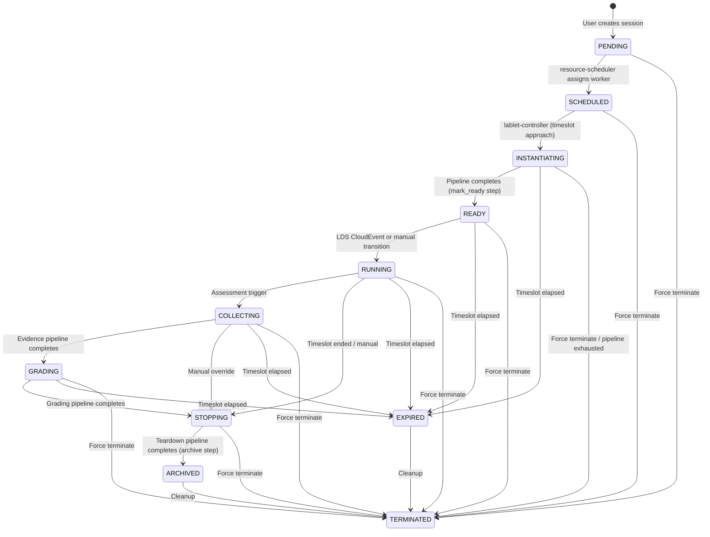
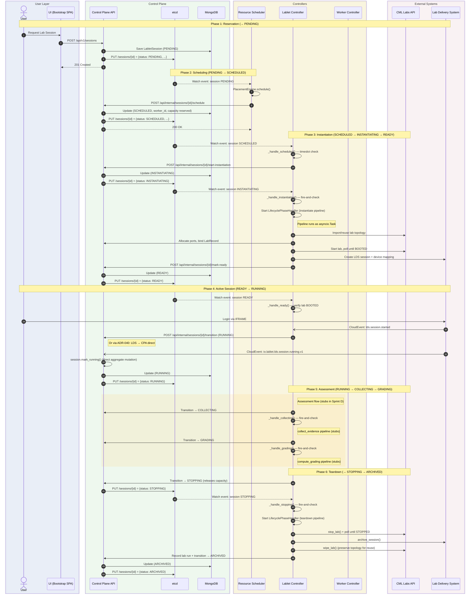

# LabletSession Lifecycle Flow

| Attribute | Value |
|-----------|-------|
| **Document Version** | 3.0.0 |
| **Created** | 2026-01-19 |
| **Updated** | 2026-04-10 |
| **Status** | Active |
| **ADRs** | ADR-001, ADR-034, ADR-039, ADR-040 |

---

## Overview

This document describes the complete lifecycle of a **LabletSession** from reservation through execution to archival, showing how all four microservices collaborate via **etcd watch streams** and the **Control Plane API** as the single source of truth (ADR-001).

**Key Architectural Principles:**

- **Control Plane API (CPA)** is the **sole MongoDB writer** — all state mutations go through it
- **etcd** is the cross-service coordination bus — state projection, watch streams, leader election, capacity tracking
- **Watch + Poll dual-mode** — etcd watches provide reactivity; periodic polling guarantees consistency against missed events
- **Pipeline fire-and-check** (ADR-034) — long-running multi-step phases (INSTANTIATING, COLLECTING, GRADING, STOPPING) run as managed `asyncio.Task` inside a `LifecyclePhaseHandler`; the reconciler never blocks — it checks handler status on each cycle
- **Lab reuse over reimport** — labs are wiped (not deleted), preserving topology for ~20s reuse vs ~90s fresh import

---

## Service Responsibilities

| Service | Role | Watch Prefix | External Systems |
|---------|------|--------------|------------------|
| **control-plane-api** | State management, aggregate persistence, etcd projection | — (source) | MongoDB |
| **resource-scheduler** | Scheduling decisions, worker assignment | `/sessions/{id}` (status=PENDING) | CPA API, etcd (capacity) |
| **worker-controller** | AWS EC2 provisioning, CML health, metrics | `/workers/{id}` | AWS EC2, CloudWatch, CML System API |
| **lablet-controller** | Session lifecycle reconciliation, lab/LDS/grading orchestration | `/sessions/{id}`, `/requeue/` | CML Labs API, LDS API, CPA API |

All services are **leader-elected** — only one instance per service reconciles at a time.

---

## State Machine

### Status Enum

```python
class LabletSessionStatus(str, Enum):
    PENDING         = "PENDING"          # Session created, awaiting scheduling
    SCHEDULED       = "SCHEDULED"        # Worker assigned, awaiting timeslot
    INSTANTIATING   = "INSTANTIATING"    # Pipeline: lab import + start + LDS provision
    READY           = "READY"            # Lab BOOTED + LDS provisioned, awaiting user
    RUNNING         = "RUNNING"          # User logged in, session active
    COLLECTING      = "COLLECTING"       # Evidence capture pipeline (configs, screenshots, pcaps)
    GRADING         = "GRADING"          # Grading engine evaluating evidence
    STOPPING        = "STOPPING"         # Teardown pipeline: stop + wipe + archive
    STOPPED         = "STOPPED"          # Teardown complete, awaiting final archival
    ARCHIVED        = "ARCHIVED"         # Terminal: session preserved for historical records
    TERMINATED      = "TERMINATED"       # Terminal: force-terminated from any state
    EXPIRED         = "EXPIRED"          # Terminal: timeslot elapsed
```

### Transition Diagram



### Valid Transitions

| From | To |
|------|----|
| **PENDING** | SCHEDULED, TERMINATED |
| **SCHEDULED** | INSTANTIATING, TERMINATED |
| **INSTANTIATING** | READY, EXPIRED, TERMINATED |
| **READY** | RUNNING, EXPIRED, TERMINATED |
| **RUNNING** | COLLECTING, STOPPING, EXPIRED, TERMINATED |
| **COLLECTING** | GRADING, STOPPING, EXPIRED, TERMINATED |
| **GRADING** | STOPPING, EXPIRED, TERMINATED |
| **STOPPING** | ARCHIVED, TERMINATED |
| **ARCHIVED** | TERMINATED |
| **EXPIRED** | TERMINATED |
| **TERMINATED** | *(terminal — no further transitions)* |

---

## End-to-End Sequence Diagram



---

## Phase Details

### Phase 1: Reservation (→ PENDING)

**Owner:** control-plane-api
**Trigger:** User API call

1. User selects a `LabletDefinition` and timeslot in the UI
2. UI calls `POST /api/v1/sessions` with `definition_id`, `timeslot_start`, `timeslot_end`
3. CPA executes `CreateLabletSessionCommand` → persists `LabletSession` aggregate to MongoDB
4. CPA publishes session state to etcd at `/sessions/{id}`
5. Domain event `lablet_session.created.v1` is emitted

```http
POST /api/v1/sessions
Content-Type: application/json

{
  "definition_id": "def-abc123",
  "timeslot_start": "2026-01-19T14:00:00Z",
  "timeslot_end": "2026-01-19T16:00:00Z",
  "reservation_id": "ext-reservation-456"
}
```

---

### Phase 2: Scheduling (PENDING → SCHEDULED)

**Owner:** resource-scheduler
**Trigger:** etcd watch on `/sessions/{id}` where status=PENDING (+ polling fallback)

The `LabletSessionScheduler` (a `WatchTriggeredHostedService`) reconciles PENDING sessions:

1. Fetches the `LabletDefinition` for resource requirements
2. Runs `PlacementEngine.schedule()` against:
    - RUNNING workers list
    - Real-time capacity from etcd (`/capacity/{worker_id}`)
    - Worker templates (for scale-up decisions)
3. **Decision outcomes:**
    - **`assign`** → calls CPA `ScheduleLabletSessionCommand` → SCHEDULED (worker capacity reserved)
    - **`scale_up`** → requests new worker provisioning, requeues session
    - **`wait`** → requeues for next cycle (no suitable worker)

!!! note "Port Allocation is Deferred"
    The scheduler passes `allocated_ports={}`. Actual port allocation happens during the instantiate pipeline's `ports_alloc` step, where real ports are allocated from the worker's pool based on the lab topology.

```http
POST /api/internal/sessions/{session_id}/schedule
X-API-Key: {internal_api_key}
Content-Type: application/json

{
  "worker_id": "worker-xyz789",
  "allocated_ports": {}
}
```

---

### Phase 3: Instantiation (SCHEDULED → INSTANTIATING → READY)

**Owner:** lablet-controller
**Trigger:** etcd watch on `/sessions/{id}` status changes
**Pattern:** Pipeline fire-and-check delegation (ADR-034)

#### Step 1: SCHEDULED → INSTANTIATING

`_handle_scheduled()` checks whether the timeslot is approaching (or is on-demand). When ready, calls CPA `StartInstantiationCommand`.

#### Step 2: Pipeline Execution

`_handle_instantiating()` uses the **fire-and-check** pattern:

```
reconcile cycle 1:  No handler exists → start LifecyclePhaseHandler
reconcile cycle 2:  Handler is_running → return success (self-driving)
     ...
reconcile cycle N:  Handler finished → check result:
    • completed/partial → success
    • failed → check retry budget → restart or terminate
    • None (crash) → restart handler
```

The `LifecyclePhaseHandler` wraps a `PipelineExecutor` in a managed `asyncio.Task`. The executor runs the **instantiate pipeline** defined in the seed YAML as a DAG (topological sort via `graphlib`):

| # | Step | Handler Method | External System | Purpose |
|---|------|---------------|-----------------|---------|
| 1 | `content_sync` | `_step_content_sync` | ContentSyncService | Verify definition content is synced |
| 2 | `variables` | `_step_variables` | — | Resolve session variables (stub) |
| 3 | `lab_resolve` | `_step_lab_resolve` | **CML Labs API** | Reuse existing WIPED/STOPPED lab or import fresh from YAML |
| 4 | `ports_alloc` | `_step_ports_alloc` | CPA API | Allocate real ports from worker pool |
| 5 | `tags_sync` | `_step_tags_sync` | **CML Labs API** | Write `protocol:port` tags to CML nodes |
| 6 | `lab_binding` | `_step_lab_binding` | CPA API | Bind LabRecord to session, denormalize ports |
| 7 | `lab_start` | `_step_lab_start` | **CML Labs API** | Start CML lab, poll until BOOTED |
| 8 | `lds_provision` | `_step_lds_provision` | **LDS API** | Create LDS session, map devices, get launch URL |
| 9 | `mark_ready` | `_step_mark_ready` | CPA API | Atomically transition session → READY |

#### Pipeline Executor Features

- **DAG-based execution** — steps sorted via `graphlib.TopologicalSorter` based on `needs` declarations
- **`skip_when` expressions** — evaluated via `simpleeval` with `$SESSION`, `$DEFINITION`, `$STEPS` context
- **Per-step retry** — configurable `max_retries` + `retry_delay_seconds` with backoff
- **Per-step timeout** — enforced via `asyncio.wait_for()`
- **Progress persistence** — after each step, calls CPA `UpdateInstantiationProgressCommand`
- **Crash-resilient resumability** — on restart, completed/skipped steps are restored from CPA progress

#### Lab Resolution Strategy

`_step_lab_resolve` attempts lab reuse before fresh import:

1. If `cml_lab_id` is empty → query CPA for WIPED/STOPPED labs on this worker matching node count
    - Priority: **WIPED** (~20s reuse) > **STOPPED** (wipe first, ~30s)
2. Fallback: fresh import via CML `import_lab()` (~90s)

---

### Phase 4: Active Session (READY → RUNNING)

**Owner:** lablet-controller
**Trigger:** etcd watch

#### READY State

`_handle_ready()` performs a **health check** — verifies the lab is still BOOTED on the CML worker. The READY → RUNNING transition is triggered externally:

- **LDS CloudEvent** (`lds.session.started`) — user logged into the IFRAME
- **Manual API call** — admin transitions via `POST /api/v1/sessions/{id}/transition`

#### RUNNING State

`_handle_running()` monitors the active session:

- Verifies lab state is still healthy (BOOTED on CML)
- Checks timeslot hasn't elapsed
- Observes resource utilization
- On timeslot end or manual trigger → transition to STOPPING (or COLLECTING for assessment flow)

---

### Phase 5: Assessment (RUNNING → COLLECTING → GRADING)

**Owner:** lablet-controller
**Pattern:** Pipeline fire-and-check (same as instantiation)

!!! warning "Sprint D Status: Stubs"
    The evidence collection and grading pipelines are currently **stub implementations** that return "completed" immediately. Full implementation is planned for Sprint E.

#### COLLECTING — Evidence Pipeline

`_handle_collecting()` uses fire-and-check with the `collect_evidence` pipeline:

| # | Step | Handler Method | Status |
|---|------|---------------|--------|
| 1 | `capture_configs` | `_step_capture_configs` | Stub |
| 2 | `capture_screenshots` | `_step_capture_screenshots` | Stub |
| 3 | `export_pcaps` | `_step_export_pcaps` | Stub |
| 4 | `package_evidence` | `_step_package_evidence` | Stub |

#### GRADING — Scoring Pipeline

`_handle_grading()` uses fire-and-check with the `compute_grading` pipeline:

| # | Step | Handler Method | Status |
|---|------|---------------|--------|
| 1 | `load_rubric` | `_step_load_rubric` | Stub |
| 2 | `evaluate` | `_step_evaluate` | Stub |
| 3 | `record_score` | `_step_record_score` | Stub |

---

### Phase 6: Teardown (→ STOPPING → ARCHIVED)

**Owner:** lablet-controller
**Pattern:** Pipeline fire-and-check (ADR-034 Sprint D)

When a session transitions to STOPPING (capacity is released by CPA), `_handle_stopping()` starts a `LifecyclePhaseHandler` with the **teardown pipeline**:

| # | Step | Handler Method | External System | Purpose |
|---|------|---------------|-----------------|---------|
| 1 | `stop_lab` | `_step_stop_lab` | **CML Labs API** | Call `stop_lab()`, poll with `asyncio.sleep(5)` until STOPPED/DEFINED_ON_CORE |
| 2 | `deregister_lds` | `_step_deregister_lds` | **LDS API** | Archive LDS session (skipped if no `lds_session_id`) |
| 3 | `wipe_lab` | `_step_wipe_lab` | **CML Labs API** | Wipe lab to DEFINED_ON_CORE (preserves topology for reuse) |
| 4 | `archive` | `_step_archive` | CPA API | Record lab run completion + transition → ARCHIVED |

!!! info "Labs are Wiped, Not Deleted"
    The teardown pipeline **wipes** labs instead of deleting them. This preserves the imported topology on the worker, allowing future sessions to **reuse** the lab (~20s) instead of re-importing from YAML (~90s).

The `_step_archive` handler internally calls `_record_lab_run_completed()` before transitioning to ARCHIVED (AD-PIPELINE-011: no separate step for run recording).

---

### Alternative Paths

#### Timeslot Expiry (→ EXPIRED)

The `TimeslotWatcherService` runs every 10 seconds, scanning for sessions with elapsed timeslots via CPA's `GET /api/internal/lablet-sessions/imminent-deadlines`. For each match, it writes an etcd trigger key to initiate watch-based reconciliation.

Additionally, `_reconcile_inner()` performs an **early timeslot expiry check** before status routing: if the timeslot has elapsed and the session is not in a terminal/stopping state, it calls `ExpireLabletSessionCommand` immediately.

EXPIRED is reachable from: INSTANTIATING, READY, RUNNING, COLLECTING, GRADING.

#### Force Termination (→ TERMINATED)

Reachable from **any** state via `TerminateLabletSessionCommand`. Side effects:

- Releases allocated ports back to worker pool
- Releases worker capacity
- Unbinds LabRecord from session

---

## Reconciliation Architecture

### Watch + Poll Dual-Mode

The lablet-controller's `LabletReconciler` extends `WatchTriggeredHostedService`:

```
┌──────────────────────────────────────────────────────────────┐
│                     LabletReconciler                          │
│                                                               │
│  ┌─────────────┐     ┌──────────────────────────────────┐    │
│  │ etcd Watch   │────▶│   _reconcile_inner(instance)      │   │
│  │ /sessions/*  │     │                                    │   │
│  └─────────────┘     │  1. Early timeslot expiry check     │   │
│                       │  2. Per-session lock                 │   │
│  ┌─────────────┐     │  3. Worker IP validation              │   │
│  │ Poll Timer   │────▶│  4. Status routing:                  │   │
│  │ (fallback)   │     │     SCHEDULED → _handle_scheduled()  │   │
│  └─────────────┘     │     INSTANTIATING → _handle_inst..()  │   │
│                       │     READY → _handle_ready()           │   │
│                       │     RUNNING → _handle_running()        │   │
│                       │     COLLECTING → _handle_collecting()  │   │
│                       │     GRADING → _handle_grading()        │   │
│                       │     STOPPING → _handle_stopping()      │   │
│                       └──────────────────────────────────────┘    │
│                                                                    │
│  Sub-services (started on leader election):                        │
│  • LabsRefreshService — periodic CML lab discovery                 │
│  • LabActionWatcherService — reactive lab pending actions          │
│  • ContentSyncWatcherService — definition content sync             │
│  • TimeslotWatcherService — proactive deadline detection (10s)     │
└────────────────────────────────────────────────────────────────────┘
```

### Fire-and-Check Pattern

Used for INSTANTIATING, COLLECTING, GRADING, and STOPPING:

```
┌──────────────────────────────────────────────────────────┐
│              Fire-and-Check Delegation                     │
│                                                            │
│  Reconciler checks _active_handlers[handler_key]:          │
│                                                            │
│  ┌─ No handler exists ──────────────────────────────────┐ │
│  │  1. Get pipeline_def from LabletDefinition YAML       │ │
│  │  2. Build PipelineContext ($SESSION, $DEFINITION)      │ │
│  │  3. Create PipelineExecutor with step_dispatcher       │ │
│  │  4. Wrap in LifecyclePhaseHandler (asyncio.Task)       │ │
│  │  5. Store in _active_handlers                          │ │
│  └───────────────────────────────────────────────────────┘ │
│                                                            │
│  ┌─ Handler exists + is_running ─────────────────────────┐ │
│  │  → return success (pipeline is self-driving)           │ │
│  └───────────────────────────────────────────────────────┘ │
│                                                            │
│  ┌─ Handler finished ────────────────────────────────────┐ │
│  │  result.status == "completed"/"partial" → success      │ │
│  │  result.status == "failed":                            │ │
│  │    retries < max → restart handler (retry)             │ │
│  │    retries >= max → terminate session                  │ │
│  │  result is None (crash) → restart handler              │ │
│  └───────────────────────────────────────────────────────┘ │
└──────────────────────────────────────────────────────────┘
```

---

## External Systems Integration

| System | Protocol | Called By | Operations |
|--------|----------|-----------|------------|
| **CML Labs API** | REST (`https://{worker_ip}`) | lablet-controller | `import_lab`, `start_lab`, `stop_lab`, `wipe_lab`, `get_lab_state`, `get_lab_nodes`, `patch_node_tags` |
| **CML System API** | REST (`https://{worker_ip}`) | worker-controller | Health check, system info, license register/deregister |
| **LDS API** | REST | lablet-controller | `create_session`, `set_devices`, `get_lablet_launch_url`, `archive_session` |
| **AWS EC2** | boto3 | worker-controller | `run_instance`, `start/stop/terminate_instance`, `describe_instances` |
| **AWS CloudWatch** | boto3 | worker-controller | `get_metric_data` (CPU, memory, network) |
| **MongoDB** | Motor (async) | control-plane-api **only** | All aggregate persistence |
| **etcd** | gRPC | All services | Leader election, watch streams, capacity projection, state publication |

---

## Domain Events

| Event Type | Transition | Description |
|------------|------------|-------------|
| `lablet_session.created.v1` | → PENDING | Session created |
| `lablet_session.scheduled.v1` | PENDING → SCHEDULED | Assigned to worker |
| `lablet_session.instantiating.v1` | SCHEDULED → INSTANTIATING | Pipeline started |
| `lablet_session.ready.v1` | INSTANTIATING → READY | Lab + LDS ready |
| `lablet_session.running.v1` | READY → RUNNING | User logged in |
| `lablet_session.collecting.v1` | RUNNING → COLLECTING | Evidence capture started |
| `lablet_session.grading.v1` | COLLECTING → GRADING | Grading started |
| `lablet_session.stopping.v1` | * → STOPPING | Teardown started |
| `lablet_session.archived.v1` | STOPPING → ARCHIVED | Teardown complete |
| `lablet_session.expired.v1` | * → EXPIRED | Timeslot elapsed |
| `lablet_session.terminated.v1` | * → TERMINATED | Force terminated |

---

## CloudEvents Consumed

| Event Type | Source | Handler | Action |
|------------|--------|---------|--------|
| `lds.session.started` | LDS | `LdsSessionStartedHandler` | Update UserSession → ACTIVE, transition READY → RUNNING |
| `lds.session.ended` | LDS | `LdsSessionEndedHandler` | Update UserSession → ENDED, trigger collection |
| `grading.session.completed` | Grading Engine | `GradingSessionCompletedHandler` | Create ScoreReport, transition → STOPPING |
| `grading.session.failed` | Grading Engine | `GradingSessionFailedHandler` | Mark GradingSession FAULTED |

---

## API Endpoints Summary

### Public Endpoints (User-Facing via CPA)

| Method | Endpoint | Description |
|--------|----------|-------------|
| `POST` | `/api/v1/sessions` | Create reservation (→ PENDING) |
| `GET` | `/api/v1/sessions/{id}` | Get session details |
| `GET` | `/api/v1/sessions` | List sessions (with filters) |
| `DELETE` | `/api/v1/sessions/{id}` | Terminate session |
| `POST` | `/api/v1/sessions/{id}/transition` | Manual status transition |

### Internal Endpoints (Service-to-Service via CPA)

| Method | Endpoint | Called By |
|--------|----------|-----------|
| `POST` | `/api/internal/sessions/{id}/schedule` | resource-scheduler |
| `POST` | `/api/internal/sessions/{id}/start-instantiation` | lablet-controller |
| `POST` | `/api/internal/sessions/{id}/mark-ready` | lablet-controller |
| `POST` | `/api/internal/sessions/{id}/transition` | lablet-controller |
| `PATCH` | `/api/internal/sessions/{id}/bind-lab` | lablet-controller |
| `PUT` | `/api/internal/sessions/{id}/progress` | lablet-controller |
| `POST` | `/api/internal/sessions/{id}/expire` | lablet-controller |
| `POST` | `/api/internal/sessions/{id}/terminate` | any service |

---

## Key Code Locations

| Component | File | Purpose |
|-----------|------|---------|
| **LabletSessionStatus enum** | `src/core/lcm_core/domain/enums/lablet_session_status.py` | All status values + valid transitions |
| **LabletReconciler** | `src/lablet-controller/application/hosted_services/lablet_reconciler.py` | Main lifecycle engine (~2500 lines) |
| **PipelineExecutor** | `src/lablet-controller/application/services/pipeline_executor.py` | DAG-based step execution engine |
| **LifecyclePhaseHandler** | `src/lablet-controller/application/services/lifecycle_phase_handler.py` | Managed asyncio.Task wrapper |
| **Session commands** | `src/control-plane-api/application/commands/lablet_session/` | CPA command handlers (create, schedule, transition, etc.) |
| **Seed pipeline definitions** | `src/lablet-controller/data/seed/` | YAML files defining pipeline steps per LabletDefinition |
| **TimeslotWatcherService** | `src/lablet-controller/application/hosted_services/timeslot_watcher_service.py` | Proactive deadline detection |

---

## Related Documentation

- [ADR-001: API-Centric State Management](adr/ADR-001-api-centric-state-management.md)
- [LCM Platform Architecture](lablet-resource-manager-architecture.md)
- [Lablet Controller Architecture](components/lablet-controller/index.md)
- [Resource Scheduler Architecture](components/resource-scheduler/index.md)
- [Worker Controller Architecture](components/worker-controller/index.md)
- [Control Plane API Architecture](components/control-plane-api/index.md)
