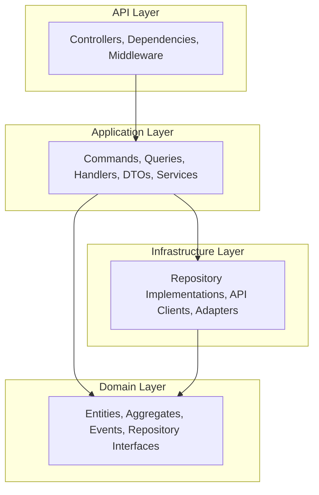

# System Design

This document describes the foundational architecture and framework patterns used across all Lablet Cloud Manager microservices.

!!! tip "Looking for Component Architecture?"
    For detailed architecture of each microservice, see the [Architecture Overview](index.md) and individual component pages.

## Neuroglia-Python Framework

All LCM microservices are built using the **neuroglia-python** framework, which promotes a clean, modular architecture based on Domain-Driven Design (DDD) and Command Query Responsibility Segregation (CQRS).

!!! info "Framework Documentation"
    - **GitHub Repository**: [https://github.com/bvandewe/pyneuro](https://github.com/bvandewe/pyneuro)
    - **Public Documentation**: [https://bvandewe.github.io/pyneuro/](https://bvandewe.github.io/pyneuro/)

## Clean Architecture Layers

Each microservice follows the same layered structure:



### Layer Responsibilities

| Layer | Directory | Responsibility | Dependencies |
|-------|-----------|----------------|--------------|
| **Domain** | `domain/` | Pure business logic, entities, invariants | None (pure Python) |
| **Application** | `application/` | Orchestration, CQRS handlers, services | Domain |
| **Infrastructure** | `integration/` | MongoDB, AWS, CML API clients | Domain |
| **API** | `api/` | HTTP controllers, auth, middleware | Application |

### Key Principles

- **Dependency Rule**: Inner layers know nothing about outer layers
- **Domain Isolation**: Domain layer has no external dependencies
- **Repository Pattern**: Abstract interfaces in domain, implementations in infrastructure
- **Mediator Pattern**: Commands/Queries dispatched through centralized mediator

## Directory Structure (Per Service)

```
service-name/
├── api/                          # HTTP Layer
│   ├── controllers/              # REST endpoints (Neuroglia auto-prefix)
│   ├── dependencies.py           # FastAPI DI for auth, sessions
│   └── services/                 # API-layer services (auth, SSE)
│
├── application/                  # Business Logic Layer
│   ├── commands/                 # Write operations (self-contained)
│   │   └── create_entity_command.py  # Command + Handler in same file
│   ├── queries/                  # Read operations (self-contained)
│   │   └── get_entities_query.py     # Query + Handler in same file
│   ├── dtos/                     # Data Transfer Objects
│   ├── services/                 # Application services
│   ├── jobs/                     # Background tasks
│   └── settings.py               # Configuration (Pydantic Settings)
│
├── domain/                       # Core Domain Layer
│   ├── entities/                 # Aggregates and entities
│   ├── events/                   # Domain events (@cloudevent)
│   ├── enums/                    # Value objects and enums
│   └── repositories/             # Abstract repository interfaces
│
├── integration/                  # External Service Adapters
│   ├── repositories/             # Concrete repository implementations
│   └── services/                 # External API clients
│
├── infrastructure/               # Technical Adapters
│   └── session_store.py          # Redis/InMemory adapters
│
├── tests/                        # Test suite
├── main.py                       # Application entrypoint
├── Makefile                      # Development commands
└── pyproject.toml                # Dependencies
```

## CQRS Pattern

Commands (writes) and Queries (reads) are handled separately through the Mediator:

```python
# Self-contained command file: application/commands/create_worker_command.py

@dataclass
class CreateWorkerCommand(Command[OperationResult[WorkerCreatedDto]]):
    name: str
    region: str
    instance_type: str

class CreateWorkerCommandHandler(CommandHandler[CreateWorkerCommand, OperationResult[WorkerCreatedDto]]):
    def __init__(self, repository: CMLWorkerRepository):
        self._repository = repository

    async def handle_async(self, request: CreateWorkerCommand, cancellation_token=None):
        # Validation
        if not request.name:
            return self.bad_request("Name is required")

        # Business logic
        worker = CMLWorker.create(
            name=request.name,
            region=request.region,
            instance_type=request.instance_type
        )

        # Persistence
        await self._repository.add_async(worker, cancellation_token)

        # Response
        return self.created(WorkerCreatedDto(id=worker.id(), name=worker.state.name))
```

## Controller Routing

Neuroglia auto-generates route prefixes from controller class names:

```python
class WorkersController(ControllerBase):
    """Routes: /workers/*"""

    @route(HttpMethod.GET, "/")           # GET /workers/
    async def list_workers(self): ...

    @route(HttpMethod.GET, "/{id}")       # GET /workers/{id}
    async def get_worker(self, id: str): ...

    @route(HttpMethod.POST, "/")          # POST /workers/
    async def create_worker(self): ...
```

!!! warning "Avoid Double Prefixing"
    Do NOT include the prefix in route decorators:

    ```python
    # ❌ Wrong: GET /workers/workers/{id}
    @route(HttpMethod.GET, "/workers/{id}")

    # ✅ Correct: GET /workers/{id}
    @route(HttpMethod.GET, "/{id}")
    ```

## State-Based Persistence

Unlike the AIX platform which uses Event Sourcing, LCM uses **State-Based Persistence**:

```python
class CMLWorker(AggregateRoot[CMLWorkerState]):
    """
    State-based aggregate with optimistic concurrency.

    - State stored directly in MongoDB
    - state_version field for conflict detection
    - No event stream (simpler model)
    """
```

Domain Events are still emitted as Cloudevents: See

## Related Documentation

- [CQRS Pattern](cqrs-pattern.md) - Detailed CQRS implementation
- [Data Layer](data-layer.md) - MongoDB integration patterns
- [Dependency Injection](dependency-injection.md) - Service registration
