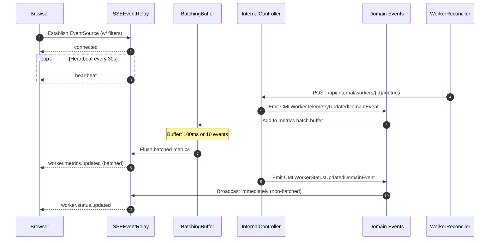

# Real-Time Updates Architecture

> **Updated:** 2026-04-10 (SSE race condition fix per [ADR-039](./adr/ADR-039-sse-race-condition-fix.md))
>
> Delivering low-latency UI changes for worker lifecycle, metrics, lablet definitions,
> and lablet instances using Server-Sent Events (SSE).

## Overview

The application provides a push-based real-time channel so the browser reflects backend changes immediately without manual refresh. This is implemented with **Server-Sent Events (SSE)** for simplicity, broad browser support, and one-directional event flow.

| Aspect | Choice | Rationale |
|--------|--------|-----------|
| Protocol | SSE (EventSource) | Lightweight, native in browsers, text/event-stream |
| Transport | HTTP (long-lived) | Reuses existing infrastructure; no extra sockets |
| Direction | Server → Client | UI only needs updates; commands remain HTTP REST |
| Format | JSON payloads | Simple, debuggable in dev tools |
| Event Model | Domain + Application events | Unified abstraction over worker lifecycle & telemetry |
| Batching | Optional (per ADR-013) | High-frequency metrics batched into single frames |
| Filtering | Server-side (per ADR-013) | Clients can filter by worker_ids and event_types |

## Endpoint

`GET /api/events/stream`

**Query Parameters** (filtering - per ADR-013):

| Parameter | Type | Description |
|-----------|------|-------------|
| `worker_ids` | string (CSV) | Only receive events for these workers |
| `event_types` | string (CSV) | Only receive these event types |

**Examples:**

```bash
# All events (default)
GET /api/events/stream

# Events for specific workers
GET /api/events/stream?worker_ids=worker-1,worker-2

# Only metrics events
GET /api/events/stream?event_types=worker.metrics.updated

# Combined filtering
GET /api/events/stream?worker_ids=worker-1&event_types=worker.metrics.updated,worker.status.updated
```

**Response:**

- Content-Type: `text/event-stream`
- Includes initial `connected` event and `heartbeat` every 30 seconds.
- Closes gracefully with `system.sse.shutdown` on application stop.

## Event Types

### Core Events (existing)

| SSE Event | Source | Description |
|-----------|--------|-------------|
| `worker.created` | Domain event handler | New worker aggregate created |
| `worker.imported` | Bulk import command | Worker discovered and imported from AWS |
| `worker.status.updated` | Status command / reconciler | EC2 state change mapped to domain status |
| `worker.metrics.updated` | Metrics collection reconciler | Telemetry snapshot (CPU/Mem/Labs count) |
| `worker.labs.updated` | Labs refresh command | Lab records synchronized from CML instance |
| `worker.terminated` | Terminate command | Worker lifecycle end |
| `system.sse.shutdown` | Hosted service stop | Relay shutting down (optional UI notice) |

### Worker Template Events (ADR-013)

| SSE Event | Source | Description |
|-----------|--------|-------------|
| `worker-template.created` | Domain event handler | New worker template defined |
| `worker-template.updated` | Update command | Template specification changed |
| `worker-template.deleted` | Delete command | Template removed |

### Lablet Definition Events (ADR-013)

| SSE Event | Source | Description |
|-----------|--------|-------------|
| `lablet-definition.created` | Domain event handler | New lablet definition created |
| `lablet-definition.updated` | Update command | Definition specification changed |
| `lablet-definition.deleted` | Delete command | Definition removed |

### Lablet Session Events (ADR-013, ADR-039)

| SSE Event | Source | Description |
|-----------|--------|-------------|
| `lablet.session.created` | Domain event handler | New lablet session created (enriched payload: status, definition, timeslot) |
| `lablet.session.status.changed` | Domain event handler | **Generic** — handles ALL lifecycle transitions (PENDING→…→ARCHIVED) |
| `lablet.session.timeslot.extended` | Timeslot command | Session timeslot extended (`new_timeslot_end` field) |
| `lablet.session.score.recorded` | Score command | Score report recorded (`score_report_id`, `grade_result` fields) |
| `lablet.session.deleted` | Delete command | Session removed |

!!! warning "Wire Type Consolidation (ADR-039)"
    The backend emits a **single** `lablet.session.status.changed` wire type for all lifecycle
    transitions. Per-status wire types (`lablet.session.scheduled`, `.instantiating`, `.ready`,
    `.running`, etc.) are **not emitted** and should not be subscribed to. The frontend's
    `LABLET_SESSION_STATUS_CHANGED` handler is generic and covers every state.

## Flow Diagram


```mermaid
sequenceDiagram
    autonumber
    participant Browser
    participant SSE as SSEEventRelay
    participant Batch as BatchingBuffer
    participant Int as InternalController
    participant Dom as Domain Events
    participant WR as WorkerReconciler

    Browser->>SSE: Establish EventSource (w/ filters)
    SSE-->>Browser: connected
    loop Heartbeat every 30s
        SSE-->>Browser: heartbeat
    end
    WR->>Int: POST /api/internal/workers/{id}/metrics
    Int->>Dom: Emit CMLWorkerTelemetryUpdatedDomainEvent
    Dom->>Batch: Add to metrics batch buffer
    Note over Batch: Buffer: 100ms or 10 events
    Batch->>SSE: Flush batched metrics
    SSE-->>Browser: worker.metrics.updated (batched)
    Int->>Dom: Emit CMLWorkerStatusUpdatedDomainEvent
    Dom->>SSE: Broadcast immediately (non-batched)
    SSE-->>Browser: worker.status.updated
```

## Event Batching (ADR-013)

High-frequency metrics events are batched to reduce browser overhead:

### Batching Configuration

```python
class BatchingConfig:
    ENABLED = True
    MAX_BATCH_SIZE = 10           # Flush after N events
    FLUSH_INTERVAL_MS = 100       # Flush after N milliseconds
    BATCHED_EVENT_TYPES = [
        "worker.metrics.updated",
        "lablet-instance.metrics.updated",
    ]
```

### Batched vs Non-Batched Events

| Event Category | Batching | Rationale |
|---------------|----------|-----------|
| `*.metrics.updated` | ✅ Batched | High frequency, aggregatable |
| `*.status.updated` | ❌ Immediate | Lifecycle-critical, user-visible |
| `*.created` | ❌ Immediate | User action result, needs feedback |
| `*.deleted` | ❌ Immediate | Requires immediate UI removal |

### Batch Payload Format

```json
{
  "batch_id": "batch-123",
  "event_type": "worker.metrics.updated",
  "count": 5,
  "events": [
    {"worker_id": "w1", "cpu_percent": 45.2, "collected_at": "..."},
    {"worker_id": "w2", "cpu_percent": 32.1, "collected_at": "..."},
    ...
  ],
  "batched_at": "2026-01-19T10:30:00.123Z"
}
```

## Server-Side Filtering (ADR-013)

Filtering is performed server-side before event transmission to reduce bandwidth:

```python
class SSEEventRelay:
    async def should_send_to_client(
        self, event: dict, client: SSEClient
    ) -> bool:
        # Check worker_ids filter
        if client.worker_id_filter:
            worker_id = event.get("worker_id")
            if worker_id and worker_id not in client.worker_id_filter:
                return False

        # Check event_types filter
        if client.event_type_filter:
            if event["type"] not in client.event_type_filter:
                return False

        return True
```

## Frontend Client

`sse-client.js` provides:

- Auto reconnection (exponential backoff capped at 30s)
- Status callbacks (`connected`, `reconnecting`, `disconnected`, `error`)
- Event routing (`on(eventType, handler)`) for UI modules (`workers.js`)
- Toast notifications for key lifecycle events
- **Graceful cleanup on page lifecycle events**:
  - `beforeunload`: Closes connection when page is refreshed, closed, or navigated away
  - `visibilitychange`: Maintains connection when tab is hidden, reconnects if disconnected when tab becomes visible
  - `freeze`/`resume`: Handles mobile browser backgrounding and page lifecycle states

### Status Badge

A dynamic badge (`Realtime: <status>`) shows live connection state:

| Status | Meaning | UI Color |
|--------|---------|----------|
| connected | Stream healthy | green |
| reconnecting | Backoff in progress | yellow |
| disconnected | Closed / retrying | red |
| error | Transient failure | red |

## Server Components

| Component | Responsibility |
|-----------|---------------|
| `SSEEventRelay` | Manages client queues & broadcasts events |
| `SSEEventRelayHostedService` | Lifecycle (start/stop + future cleanup) |
| Domain Event Handlers | Translate domain events → SSE payloads |
| Commands / Jobs | Trigger domain events or direct broadcast (labs) |

## Extending Events

1. Publish a new domain event or hook existing handler.
2. In handler: `await get_sse_relay().broadcast_event("my.event", { ... })`
3. In UI: `sseClient.on('my.event', data => {/* update UI */})`

## Performance & Scalability

Current design targets moderate connection counts (< hundreds). Future enhancements:

- Backpressure metrics & queue size monitoring
- Client pruning (idle timeout) in hosted service
- Filtering by role or region (add authorization context to generator)
- Optional upgrade path: WebSocket or HTTP/2 for bi-directional communications

## Error Handling

- Dropped events logged if queue put times out (>0.1s)
- Reconnection attempts escalate delay until capped
- UI continues functioning with last known data while reconnecting
- **Page lifecycle handling**:
  - Connections are intentionally closed on page unload to prevent stale connections
  - Auto-reconnection is suppressed during intentional disconnects (refresh, navigation)
  - Reconnection resumes when page becomes visible again after being hidden

## Testing & Debugging

- Use browser DevTools → Network → `events/stream` to inspect raw event frames
- Temporarily add console logs in handlers for verbose tracing
- Simulate failures by stopping backend; observe badge transition

## Future Improvements

| Area | Idea | Status |
|------|------|--------|
| Batching | Batch multiple metric events into single frame | ✅ ADR-013 |
| Filtering | Server-side filtering by worker_ids/event_types | ✅ ADR-013 |
| Extended Events | Worker template, lablet definition/instance CRUD | ✅ ADR-013 |
| Race Condition Fix | Timestamp-guarded `mergeAll` prevents stale HTTP overwriting SSE data | ✅ ADR-039 |
| Security | Per-event auth filtering / claim-based masking | 🔜 Planned |
| Observability | Emit OTEL spans for relay broadcast durations | 🔜 Planned |

**Explicitly Rejected:**

- ❌ **Resumable streams** (event ID + Last-Event-ID): Clients get current state on reconnect via REST; no replay needed
- ❌ **Controller-direct Redis**: Violates ADR-001; all events flow through control-plane-api domain events

## FAQ

**Why SSE instead of WebSockets?**
One-directional updates reduce complexity; no need for server-side subscriptions or bidirectional commands. Browsers handle proxy/load-balancer quirks more predictably with standard HTTP.

**How are lab updates delivered?**
`WorkerReconciler` syncs labs and reports via `/api/internal/workers/{id}/labs`. The command broadcasts `worker.labs.updated` events.

**How do reconnections work?**
When a client reconnects, it establishes a new stream and receives the current snapshot via REST API (worker list, etc.). No event replay is provided; this simplifies implementation and matches the current UI architecture.

**Can I disable real-time updates?**
Remove the SSE connection call in `workers.js` or provide a settings flag to skip initializing the stream for certain deployments.

---
**Related:**

- [Worker Monitoring](worker-monitoring.md) - Background metrics collection
- [ADR-001: API-Centric State Management](./adr/ADR-001-api-centric-state-management.md)
- [ADR-013: SSE Protocol Improvements](./adr/ADR-013-sse-protocol-improvements.md)
- [ADR-039: SSE Race Condition Fix](./adr/ADR-039-sse-race-condition-fix.md)
