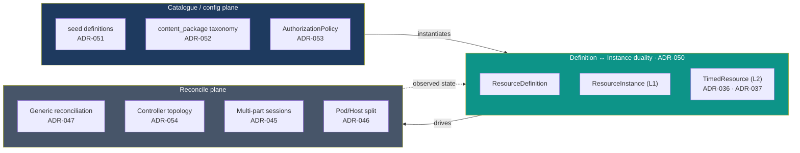

# Architecture at a Glance — Decision Map

> A one-page map of the platform's **four planes** and the ADRs that ratify each. Use it to jump
> from a concept to its canonical solution page and the decision record behind it. The
> generalized resource-plane cluster (ADR-044–054) is the **north-star target** and is still
> `Proposed` — see [Solution Design overview](index.md) for the status caveat.

## The four planes

## Plane → page → ADR

| Plane | What it is | Canonical page | Key ADRs |
|---|---|---|---|
| **Catalogue / config** | The two `provisioning_source`s (`seed`, `content_package`), the content-authoring taxonomy, and the authorization policy model. | [Definition & Catalogue Model](definition-catalog-model.md) | [ADR-051](../adr/ADR-051-provisioning-sources.md), [ADR-052](../adr/ADR-052-content-authoring-taxonomy.md), [ADR-053](../adr/ADR-053-authorization-policy-model.md) |
| **Definition ↔ Instance** | Every runtime resource is created from a `ResourceDefinition`; instances split into untimed `ResourceInstance` (L1) and timed `TimedResource` (L2). | [Resource Model](resource-model.md) | [ADR-050](../adr/ADR-050-definition-instance-duality.md), [ADR-036](../adr/ADR-036-resource-management-abstraction-layer.md), [ADR-037](../adr/ADR-037-timeslot-management.md) |
| **Reconcile** | The generic observe → diff → act → record loop and the controller that owns each resource kind. | [Resource Model](resource-model.md), [Unified Resource Management](unified-resource-management.md) | [ADR-047](../adr/ADR-047-generic-reconciliation-framework.md), [ADR-054](../adr/ADR-054-controller-topology-resource-kind.md) |
| **Session delivery** | Multi-part sessions, the `PodType`/`HostType` split, and the Collect → Evaluate → Report automation seam. | [Session Model](session-model.md), [Generic Pattern](generic-pattern.md) | [ADR-045](../adr/ADR-045-multi-part-session-part-model.md), [ADR-046](../adr/ADR-046-host-abstraction-and-pod-host-type-split.md), [ADR-044](../adr/ADR-044-content-driven-lifecycle-engine.md) |

## Reading order

1. [Glossary](glossary.md) — canonical vocabulary; read first if any term is unclear.
2. [Solution Overview](solution-overview.md) — services, ownership, C4 context.
3. [Resource Model](resource-model.md) + [Definition & Catalogue Model](definition-catalog-model.md) — the instance and definition sides of the duality.
4. [Session Model](session-model.md) → [Flow: Session Delivery](flow-session-delivery.md) — the delivery path end to end.

## Related

- [Solution Design overview](index.md) — status and audience map.
- [ADR index](../adr/README.md) — the full decision log with the supersession graph.
