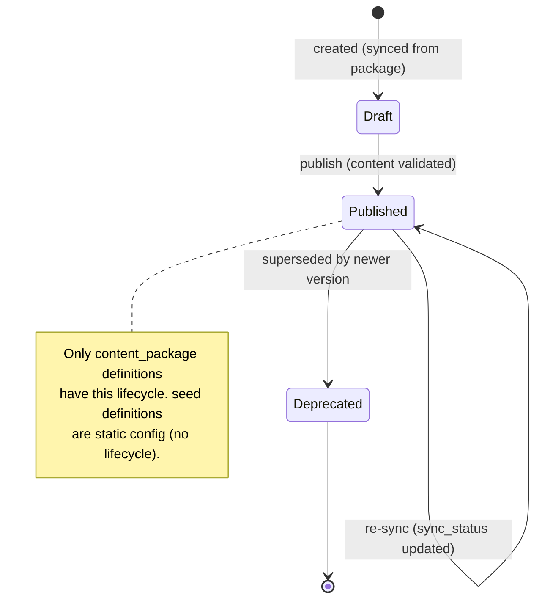
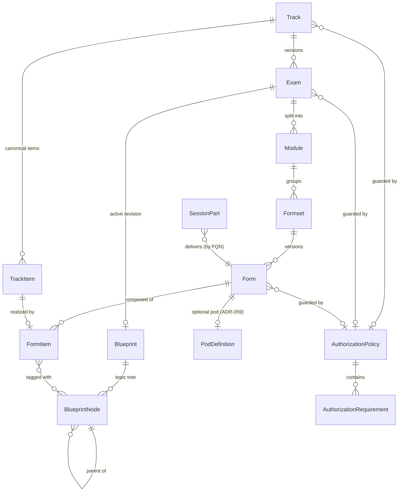
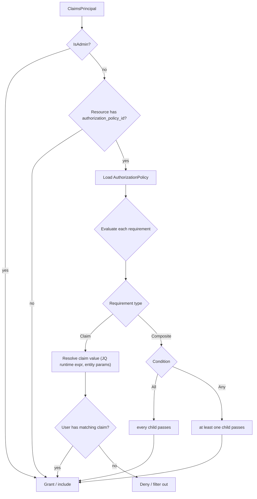

# Definition & Catalogue Model

> Every runtime resource is created from a **`ResourceDefinition`**. This page describes the
> definition side of the [resource model](resource-model.md): where definitions come from
> (the two **provisioning sources**), the **content-authoring taxonomy** that supplies exam
> content, the **catalogue / config plane** of static reference data, and the **authorization
> policy** model that guards both. See [ADR-051](../adr/ADR-051-provisioning-sources.md),
> [ADR-052](../adr/ADR-052-content-authoring-taxonomy.md) and
> [ADR-053](../adr/ADR-053-authorization-policy-model.md).

## Two provisioning sources

A definition's `provisioning_source` is the single switch that decides whether it reconciles:

| Source | Origin | Lifecycle | Examples |
|---|---|---|---|
| **`seed`** | YAML assets loaded once by a **seeder** when the store is empty (the inverse of an export). | **None** — static config, immutable until re-seeded. No `sync_status`. | `SessionDefinition`, `PodDefinition`, `HostDefinition`, `DeliveryEnvironment`, `LabLocation`, `HostingSiteLocation`, `AuthorizationPolicy`. |
| **`content_package`** | Synced from a **PAv1 content package** when content is published/updated. | **Asymmetric** — `definition_status` (`draft → published → deprecated`) + a `sync_status` reconciled against the package. | The **`Form`** (the synced leaf of `Track → … → Form → FormItem`) plus its per-part `JobDefinition`, `ReportDefinition`. |

> **The model's only asymmetry.** `seed` definitions are inert reference data: a `ResourceDefinition`
> with `definition_status = published` and no reconciliation. `content_package` definitions are
> _synced_ (not provisioned). Within the taxonomy, the **`Form`** is the one node that actually
> reconciles — the **`form-controller`** owns its sync loop ([ADR-059](../adr/ADR-059-form-as-first-class-synced-resource.md)); the surrounding `Track`/`Exam`/`Module`/`Formset` nodes are inert catalogue metadata.

## Content-authoring taxonomy

Exam content is authored as a strict, versioned taxonomy (ported from the legacy _Track Manager_
domain). Every node is a `content_package` `ResourceDefinition`; ids are **deterministic slugs**
derived from the parent chain, which makes re-sync idempotent (a duplicate id is a conflict, not a
new node).

| Node | What it is | Identity |
|---|---|---|
| **Track** | A certification line (e.g. _Exam CCIE DEMO_). Owns the canonical item catalogue and one or more versioned exams. | `slug("{Type} {Level} {Acronym}")` |
| **TrackItem** | A canonical, auto-numbered catalogue entry (the stable task/question a form item realises). | `slug("{track} {sequence}")` |
| **Exam** | A versioned realisation of a track with a publication lifecycle (`Draft → Released → Retired`). | `slug("{track} v{version}")` |
| **Blueprint / BlueprintNode** | The weighted topic taxonomy an exam is measured against (a revisioned, self-referential tree). | `"{exam}-{revision}"` / `"{blueprint}-{guid}"` |
| **Module** | A section of an exam (e.g. a lab or written section). | `slug("{exam} {acronym}")` |
| **Formset** | A versioned family of forms (e.g. _DOO-1.x_). | `slug("{module} {version}.x")` |
| **Form** | A concrete deliverable version (e.g. _DOO 1.1_) — the **single synced** `content_package` resource ([ADR-059](../adr/ADR-059-form-as-first-class-synced-resource.md)): owns `sync_status`, synced content bytes, and an **optional `PodDefinition` ref**. Generalises the legacy `LabletDefinition`. Delivered by a `SessionPart`. | `slug("{formset trimmed}{version}")` |
| **FormItem** | An item as placed on a form: references its `TrackItem`, carries placement + type-driven scoring, tagged with `BlueprintNode`s. | GUID |

**Form qualified name (FQN).** A `Form` is addressed across services by its FQN — the six-token
path through the taxonomy (`{Type} {Level} {Acronym} v{version} {module} {form}`). This is the key a
[`PartDefinition`](session-model.md) selects by pattern.

### Form delivery — the synced unit, no timed instance

A `Form` is **authored content that syncs** ([ADR-059](../adr/ADR-059-form-as-first-class-synced-resource.md)): it is the
single `content_package` resource that reconciles (owns `sync_status` + the RustFS bytes) and
carries an **optional `PodDefinition` ref** — a self-contained _content + optional pod_ deliverable.
It **generalises the legacy `LabletDefinition`** (single-part) to every use-case.

It is **delivered** by a `SessionPart` (the timed runtime instance) which selects the `Form` by
FQN and inherits its optional pod. The `Form` lives on the **catalogue / sync plane**, so there is
**no separate timed Form instance** in the runtime tree — the part _is_ the runtime that delivers
the form. Per-part automation (`JobDefinition`, `ReportDefinition`) travels with the same content
package and drives the part's `workflow` lifecycle phases (collect / grade / report).

## Catalogue / config plane

Reference data that has **no timeslot and no reconciliation** is modelled as `seed`
`ResourceDefinition`s in a uniform catalogue. They are configuration the runtime _reads_, never
resources the runtime _drives_:

| Definition | Purpose |
|---|---|
| **`DeliveryEnvironment`** | Which session types are deliverable in a given environment. |
| **`LabLocation`** | A logical lab location (capacity / placement target). |
| **`HostingSiteLocation`** | A physical hosting site / rack a host belongs to. |
| **`AuthorizationPolicy`** | A reusable, named guard (see below) referenced by any definition or resource. |

!!! note "Deferred — `Device` / `DeviceDefinition`"
    A managed **`Device`** instance and its `DeviceDefinition` are **out of scope this round**
    (ADR-050 §2.3). Device-based parts currently reach **pre-existing** devices through
    **ROC / RADkit** and provision nothing — see [session-model.md](session-model.md) and the
    [glossary](glossary.md). They will be added later as a `ResourceDefinition` / `TimedResource`
    pair, with no change to the model.

## Authorization model

Per-resource authorization is ported from the legacy domains as first-class definitions
(`AuthorizationPolicy` + embedded `AuthorizationRequirement`s). **Keycloak/OIDC remains the
authentication** layer; the policy model adds fine-grained **authorization filtering** on top of it.

- An **`AuthorizationPolicy`** is a named, seed-provisioned `ResourceDefinition` composed of
  requirements. Any definition or resource may reference one via `authorization_policy_id`.
- An **`AuthorizationRequirement`** is one of two shapes:
  - **Claim** — a `claim_type` (regex-capable) + optional `claim_value`. The value may be a
      **JQ runtime expression** evaluated against the entity under check (e.g. _"the user's `track`
      claim must equal this track's id"_). Absence ⇒ existence check only.
  - **Composite** — `All` or `Any` over nested requirements (recursive).

Evaluation **filters** results rather than hard-failing, and **admin principals bypass** all checks
(mirrors the legacy `…ForCurrentUser` queries):

## Persistence

Like every aggregate in LCM, definitions are **state-based**: a Neuroglia `AggregateRoot` whose
state is persisted by a `MotorRepository` with `state_version` (not EventStore). The legacy
event-sourced behaviour is preserved as `@dispatch` reducers over domain events; only the
_persistence_ differs. See [ADR-051](../adr/ADR-051-provisioning-sources.md).

## Where definitions are reconciled

!!! warning "Target topology (ADR-054 Rev 2, _Proposed_)"
    The controller names below (`form-controller`, `pod-controller`, `host-controller`) describe the
    **per-resource-kind target topology** proposed in
    [ADR-054](../adr/ADR-054-controller-topology-resource-kind.md), **not** the current
    as-built services. Today the same responsibilities live in **`control-plane-api`** (catalogue
    + content sync), **`lablet-controller`** (session / part / pod reconcile) and
    **`worker-controller`** (host / license). Read the _Owner_ column as _"the controller that owns
    this kind once ADR-054 lands."_

| Definition family | Source | Owner (target — ADR-054 Rev 2) |
|---|---|---|
| **`Form`** (synced leaf) + per-part `JobDefinition` / `ReportDefinition` | content_package | **form-controller** (sync loop — ADR-059) |
| `Track … Formset`, `FormItem`, `Blueprint` (inert taxonomy) | content_package | form-controller (seeded with the package), consumed by CPA |
| `SessionDefinition`, `PartDefinition` | seed | CPA (catalogue seeder) |
| `PodDefinition` | seed / content_package | pod-controller (consumes; pod ref resolved from the `Form`) |
| `HostDefinition` | seed | host-controller |
| Catalogue / config + `AuthorizationPolicy` | seed | CPA (seeder) |

See [ADR-054](../adr/ADR-054-controller-topology-resource-kind.md) for the controller topology.

## Related

- [resource-model.md](resource-model.md) — the instance side (ResourceInstance / TimedResource).
- [session-model.md](session-model.md) — how a `SessionPart` selects and delivers a `Form`.
- [unified-resource-management.md](unified-resource-management.md) — resource lifecycle vs job
  automation.
