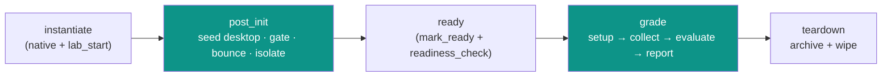

# Sample content — `LAB-0.1` (PAv1)

This is the **canonical, minimal `PAv1/` content package**. Authors can copy this folder as a
starting point. It is derived faithfully from the legacy `LAB-1.1.1` (`RCUv1/`) content so you
can see exactly how legacy artifacts map into the new format — including the **`post_init`** and
**`pre_collect`** scriptblocks expressed with the DSL primitives.

> This sample is a **documentation reference**, not a deployed seed. When ready for runtime, the
> same `PAv1/` folder is what gets published to Mosaic and synced into RustFS (see
> [Flow: Content Sync](../../flow-content-sync.md)). For the full 1:1 fidelity proof of _every_
> legacy task, see the [`LAB-1.1.1` golden port](../LAB-1.1.1/README.md).

## Folder layout

The canonical [PAv1 layout](../../generic-pattern.md#canonical-pav1-layout-one-shape)
([ADR-057 §2.6](../../../adr/ADR-057-content-driven-lifecycle-dsl.md)):

```
LAB-0.1/
└── PAv1/
    ├── manifest.yaml            # catalog metadata + pod type  (CPA reads this)
    ├── lifecycle.yaml           # phase → JobDefinition binding (CPA + SE)
    ├── connectors.yaml          # connector/port model          (from RCUv1/pod.xml)
    ├── topology/
    │   ├── devices.json         # AWS/CML instance config      (LCM instantiate)
    │   └── ports.json           # per-device serial/vnc/pat ports
    ├── jobs/                    # the step DAGs (SE) — one JobDefinition per file
    │   ├── post_init.yaml       # from RCUv1/sb_post_init.xml
    │   └── grade.yaml           # from RCUv1/sb_pre_collect.xml + grade.xml
    ├── grading/
    │   └── rubric.yaml          # Evaluate spec: items + checks + points (SE)
    ├── reports/
    │   └── score_report.yaml    # Report spec: what the ScoreReport contains (SE)
    └── files/
        └── desktop_package.tgz  # payload pushed by copy@v1 (omitted in this doc sample)
```

## How the legacy `RCUv1/` maps to `PAv1/`

| Legacy (`RCUv1/`) | PAv1 file | Owner at runtime |
|---|---|---|
| `mosaic_meta.json` (FormName, Track, Exam…) | `manifest.yaml` | CPA (catalog) |
| `devices.json` (instance_type, ami_name…) | `topology/devices.json` | LCM instantiate |
| `cml.yaml` `smart_annotations` (serial/vnc/pat) | `topology/ports.json` | LCM `ports_alloc` / LDS |
| `pod.xml` `unit-template` (device connectors) | `connectors.yaml` | SE (`target:` resolution) |
| `sb_post_init.xml` (`post_init` tasks) | `jobs/post_init.yaml` | SE job (`post_init` phase) |
| `sb_pre_collect.xml` (`pre_collect` tasks) | `jobs/grade.yaml` (`stage: setup`) | SE job (`grade` phase) |
| `grade.xml` `verify commandOutput` | `jobs/grade.yaml` (`stage: collect`) | SE collect → ROC |
| `grade.xml` `section`/`subsection`/`verify parse` | `grading/rubric.yaml` | SE evaluate |
| `grade.xml` `reportClass='LabletReport'` | `reports/score_report.yaml` | SE report |

Every legacy literal — `port=5052`, `--cml-password trackNMC50`, `${config.core.paths.lab_root}`,
`{files}` — is replaced by a [data-flow scope](../../../adr/ADR-058-lifecycle-data-flow-and-variable-scopes.md)
reference (`runtime_env.*`, `content.*`, `vars.*`). **No secret or port is ever literal in content.**

## What each phase does



See [`lifecycle.yaml`](#lifecycleyaml) for the exact phase → `JobDefinition@version` bindings.

---

## File contents

### `manifest.yaml`

```yaml
# Catalog metadata. CPA reads this when the Lablet is synced.
# Derived from RCUv1/mosaic_meta.json.
apiVersion: pav1
kind: LabletDefinition
metadata:
  name: LAB-0.1                       # form-qualified name (catalog key)
  title: "Sample Network Automation Lablet"
  track: "350-901 AUTOCOR"
  exam: "350-901"
  language: ENU
  content_version: "1"
spec:
  pod_type: CML_ON_AWS                # CML_ON_AWS | ROC_RADKIT  (others: future)
  summary: >
    Minimal reference lab: two routers, two switches and a candidate workstation.
    Demonstrates the full lifecycle — post_init desktop seeding + control-node
    isolation, then the Collect -> Evaluate -> Report grading flow.
```

### `lifecycle.yaml`

```yaml
# Orchestration only: CPA owns the phase ORDER; SE owns each job BODY (in jobs/).
# Canonical shape (ADR-057 §2.6): phases[].{ native_steps_by_pod_type, jobs[] };
# every job references a JobDefinition by `definition: name@version`.
apiVersion: pav1
kind: Lifecycle
metadata:
  lablet: LAB-0.1
spec:
  phases:
    - name: instantiate
      native_steps_by_pod_type:
        cml_on_aws: [worker_lab_resolve, pod_locator, ports_alloc, lds_register]
      jobs:
        - definition: cml.lab_start@v1          # resolve + start the CML lab

    - name: post_init
      # Seed the candidate desktop, gate on the package, bounce switches, isolate Internet.
      jobs:
        - definition: post_init@v1              # -> jobs/post_init.yaml
          process_type: Initialization

    - name: ready
      native_steps_by_pod_type:
        cml_on_aws: [mark_ready]
      jobs:
        - definition: readiness_check@v1
          process_type: Initialization

    - name: grade
      # setup (was sb_pre_collect.xml) + collect + evaluate + report, all in one job.
      jobs:
        - definition: grade@v1                  # -> jobs/grade.yaml
          process_type: Grading
          rubric: rubric                        # -> grading/rubric.yaml   (evaluate stage)
          report: score_report                  # -> reports/score_report.yaml

    - name: teardown
      native_steps_by_pod_type:
        cml_on_aws: [archive]
      jobs:
        - definition: cml.wipe@v1
          process_type: Archive
```

> **Canonical lifecycle shape.** `native_steps_by_pod_type` (not a bare `native_steps`) and one
> `JobDefinition` per phase referenced by `definition: name@version`. The `grade@v1` job runs the
> Collect→Evaluate→Report stages over the referenced `rubric`/`report` — see
> [ADR-057 §2.6](../../../adr/ADR-057-content-driven-lifecycle-dsl.md) and the
> [`LAB-1.1.1` golden port](../LAB-1.1.1/README.md).

### `topology/devices.json`

```json
{
  "default_instance_type": "m5zn.metal",
  "device_type": "cml",
  "ami_name": "cisco-cml2.9.1-20nodes-v0.2.2c",
  "disk_type": "io1",
  "disk_size": 256,
  "public_ip": 1,
  "lab_type": "lablet"
}
```

### `topology/ports.json`

```json
{
  "comment": "Per-device console/serial/vnc/pat ports (from RCUv1 cml.yaml smart_annotations).",
  "ports": [
    { "device": "rtr01", "serial": 5045 },
    { "device": "rtr02", "serial": 5046 },
    { "device": "sw01",  "serial": 5048 },
    { "device": "sw02",  "serial": 5049 },
    { "device": "workstation", "serial": 5050, "vnc": 5051, "pat": { "5052": 22 } },
    { "device": "control_node", "serial": 5047 }
  ]
}
```

### `connectors.yaml`

The connector/port model, ported 1:1 from `RCUv1/pod.xml`. A step's `target:` selects one of
these connectors; SE resolves the actual prompts/ports/credentials from `runtime_env.*` at submit
time — **nothing sensitive is literal here** ([ADR-058](../../../adr/ADR-058-lifecycle-data-flow-and-variable-scopes.md)).

```yaml
apiVersion: pav1
kind: ConnectorModel
metadata:
  name: LAB-0.1
spec:
  connectors:
    - name: rtr01
      class: cisco_common
      transport: telnet
      timeout: 3
      prompt: "${ runtime_env.devices.rtr01.prompt }"                   # was rtr01#
      enable_password: "${ runtime_env.devices.rtr01.enable_password }" # was cisco
      port: "${ runtime_env.devices.rtr01.serial_port }"               # was 5045
    # … rtr02 / sw01 / sw02 follow the same shape …

    # Workstation reached two ways:
    #   *_22     — UnixSSH via the PAT port (post_init desktop seed)
    #   *_serial — serial console (grade runs candidate solutions)
    - name: workstation_22
      class: unix
      transport: ssh
      timeout: 5
      via_port: "${ runtime_env.devices.workstation.pat_port }"        # was port=5052 -> 22
      username: "${ runtime_env.devices.workstation.username }"
      password: "${ runtime_env.devices.workstation.password }"
      prompt: "#goodmorningstartshine#"
    - name: workstation_serial
      class: unix
      transport: telnet
      timeout: 5
      port: "${ runtime_env.devices.workstation.serial_port }"         # was 5050
      username: "${ runtime_env.devices.workstation.username }"
      password: "${ runtime_env.devices.workstation.password }"
      prompt: "#goodmorningstartshine#"

    # Control node — used only implicitly by cml.* primitives (never targeted directly).
    - name: control_node
      class: control
      transport: telnet
      timeout: 5
      port: "${ runtime_env.control_node.serial_port }"               # was 5047
```

### `jobs/post_init.yaml`

A direct port of `RCUv1/sb_post_init.xml`. It shows the **setup primitives** (`pause`, `exec`,
`copy`), an **`evaluate.regex` gate** (legacy `tVerify set='file.OK'` / `if='file.OK'` becomes
`capture:` + a downstream `when:`), and **control-node ops** (`cml.bounce_interface`, `cml.power`).

```yaml
apiVersion: pav1
kind: JobDefinition
metadata:
  name: post_init
  version: v1
spec:
  process_type: Initialization
  steps:
    - id: settle                       # tPause id=1
      uses: pause@v1
      with: { seconds: 30 }

    - id: mkdir_tmp                     # tExecute id=3
      uses: exec@v1
      target: workstation_22
      with: { command: "mkdir -p /home/cisco/Desktop/tmp/" }
      capture: { ok: cmd0_ok }

    - id: push_package                 # tScp id=5
      uses: copy@v1
      target: workstation_22
      with:
        source: "${ content.files.desktop_package }"   # was ${config.core.paths.lab_root}/desktop_package.tgz
        dest: "/home/cisco/Desktop/tmp/desktop_package.tgz"
        via_port: "${ runtime_env.devices.workstation.pat_port }"  # was port=5052
      capture: { ok: scp_ok }

    - id: list_tmp                     # tExecute id=10, out="files"
      uses: exec@v1
      target: workstation_22
      with: { command: "ls -la /home/cisco/Desktop/tmp/" }
      capture: { stdout: files, ok: cmd1_ok }

    - id: verify_package               # tVerify id=30 (if=CMD1.OK) — the GATE
      uses: evaluate.regex@v1
      when: "${ vars.cmd1_ok }"
      with:
        source: "${ vars.files }"                      # was string="{files}"
        regex: "desktop_package\\.tgz"
        mode: positive
      capture: { passed: file_ok }     # was set="file.OK"

    - id: unpack                       # tExecute id=40 (if=file.OK)
      uses: exec@v1
      target: workstation_22
      when: "${ vars.file_ok }"        # gated on the verify above
      with: { command: "tar -v -C /home/cisco/Desktop/tasks/ -xzf /home/cisco/Desktop/tmp/desktop_package.tgz" }
      timeout: 10

    - id: cleanup_tmp                  # tExecute id=45
      uses: exec@v1
      target: workstation_22
      with: { command: "rm -rf /home/cisco/Desktop/tmp/" }
      timeout: 10

    - id: bounce_sw01                  # tExecute id=50 (bounce_interface on control node)
      uses: cml.bounce_interface@v1
      with: { device: sw01, interface: Vl99, serial_port: "${ runtime_env.devices.sw01.serial_port }" }
      timeout: 15
    - id: bounce_sw02                  # tExecute id=51
      uses: cml.bounce_interface@v1
      with: { device: sw02, interface: Vl99, serial_port: "${ runtime_env.devices.sw02.serial_port }" }
      timeout: 15

    - id: isolate_internet             # tExecute id=70 (cmlctl --action stop ext-conn-0)
      uses: cml.power@v1
      with: { node: ext-conn-0, action: stop }   # cml_password resolved from runtime_env.*
      timeout: 15
```

### `jobs/grade.yaml`

`sb_pre_collect.xml` becomes the **setup stage**; `grade.xml`'s `verify commandOutput` becomes the
**collect stage**; the ruleset-driven `evaluate` step expands `grading/rubric.yaml` into one
`evaluate.regex@v1` per check; `report.score` emits the `ScoreReport`. `stage` is a soft grouping
([ADR-057 §2.4](../../../adr/ADR-057-content-driven-lifecycle-dsl.md)).

```yaml
apiVersion: pav1
kind: JobDefinition
metadata:
  name: grade
  version: v1
spec:
  process_type: Grading
  steps:
    # ---- setup stage (was sb_pre_collect.xml) ----
    - id: wipe_devices                 # id=10 — wipe candidate devices (~50s)
      uses: cml.wipe@v1
      stage: setup
      with: { devices: [rtr01, rtr02, sw01, sw02] }
      timeout: 120
    - id: bounce_sw01                  # id=20
      uses: cml.bounce_interface@v1
      stage: setup
      with: { device: sw01, interface: Vl99, serial_port: "${ runtime_env.devices.sw01.serial_port }" }
      timeout: 30
    - id: bounce_sw02                  # id=21
      uses: cml.bounce_interface@v1
      stage: setup
      with: { device: sw02, interface: Vl99, serial_port: "${ runtime_env.devices.sw02.serial_port }" }
      timeout: 30
    - id: candidate_py_deploy          # id=30 — candidate solution, serial console
      uses: exec@v1
      stage: setup
      target: workstation_serial
      with:
        script: |
          cd /home/cisco/Desktop/tasks/
          source venv/bin/activate
          python ./scripts/py_deploy.py -i ./scripts/py_inventory.yaml
          deactivate
      timeout: 15
      on_error: { action: continue }   # legacy only logged 30.error.msg
    - id: candidate_ansible            # id=31
      uses: exec@v1
      stage: setup
      target: workstation_serial
      with:
        script: |
          cd /home/cisco/Desktop/tasks/
          source venv/bin/activate
          ./ansible/run-playbook.sh
          deactivate
      timeout: 15
      on_error: { action: continue }

    # ---- collect stage (was grade.xml verify subject='commandOutput') ----
    - { id: c_sw01_vlan,  uses: collect@v1, stage: collect, target: sw01,  with: { command: "show vlan brief" },          capture: { output: sw01.show_vlan_brief } }
    - { id: c_rtr01_acl,  uses: collect@v1, stage: collect, target: rtr01, with: { command: "show access-list" },         capture: { output: rtr01.show_access_list } }
    - { id: c_rtr01_ospf, uses: collect@v1, stage: collect, target: rtr01, with: { command: "show ip ospf neighbor" },    capture: { output: rtr01.show_ip_ospf_nei } }
    # … one collect@v1 per show command (full list in the file) …

    # ---- evaluate + report stage ----
    - id: evaluate
      uses: evaluate.regex@v1          # ruleset-driven: one evaluate.regex per rubric check
      stage: evaluate
      with: { ruleset: rubric }        # -> grading/rubric.yaml
      capture: { items: graded_items }
    - id: report
      uses: report.score@v1
      stage: report
      with:
        items: "${ vars.graded_items }"
        report_class: ScoreReport      # legacy reportClass='Reports::LabletReport'
      capture: { report_ref: report_ref }
```

### `grading/rubric.yaml`

```yaml
# Evaluate spec. Each item runs regex checks against captured output and awards points.
# Direct translation of RCUv1/grade.xml section 1 "Content" (10 points).
apiVersion: pav1
kind: EvaluationRuleset
metadata:
  name: rubric
spec:
  domain: "1.0 Network Automation"
  max_points: 10
  items:
    - id: 1
      points: 1
      description: "sw01 must have VLAN 80"
      checks:
        - source: sw01.show_vlan_brief
          regex: '^80\s+LAB80'
    - id: 2
      points: 1
      description: "sw02 must have VLAN 80"
      checks:
        - source: sw02.show_vlan_brief
          regex: '^80\s+LAB80'
    - id: 3
      points: 1
      description: "rtr01 must have an access-list MGMTOPS configured"
      checks:
        - source: rtr01.show_access_list
          regex: 'MGMTOPS'
          on_fail: "MGMTOPS ACL not found"
    - id: 4
      points: 1
      description: "rtr02 must have an access-list MGMTOPS configured"
      checks:
        - source: rtr02.show_access_list
          regex: 'MGMTOPS'
          on_fail: "MGMTOPS ACL not found"
    - id: 5
      points: 1
      description: "Interface descriptions present (rtr01<->rtr02)"
      checks:
        - source: rtr01.show_int_gi01
          regex: 'Description: to-rtr02'
        - source: rtr02.show_int_gi01
          regex: 'Description: to-rtr01'
    - id: 6
      points: 1
      description: "rtr01 Loopback0 ip address"
      checks:
        - source: rtr01.show_int_loop0
          regex: 'Loopback0 is up, line protocol is up'
        - source: rtr01.show_int_loop0
          regex: 'Internet address is 10\.255\.81\.1/32'
    - id: 7
      points: 1
      description: "rtr02 Loopback0 ip address"
      checks:
        - source: rtr02.show_int_loop0
          regex: 'Loopback0 is up, line protocol is up'
        - source: rtr02.show_int_loop0
          regex: 'Internet address is 10\.255\.81\.2/32'
    - id: 8
      points: 2
      description: "rtr01 has one OSPF neighbor in FULL state"
      checks:
        - source: rtr01.show_ip_ospf_nei
          regex: 'FULL.*GigabitEthernet0/1'
          flags: [multiline, ignorecase]
          on_fail: "OSPF neighbor in state FULL not found"
    - id: 9
      points: 1
      description: "rtr01 and rtr02 must have NTP server 192.168.10.254"
      checks:
        - source: rtr01.show_ntp_assoc
          regex: '192\.168\.10\.254'
        - source: rtr02.show_ntp_assoc
          regex: '192\.168\.10\.254'
```

### `reports/score_report.yaml`

```yaml
# Report spec. SE emits a ScoreReport with one result per rubric item.
apiVersion: pav1
kind: ProcessReportSpec
metadata:
  name: score_report
spec:
  process_type: Grading
  report_class: ScoreReport            # legacy: Reports::LabletReport
  include:
    - per_item: [id, description, points_awarded, points_max, passed, issues]
    - totals: [points_awarded, points_max, percentage]
```
