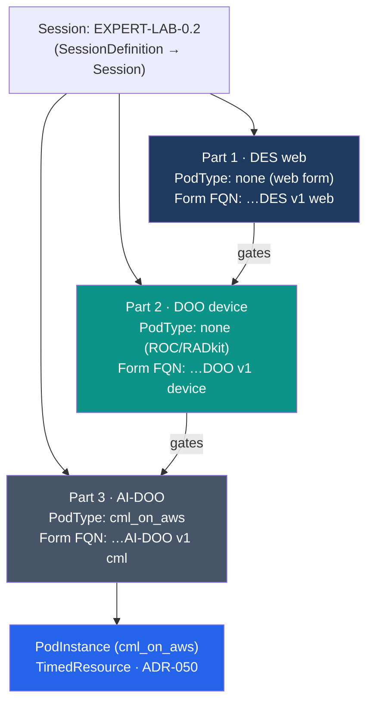

# Sample content — `LAB-0.2` (multi-part PAv1)

This is the **multi-part companion** to [`LAB-0.1`](../LAB-0.1/README.md). Where `LAB-0.1` is a
single-part lab (one `cml_on_aws` pod), `LAB-0.2` is a **three-part expert exam** that exercises
the parts of the model a single-part lab cannot:

- **Definition ↔ Instance duality** ([ADR-050](../../../adr/ADR-050-definition-instance-duality.md)) —
  one `SessionDefinition` + three `PartDefinition`s instantiate into one `Session` + three
  `SessionPart`s.
- **Multi-part session gating** ([ADR-045](../../../adr/ADR-045-multi-part-session-part-model.md)) —
  each `SessionPart` is its own `TimedResource` with an ordered, gated lifecycle.
- **Content-authoring taxonomy** ([ADR-052](../../../adr/ADR-052-content-authoring-taxonomy.md)) —
  each part selects a `Form` by its **FQN pattern**, not by a hard-coded id.
- **`PodType` vs `HostType` split** ([ADR-046](../../../adr/ADR-046-host-abstraction-and-pod-host-type-split.md)) —
  the three parts use three different provisioning shapes: **web (no pod)**, **device (ROC/RADkit,
  no pod)**, and **`cml_on_aws` (a real `PodInstance`)**.
- **Authorization** ([ADR-053](../../../adr/ADR-053-authorization-policy-model.md)) — the session
  is guarded by an `AuthorizationPolicy` with a JQ-driven claim requirement.

> Like `LAB-0.1`, this sample is a **documentation reference**, not a deployed seed. The same
> `PAv1/` folder is what gets published to Mosaic and synced into RustFS (see
> [Flow: Content Sync](../../flow-content-sync.md)).

## The three parts

| # | Part | `PodType` | Provisioning | Reaches | Form FQN pattern |
|---|---|---|---|---|---|
| 1 | **DES — web** | _none_ | web form only — **no `PodInstance`** | the candidate's browser | `… DES v1 web` |
| 2 | **DOO — device** | _none_ | **pre-existing** devices via **ROC / RADkit** — **no `PodInstance`** | managed lab devices | `… DOO v1 device` |
| 3 | **AI-DOO — cml** | `cml_on_aws` | provisions a **`PodInstance`** (`TimedResource`) | a CML-on-AWS topology | `… AI-DOO v1 cml` |

Only **Part 3** provisions a runtime pod. Parts 1 and 2 add **no new resource kind** — they are
`SessionPart` `TimedResource`s that bind a `Form` and run the same Collect → Evaluate → Report
automation against either the browser submission (web) or pre-existing devices (ROC/RADkit). This
is exactly the `Device` deferral noted in the [glossary](../../glossary.md) and
[ADR-050 §2.3](../../../adr/ADR-050-definition-instance-duality.md): device parts target existing
devices and provision nothing.



## Folder layout

```
LAB-0.2/
└── PAv1/
    ├── manifest.yaml                 # SessionDefinition: session type + 3 part requirements
    ├── lifecycle.yaml                # session phase order + per-part workflow bindings
    ├── authorization/
    │   └── policies.yaml             # AuthorizationPolicy + Requirements (claim / composite)
    └── parts/
        ├── 01-des-web/
        │   ├── part.yaml             # PartDefinition: requirement + Form FQN selector (web)
        │   └── grading/rubric.yaml
        ├── 02-doo-device/
        │   ├── part.yaml             # PartDefinition: device selector, no pod
        │   ├── scenarios/collect.yaml
        │   └── grading/rubric.yaml
        └── 03-ai-doo-cml/
            ├── part.yaml             # PartDefinition: cml_on_aws pod
            ├── topology/devices.json
            ├── topology/ports.json
            ├── scenarios/collect.yaml
            ├── grading/rubric.yaml
            └── reports/score_report.yaml
```

## How definitions become instances

| Definition (in `PAv1/`) | → Instance (runtime) | Tier | Source |
|---|---|---|---|
| `SessionDefinition` (manifest) | `Session` | Timed | seed |
| `PartDefinition` × 3 (`parts/*/part.yaml`) | `SessionPart` × 3 | Timed | seed |
| `Form` selected by each part's FQN pattern | _delivered by the `SessionPart` — no instance_ | — | content_package |
| Part 3 `PodDefinition` (`topology/`) | `PodInstance` (cml_on_aws) | Timed | seed |
| `JobDefinition` / `ReportDefinition` per part | `Job` / `Report` | Untimed | content_package |
| `AuthorizationPolicy` (`authorization/`) | _config — no instance_ | — | seed |

---

## File contents

### `manifest.yaml`

```yaml
# SessionDefinition — the session type and its ordered part requirements.
# CPA reads this when the content is synced; it instantiates one Session + three SessionParts.
apiVersion: pav1
kind: SessionDefinition
metadata:
  name: EXPERT-LAB-0.2
  title: "Sample Expert Multi-Part Exam"
  track: "999-001 EXPERT DEMO"
  exam: "999-001"
  language: ENU
  content_version: "1"
spec:
  authorization_policy: expert-candidates      # -> authorization/policies.yaml
  parts:                                        # ordered; each gates the next
    - requirement: des-web                      # -> parts/01-des-web/part.yaml
      order: 1
    - requirement: doo-device                   # -> parts/02-doo-device/part.yaml
      order: 2
    - requirement: ai-doo-cml                   # -> parts/03-ai-doo-cml/part.yaml
      order: 3
```

### `lifecycle.yaml`

```yaml
# Session-level phase order (CPA) + the per-part workflow each part runs (SE).
# The Session reconciles its parts in `order`; a part gates the next only when it reaches `graded`.
apiVersion: pav1
kind: Lifecycle
metadata:
  session: EXPERT-LAB-0.2
spec:
  session_phases: [pending, active, inactive]   # driven by the Session's own Timeslot
  part_workflow:                                 # applied to every SessionPart
    - name: provision
      # web/device parts skip pod provisioning; cml part runs native instantiate steps
      native_steps_by_pod_type:
        none:        [mark_ready]
        cml_on_aws:  [worker_lab_resolve, pod_locator, ports_alloc, lds_register, mark_ready]
    - name: collect
      jobs:
        - definition: collect_evidence@v1
          process_type: Grading
          scenario: collect             # absent for the web part (browser submission)
    - name: grade
      jobs:
        - definition: grade_item@v1
          process_type: Grading
          rubric: rubric                # -> parts/<part>/grading/rubric.yaml
    - name: report
      jobs:
        - definition: score_report@v1
          process_type: Grading
          report: score_report          # session-level aggregate (see Part 3)
    - name: teardown
      native_steps_by_pod_type:
        none:        [archive]
        cml_on_aws:  [archive, lab_wipe]
```

> **Canonical lifecycle shape.** `native_steps_by_pod_type` + `part_workflow` **is** the canonical
> multi-part form ([ADR-057 §2.6](../../../adr/ADR-057-content-driven-lifecycle-dsl.md)): a session
> applies the same `jobs[]` to every `SessionPart`, varying only the native steps by pod type. Each
> job references a `JobDefinition` (`definition: name@version`) whose step DAG lives under the part's
> `jobs/`. A single-part lab ([`LAB-0.1`](../LAB-0.1/README.md)) is the same shape with one
> `cml_on_aws` entry; the [`LAB-1.1.1` golden port](../LAB-1.1.1/README.md) shows the full step DAGs.

### `authorization/policies.yaml`

```yaml
# AuthorizationPolicy — guards the session. Keycloak/OIDC stays the AUTHN layer;
# this adds fine-grained AUTHZ filtering (ADR-053). Admin principals bypass all checks.
apiVersion: pav1
kind: AuthorizationPolicy
metadata:
  name: expert-candidates
spec:
  requirements:
    - type: All
      of:
        - type: Claim
          claim_type: "exam_registration"
          # JQ runtime expression evaluated against the entity under check:
          # the user's exam_registration claim must equal this session's exam id.
          claim_value: ".exam"
        - type: Claim
          claim_type: "expert_eligible"      # existence check (no value)
```

### `parts/01-des-web/part.yaml`

```yaml
# PartDefinition — a WEB part. Selects a Form by FQN PATTERN (not a hard id), delivers it in the
# browser, and provisions NO pod. The part IS the runtime that delivers the form.
apiVersion: pav1
kind: PartDefinition
metadata:
  name: des-web
spec:
  pod_type: none
  form_selector:
    fqn_pattern: "999-001 EXPERT DEMO * DES v1 web"   # six-token FQN, glob on module
  collect_source: submission        # graded from the candidate's browser submission
```

### `parts/01-des-web/grading/rubric.yaml`

```yaml
apiVersion: pav1
kind: EvaluationRuleset
metadata:
  name: rubric
spec:
  domain: "Design (DES)"
  max_points: 4
  items:
    - id: 1
      points: 2
      description: "Submitted design names a redundant default gateway"
      checks:
        - source: submission.answers.gateway
          regex: 'HSRP|VRRP|GLBP'
    - id: 2
      points: 2
      description: "Submitted design documents an OSPF area plan"
      checks:
        - source: submission.answers.routing
          regex: 'area\s+0'
          flags: [ignorecase]
```

### `parts/02-doo-device/part.yaml`

```yaml
# PartDefinition — a DEVICE part. Targets PRE-EXISTING devices via ROC/RADkit; provisions NO pod
# and adds NO new resource kind (the Device deferral, ADR-050 §2.3).
apiVersion: pav1
kind: PartDefinition
metadata:
  name: doo-device
spec:
  pod_type: none
  form_selector:
    fqn_pattern: "999-001 EXPERT DEMO * DOO v1 device"
  devices:
    transport: roc_radkit           # access/collection transport, NOT a PodType
    inventory: expert-rack-a         # a pre-existing managed device inventory
```

### `parts/02-doo-device/scenarios/collect.yaml`

```yaml
apiVersion: pav1
kind: ScenarioDefinition
metadata:
  name: collect
spec:
  devices: [edge01, core01]
  collect:
    - device: edge01
      command: "show ip route ospf"
      as: edge01.show_ip_route_ospf
    - device: core01
      command: "show running-config | section bgp"
      as: core01.show_bgp
```

### `parts/02-doo-device/grading/rubric.yaml`

```yaml
apiVersion: pav1
kind: EvaluationRuleset
metadata:
  name: rubric
spec:
  domain: "Deploy & Operate (DOO)"
  max_points: 4
  items:
    - id: 1
      points: 2
      description: "edge01 learns the core loopback via OSPF"
      checks:
        - source: edge01.show_ip_route_ospf
          regex: 'O\s+10\.255\.0\.1/32'
    - id: 2
      points: 2
      description: "core01 has an established iBGP session"
      checks:
        - source: core01.show_bgp
          regex: 'neighbor\s+10\.0\.0\.2\s+remote-as\s+65000'
          flags: [ignorecase]
```

### `parts/03-ai-doo-cml/part.yaml`

```yaml
# PartDefinition — a CML_ON_AWS part. This is the ONLY part that provisions a PodInstance.
apiVersion: pav1
kind: PartDefinition
metadata:
  name: ai-doo-cml
spec:
  pod_type: cml_on_aws
  host_type: cml_on_aws              # platform axis (ADR-046) — where the pod runs
  form_selector:
    fqn_pattern: "999-001 EXPERT DEMO * AI-DOO v1 cml"
```

### `parts/03-ai-doo-cml/topology/devices.json`

```json
{
  "default_instance_type": "m5zn.metal",
  "device_type": "cml",
  "ami_name": "cisco-cml2.9.1-20nodes-v0.2.2c",
  "disk_type": "io1",
  "disk_size": 256,
  "public_ip": 1,
  "lab_type": "lablet"
}
```

### `parts/03-ai-doo-cml/topology/ports.json`

```json
{
  "comment": "Per-device console/serial/vnc ports for the cml_on_aws pod.",
  "ports": [
    { "device": "rtr01", "serial": 5045 },
    { "device": "rtr02", "serial": 5046 },
    { "device": "host01", "serial": 5050, "vnc": 5051, "pat": { "5052": 22 } }
  ]
}
```

### `parts/03-ai-doo-cml/scenarios/collect.yaml`

```yaml
apiVersion: pav1
kind: ScenarioDefinition
metadata:
  name: collect
spec:
  devices: [rtr01, rtr02, host01]
  collect:
    - device: rtr01
      command: "show ip ospf neighbor"
      as: rtr01.show_ip_ospf_nei
    - device: host01
      command: "python3 /opt/verify_intent.py"
      as: host01.intent_check
```

### `parts/03-ai-doo-cml/grading/rubric.yaml`

```yaml
apiVersion: pav1
kind: EvaluationRuleset
metadata:
  name: rubric
spec:
  domain: "AI-Assisted Deploy & Operate (AI-DOO)"
  max_points: 4
  items:
    - id: 1
      points: 2
      description: "rtr01 has an OSPF neighbor in FULL state"
      checks:
        - source: rtr01.show_ip_ospf_nei
          regex: 'FULL'
          flags: [ignorecase]
    - id: 2
      points: 2
      description: "Intent-verification script reports success"
      checks:
        - source: host01.intent_check
          regex: 'INTENT:\s*PASS'
```

### `parts/03-ai-doo-cml/reports/score_report.yaml`

```yaml
# Session-level aggregate ScoreReport. SE emits one result per part, then totals across parts.
apiVersion: pav1
kind: ProcessReportSpec
metadata:
  name: score_report
spec:
  process_type: Grading
  report_class: ScoreReport
  aggregate: by_part                 # one block per SessionPart, plus a session total
  include:
    - per_part: [part, points_awarded, points_max, percentage]
    - per_item: [id, description, points_awarded, points_max, passed, issues]
    - totals: [points_awarded, points_max, percentage]
```

## Related

- [`LAB-0.1`](../LAB-0.1/README.md) — the single-part baseline this example extends.
- [Session Model](../../session-model.md) — `PartDefinition` selectors and the `PodType`/`HostType` split.
- [Definition & Catalogue Model](../../definition-catalog-model.md) — provisioning sources and the content taxonomy.
- [Resource Model](../../resource-model.md) — the `TimedResource` tree the parts and pod live in.
