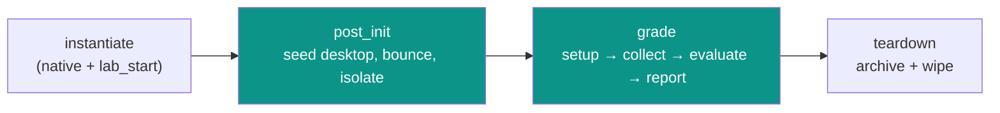

# Golden port — `LAB-1.1.1` (the fidelity proof)

This is the **1:1 port** of the real published lablet
`deployment/lds/content/LAB-1.1.1/` (legacy RCUv1 XML) into the
[Content-Driven Lifecycle DSL](../../../adr/ADR-057-content-driven-lifecycle-dsl.md). Where
[`LAB-0.1`](../LAB-0.1/README.md) is a _minimal_ reference and [`LAB-0.2`](../LAB-0.2/README.md)
exercises _multi-part_, **`LAB-1.1.1` is the fidelity bar**: every legacy task — `tScp`, `tVerify`
gating, control-node operations, candidate-solution exec, pauses, conditionals, and the connector
model — must round-trip into a primitive with **no loss**. If a construct cannot be expressed here,
the primitive set ([ADR-057 §2.2](../../../adr/ADR-057-content-driven-lifecycle-dsl.md)) is
incomplete.

> Like the other samples this is a **documentation reference**, not a deployed seed. It mirrors
> the artifacts under `deployment/lds/content/LAB-1.1.1/RCUv1/`.

## Legacy → primitive coverage

| Legacy task (RCUv1) | New `uses:` | Where |
|---|---|---|
| `tPause` | `pause@v1` | `jobs/post_init.yaml` |
| `tExecute` (chunk, out, set, error, if) | `exec@v1` | `post_init`, `grade` |
| `tExecuteBatch` (CDATA) | `exec@v1` (`script:`) | `grade` (candidate solution) |
| `tScp` (from, to, port) | `copy@v1` | `post_init` |
| `tVerify` (string, regexp, set) | `evaluate.regex@v1` + `when:` | `post_init` |
| `verify subject='commandOutput'` | `collect@v1` | `grade` (collect stage) |
| `verify subject='parse'` (regexp, mode, issue_replace) | `evaluate.regex@v1` | `grade` (evaluate stage) |
| `bounce_interface` | `cml.bounce_interface@v1` | `post_init`, `grade` |
| `cmlctl … --action wipe` | `cml.wipe@v1` | `grade` (setup) |
| `cmlctl … --action stop` | `cml.power@v1` | `post_init` |
| `dev::tExecute` targeting | `target: <connector>` | everywhere |
| `${config.core.paths.lab_root}` / `port=5052` / `trackNMC50` | `${ content.* }` / `${ runtime_env.* }` | all (see [ADR-058](../../../adr/ADR-058-lifecycle-data-flow-and-variable-scopes.md)) |

## Phase map (legacy → new)

| Legacy phase | New phase | JobDefinition | `process_type` |
|---|---|---|---|
| `init` (implicit) | `instantiate` | native + `cml.lab_resolve`/`cml.lab_start` | `Initialization` |
| `post_init` (`sb_post_init.xml`) | `post_init` | `jobs/post_init.yaml` | `Initialization` |
| `pre_collect` (`sb_pre_collect.xml`) | `grade` (setup stage) | `jobs/grade.yaml` (`stage: setup`) | `Grading` |
| `grade.xml` collect + grade | `grade` (collect/evaluate/report) | `jobs/grade.yaml` | `Grading` |



## Folder layout

```
LAB-1.1.1/
└── PAv1/
    ├── manifest.yaml
    ├── lifecycle.yaml
    ├── connectors.yaml          # from RCUv1/pod.xml
    ├── topology/
    │   ├── devices.json         # from RCUv1/devices.json
    │   └── ports.json           # from RCUv1/cml.yaml smart_annotations
    ├── jobs/
    │   ├── post_init.yaml       # from RCUv1/sb_post_init.xml
    │   └── grade.yaml           # from RCUv1/sb_pre_collect.xml + grade.xml
    ├── grading/
    │   └── rubric.yaml          # from RCUv1/grade.xml
    ├── reports/
    │   └── score_report.yaml
    └── files/
        └── desktop_package.tgz  # from RCUv1/desktop_package.tgz
```

---

## File contents

### `manifest.yaml`

```yaml
# Derived from RCUv1/mosaic_meta.json.
apiVersion: pav1
kind: LabletDefinition
metadata:
  name: LAB-1.1.1
  title: "350-901 AUTOCOR — Lablet 1.1.1"
  track: "350-901 AUTOCOR"        # TrackLongName
  track_short: AUTOCOR            # TrackShortName
  exam: "350-901"
  language: ENU
  content_version: "32"           # mosaic_meta Version
spec:
  pod_type: CML_ON_AWS
  summary: >
    Two routers + two switches + a workstation. Ports VLAN/ACL/OSPF/NTP grading and the full
    post_init desktop-seed + control-node isolation flow from the legacy RCUv1 content.
```

### `lifecycle.yaml`

```yaml
# Orchestration only (CPA owns phase ORDER; SE owns each job BODY in jobs/).
apiVersion: pav1
kind: Lifecycle
metadata:
  lablet: LAB-1.1.1
spec:
  phases:
    - name: instantiate
      native_steps_by_pod_type:
        cml_on_aws: [worker_lab_resolve, pod_locator, ports_alloc, lds_register]
      jobs:
        - definition: cml.lab_start@v1     # resolve+start handled as native cml.* steps
    - name: post_init
      jobs:
        - definition: post_init@v1         # -> jobs/post_init.yaml
          process_type: Initialization
    - name: grade
      jobs:
        - definition: grade@v1             # -> jobs/grade.yaml (setup→collect→evaluate→report)
          process_type: Grading
          rubric: rubric                   # -> grading/rubric.yaml
          report: score_report             # -> reports/score_report.yaml
    - name: teardown
      native_steps_by_pod_type:
        cml_on_aws: [archive]
      jobs:
        - definition: cml.wipe@v1
          process_type: Archive
```

### `connectors.yaml`

```yaml
# 1:1 from RCUv1/pod.xml unit-template/connector. Facts (ports/prompts/creds) come from
# runtime_env.* at submit time (ADR-058) — never literal here.
apiVersion: pav1
kind: ConnectorModel
metadata:
  name: LAB-1.1.1
spec:
  connectors:
    - name: rtr01
      class: cisco_common
      transport: telnet
      timeout: 3
      prompt: "${ runtime_env.devices.rtr01.prompt }"            # rtr01#
      enable_password: "${ runtime_env.devices.rtr01.enable_password }"  # cisco
      port: "${ runtime_env.devices.rtr01.serial_port }"
    - name: rtr02
      class: cisco_common
      transport: telnet
      timeout: 3
      prompt: "${ runtime_env.devices.rtr02.prompt }"            # rtr02#
      enable_password: "${ runtime_env.devices.rtr02.enable_password }"
      port: "${ runtime_env.devices.rtr02.serial_port }"
    - name: sw01
      class: cisco_common
      transport: telnet
      timeout: 3
      prompt: "${ runtime_env.devices.sw01.prompt }"             # sw01#
      enable_password: "${ runtime_env.devices.sw01.enable_password }"
      port: "${ runtime_env.devices.sw01.serial_port }"          # 5048
    - name: sw02
      class: cisco_common
      transport: telnet
      timeout: 3
      prompt: "${ runtime_env.devices.sw02.prompt }"             # sw02#
      enable_password: "${ runtime_env.devices.sw02.enable_password }"
      port: "${ runtime_env.devices.sw02.serial_port }"          # 5049
    - name: workstation_22
      class: unix
      transport: ssh                                             # UnixSSH via PAT
      timeout: 5
      via_port: "${ runtime_env.devices.workstation.pat_port }"  # 5052 -> 22
      username: "${ runtime_env.devices.workstation.username }"  # cisco
      password: "${ runtime_env.devices.workstation.password }"  # cisco
      prompt: "#goodmorningstartshine#"
    - name: workstation_serial
      class: unix
      transport: telnet                                          # serial console
      timeout: 5
      port: "${ runtime_env.devices.workstation.serial_port }"
      username: "${ runtime_env.devices.workstation.username }"
      password: "${ runtime_env.devices.workstation.password }"
      prompt: "#goodmorningstartshine#"
    - name: control_node
      class: control                                            # cmlctl-0; used only by cml.*
      transport: telnet
      timeout: 5
      port: "${ runtime_env.control_node.serial_port }"
```

### `topology/devices.json`

```json
{
  "default_instance_type": "m5zn.metal",
  "device_type": "cml",
  "ami_name": "cisco-cml2.9.1-20nodes-v0.2.2c",
  "disk_type": "io1",
  "disk_size": 256,
  "public_ip": 1,
  "lab_type": "lablet"
}
```

### `topology/ports.json`

```json
{
  "comment": "Per-device serial/vnc/pat ports (from RCUv1/cml.yaml smart_annotations).",
  "ports": [
    { "device": "rtr01", "serial": 5045 },
    { "device": "rtr02", "serial": 5046 },
    { "device": "sw01",  "serial": 5048 },
    { "device": "sw02",  "serial": 5049 },
    { "device": "workstation", "serial": 5050, "vnc": 5051, "pat": { "5052": 22 } },
    { "device": "control_node", "serial": 5047 }
  ]
}
```

### `jobs/post_init.yaml`

A direct port of `sb_post_init.xml`. The legacy `set='CMD1.OK'` / `if='CMD1.OK'` flags become
`capture:` + `when:` gates; `tVerify` becomes `evaluate.regex`; `tScp` becomes `copy`; the
control-node ops become `cml.*`.

```yaml
apiVersion: pav1
kind: JobDefinition
metadata:
  name: post_init
  version: v1
spec:
  process_type: Initialization
  steps:
    # tPause (id=1)
    - id: settle
      uses: pause@v1
      with: { seconds: 30 }

    # tExecute id=3 — mkdir tmp dir on the workstation (SSH via PAT)
    - id: mkdir_tmp
      uses: exec@v1
      target: workstation_22
      with: { command: "mkdir -p /home/cisco/Desktop/tmp/" }
      capture: { ok: cmd0_ok, error: cmd0_err }

    # tScp id=5 — push the desktop package over the PAT port
    - id: push_package
      uses: copy@v1
      target: workstation_22
      with:
        source: "${ content.files.desktop_package }"     # was ${config.core.paths.lab_root}/desktop_package.tgz
        dest: "/home/cisco/Desktop/tmp/desktop_package.tgz"
        via_port: "${ runtime_env.devices.workstation.pat_port }"   # was port=5052
      capture: { ok: scp_ok }

    # tExecute id=10 — list tmp dir, capture as vars.files
    - id: list_tmp
      uses: exec@v1
      target: workstation_22
      with: { command: "ls -la /home/cisco/Desktop/tmp/" }
      capture: { stdout: files, ok: cmd1_ok }

    # tVerify id=30 — gate: is the package present? (if=CMD1.OK)
    - id: verify_package
      uses: evaluate.regex@v1
      when: "${ vars.cmd1_ok }"
      with:
        source: "${ vars.files }"                         # was string="{files}"
        regex: "desktop_package\\.tgz"
        mode: positive
      capture: { passed: file_ok }

    # tExecute id=40 — unpack (if=file.OK)
    - id: unpack
      uses: exec@v1
      target: workstation_22
      when: "${ vars.file_ok }"
      with: { command: "tar -v -C /home/cisco/Desktop/tasks/ -xzf /home/cisco/Desktop/tmp/desktop_package.tgz" }
      timeout: 10
      capture: { stdout: tgz_out, ok: cmd2_ok }

    # tExecute id=45 — remove distractions
    - id: cleanup_tmp
      uses: exec@v1
      target: workstation_22
      with: { command: "rm -rf /home/cisco/Desktop/tmp/" }
      timeout: 10
      capture: { ok: cmd45_ok }

    # tExecute id=50/51 — bounce Vl99 on both switches (control node)
    - id: bounce_sw01
      uses: cml.bounce_interface@v1
      with:
        device: sw01
        interface: Vl99
        serial_port: "${ runtime_env.devices.sw01.serial_port }"   # was 5048
      timeout: 15
      capture: { ok: sw01_bounce }
    - id: bounce_sw02
      uses: cml.bounce_interface@v1
      with:
        device: sw02
        interface: Vl99
        serial_port: "${ runtime_env.devices.sw02.serial_port }"   # was 5049
      timeout: 15
      capture: { ok: sw02_bounce }

    # tExecute id=70 — shut down Internet access (cmlctl --action stop on ext-conn-0)
    - id: isolate_internet
      uses: cml.power@v1
      with:
        node: ext-conn-0
        action: stop                                       # cml_password resolved from runtime_env
      timeout: 15
      capture: { ok: cmd4_ok }
```

### `jobs/grade.yaml`

`sb_pre_collect.xml` becomes the **setup stage**; `grade.xml`'s `verify commandOutput` becomes the
**collect stage**; `verify parse` becomes the **evaluate stage**; the report is the terminal
`report.score`. The 9 subsections / 10 points live in `grading/rubric.yaml` (referenced by the
evaluate stage), keeping the job body compact.

```yaml
apiVersion: pav1
kind: JobDefinition
metadata:
  name: grade
  version: v1
spec:
  process_type: Grading
  steps:
    # ---- setup stage (was sb_pre_collect.xml) ----
    # id=10 — wipe candidate devices
    - id: wipe_devices
      uses: cml.wipe@v1
      stage: setup
      with: { devices: [rtr01, rtr02, sw01, sw02] }
      timeout: 120
      capture: { ok: wipe_ok }
    # id=20/21 — bounce Vl99 on both switches
    - id: bounce_sw01
      uses: cml.bounce_interface@v1
      stage: setup
      with: { device: sw01, interface: Vl99, serial_port: "${ runtime_env.devices.sw01.serial_port }" }
      timeout: 30
    - id: bounce_sw02
      uses: cml.bounce_interface@v1
      stage: setup
      with: { device: sw02, interface: Vl99, serial_port: "${ runtime_env.devices.sw02.serial_port }" }
      timeout: 30
    # id=30 — run the candidate's python deployment (serial console, venv activate/deactivate)
    - id: candidate_py_deploy
      uses: exec@v1
      stage: setup
      target: workstation_serial
      with:
        script: |
          cd /home/cisco/Desktop/tasks/
          source venv/bin/activate
          python ./scripts/py_deploy.py -i ./scripts/py_inventory.yaml
          deactivate
      timeout: 15
      on_error: { action: continue }                       # legacy only logged error=30.error.msg
    # id=31 — run the candidate's ansible playbook
    - id: candidate_ansible
      uses: exec@v1
      stage: setup
      target: workstation_serial
      with:
        script: |
          cd /home/cisco/Desktop/tasks/
          source venv/bin/activate
          ./ansible/run-playbook.sh
          deactivate
      timeout: 15
      on_error: { action: continue }

    # ---- collect stage (was grade.xml verify subject='commandOutput') ----
    - { id: c_sw01_vlan,  uses: collect@v1, stage: collect, target: sw01,  with: { command: "show vlan brief" },          capture: { output: sw01.show_vlan_brief } }
    - { id: c_sw02_vlan,  uses: collect@v1, stage: collect, target: sw02,  with: { command: "show vlan brief" },          capture: { output: sw02.show_vlan_brief } }
    - { id: c_rtr01_acl,  uses: collect@v1, stage: collect, target: rtr01, with: { command: "show access-list" },         capture: { output: rtr01.show_access_list } }
    - { id: c_rtr02_acl,  uses: collect@v1, stage: collect, target: rtr02, with: { command: "show access-list" },         capture: { output: rtr02.show_access_list } }
    - { id: c_rtr01_gi,   uses: collect@v1, stage: collect, target: rtr01, with: { command: "show interface gi0/1" },     capture: { output: rtr01.show_int_gi01 } }
    - { id: c_rtr02_gi,   uses: collect@v1, stage: collect, target: rtr02, with: { command: "show interface gi0/1" },     capture: { output: rtr02.show_int_gi01 } }
    - { id: c_rtr01_lo,   uses: collect@v1, stage: collect, target: rtr01, with: { command: "show interface Loopback0" }, capture: { output: rtr01.show_int_loop0 } }
    - { id: c_rtr02_lo,   uses: collect@v1, stage: collect, target: rtr02, with: { command: "show interface Loopback0" }, capture: { output: rtr02.show_int_loop0 } }
    - { id: c_rtr01_ospf, uses: collect@v1, stage: collect, target: rtr01, with: { command: "show ip ospf neighbor" },    capture: { output: rtr01.show_ip_ospf_nei } }
    - { id: c_rtr01_ntp,  uses: collect@v1, stage: collect, target: rtr01, with: { command: "show ntp associations" },    capture: { output: rtr01.show_ntp_assoc } }
    - { id: c_rtr02_ntp,  uses: collect@v1, stage: collect, target: rtr02, with: { command: "show ntp associations" },    capture: { output: rtr02.show_ntp_assoc } }

    # ---- evaluate + report stage ----
    # The evaluate stage applies grading/rubric.yaml (each rubric check -> evaluate.regex@v1)
    # against the captured vars.* above, then report.score assembles the ScoreReport.
    - id: evaluate
      uses: evaluate.regex@v1            # ruleset-driven: one evaluate.regex per rubric check
      stage: evaluate
      with: { ruleset: rubric }          # -> grading/rubric.yaml
      capture: { items: graded_items }
    - id: report
      uses: report.score@v1
      stage: report
      with:
        items: "${ vars.graded_items }"
        report_class: ScoreReport        # legacy reportClass='Reports::LabletReport'
      capture: { report_ref: report_ref }
```

> **Note on the evaluate stage.** Rather than spelling out 14 `evaluate.regex` steps inline, the
> single ruleset-driven `evaluate` step expands `grading/rubric.yaml` into one `evaluate.regex@v1`
> invocation per check (same primitive, same `source`/`regex`/`mode`/`issue` fields). This keeps
> the job body compact while remaining 1:1 with `grade.xml`'s `verify subject='parse'` rows.

### `grading/rubric.yaml`

Direct translation of `grade.xml` section 1 "Content" — 10 points, 9 subsections. Each `check`
maps to one legacy `verify subject='parse'` (`regexp` → `regex`, `mode` → `mode`, `issue_replace`
→ `on_fail`). `match='/^(.*)$/msig'` on the legacy `commandOutput` verify is captured by the
collect step, so only the `parse` checks live here.

```yaml
apiVersion: pav1
kind: EvaluationRuleset
metadata:
  name: rubric
spec:
  domain: "1.0 Network Automation"
  max_points: 10
  items:
    - id: 1
      points: 1
      description: "sw01 must have VLAN 80"
      checks:
        - { source: sw01.show_vlan_brief, regex: '^80\s+LAB80', mode: positive, flags: [multiline] }
    - id: 2
      points: 1
      description: "sw02 must have VLAN 80"
      checks:
        - { source: sw02.show_vlan_brief, regex: '^80\s+LAB80', mode: positive, flags: [multiline] }
    - id: 3
      points: 1
      description: "rtr01 must have an access-list MGMTOPS configured"
      checks:
        - { source: rtr01.show_access_list, regex: 'MGMTOPS', mode: positive, flags: [multiline], on_fail: "MGMTOPS ACL not found" }
    - id: 4
      points: 1
      description: "rtr02 must have an access-list MGMTOPS configured"
      checks:
        - { source: rtr02.show_access_list, regex: 'MGMTOPS', mode: positive, flags: [multiline], on_fail: "MGMTOPS ACL not found" }
    - id: 5
      points: 1
      description: "Interface descriptions present (rtr01<->rtr02)"
      checks:
        - { source: rtr01.show_int_gi01, regex: 'Description: to-rtr02', mode: positive, flags: [multiline], on_fail: "Description: to-rtr02 NOT found in rtr01.show_int_gi0.1" }
        - { source: rtr02.show_int_gi01, regex: 'Description: to-rtr01', mode: positive, flags: [multiline], on_fail: "Description: to-rtr01 NOT found in rtr02.sh_int_gi0.1" }
    - id: 6
      points: 1
      description: "rtr01 Loopback0 ip address"
      checks:
        - { source: rtr01.show_int_loop0, regex: 'Loopback0 is up, line protocol is up', mode: positive, flags: [multiline], on_fail: "Lo0 is not up/up" }
        - { source: rtr01.show_int_loop0, regex: 'Internet address is 10\.255\.81\.1/32', mode: positive, flags: [multiline], on_fail: "Internet address is 10.255.81.1/32 was not found." }
    - id: 7
      points: 1
      description: "rtr02 Loopback0 ip address"
      checks:
        - { source: rtr02.show_int_loop0, regex: 'Loopback0 is up, line protocol is up', mode: positive, flags: [multiline], on_fail: "Lo0 is not up/up" }
        - { source: rtr02.show_int_loop0, regex: 'Internet address is 10\.255\.81\.2/32', mode: positive, flags: [multiline], on_fail: "Internet address is 10.255.81.2/32 was not found." }
    - id: 8
      points: 2
      description: "rtr01 has one OSPF neighbor in FULL state"
      checks:
        - { source: rtr01.show_ip_ospf_nei, regex: 'FULL.*GigabitEthernet0/1', mode: positive, flags: [multiline, ignorecase], on_fail: "OSPF neighbor in state FULL not found" }
    - id: 9
      points: 1
      description: "rtr01 and rtr02 must have NTP server 192.168.10.254"
      checks:
        - { source: rtr01.show_ntp_assoc, regex: '192\.168\.10\.254', mode: positive, flags: [multiline] }
        - { source: rtr02.show_ntp_assoc, regex: '192\.168\.10\.254', mode: positive, flags: [multiline] }
```

### `reports/score_report.yaml`

```yaml
apiVersion: pav1
kind: ProcessReportSpec
metadata:
  name: score_report
spec:
  process_type: Grading
  report_class: ScoreReport            # legacy: Reports::LabletReport
  include:
    - per_item: [id, description, points_awarded, points_max, passed, issues]
    - totals: [points_awarded, points_max, percentage]
```

---

## Fidelity checklist

- ✅ `tPause` → `pause@v1` (`settle`)
- ✅ `tExecute` (capture + gate) → `exec@v1` with `capture`/`when`
- ✅ `tScp` (PAT port) → `copy@v1` with `via_port` from `runtime_env.*`
- ✅ `tVerify` gate → `evaluate.regex@v1` + downstream `when:`
- ✅ control-node `bounce_interface` / `cmlctl --action wipe` / `--action stop` →
  `cml.bounce_interface` / `cml.wipe` / `cml.power`
- ✅ candidate solutions (`py_deploy.py`, `run-playbook.sh`) → `exec@v1` (`script`) on
  `workstation_serial`
- ✅ `verify commandOutput` → `collect@v1`; `verify parse` → `evaluate.regex@v1`
- ✅ 10 points / 9 subsections preserved in `grading/rubric.yaml`
- ✅ connector model (Telnet / UnixSSH / serial / control node) → `connectors.yaml`
- ✅ **zero hard-coded ports or passwords** — all resolved from `runtime_env.*`
  ([ADR-058](../../../adr/ADR-058-lifecycle-data-flow-and-variable-scopes.md))
