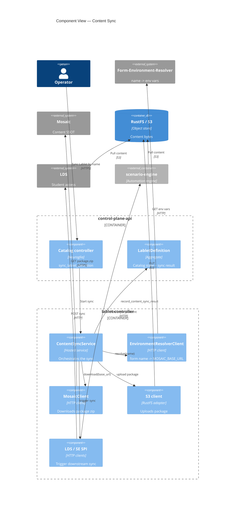
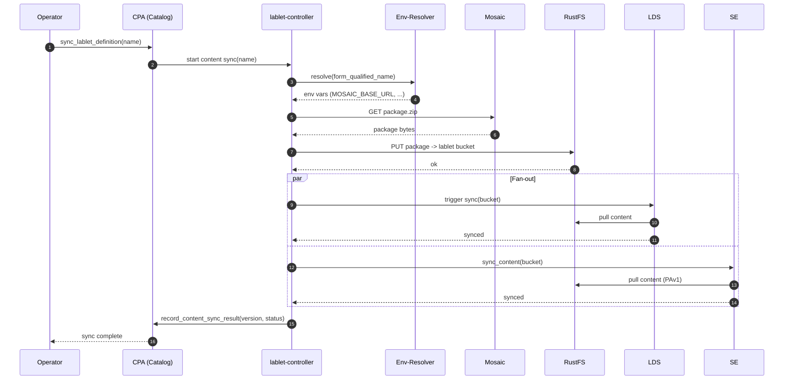

# Flow: Content Sync

> **Trigger:** an operator opens the CPA UI and clicks **Sync** on a Lablet (by name, e.g.
> `LAB-1.1.1`), or calls the equivalent API.

## Operator / Author summary

Syncing a Lablet **pulls the latest authored content from Mosaic and pushes it into the
platform** so it can be delivered. After a successful sync:

- CPA's **catalog entry** (`LabletDefinition`) is up to date.
- The content **bytes** live in internal blob storage (RustFS), which is what SE and LDS run
  from.
- **LDS** and **SE** have each refreshed their **own local view** of that content.

**What you need:** the content must be published in **Mosaic**, and its **form-qualified name**
must resolve via the environment-resolver. If sync fails at "resolve", it's a Mosaic/resolver
problem; if it fails at "fan-out", LDS or SE couldn't refresh.

**Sources of truth:** CPA trusts **Mosaic** (what content should exist); SE and LDS trust
**RustFS** (the bytes to run). Sync is the bridge.

---

## Architect detail

### Steps

1. **Resolve.** CPA (via lablet-controller) calls the **form-environment-resolver** with the
   form-qualified name → receives env vars including `MOSAIC_BASE_URL`.
2. **Download.** lablet-controller downloads the content **package (zip)** from the resolved
   Mosaic base URL.
3. **Store.** lablet-controller uploads the package to the **RustFS bucket** for that Lablet —
   the internal shared blob storage.
4. **Fan-out.** lablet-controller triggers **LDS** and **SE** to sync their own local views.
   Both treat RustFS as their source of truth.
5. **Record.** Result is recorded back on the `LabletDefinition` (synced version, timestamp,
   status) via `record_content_sync_result`.

### C4 — Component view (content sync)

### Sequence

### Commands / queries / events

| Step | Actor | Operation | Kind |
|---|---|---|---|
| Trigger | CPA | `sync_lablet_definition` | Command |
| Resolve | lablet-controller → resolver | resolve by form-qualified name | HTTP query |
| Download | lablet-controller → Mosaic | GET package zip | HTTP |
| Store | lablet-controller → RustFS | PUT package | S3 |
| Fan-out | lablet-controller → LDS | trigger content sync | HTTP |
| Fan-out | lablet-controller → SE | `sync_content` | Command (HTTP) |
| Record | CPA | `record_content_sync_result` | Command |

### Failure handling

| Fails at | Symptom | Likely cause |
|---|---|---|
| Resolve | "cannot resolve content" | Form name not registered / resolver down |
| Download | "package not available" | Not published in Mosaic / wrong base URL |
| Store | "blob upload failed" | RustFS credentials / connectivity |
| Fan-out (LDS/SE) | catalog synced but delivery stale | Downstream service down — sync is **idempotent**, re-run safely |

Sync is **idempotent** and **re-runnable**: re-syncing overwrites the bucket and re-triggers
fan-out. No migration/backfill window is needed.
