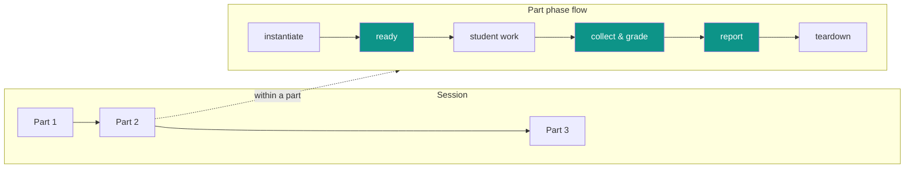
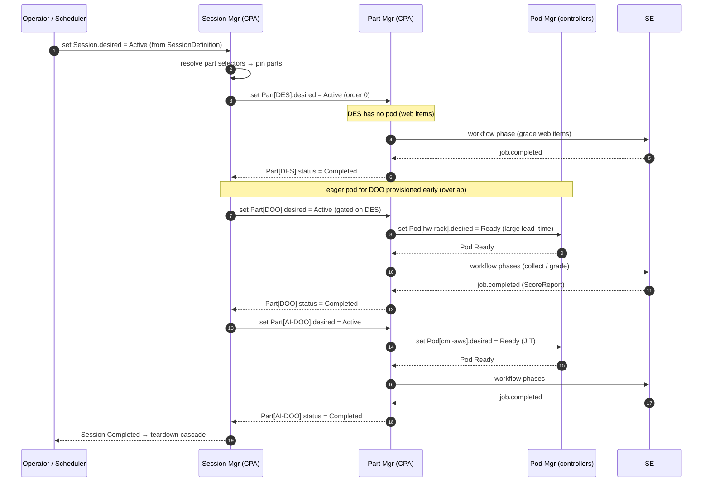
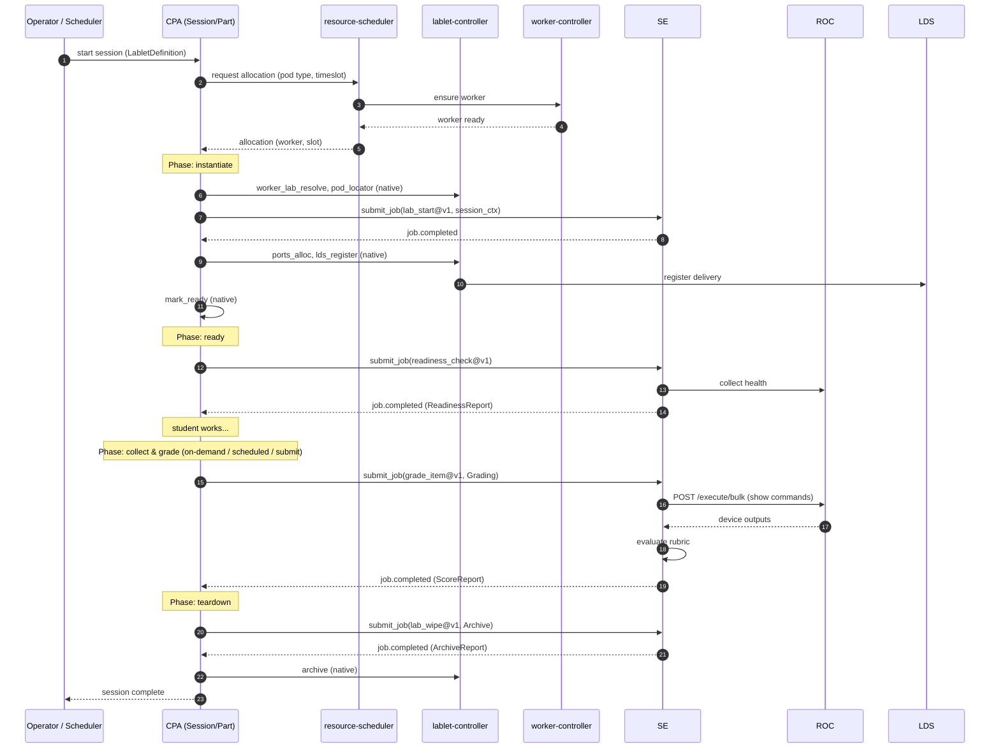

# Flow: Session Delivery

> **Trigger:** a session is started — either an **operator** picks a session and starts a
> delivery, or the scheduler **automatically** starts one from a booked timeslot.

## Operator / Author summary

A **Session** orchestrates one or more **Parts** in a gated sequence. Each part is itself a
timed resource that walks through the same phase flow; CPA drives the order (across parts and
within a part), and SE does the automation inside the phases that need it. A classic single-lab
delivery (`LabletSession`) is simply a session with **one** part.

- **Session level** — resolves its `SessionDefinition` into pinned parts, then activates parts
  in `order`, **gating** each on the previous. A later part's **eager** pod may provision early.
- **Part level** — each part runs the phase flow below. A part may have **0 pods** (e.g. a
  web-only DES design part) or one pod of any `PodType`.
- **instantiate / ready / collect & grade / report / teardown** — as before, but **per part**.

Phases shaded teal are **SE jobs**; the rest are **native LCM steps**.

Examples: a **Lablet** = 1 part / 1 `cml_on_aws` pod; a **CCIE exam** = DES (no pod) → DOO
(eager hardware pod) → AI-DOO (JIT `cml_on_aws` pod). See
[session-model.md](session-model.md) for profiles.

---

## Architect detail

### Session orchestration (across parts)

The Session manager resolves the `SessionDefinition`, pins each part's content via its selector
(at schedule time), then activates parts in `order` with **gating**. Parts are sequential, but a
later part's **eager** pod (large `Timeslot.lead_time`) may provision while an earlier part is
still active.

### Phase → step/job binding (within a part)

| Phase | Native LCM step(s) | SE JobDefinition (content) | Process type |
|---|---|---|---|
| schedule | `schedule` (resource-scheduler) | — | — |
| instantiate | `worker_lab_resolve`, `pod_locator`, `lab_start`*, `ports_alloc`, `lds_register` | `lab_resolve@v1`, `lab_start@v1` | — |
| ready | `mark_ready` | `readiness_check@v1` | `Initialization` → ReadinessReport |
| collect & grade | — | `collect_evidence@v1`, `grade_item@v1` | `Grading` → ScoreReport |
| report | — | `score_report@v1` | `Grading` → ScoreReport |
| teardown | `archive` | `lab_wipe@v1` | `Archive` → ArchiveReport |

\* `lab_start` is a content-driven SE job, but it is _sequenced_ by CPA inside the instantiate
phase — illustrating the split: **CPA owns ordering, SE owns the job body.**

### Entry points

| Entry | Who | How |
|---|---|---|
| Manual | Operator | Selects a `SessionDefinition` and starts a `Session`. |
| Scheduled | resource-scheduler | Booked timeslot reaches its start time → session auto-created. |

### Grading triggers

Grading is **not** tied to a single moment. The `collect & grade` phase can be entered by:

1. **Operator on-demand** — re-grade at any time.
2. **Scheduled** — at timeslot end.
3. **Student submit** — a `submission` event from the student.

Each trigger results in the same SE Collect→Evaluate→Report run; re-grading is idempotent and
produces a new `ScoreReport`.

### Sequence — single part (detail)

The per-part flow below is exactly the single-part `LabletSession` case; in a multi-part
session it runs once per part under the Part manager.

### Commands / queries / events

| Step | Actor | Operation | Kind |
|---|---|---|---|
| Start | CPA | `start_instantiation` | Command |
| Phase transition | CPA | `transition_lablet_session` | Command |
| Progress | CPA | `update_pipeline_progress` | Command |
| Ready | CPA | `mark_session_ready` | Command |
| Step retry/fail | CPA | `resume_pipeline_step`, `fail_pipeline_step` | Command |
| Terminate | CPA | `terminate` | Command |
| Job trigger | CPA → SE | `submit_job`, `cancel_job` | Command (HTTP) |
| Job status | CPA → SE | `get_job` | Query (HTTP) |
| Job result | SE → CPA | `job.completed` / `job.failed` | CloudEvent |
| Device collect | SE → ROC | `POST /devices`, `POST /execute/bulk`, `GET/DELETE /execute/bulk/{uuid}` | HTTP |

### Reconciliation note

The Session and Part managers (CPA) reconcile session/part state; Pod and Host managers
(controllers) reconcile infrastructure — all under the **generic reconciliation framework**
([ADR-047](../adr/ADR-047-generic-reconciliation-framework.md)). `desired_status` cascades
**down** (Session → Part → Pod), observed `status` bubbles **up**. CPA publishes desired state to
**etcd**; controllers watch and reconcile, reporting progress back. SE results arrive as
CloudEvents and advance the owning part's phase. This keeps CPA the **single writer** of
session/part state while controllers and SE act asynchronously. See
[resource-model.md](resource-model.md) and
[unified-resource-management.md](unified-resource-management.md).
