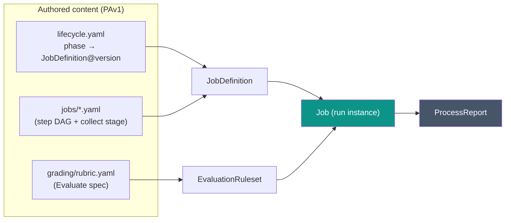
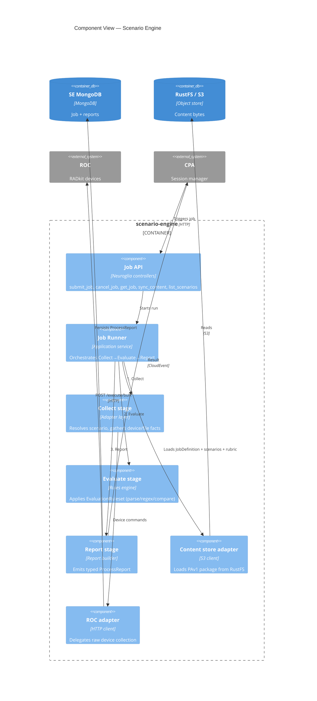
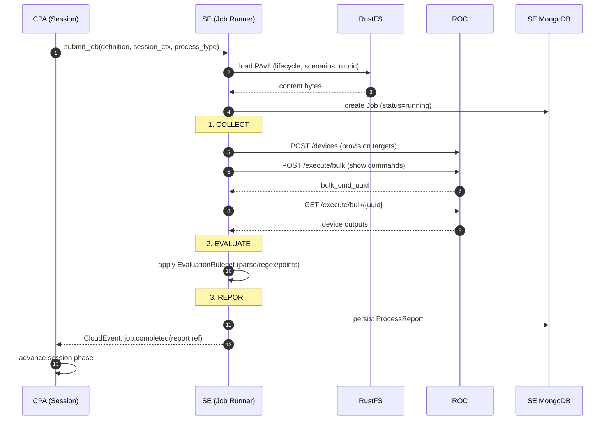

# Generic Pattern: Collect → Evaluate → Report

## Operator / Author summary

Every piece of automation SE runs — checking a lab is ready, grading a candidate, archiving a
session — is the **same three steps**:

1. **Collect** — gather facts from the live lab (run `show` commands on devices, read files).
2. **Evaluate** — compare those facts against the author's rules (regex, parse, thresholds).
3. **Report** — produce a typed result document.

As an **author**, you describe each step in your content: _what to collect_ (scenarios),
_how to grade it_ (grading rules), and _which report_ to emit. As an **operator**, this is why
"readiness check", "grade", and "archive" all feel the same — they are the same engine with
different inputs.

The **process type** picks which report you get:

| Process type | Collects | Evaluates | Report |
|---|---|---|---|
| `Initialization` | Boot/health facts | Lab-is-ready rules | **ReadinessReport** |
| `Grading` | Candidate config/output | Grading rubric | **ScoreReport** |
| `Change` | Before/after facts | Change rules | **ChangeReport** |
| `Submission` | Final state | Submission rules | **ALII / submission report** |
| `Archive` | Final artifacts | — | **ArchiveReport** |

Collect → Evaluate → Report is a **soft grouping** (the `stage` of each step), not a rigid
template. A real job usually also has a **setup** stage first — seed files, wipe devices, run the
candidate's solution — before it can collect. You express all of it with the **same closed set of
primitives**, described next.

---

## Architect detail

### The two layers — scenarioFunctions vs JobDefinitions

The DSL has exactly two layers (see
[ADR-057](../adr/ADR-057-content-driven-lifecycle-dsl.md)):

- **`scenarioFunction`** — a **code-defined, versioned, trusted primitive** in the SE registry (an
  `@scenario(name, version)` class). The set is **closed and orthogonal**. Authors and LLMs **never
  write these**; adding one is a code PR + version bump.
- **`JobDefinition`** — a **content-defined phase body**: an ordered DAG of **steps**, each of which
  `uses:` a `scenarioFunction@version`. Authors (and LLMs) write **only this declarative wiring**.

This keeps content sandboxed and machine-validatable. A `JobDefinition` lives in `PAv1/jobs/<name>.yaml`
and is bound to a phase from `lifecycle.yaml` (`definition: <name>@<version>`); the runtime instance
is a **Job**.

### The closed primitive set (scenarioFunctions)

| `uses:` | Stage | Purpose | Legacy origin |
|---|---|---|---|
| `pause@v1` | setup | Wait/settle | `tPause` |
| `exec@v1` | setup | Run command/script on a connector, capture output, gate | `tExecute`, `tExecuteBatch` |
| `copy@v1` | setup | Push a content file to the POD host | `tScp` |
| `cml.bounce_interface@v1` | setup | Bounce an interface via the control node | `bounce_interface` |
| `cml.wipe@v1` | setup | Wipe devices via the control node | `cmlctl --action wipe` |
| `cml.power@v1` | setup | Start/stop a node or ext-conn | `cmlctl --action stop` |
| `cml.lab_resolve@v1` / `cml.lab_start@v1` / `cml.lab_stop@v1` | setup | Lab lifecycle | (native) |
| `collect@v1` | collect | Run a `show` command on a device, capture output | `verify subject='commandOutput'` |
| `evaluate.regex@v1` | evaluate | Regex check a captured var → pass/fail + issue | `verify subject='parse'`, `tVerify` |
| `report.score@v1` / `report.readiness@v1` / … | report | Assemble the typed report | `reportClass='LabletReport'` |

`evaluate.regex` is the **single check primitive**: in a _grading_ stage it feeds `report.score`; in
a _setup_ stage its captured `passed` flag feeds a later step's `when:` gate (the legacy
`tVerify … set='X.OK'` → `if='X.OK'` pattern). `cml.*` operations are first-class primitives — the
author names the operation, SE owns the mechanics and the `cml_password`.

### The step shape

Every step has one consistent shape:

```yaml
- id: <unique-in-job>            # stable id; also the capture namespace
  uses: <scenarioFunction>@<ver> # must exist in the SE registry
  target: <connector-name>       # optional — omitted for pause/report/cml.*
  with: { <input>: <value|expr> }# inputs; values may be ${ jq } over the scopes
  capture: { <var>: <output> }   # write named outputs into vars.*
  when: "${ <jq-bool-expr> }"    # optional gating
  on_error: { action: fail|continue|retry, retries?, backoff? }
  timeout: <seconds>
  stage: setup|collect|evaluate|report   # soft grouping (default: setup)
```

`target:` selects a **connector** from `PAv1/connectors.yaml` (the port model from the legacy
`pod.xml`). Steps run in document order, honouring `when` and `on_error`; a step may read any
`vars.*` an earlier step captured.

### Data-flow scopes

Every value a step reads or writes lives in one of **four namespaced scopes** (see
[ADR-058](../adr/ADR-058-lifecycle-data-flow-and-variable-scopes.md)). References use **jq in `${ }`**.

| Scope | Writable? | Holds | Replaces legacy |
|---|---|---|---|
| `session.*` | read-only | candidate / exam / timeslot metadata (`mosaic_meta.json` + Session) | — |
| `content.*` | read-only | lab-root path, packaged files, form FQN | `${config.core.paths.lab_root}` |
| `runtime_env.*` | read-only | POD facts: device ports, prompts, creds, `cml_password`, worker IP | hard-coded `5052`, `trackNMC50`, `rtr01#` |
| `vars.*` | **read/write** | task-captured intermediates (`step.capture`) | `{files}`, `$(rtr01.show_int_loop0)` |

Only `vars.*` is writable; the other three are resolved at job submit and frozen. **Secrets and
ports are never literal in content** — they resolve from `runtime_env.*`.

```yaml
# Example: the legacy tScp PAT push, fully scoped
- id: push_package
  uses: copy@v1
  target: workstation_22
  with:
    source: "${ content.files.desktop_package }"   # was ${config.core.paths.lab_root}/…
    dest: "/home/cisco/Desktop/tmp/desktop_package.tgz"
    via_port: "${ runtime_env.devices.workstation.pat_port }"  # was port=5052
  capture: { ok: scp_ok }
```

### Canonical PAv1 layout (one shape)

There is **one** content layout. A single-part lablet uses the top level; a multi-part session
repeats the per-part subtree under `parts/`.

```
PAv1/
├── manifest.yaml          # definition metadata + pod_type  OR  SessionDefinition + parts[]
├── lifecycle.yaml         # phases -> { native_steps_by_pod_type, jobs[] }   (CPA + SE seam)
├── connectors.yaml        # connector/port model (from legacy pod.xml)
├── topology/
│   ├── devices.json       # instance config
│   └── ports.json         # per-device serial/vnc/pat ports
├── jobs/                  # JobDefinitions — the step DAGs (SE)
│   ├── post_init.yaml
│   └── grade.yaml
├── grading/rubric.yaml    # EvaluationRuleset (graded items + checks + points)
├── reports/score_report.yaml   # ProcessReportSpec (report shape)
└── files/                 # packaged payloads pushed by copy@v1 (desktop_package.tgz)
```

The **single lifecycle shape** is `phases[].{native_steps_by_pod_type, jobs[]}`:

- A **single-part** lab uses the `cml_on_aws` (or `none`) entry of `native_steps_by_pod_type` —
  this subsumes the older `native_steps: []` form.
- A **multi-part** session applies the same `jobs[]` per part under `part_workflow` — this subsumes
  the older `part_workflow` / `native_steps_by_pod_type` forms.
- `jobs[]` **always reference a `JobDefinition` file** (`definition: <name>@<version>` →
  `jobs/<name>.yaml`); the step DAG never lives inline in `lifecycle.yaml`. Orchestration is in
  `lifecycle.yaml`; bodies are in `jobs/`.

See the [`LAB-1.1.1` golden port](examples/LAB-1.1.1/README.md) for a full 1:1 port of legacy content
into this layout, and [`LAB-0.1`](examples/LAB-0.1/README.md) / [`LAB-0.2`](examples/LAB-0.2/README.md)
for the minimal and multi-part references.

### Worked example — `post_init` (from `LAB-0.1`)

The minimal [`LAB-0.1` package](examples/LAB-0.1/README.md) ports the legacy `sb_post_init.xml`
scriptblock into [`jobs/post_init.yaml`](examples/LAB-0.1/README.md#jobspost_inityaml). It shows the
setup primitives end-to-end: `pause` → `exec` (mkdir) → `copy` (seed the desktop over the PAT port)
→ `exec` (list) → an `evaluate.regex` **gate** → a gated `exec` (unpack) → `cml.bounce_interface`
→ `cml.power` (isolate the Internet). The gate is the key mechanic — legacy `set='file.OK'` /
`if='file.OK'` becomes `capture:` feeding a downstream `when:`:

```yaml
- id: list_tmp                     # capture the `ls` output into vars.files
  uses: exec@v1
  target: workstation_22
  with: { command: "ls -la /home/cisco/Desktop/tmp/" }
  capture: { stdout: files, ok: cmd1_ok }

- id: verify_package               # gate: is the package present?
  uses: evaluate.regex@v1
  when: "${ vars.cmd1_ok }"
  with: { source: "${ vars.files }", regex: "desktop_package\\.tgz", mode: positive }
  capture: { passed: file_ok }

- id: unpack                       # only runs when the gate passed
  uses: exec@v1
  target: workstation_22
  when: "${ vars.file_ok }"
  with: { command: "tar -C /home/cisco/Desktop/tasks/ -xzf …/desktop_package.tgz" }
```

The companion [`jobs/grade.yaml`](examples/LAB-0.1/README.md#jobsgradeyaml) ports `sb_pre_collect.xml`
(setup stage) plus `grade.xml` (collect → evaluate → report) into one job — the canonical
Collect→Evaluate→Report flow.

### Reuse & iteration — today vs. the deferred hybrid

The v1 model is **flat**: a job lists its steps, and reuse is **copy-paste**. In a two-device lab
this is fine; at scale it shows. The [`LAB-1.1.1` golden port](examples/LAB-1.1.1/README.md) already
hand-writes near-identical step pairs that differ only by device — `c_rtr01_lo` / `c_rtr02_lo`,
`c_sw01_vlan` / `c_sw02_vlan` — and repeats the same Loopback0 check per device in the rubric. The
evaluate stage _already_ dodges this by **expanding `grading/rubric.yaml`** into N `evaluate.regex`
steps from one ruleset-driven step — i.e. constrained iteration over content in all but name.

[ADR-057 §2.8](../adr/ADR-057-content-driven-lifecycle-dsl.md) records a **deferred, opt-in** hybrid
that generalises this without re-opening the sandbox:

- **`CompositeScenario`** — a content-defined, parameterised group of _closed primitives_ (typed
  `parameters` in, `export` out), invoked from any step via `uses: composite:<name>@<ver>`. It is
  **indistinguishable from a primitive at the call site** and runs in an **isolated `vars.*` frame**
  ([ADR-058 §2.5](../adr/ADR-058-lifecycle-data-flow-and-variable-scopes.md)) — never code, never a
  new primitive.
- **`for_each`** — a step modifier that runs a step once per list element (e.g. one `collect` over a
  device list), collapsing the `c_rtrNN_*` duplication.

These are **specified, not yet built**: v1 ships the flat model (Model B), and the hybrid (Model C)
is promoted only when duplication in real authored content crosses a pain threshold. Every v1 job
stays valid under the hybrid, so the deferral is reversible upward.

### Where a job comes from

A session **phase** binds to a `JobDefinition(name@version)` in the content's `lifecycle.yaml`.
When CPA enters that phase, it calls SE `submit_job` with the **session context** (session id,
pod/bucket handle, pod type). SE resolves the `JobDefinition`, builds the pipeline, runs
Collect→Evaluate→Report, persists a `ProcessReport`, and emits a CloudEvent that CPA consumes
to advance the phase.



### C4 — Component view of the Scenario Engine



### Sequence — one job run



### Native LCM step vs SE job — the boundary

A phase may run a **native step**, an **SE job**, or both in sequence. The rule of thumb:

- **Native (CPA/controllers):** anything about _infrastructure and session bookkeeping_ —
  `worker_lab_resolve`, `pod_locator`, `ports_alloc`, `lds_register`, `mark_ready`, `archive`,
  `schedule`. These rarely change and are not author-editable.
- **SE job (content-driven):** anything about _the lab's behaviour and assessment_ —
  `lab_start`/`stop`/`wipe`, `collect_evidence`, `grade_item`, `score_report`, and report
  generation. These are defined by content and change per lab.

### Commands & queries used

| Direction | Operation | Kind |
|---|---|---|
| CPA → SE | `submit_job`, `cancel_job`, `sync_content` | Command |
| CPA → SE | `get_job`, `list_scenarios` | Query |
| SE → ROC | `POST /devices`, `POST /execute/bulk`, `GET/DELETE /execute/bulk/{uuid}` | HTTP |
| SE → CPA | `job.completed` / `job.failed` | CloudEvent |
