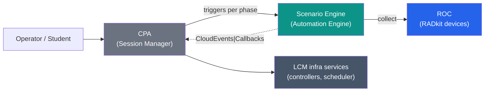

# Solution Design — Reference

> **Status:** North-star target (ratification pending). This doc set is the **single source of
> truth** for the _target_ shape of the platform — how it is split across services, what each owns,
> and how the two critical flows (content sync, session delivery) work. The generalized
> resource-plane model it describes is carried by ADRs **044–054**, which are still **`Proposed`**;
> treat this set as the **authoritative north-star** the codebase is converging on, not a literal
> as-built snapshot. Where target and as-built names differ (e.g. `pod-controller` vs the current
> `lablet-controller`), the pages flag it inline. It supersedes
> [`docs/implementation/cpa-se-integration-plan.md`](../../implementation/cpa-se-integration-plan.md) (now archived).

## Who this is for

| Audience | Read this for |
|---|---|
| **System operators** | What "sync a Lablet" and "deliver a session" actually do, and which service to look at when something breaks. |
| **Exam content owners / authors** | What you ship (the `PAv1/` content package), and how it drives the runtime. |
| **Architects / engineers** | Service boundaries, ownership, commands/queries, events, and data flows. |

Each page has an **Operator/Author summary** up top and an **Architect detail** section below.

## The one-paragraph model

The platform is a **timed-resource management plane**: every operable thing — a `Session`, its
`SessionPart`s, their `PodInstance`s, and the `Host`/`Worker`s they run on — is a `TimedResource`
with a declared _desired_ state and an observed _actual_ state, reconciled continuously. The
**Control-Plane API (CPA)** is the single entry point and the **session manager / control
plane**: it owns the catalog (`SessionDefinition`/`PartDefinition`/`PodDefinition`), reconciles
`Session` + `SessionPart` (ordering and gating), runs the **native infrastructure steps**, and
hosts the **unified resource dashboard**. The **Scenario Engine (SE)** is the **automation
engine**: it owns `Job` / `JobDefinition` / `ScenarioDefinition` / grading rules / reports and
executes the universal **Collect → Evaluate → Report** pattern. The two planes meet at one seam
— a lifecycle phase whose engine is `workflow` triggers an **SE Job**; SE reports back via
**CloudEvents**, callbacks or queries. A classic single-lab `LabletSession` is just a `Session`
with one part and one `cml_on_aws` pod.

## Pages

| Page | What it covers |
|---|---|
| [Architecture at a Glance](architecture-at-a-glance.md) | One-page decision map: the four planes and the ADRs that ratify each. |
| [Solution Overview](solution-overview.md) | Services, responsibilities, C4 context + container diagrams, ownership map. |
| [Resource Model](resource-model.md) | The `TimedResource` tree, value objects, and the generic reconciliation framework. |
| [Definition & Catalogue Model](definition-catalog-model.md) | `ResourceDefinition` provisioning sources, the content-authoring taxonomy, catalogue/config plane, and authorization. |
| [Session Model](session-model.md) | `SessionDefinition`/`PartDefinition` selectors, `PodDefinition`, and session profiles. |
| [Unified Resource Management](unified-resource-management.md) | Resource lifecycle (LCM) vs job automation (SE); type-driven orchestration vs content-driven behaviour. |
| [Generic Pattern: Collect → Evaluate → Report](generic-pattern.md) | The universal automation pattern SE runs for every process type. |
| [Flow: Content Sync](flow-content-sync.md) | Operator syncs a Lablet by name (Mosaic → RustFS → LDS + SE). |
| [Flow: Session Delivery](flow-session-delivery.md) | Multi-part session lifecycle from schedule to teardown. |
| [UI: Resource Dashboard](ui-resource-dashboard.md) | The K8s-style operator console + shared `lcm-core` components. |
| [Glossary](glossary.md) | Canonical vocabulary — read this first if any term is unclear. |
| [Sample content: `LAB-0.1`](examples/LAB-0.1/README.md) | A minimal, faithful `PAv1/` package authors can copy. |
| [Sample content: `LAB-0.2`](examples/LAB-0.2/README.md) | A three-part expert exam (web / device / cml_on_aws) exercising the multi-part model. |

## Non-goals of this doc set

- It is **not** an implementation tracker (gaps, sprints, ADR bookkeeping). That history lives,
  archived, under `docs/implementation/archive/`.
- It does **not** restate the Neuroglia/CQRS framework mechanics — see the
  [Patterns](../cqrs-pattern.md) section.
