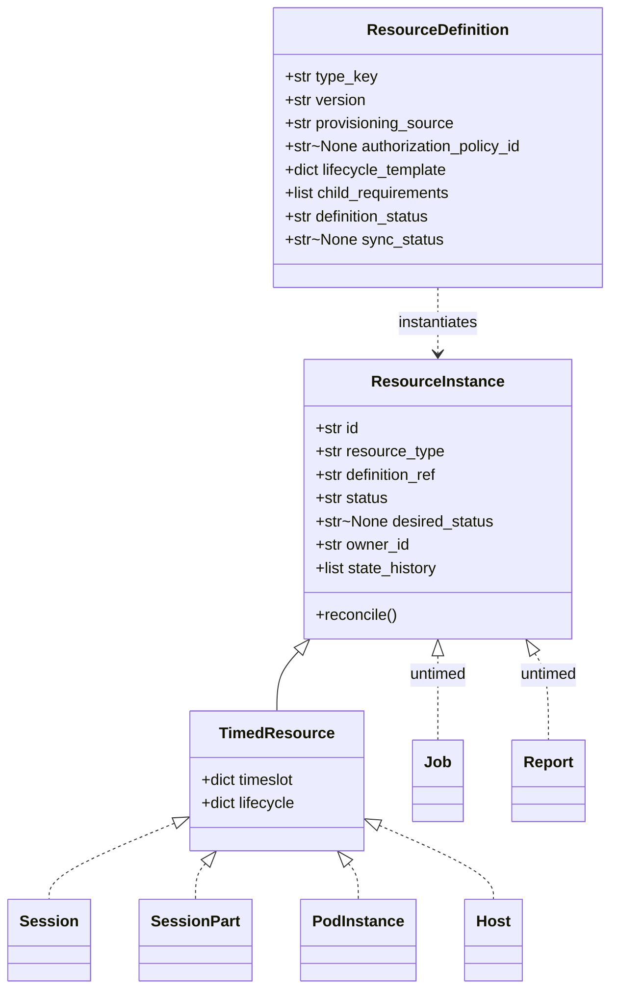
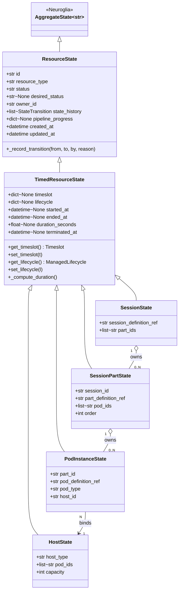
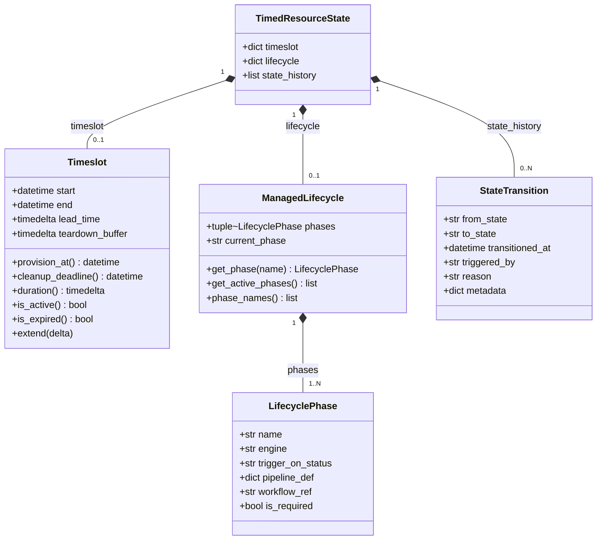
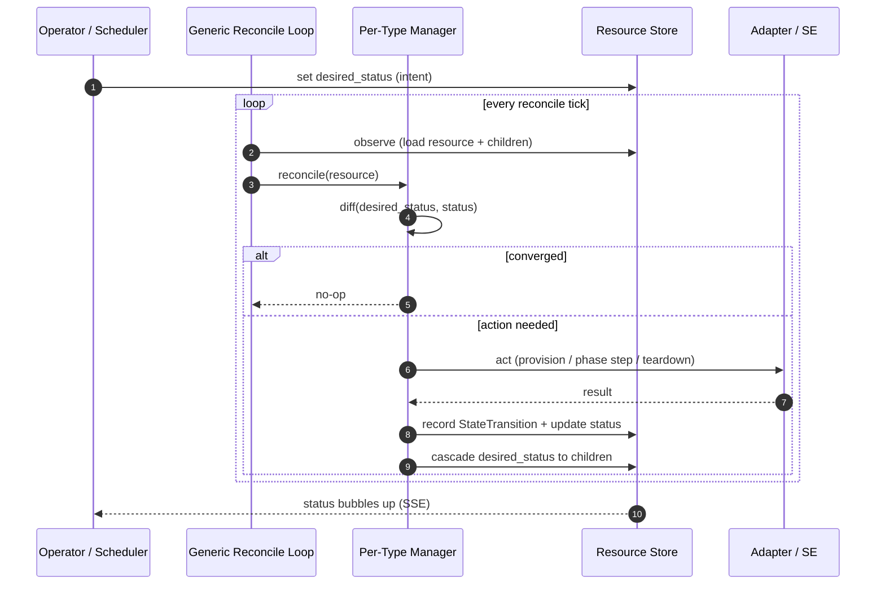
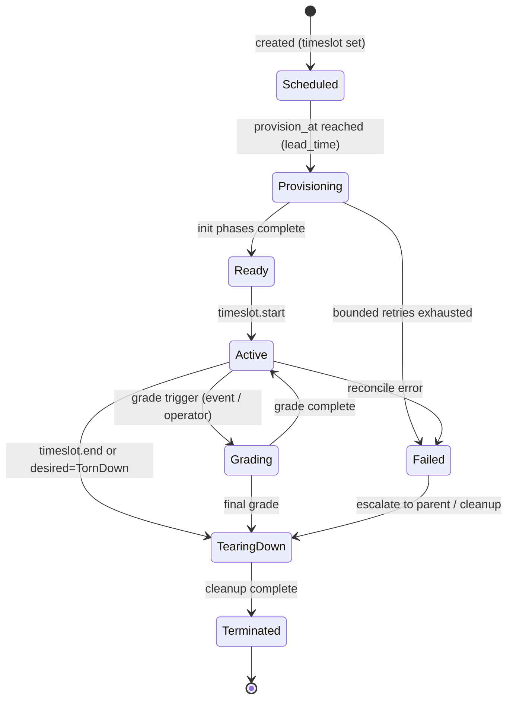

# Resource Model

> The platform is a **timed-resource management plane**. Every operable thing — a session, a
> part of a session, a pod, a host — is a `TimedResource` with a declared _desired_ state and an
> observed _actual_ state, reconciled continuously (Kubernetes-style). This page defines the
> abstraction, the runtime tree, and the reconciliation framework. See the
> [glossary](glossary.md) for terms and [ADR-036](../adr/ADR-036-resource-management-abstraction-layer.md)
> for the layered state design.

## Why one pattern

Sessions, pods, and hosts used to be modelled as unrelated aggregates with bespoke state
machines. They actually share the same shape: a **scheduled window**, a **lifecycle of phases**,
a **desired vs actual** status, and an **audit trail of transitions**. Collapsing them onto one
abstraction means a single reconciliation engine, a single dashboard, and uniform behaviour for
provisioning, gating, failure handling, and teardown at every level.

## Definition vs instance

Every runtime resource is **created from a definition**. The platform is therefore two parallel
families — a **catalogue** of definitions and a **runtime** of instances — and the same duality
that already exists in the legacy .NET domains (`SessionType → Session`, `PodDefinition → Pod`,
`Track → … → Form`) is generalised onto one base each. See
[ADR-050](../adr/ADR-050-definition-instance-duality.md).

- A **`ResourceDefinition`** is _type metadata_: the stable spec of a kind of thing — its
  identity (`type_key`), `version`, the **lifecycle template** its instances run, the
  **selectors / requirements** for its children, and an optional **authorization policy**.
  Definitions are the catalogue; they do **not** reconcile against infrastructure.
- A **`ResourceInstance`** is a _running thing_: it carries `status` + `desired_status`, a
  `state_history`, an instantiated `lifecycle`, an `owner_id`, and children. Its behaviour is to
  **reconcile** its actual state toward its desired state.



### Two provisioning sources

A definition's `provisioning_source` declares where it comes from, and that **determines whether
it has a lifecycle of its own** (ADR-051):

- **`seed`** — static catalogue/config loaded by a seeder from YAML assets (session types, pod
  definitions, locations, delivery environments, authorization policies). **No lifecycle**, no
  `sync_status`; immutable until re-seeded.
- **`content_package`** — authored content synced from a PAv1 package (the content-authoring
  taxonomy + per-part jobs/reports). Carries a `definition_status` and a reconciled `sync_status`.

This is the only asymmetry in the model: **seed** definitions are inert reference data; only
**content_package** definitions reconcile (they are _synced_, not provisioned). The full table,
state diagram and ownership live in **[definition-catalog-model.md](definition-catalog-model.md#two-provisioning-sources)** (canonical).

### Timed vs untimed instances

Not every instance owns a window. The instance base splits in two tiers (ADR-050):

| Tier | Class | Adds | Examples |
|---|---|---|---|
| **L1** | `ResourceInstance` | lifecycle + `desired_status` reconciliation, **no `Timeslot` of its own** (inherits its parent's window). | `Job`, `Report` (SE automation outputs). |
| **L2** | `TimedResource` | a `Timeslot` (scheduled window, `lead_time`, teardown buffer). | `Session`, `SessionPart`, `PodInstance`, `Host` / `Worker`. |

### Catalogue → runtime map

| Definition | → Instance | Tier | Source |
|---|---|---|---|
| `SessionDefinition` (session type) | `Session` | Timed | seed |
| `PartDefinition` (requirement + form selector) | `SessionPart` | Timed | seed |
| `PodDefinition` | `PodInstance` | Timed | seed / content_package |
| `HostDefinition` (hosting-site / rack) | `Host` / `Worker` | Timed | seed |
| `Form` (the **synced** leaf of `Track → Exam → Module → Formset → Form → FormItem`) | _delivered by `SessionPart` — **no timed instance**; the Form itself is a synced definition-plane resource_ | — | content_package |
| `JobDefinition` | `Job` | Untimed | content_package |
| `ReportDefinition` | `Report` | Untimed | content_package |
| `DeliveryEnvironment` / `LabLocation` / `HostingSiteLocation` / `AuthorizationPolicy` | _config — no instance_ | — | seed |
| `Device` / `DeviceDefinition` | _deferred — out of scope this round_ | — | — |

> **`Form` is the one synced unit, not an inert leaf ([ADR-059](../adr/ADR-059-form-as-first-class-synced-resource.md)).** Across the
> `content_package` taxonomy, only the **`Form`** reconciles — it owns a `sync_status`, the synced
> content bytes (RustFS), and an **optional `PodDefinition` ref**. It generalises the legacy
> `LabletDefinition`. It lives on the **catalogue / sync plane**, not the timed runtime tree: the
> `SessionPart` is still the timed delivery, so there is **no separate timed Form instance**. The
> `form-controller` owns its sync loop (see [ADR-054](../adr/ADR-054-controller-topology-resource-kind.md)).

## The layered state abstraction

Three layers, defined once in `lcm_core` and reused everywhere (ADR-036):

| Layer | Class | Adds |
|---|---|---|
| 1 | `ResourceState` | spec/status (`status`, `desired_status`), `owner_id`, `state_history`, `pipeline_progress`, timestamps, `_record_transition()`. |
| 2 | `TimedResourceState` | `timeslot`, `lifecycle`, `started_at/ended_at/duration`, `terminated_at` + VO accessors. |
| 3 | Concrete | `SessionState`, `SessionPartState`, `PodInstanceState`, `HostState` (and profiles `LabletSessionState`, `CMLWorkerState`, `LabRecordState`). |

> **State vs aggregate.** These are the **state** classes (Neuroglia `AggregateState`). Their
> matching **aggregates** are `ResourceInstance` (holds `ResourceState`) and `TimedResource`
> (holds `TimedResourceState`). **Untimed** instances (`Job`, `Report`) stop at layer 1 — they
> hold a `ResourceState` only, with no `Timeslot`.



!!! note "Profiles, not new types"
    `LabletSession` is simply a `Session` with one part and one `cml_on_aws` pod; `LabRecord`
    is the `cml_on_aws` `PodInstance`; `CmlWorker` is the `cml_on_aws` `Host`. They are
    specialisations, not parallel hierarchies. See [session-model.md](session-model.md).

## Value objects

`timeslot` and `lifecycle` are stored as dicts on the state (Neuroglia serialization) and
accessed as value objects from `lcm_core`.



- **`Timeslot`** — the scheduled window. `lead_time` is the knob that distinguishes
  **JIT** provisioning (short lead, e.g. a CML pod) from **eager** provisioning (long lead /
  pre-booked, e.g. CCIE hardware appliances). `provision_at = start - lead_time`.
- **`ManagedLifecycle`** — the ordered phases for this resource type. Each `LifecyclePhase`
  binds to an **engine**: `pipeline` (native LCM steps) or `workflow` (an SE job). This is the
  one seam where a resource's lifecycle hands work to **content-driven automation**.
- **`StateTransition`** — every status change is appended to `state_history` for audit and for
  the dashboard's timeline tab.

## The runtime tree

```text
Session ─┬─ SessionPart ─┬─ PodInstance ─→ (binds) ─→ Host / Worker
         │               └─ PodInstance
         └─ SessionPart ─── PodInstance
```

| Resource | Reconciled by | Notes |
|---|---|---|
| `Session` | **session-controller** | Runs an **orchestration** lifecycle (`admit → run_parts → aggregate → finalize`) driven by a `part_execution` policy; thin `pending → active → inactive` is the **degenerate single-part/no-gate case**. |
| `SessionPart` | **session-controller** | First-class resource; own timeslot + lifecycle; 0..N pods. |
| `PodInstance` | **pod-controller** | Any `PodType`; instantiated from a `PodDefinition`. |
| `Host` / `Worker` | **host-controller** (+ adapters) | Any `HostType`; pods bind to it. |

Intent (`desired_status`) cascades **down** the tree; observed `status` bubbles **up**. The
**Reconciled by** column names the **target** resource-kind controllers of
[ADR-054](../adr/ADR-054-controller-topology-resource-kind.md); see the as-built mapping under the
manager registry below. **CPA remains the sole writer of the resource store**
([ADR-001](../adr/ADR-001-api-centric-state-management.md)) — controllers observe via etcd watch
and persist their reconcile results **through CPA**, never writing the store directly.

## Generic reconciliation framework

One control loop, specialised per resource kind (see
[ADR-047](../adr/ADR-047-generic-reconciliation-framework.md)). The loop is **observe → diff →
act → record**; a **per-type manager** supplies the kind-specific logic.



**Manager registry** — each resource kind registers a manager against the loop:

| Manager | Resource kind | Home |
|---|---|---|
| Session manager | `Session` | session-controller |
| Part manager | `SessionPart` | session-controller |
| Pod manager | `PodInstance` | pod-controller |
| Host manager | `Host` / `Worker` | host-controller |
| Job manager | `Job` (untimed) | scenario-engine |
| Report manager | `Report` (untimed) | scenario-engine |

!!! note "Home column — target topology vs as-built"
    The **Home** column names the **target** resource-kind controllers of
    [ADR-054](../adr/ADR-054-controller-topology-resource-kind.md). As-built today the same
    reconcile logic runs in fewer services:

    | Resource kind | Target controller | As-built home |
    |---|---|---|
    | `Session` + `SessionPart` | **`session-controller`** | CPA / the session half of `lablet-controller` |
    | `PodInstance` | **`pod-controller`** | `lablet-controller` |
    | `Host` / `Worker` | **`host-controller`** | `worker-controller` |
    | `Job` + `Report` | **`scenario-engine`** | `scenario-engine` (unchanged) |

    Across both topologies **CPA is the only writer of the resource store**
    ([ADR-001](../adr/ADR-001-api-centric-state-management.md)): controllers reconcile from an
    etcd watch and persist `status` / cascaded `desired_status` **through CPA** (intent down,
    status up).

The Session and Part managers also drive **per-part content automation** by transitioning a
`workflow` phase, which submits an SE job and waits for the CloudEvent result.

## Resource lifecycle (states)

Each resource type defines its own phase names, but they share the same shape: a scheduled
window, provisioning gated on `provision_at`, an active window, optional grading, then teardown.
Failure is **bounded-retry then escalate to the parent**.



> **Session vs part.** The state shape above applies to the resources LCM **provisions** —
> `SessionPart`, `PodInstance`, `Host`. The `Session` runs a different, **orchestration**
> lifecycle (`admit → run_parts → aggregate → finalize`) driven by its `part_execution` policy —
> it sequences and gates parts and rolls their status up rather than provisioning infrastructure.
> The thin `pending → active → inactive` is just the **degenerate single-part, no-gate case**
> (see [session-model.md](session-model.md#two-lifecycle-layers)).

## Triggers

Reconciliation is driven by four trigger sources (all resource kinds):

| Trigger | Example |
|---|---|
| **Schedule / timeslot** | `provision_at` reached → start provisioning; `end` reached → teardown. |
| **Operator (UI / API)** | Operator sets `desired_status`, forces a reconcile, or retries a phase. |
| **External event** | Student submits → grade trigger; webhook from an external system. |
| **Inter-resource** | A child becomes Ready, or a sibling part completes → next part may start. |

## Failure handling

When a reconcile step fails, the responsible manager retries with a **bounded** policy. On
exhaustion the resource is marked `Failed` and the failure is **escalated to its parent**, which
decides whether to abort the subtree or continue. There is no silent infinite retry; a resource
cannot outlive its `Timeslot.cleanup_deadline`.

## Provisioning strategy

JIT vs eager is **not** a separate field — it falls out of `Timeslot.lead_time`:

- **JIT** (short lead): CML pods are provisioned shortly before `start`.
- **Eager** (long lead / pre-booked): hardware-backed pods (e.g. CCIE) carry a large
  `lead_time`, so `provision_at` may fall **inside an earlier part's active window** — the tree
  allows a later part's pod to provision early while parts remain sequential and gated.

## Related

- [session-model.md](session-model.md) — definitions, selectors, and session profiles.
- [unified-resource-management.md](unified-resource-management.md) — resource lifecycle (LCM)
  vs job automation (SE).
- [ui-resource-dashboard.md](ui-resource-dashboard.md) — the K8s-style dashboard.
- ADRs: [036](../adr/ADR-036-resource-management-abstraction-layer.md) (layers),
  [046](../adr/ADR-046-host-abstraction-and-pod-host-type-split.md) (host / type split),
  [047](../adr/ADR-047-generic-reconciliation-framework.md) (reconciliation).
