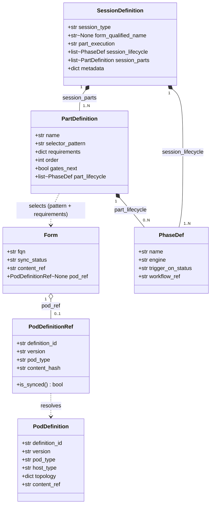
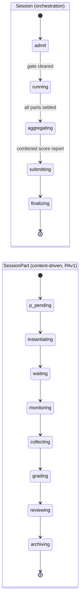

# Session Model

> A **Session** is the top-level delivery resource. It is instantiated from a
> **`SessionDefinition`** identified by a **`session_type`** that declares one or more **parts**
> and a **session orchestration lifecycle** (how those parts are admitted, sequenced and rolled
> up). Each part is a first-class
> `TimedResource` with its **own, richer content-driven lifecycle**, resolves its content to a
> **`Form`** by a **selector pattern + requirements**; the resolved **`Form`** optionally carries a
> **`PodDefinition`** ([ADR-059](../adr/ADR-059-form-as-first-class-synced-resource.md)). This page
> covers the catalog (definitions), the two lifecycle layers, and the runtime profiles. See
> [resource-model.md](resource-model.md) for the underlying `TimedResource` abstraction.

## Definitions vs runtime

- **Definitions** are `ResourceDefinition`s (`provisioning_source = seed`) — content-driven
  catalog entries shipped in **seed content**. They describe _what_ a session is.
  `SessionDefinition` generalises the legacy `SessionType`; `PartDefinition` generalises the
  legacy `SessionPartRequirement` (see [definition-catalog-model.md](definition-catalog-model.md)
  and [ADR-052](../adr/ADR-052-content-authoring-taxonomy.md)).
- **Runtime resources** (`Session`, `SessionPart`, `PodInstance`) are `TimedResource`s created
  from definitions at **schedule time** and reconciled toward their desired state.

## SessionDefinition

The umbrella catalog entry is identified by a **`session_type`** (a stable definition key such as
`CCIE-EI-Lab-Exam`), **not** universally by a form-qualified name. It declares
`session_parts: list[PartDefinition]`, a **session lifecycle**, and shared metadata.

**Identity depends on cardinality:**

- **Single-part** types (`lablet`, `practicelab`) _are_ the form — the one part's content is
  keyed by its **form-qualified name (FQN)**, so the session is effectively addressed by that FQN.
- **Multi-part** types (`expertlab` = **CCIE**, 2 parts; `expertdesign` = **CCDE**, 4 parts) are
  addressed by their **`session_type`**; each `PartDefinition` selects a **separate** `Form` (its
  own FQN) by **pattern + requirements**.

The **session lifecycle** is an **orchestration lifecycle** defined in the **seed definition
file** and may be **inherited from the `session_type`** (`lablet` / `practicelab` / `expertlab` /
`expertdesign`); together with the **`part_execution`** policy (`single` / `sequential` /
`parallel`) it declares _how the parts are admitted, sequenced and rolled up_. The complementary,
much richer **part lifecycle** — _what happens inside one part_ — is defined in the **PAv1 content
package**. See _Two lifecycle layers_ below.

## PartDefinition, selectors and requirements

Each part binds to its content by a **selector pattern** over form-qualified names plus optional
**`requirements`** (declarative filters the resolved form must satisfy — track, version, node
count, capability flags), **resolved at schedule time**. This is what makes parts reusable across
many exams while still constraining what may fill each slot.

| Selector pattern | Resolves to |
|---|---|
| `"Exam ** LAB"` | any exam's LAB part |
| `"Exam CCIE * * DES*"` | the CCIE design (DES) part for any track/version |
| `"* CCDE * COR"` | the CCDE core (COR) part |

The `requirements` block carries the **admissibility filters** ported from the legacy
`SessionPartRequirement` — they constrain which authored `Form` may fill the slot:

| Requirement | Constrains the resolved form by |
|---|---|
| `track_types` / `track_levels` / `track_acronyms` | the form's `Track` taxonomy coordinates |
| `exam_versions` | the form's `Exam` version |
| `module_acronyms` | the form's `Module` |
| `parts_count` | how many parts of this kind the session admits |
| `requires_pod` | whether the resolved `Form` must carry a `PodDefinition` (vs web/device-only) |

A part may:

- select a **`Form`** that references **0 or 1** `PodDefinition` (none for web-only parts such as
  a CCDE `COR` or CCIE `DES` design item — the pod travels with the resolved `Form`, ADR-059);
- declare its own **lifecycle** of phases (`PhaseDef`), each bound to a `pipeline` (native LCM)
  or `workflow` (SE job) engine;
- **gate** the next part (`gates_next = true`) — parts are sequential and gated.

See [ADR-045](../adr/ADR-045-multi-part-session-part-model.md) for the model and selector
resolution.

## PodDefinition

The **canonical pod spec** (un-retired — see [ADR-046](../adr/ADR-046-host-abstraction-and-pod-host-type-split.md)).
It declares the pod's **`PodType`** (workload), target **`HostType`** (platform), topology, and
a pointer to synced content. `PodInstance`s are created from it and bound to a `Host`. The pod ref
is owned by the **`Form`** the part resolves ([ADR-059](../adr/ADR-059-form-as-first-class-synced-resource.md)),
not the `PartDefinition` — a `Form` is a self-contained _content + optional pod_ deliverable.

| Axis | Field | Examples |
|---|---|---|
| **Workload** (what the pod is) | `PodType` | `cml_on_aws`, `proxmox`, `vmware` |
| **Platform** (where it runs) | `HostType` | `cml_on_aws`, `vmware`, `proxmox`, `native_aws`, `hybrid_hardware` |

The two axes are split because they are not always the same: e.g. a `hybrid_hardware` host runs
physical appliances with no hypervisor, while `native_aws` uses AWS-managed services directly.

> **Not every part has a pod.** Design items (e.g. `DES` / `COR`) are web-only — no
> `PodDefinition`. **Device-based** parts target **pre-existing** devices reached through the
> **ROC / RADkit** collection mechanism; LCM provisions nothing for them, so `roc_radkit` is
> **not** a `PodType` — it is an access/collection transport used by SE's _Collect_ step (see
> [glossary](glossary.md) and [ADR-046](../adr/ADR-046-host-abstraction-and-pod-host-type-split.md)).

## Session profiles (`session_type`)

The same structure expresses every delivery kind; the `session_type` selects the session
lifecycle template and how the session is addressed:

| `session_type` | Parts | `part_execution` | Addressed by | Pods | Notes |
|---|---|---|---|---|---|
| **lablet** | 1 | `single` | **FQN** | 1 × `cml_on_aws` | The classic single-lab delivery. |
| **practicelab** | 1 | `single` | **FQN** | 1 × any platform | Single-part, different platform. |
| **expertlab** (CCIE) | **2** | `sequential` | **session_type** | per-part | e.g. DOO (1 device/pod) → AI-DOO (1 `cml_on_aws` pod). |
| **expertdesign** (CCDE) | **4** | `sequential` | **session_type** | per-part (often **none**) | 4 × `COR` core-design parts resolved by `"* CCDE * COR"` selectors; mostly web items, no pod. |

## Two lifecycle layers

Both the `Session` and each `SessionPart` are `TimedResource`s, so both have a lifecycle — but
they are **complementary, not redundant**: the session lifecycle is **horizontal** (orchestration
_around and between_ parts), the part lifecycle is **vertical** (content delivery _inside_ one
part). They never duplicate each other.

| Layer | Phases | Defined in | Driven by |
|---|---|---|---|
| **Session** (orchestration) | seeded `session_lifecycle`, e.g. `admit → run_parts → aggregate → submit → finalize`; **degenerates to `pending → active → inactive`** for a single-part, no-gate type | seed definition — `session_lifecycle` + `part_execution` policy (may inherit from `session_type`) | the **session-controller** reconcile loop ([ADR-047](../adr/ADR-047-generic-reconciliation-framework.md) / [ADR-054](../adr/ADR-054-controller-topology-resource-kind.md)) — admits the session, drives parts by `part_execution`, rolls up status. |
| **SessionPart** (content) | `pending → instantiating → waiting → monitoring → collecting → grading → reviewing → archiving` | **PAv1 content package** | content-driven engine (ADR-044); the per-part business logic. |

The session lifecycle owns only what **no single part can decide**:

- **cross-part ordering & gating** — admit the next part once the gating part (`gates_next`)
  completes, per the `part_execution` policy;
- **session-scoped gates** with no owning part — authorization / proctor admission, a global
  _ready-to-begin_ gate, **result aggregation** then **submission of the single combined score
  report** for the whole session (one per session, **not** one per part), and archival rollup;
- **aggregate status & failure policy** — a session is **healthy/consistent** only while **at
  least one** part is consistent (`status == desired_status`, not `Failed`); if every part fails
  the session is inconsistent and escalates ([ADR-047](../adr/ADR-047-generic-reconciliation-framework.md));
- **cross-part data flow** — a later part whose content depends on an earlier part's outcome.

Each session phase is a `PhaseDef` bound to an **engine** exactly like a part phase — `pipeline`
(native orchestration / gating steps) or `workflow` (an SE `Job`, e.g. publish a combined report)
— so **no new machinery** is needed: the same generic loop reconciles the session's
`session_lifecycle`. The thin `pending → active → inactive` is simply the **empty-orchestration
special case** (one part, no session-scoped gates), so nothing is lost by generalising.

### `part_execution` policy

How the parts of a session are activated is **data on the definition**, not a different lifecycle:

| `part_execution` | Behaviour | Example |
|---|---|---|
| `single` | activate the one part; the session is effectively that part | `lablet`, `practicelab` |
| `sequential` | activate parts in `order`, each gated on the previous (`gates_next`) | `expertlab` (CCIE), `expertdesign` (CCDE) |
| `parallel` | activate all parts at once; aggregate when all settle | (future multi-track) |

So _"a lablet activates only one part while CCIE sequences two"_ is the **same** session reconcile
algorithm with a different `part_execution` value + part count — **not** a different lifecycle
definition.

## Timeslot inheritance and containment

Parts **inherit** the session `Timeslot` as their default bounds and are constrained by it:

- **Containment** — `part.timeslot ⊆ session.timeslot` (a part may not start before
  `session.start` nor end after `session.end`).
- **Cumulative compatibility** — the parts' windows must fit **collectively**:
  `Σ part.timeslot ≤ session.timeslot`. Sequential, gated parts cannot together overrun the
  session window.

These rules are validated at schedule time, before any part is provisioned.

## Multi-part timeline

Parts are **sequential and gated**, but a later part's **eager** pod (long `lead_time`) may
begin provisioning **while an earlier part is still active** — so the hardware is ready when the
part's window opens.

```mermaid
gantt
    title CCIE expert lab (expertlab, 2 parts) — eager pod provisions early
    dateFormat HH:mm
    axisFormat %H:%M

    section DOO part (1 pod, eager hardware)
    Eager pod provision  :crit, doo_prov, 08:30, 120m
    Active window        :doo, 09:00, 120m

    section AI-DOO part (1 cml_on_aws pod, JIT)
    JIT pod provision    :aidoo_prov, 10:35, 20m
    Active window        :aidoo, after doo, 90m
```

## Legacy mapping (Session Manager)

The legacy _Session Manager_ modelled the lifecycle **imperatively** on the `Session` aggregate
(`Empty → Assigned → Instantiating → Pending → Running → Pausing → Paused → Completed → Archived`)
and a parallel `SessionPart` machine (`Pending → Running → Paused → Completed → Grading → Graded →
Locked`, plus a `SessionPodStatus` of `None → Assigning → Assigned`). There was **no
`desired_status` and no reconciliation** — transitions were driven by explicit commands.

The port collapses that onto the [resource model](resource-model.md):

| Legacy concept | LCM equivalent |
|---|---|
| `SessionType` (+ `SessionPartRequirement[]`) | `SessionDefinition` (+ `PartDefinition[]`) — a seed `ResourceDefinition`. |
| `Session` rich state machine | `Session` **orchestration** lifecycle (`admit → run_parts → aggregate → finalize`; thin `pending → active → inactive` is the degenerate single-part/no-gate case). |
| `SessionPart` rich state machine | `SessionPart` **content-driven** lifecycle from PAv1 (the rich phases now live at _part_ level). |
| `SessionPodStatus` (`Assigning → Assigned`) | the part's `PodInstance` reconciliation (`desired_status`). |
| explicit command-driven transitions | `desired_status` + a reconcile loop (intent down, status up). |
| EventStore + Mongo projection | **state-based** `MotorRepository` + `state_version`, `@dispatch` reducers. |

The key shift: the legacy _session_-level richness is re-homed at the **part** level, and every
imperative transition becomes a **declarative `desired_status`** the reconciler converges toward.

## Related

- [resource-model.md](resource-model.md) — `TimedResource` abstraction and reconciliation.
- [definition-catalog-model.md](definition-catalog-model.md) — content taxonomy, Form delivery,
  catalogue/config plane, authorization.
- [flow-session-delivery.md](flow-session-delivery.md) — the end-to-end multi-part delivery flow.
- [unified-resource-management.md](unified-resource-management.md) — lifecycle vs automation.
