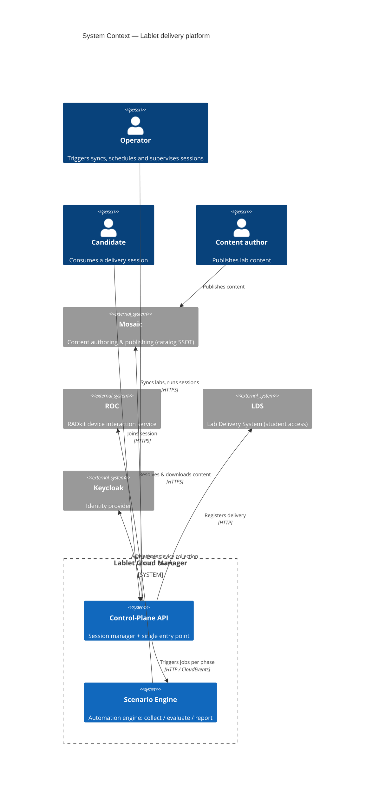
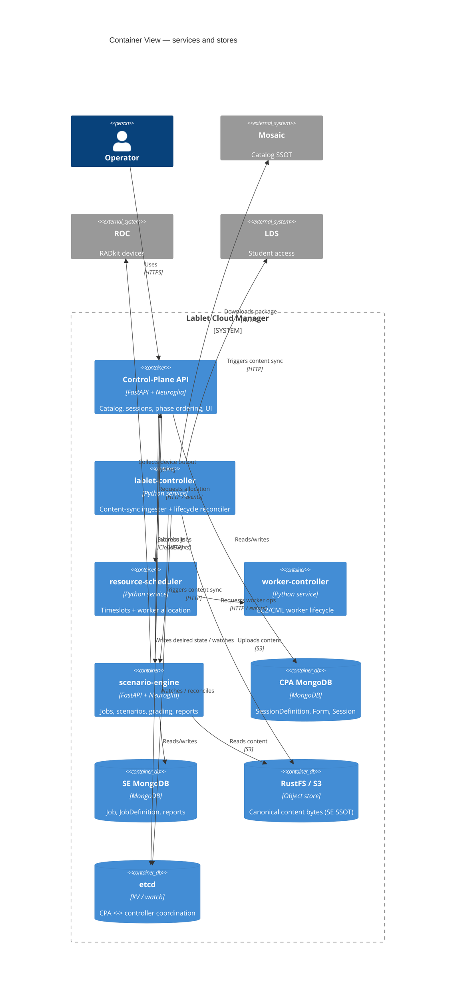

# Solution Overview

## Operator / Author summary

The platform turns **authored lab content** into **graded delivery sessions** for candidates.
Everything operable is modelled as a **timed resource** with a declared _desired_ state and an
observed _actual_ state, reconciled continuously. Two responsibilities are kept strictly apart:

- **CPA is the session manager + control plane.** It is the only place operators and students
  enter. It keeps the catalog of definitions, drives each **Session** (and its **Parts**)
  through their lifecycle phases, runs the plumbing (pick a host, find the pod, open ports,
  register with the delivery system), and hosts the **unified resource dashboard**.
- **SE is the automation engine.** Whenever a phase needs something _done to the lab_ —
  apply changes post-init, collect device output, grade it, produce a report — CPA hands that work to SE. SE talks to
  the live devices through **ROC** (and other adapters) and sends results back.

A session may be **single-part** (the classic Lablet) or **multi-part** (e.g. an expert exam
with DES / DOO / AI-DOO parts), and each part may run **0..N pods** of any **PodType** on any
**HostType**. The same lifecycle/reconciliation machinery applies at every level of the tree.

If a session is stuck **provisioning**, look at CPA + the LCM controllers. If grading or a
report is wrong, look at SE + the content's grading rules.

---

## Architect detail

### Responsibility map

| Concern | Owner | Notes |
|---|---|---|
| Entry point (API + UI) | **CPA** | Single front door; dual auth (cookie BFF + JWT). |
| Unified resource dashboard | **CPA** | K8s-style: per-type lists + drill-down, slide-over detail, declarative+imperative actions. SE report UI embedded as an iframe widget. |
| Catalog (`SessionDefinition` / `PartDefinition` / `PodDefinition`) | **CPA** | SSOT = Mosaic (resolved dynamically). The **`Form`** is the synced content unit (ADR-059). |
| `Session` + `SessionPart` ordering & gating | **CPA** | Top-level resource reconcilers; own part sequencing and gating. |
| Native infra steps | **CPA → controllers** | `worker_lab_resolve`, `pod_locator`, `ports_alloc`, `lds_register`, `mark_ready`, `archive`. |
| `PodInstance` reconciliation | **pod-controller** | Per-type manager for pods (any `PodType` workload). |
| `Host` reconciliation | **host-controller** | Per-type manager for hosts (any `HostType` platform); the generalized `CmlWorker` — the substrate a pod binds to. |
| `Form` sync ingestion | **form-controller** | Mosaic → RustFS, then fan-out to LDS + SE (ADR-059). |
| Host allocation / timeslots | **resource-scheduler** | `HostType`-aware capacity; `lead_time` drives JIT vs eager. |
| EC2/CML host lifecycle | **host-controller** | `cml_on_aws` host adapter: provision/start/stop/terminate. |
| Automation (`Job`/`Scenario`/grading/report) | **SE** | SSOT for content = RustFS. |
| Raw device interaction | **ROC** | SE delegates collection; ROC owns RADkit. |
| Student access (ports/content view) | **LDS** | Keeps its own synced content view. |

**Two sources of truth, by design:** CPA treats **Mosaic** as the SSOT for _what content
exists_ (resolved per form-qualified name); SE treats **RustFS** as the SSOT for _the content
bytes it executes_. The sync flow is what keeps them consistent.

### Resource management plane

The control plane is a **single reconciliation pattern applied recursively**. Every resource
— `Session`, `SessionPart`, `PodInstance`, `Host`/`Worker` — is a `TimedResource` with a
`desired_status`, a `status`, a `Timeslot`, and a `ManagedLifecycle`. A **generic reconcile
framework** (observe → diff → act → record) is specialised by a **per-type manager** for each
kind. Intent cascades **down** the tree (operator/scheduler → Session → Part → Pod); observed
status bubbles **up**.

Ownership of reconciliation:

| Level | Reconciled by |
|---|---|
| `Session`, `SessionPart` (ordering, gating) | **CPA / session-controller** |
| `Form` (content_package sync) | **form-controller** (ADR-059) |
| `PodInstance` (workload) | **pod-controller** |
| `Host`/`Worker` (platform substrate) | **host-controller** (+ resource-scheduler for allocation) |
| Per-part content automation (collect/grade/report) | **SE** (invoked from a part's `workflow` phase) |

See [resource-model.md](resource-model.md) for the full tree and reconciliation framework,
[session-model.md](session-model.md) for definitions and session profiles, and
[ui-resource-dashboard.md](ui-resource-dashboard.md) for the dashboard.

### C4 — System context

### C4 — Container view

!!! note "As-built names vs ADR-054 Rev 2 target"
    The container below shows the **as-built** services (`lablet-controller`, `worker-controller`).
    The [ADR-054](../adr/ADR-054-controller-topology-resource-kind.md) Rev 2 target splits
    `lablet-controller` into **`session-`/`form-`/`pod-controller`** and renames
    `worker-controller` → **`host-controller`**. The responsibility map above uses the target names.

### Integration style

- **CPA → SE (commands):** synchronous HTTP for _triggering_ a job (`submit_job`,
  `sync_content`). CPA never blocks on job completion.
- **SE → CPA (results):** asynchronous **CloudEvents** consumed by CPA's integration-event
  handlers, which advance the session phase.
- **CPA → controllers:** desired-state via **etcd**; controllers reconcile and report progress
  back through CloudEvents / phase-progress commands.
- **SE → ROC:** synchronous HTTP using the `(session/bucket, bulk_cmd_uuid)` contract
  (`POST /devices`, `POST /execute/bulk`, `GET/DELETE /execute/bulk/{uuid}`).

### Why this split

| Decision | Rationale |
|---|---|
| CPA owns Session, SE owns Job | One place to reason about delivery state; SE stays reusable across process types and pod types. |
| Phase ordering native, job bodies content-driven | Infra sequencing rarely changes; automation content changes constantly and is author-owned. |
| SE content SSOT = RustFS, not Mosaic | SE must run deterministically and offline from Mosaic; the sync flow is the only coupling point. |
| ROC kept external | RADkit/device interaction is already a live, separately-operated capability. |
