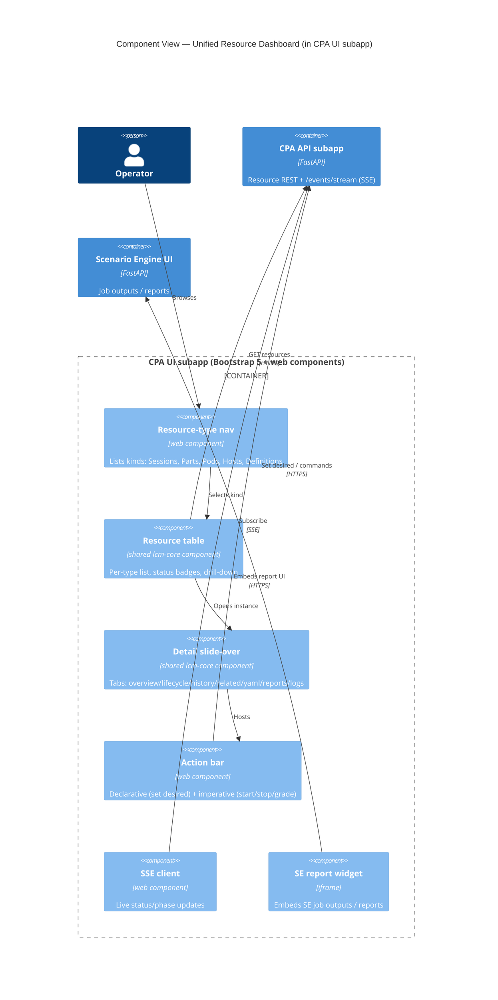

# UI — Resource Dashboard

> A **Kubernetes-style** operator console hosted by CPA. Each resource kind has a table view;
> selecting an instance opens a **slide-over** detail panel. The model behind it is the
> `TimedResource` tree ([resource-model.md](resource-model.md)); the design decisions are in
> [ADR-048](../adr/ADR-048-unified-resource-dashboard.md).

## Goals

- One console for every resource kind: `Session`, `SessionPart`, `PodInstance`, `Host`/`Worker`,
  and catalog definitions.
- Make **desired vs actual** state and **lifecycle phases** first-class in the UI.
- Keep the existing **Bootstrap 5 + vanilla web components + SSE** stack; grow shared components
  in `lcm-core` (`lcm_ui`).

## Component view



## Navigation: per-type lists + drill-down

A left nav lists resource **kinds**. Each opens a table; rows drill down to owned resources
(Session → Parts → Pods → Host) via breadcrumbs.

```text
┌──────────────┬───────────────────────────────────────────────────────────────┐
│ RESOURCES    │  Sessions                                   [+ New]  [⟳ Sync]   │
│              │  ───────────────────────────────────────────────────────────── │
│ ▸ Sessions   │  NAME           PROFILE      STATUS    DESIRED   PARTS  AGE      │
│   Parts      │  ───────────────────────────────────────────────────────────── │
│   Pods       │  ccie-ent-042   ExpertExam   ● Active  Active    3      01:12    │
│   Hosts      │  lab-1.1.1-x9   Lablet       ◐ Provis. Ready     1      00:03    │
│ ─────────    │  ccde-des-room  DesignExpert ● Active  Active    4      00:48    │
│ CATALOG      │  prac-vmw-7     PracticeLab  ○ Sched.  Ready     1      —        │
│   SessionDef │                                                                 │
│   PartDef    │  status legend:  ● ready/active  ◐ transitioning  ○ scheduled   │
│   PodDef     │                  ✖ failed                                       │
│ ─────────    │                                                                 │
│ INFRA        │                                                                 │
│   Workers    │                                                                 │
└──────────────┴───────────────────────────────────────────────────────────────┘
```

## Detail: slide-over side panel

Selecting a row slides a panel in from the right (the table stays visible). Tabs expose the full
resource. Declarative + imperative actions live in the header.

```text
                         ┌──────────────────────────────────────────────────┐
   Sessions table  ◀     │  ccie-ent-042            ● Active   [Set desired ▾]│
   (dimmed)              │  Session · ExpertExam                 [Reconcile]  │
                         │  ────────────────────────────────────────────────│
                         │  Overview | Lifecycle | History | Related | YAML  │
                         │           | Reports | Logs                        │
                         │  ────────────────────────────────────────────────│
                         │  SPEC (desired)            STATUS (actual)        │
                         │  desired_status: Active    status: Active         │
                         │  timeslot.start: 09:00     started_at: 09:00      │
                         │  parts: 3                  current_part: DOO       │
                         │  ────────────────────────────────────────────────│
                         │  PARTS (drill-down)                               │
                         │   1 ● DES    (web, no pod)        completed       │
                         │   2 ● DOO    pod: hw-rack-3        active         │
                         │   3 ○ AI-DOO pod: cml-aws (JIT)    scheduled      │
                         └──────────────────────────────────────────────────┘
```

### Lifecycle tab (desired vs actual phases)

```text
  Lifecycle — SessionPart "DOO"        engine legend:  [P] pipeline  [W] workflow
  ──────────────────────────────────────────────────────────────────────────────
   ✔ instantiate [P]  ──  ✔ ready [P]  ──  ▶ grade [W]  ──  ○ teardown [P]
                                            └ SE job: grade-lab@0.1.0 (running)
   desired_status: Active        retries: 0/3        last transition: 10:42 by system
```

### History tab (state transitions)

```text
  State history — newest first
  ──────────────────────────────────────────────────────────────────
   10:42  ready      → grading     event:student_submit   by: system
   09:05  provisioning → ready     phase:ready complete   by: PartMgr
   08:55  scheduled  → provisioning provision_at reached  by: scheduler
```

## Tabs reference

| Tab | Shows |
|---|---|
| **Overview** | `desired_status` vs `status` side by side; key timeslot/lifecycle fields. |
| **Lifecycle & phases** | phase chain, current vs desired, engine per phase, progress, retries. |
| **State history / events** | the `state_history` timeline (`StateTransition`s). |
| **Related** | parent, children, and bound host (clickable drill-down). |
| **Raw YAML/JSON** | the resource spec/status document. |
| **Reports & artifacts** | SE outputs, embedded as an **iframe** widget. |
| **Live logs** | streamed reconcile/automation logs. |

## Actions

- **Declarative** (aligned with the reconciliation framework, [ADR-047](../adr/ADR-047-generic-reconciliation-framework.md)):
  set `desired_status` (e.g. `Ready`, `Active`, `TornDown`), retry a phase, force a reconcile.
- **Imperative** (operator break-glass): start/stop/grade/teardown now.

## Real-time

The dashboard subscribes to CPA's `/events/stream` (SSE — [ADR-013](../adr/ADR-013-sse-protocol-improvements.md))
for live `status`, phase progress, and transitions, with optional filtering by resource kind/ids.

## Shared components in `lcm-core`

Promoted into `lcm_ui` for reuse across every service UI:

`resource-table`, `resource-detail-panel`, `status-badge`, `lifecycle-phases`,
`state-history-timeline`, `desired-status-editor`, `sse-client`.

## Related

- [resource-model.md](resource-model.md) — the model the dashboard renders.
- [ADR-048](../adr/ADR-048-unified-resource-dashboard.md) — dashboard decisions.
- [ADR-009](../adr/ADR-009-shared-core-package.md) — shared core package.
