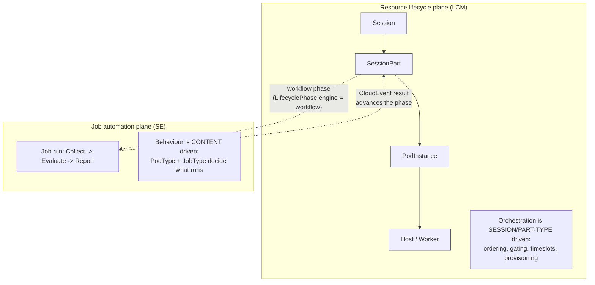
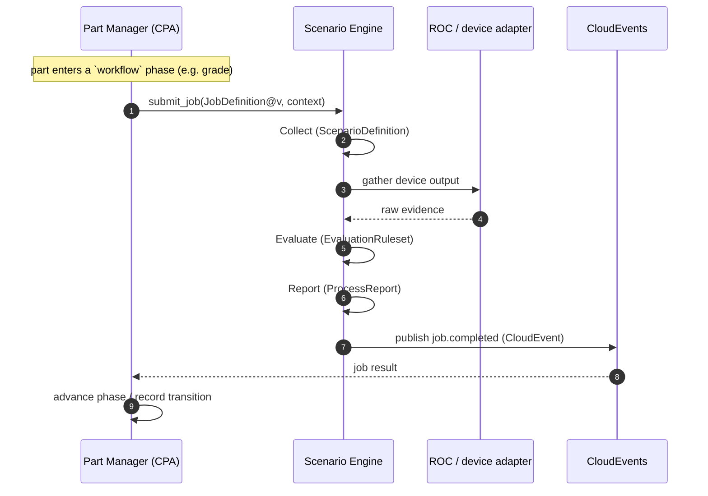

# Unified Resource Management

> The platform has **two planes** that meet at exactly one seam. The **resource lifecycle plane
> (LCM)** orchestrates _when and in what order_ things happen — driven by **session/part type**.
> The **job automation plane (SE)** decides _what actually runs against the lab_ — driven by
> **content** (`PodType` + job type). Keeping these apart is the single most important design
> rule in the system.

## Two planes, one seam

The **only** coupling point is a `LifecyclePhase` whose `engine = workflow`: when a resource
enters such a phase, its manager submits an SE job and waits (asynchronously) for the result
CloudEvent. Every other phase (`engine = pipeline`) is native LCM plumbing.

## What each plane owns

| | Resource lifecycle (LCM) | Job automation (SE) |
|---|---|---|
| **Drives off** | session / part **type** | **content** (`PodType` + job type) |
| **Decides** | ordering, gating, timeslots, provisioning, teardown | what to collect, how to evaluate, what to report |
| **State** | `TimedResource` tree (Session/Part/Pod/Host) | `Job`, `Scenario`, `EvaluationRuleset`, `ProcessReport` |
| **SSOT** | Mosaic (catalog) | RustFS (content bytes) |
| **Reconciled by** | CPA (Session/Part) + controllers (Pod/Host) | SE (per job) |

## Orchestration is type-driven; behaviour is content-driven

The same orchestration runs **regardless of content**: a `Session` of a given profile always
sequences and gates its parts the same way, and a part always provisions its pod the same way.
What changes per lab is **what the automation does** — and that lives entirely in content:

- **`PodType`** selects the pod/host adapter and the shape of the environment.
- **Job type** selects the automation recipe.

This means a new lab, a new grading scheme, or a new report never requires an LCM change — only
new content. Conversely, a new _session shape_ (e.g. a new exam profile) is an LCM/definition
change and needs no SE change.

## Any step, any job run

A job run is always the same triad — **Collect → Evaluate → Report** — but it can be bound to
**any step** of **any resource's** lifecycle:

| Step (lifecycle phase) | Typical job run |
|---|---|
| `sync` | validate / index synced content |
| `init` | initialization + readiness report |
| `collect` | collect device evidence |
| `grade` | evaluate evidence → score report |
| `change` | apply + verify a change → change report |
| `archive` | final capture → archive report |

## Why this matters operationally

- **Triage is unambiguous.** Stuck provisioning, wrong ordering, or a part not starting → LCM.
  Wrong grade, missing report, bad collection → SE + content.
- **Reuse.** SE jobs are reusable across pod types and session profiles; LCM orchestration is
  reusable across content.
- **DSL alignment.** Both planes ingest the **same workflow DSL** for lifecycle/step/task
  definitions on content sync (see [ADR-049](../adr/ADR-049-unified-workflow-dsl.md)), so a
  `pipeline` step and a `workflow` job are described uniformly.

## Related

- [resource-model.md](resource-model.md) — the `TimedResource` tree and reconciliation.
- [session-model.md](session-model.md) — definitions and profiles.
- [generic-pattern.md](generic-pattern.md) — the Collect → Evaluate → Report job pattern.
- ADRs: [044](../adr/ADR-044-content-driven-lifecycle-engine.md) (content-driven lifecycle),
  [049](../adr/ADR-049-unified-workflow-dsl.md) (unified DSL).
