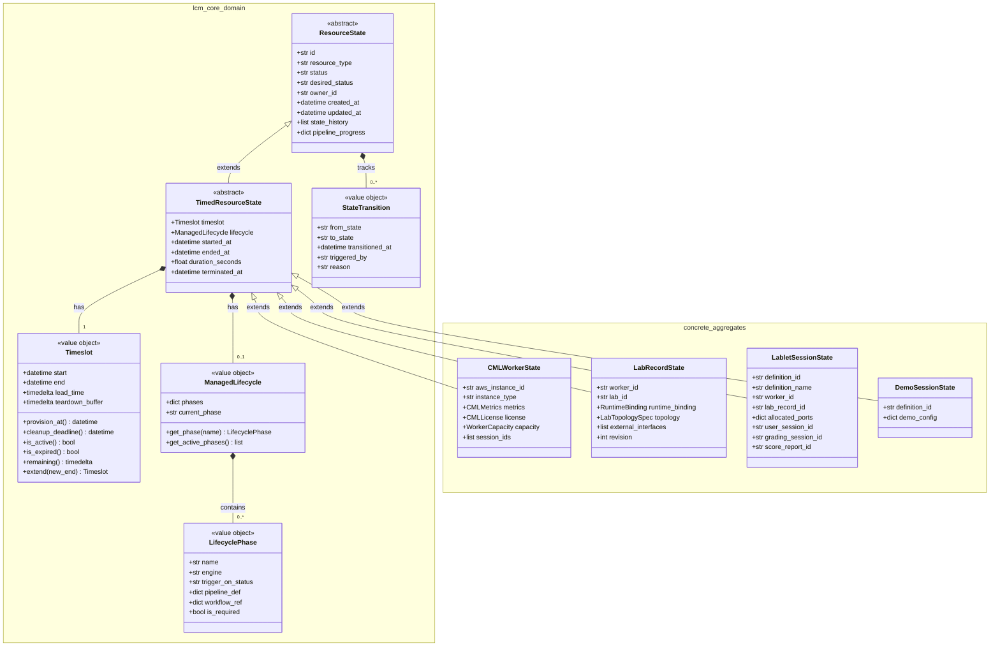
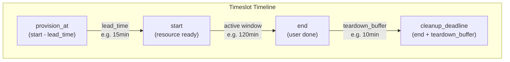
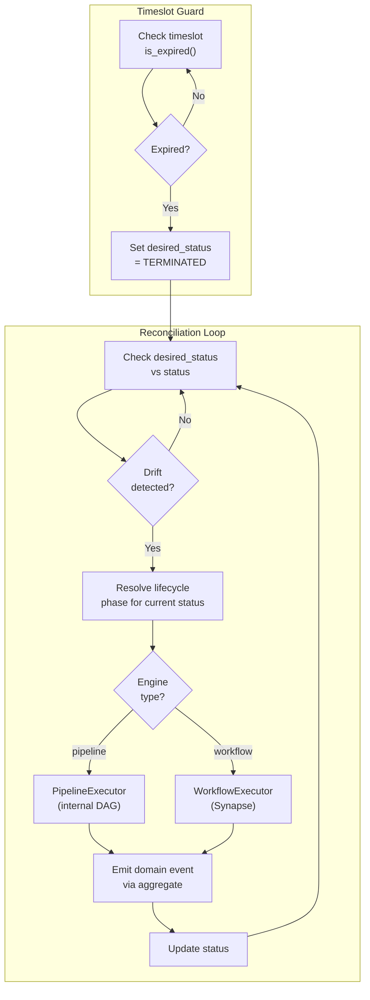

# TimedResource Data Model — Architecture Reference

> **ADR Reference**: [ADR-036 §2.1.4–§2.1.7](adr/ADR-036-resource-management-abstraction-layer.md)
> **Package**: `lcm_core.domain.entities` / `lcm_core.domain.value_objects`
> **Status**: Proposed (Phase 2 of ADR-036)

---

## Overview

The **TimedResource** abstraction unifies three existing aggregate types —
`CMLWorker`, `LabRecord`, and `LabletSession` — under a common base class
hierarchy. All three share the fundamental characteristic of being
**time-bounded resources with managed lifecycles**.

### Design Principles

1. **Spec vs Status** — Kubernetes-inspired declarative model (`desired_status` vs `status`)
2. **Timeslot as first-class concept** — Every resource has a bounded execution window with lead-time and teardown margins
3. **Lifecycle as data** — Pipeline/workflow phases are declarative (YAML-driven), not hardcoded
4. **Functional first** — Abstraction extracted from working implementations, not imposed top-down
5. **Framework-promotable** — Generic enough for eventual adoption into the Neuroglia framework

---

## Class Hierarchy



---

## Layer 1: Resource (Spec vs Status)

The **Resource** base class implements the Kubernetes-like declarative model
where `desired_status` (spec/intent) and `status` (actual state) are tracked
independently. A reconciliation loop continuously drives `status` toward
`desired_status`.

### Fields

| Field | Type | Description |
|-------|------|-------------|
| `id` | `str` | Unique aggregate identifier |
| `resource_type` | `str` | Discriminator (e.g., `"cml_worker"`, `"lablet"`, `"lab_record"`) |
| `status` | `str` | Current actual state |
| `desired_status` | `str \| None` | Target state — reconciliation drives status toward this |
| `owner_id` | `str` | Who owns this resource |
| `state_history` | `list[StateTransition]` | Audit trail of all state transitions |
| `pipeline_progress` | `dict \| None` | Progress per pipeline: `{"instantiate": {...}, "teardown": {...}}` |
| `created_at` | `datetime` | Creation timestamp |
| `updated_at` | `datetime` | Last modification timestamp |

### Reconciliation Semantics

```
if desired_status is set AND desired_status != status:
    → determine required transitions to reach desired_status
    → execute pipeline for current status → next status
    → repeat until desired_status == status or error
```

---

## Layer 2: TimedResource (Timeslot + Managed Lifecycle)

A **TimedResource** adds two key concepts:

1. **Timeslot** — A time window with operational margins for preparation and cleanup
2. **ManagedLifecycle** — An ordered set of lifecycle phases, each backed by a pipeline or workflow

### Timeslot Value Object

The `Timeslot` captures not just "when is this resource active?" but also the
operational reality that resources need **lead time** to become ready and
**teardown time** after the user is done.



| Property | Type | Description | Example |
|----------|------|-------------|---------|
| `start` | `datetime` | When the resource should be ready for use | 2026-03-08T14:00:00Z |
| `end` | `datetime` | When the user session ends | 2026-03-08T16:00:00Z |
| `lead_time` | `timedelta` | How long before `start` to begin provisioning | 15 minutes |
| `teardown_buffer` | `timedelta` | How long after `end` for cleanup | 10 minutes |
| `provision_at` | computed | `start - lead_time` | 2026-03-08T13:45:00Z |
| `cleanup_deadline` | computed | `end + teardown_buffer` | 2026-03-08T16:10:00Z |
| `duration` | computed | `end - start` (active window) | 2 hours |
| `total_duration` | computed | `cleanup_deadline - provision_at` | 2h 25min |

### Concrete Timeslot Examples

| Resource | Typical Duration | Lead Time | Teardown Buffer | Notes |
|----------|-----------------|-----------|-----------------|-------|
| **CMLWorker** | 24h max | 5–10min (EC2 launch) | 5min (terminate) | Provisioning includes CML service startup |
| **LabRecord** | Derived from session | 2–5min (import + start) | 2min (wipe + delete) | Timeslot derived from parent LabletSession |
| **LabletSession** | 120min typical | 15min (schedule + instantiate) | 10min (teardown pipeline) | User-facing timeslot with assessment lifecycle |

### ManagedLifecycle Value Object

A `ManagedLifecycle` defines **what happens** during each lifecycle transition.
Each phase specifies its execution strategy — internal `PipelineExecutor` for
deterministic DAG steps, or external `WorkflowExecutor` (Synapse) for complex
choreography.

```mermaid
graph TB
    subgraph "LabletSession Lifecycle Phases"
        direction LR
        I["instantiate<br/>engine: pipeline"]
        CE["collect_evidence<br/>engine: workflow"]
        CG["compute_grading<br/>engine: workflow"]
        T["teardown<br/>engine: pipeline"]

        I --> CE
        CE --> CG
        CG --> T
    end

    subgraph "CMLWorker Lifecycle Phases"
        direction LR
        PR["provision<br/>engine: pipeline"]
        LR2["license_register<br/>engine: pipeline<br/>optional"]
        MR["monitor_resources<br/>engine: pipeline"]
        TD["teardown<br/>engine: pipeline"]

        PR --> LR2
        LR2 --> MR
        MR --> TD
    end

    subgraph "LabRecord Lifecycle Phases"
        direction LR
        IM["import<br/>engine: pipeline"]
        BT["boot<br/>engine: pipeline"]
        WP["wipe<br/>engine: pipeline"]
        DL["teardown<br/>engine: pipeline"]

        IM --> BT
        BT --> WP
        WP --> DL
    end
```



---

## Layer 3: Concrete Resources

Each concrete resource extends `TimedResourceState` with domain-specific fields.

### Field Distribution

| Field Category | ResourceState | TimedResourceState | CMLWorker-only | LabRecord-only | LabletSession-only |
|---|---|---|---|---|---|
| Identity (`id`, `resource_type`) | ✅ | | | | |
| Spec/Status (`status`, `desired_status`) | ✅ | | | | |
| Ownership (`owner_id`) | ✅ | | | | |
| Audit (`state_history`, `pipeline_progress`) | ✅ | | | | |
| Timestamps (`created_at`, `updated_at`) | ✅ | | | | |
| Time bounds (`timeslot`) | | ✅ | | | |
| Lifecycle phases (`lifecycle`) | | ✅ | | | |
| Runtime tracking (`started_at`, `ended_at`) | | ✅ | | | |
| Termination (`terminated_at`) | | ✅ | | | |
| AWS infra (`aws_instance_id`, `instance_type`) | | | ✅ | | |
| CML metrics, license, capacity | | | ✅ | | |
| Lab topology (`runtime_binding`, `topology_spec`) | | | | ✅ | |
| Lab metadata (`node_count`, `link_count`) | | | | ✅ | |
| Definition ref (`definition_id`, `definition_name`) | | | | | ✅ |
| Lab binding (`worker_id`, `lab_record_id`) | | | | | ✅ |
| Child entity FKs (`user_session_id`, etc.) | | | | | ✅ |
| Assessment (`grade_result`, `score_report_id`) | | | | | ✅ |

---

## Reconciliation Flow

The reconciliation loop applies to all `TimedResource` types uniformly:



---

## Package Structure (lcm_core)

```
lcm_core/
├── domain/
│   ├── entities/
│   │   ├── resource.py              ← NEW: ResourceState abstract base
│   │   ├── timed_resource.py        ← NEW: TimedResourceState abstract base
│   │   └── read_models/
│   │       ├── timed_resource_read_model.py  ← NEW: Base read model
│   │       ├── cml_worker_read_model.py      ← UPDATED: extends base
│   │       ├── lab_record_read_model.py      ← UPDATED: extends base
│   │       └── lablet_session_read_model.py  ← UPDATED: extends base
│   ├── value_objects/
│   │   ├── state_transition.py       ← EXISTS (verify)
│   │   ├── timeslot.py               ← NEW: Timeslot value object
│   │   └── managed_lifecycle.py      ← NEW: ManagedLifecycle + LifecyclePhase
│   └── enums/
│       ├── cml_worker_status.py      ← EXISTS
│       ├── lab_record_status.py      ← EXISTS
│       └── lablet_session_status.py  ← EXISTS
└── infrastructure/
    └── hosted_services/
        └── reconciliation_hosted_service.py  ← EXISTS (generic reconciler)
```

---

## Migration Strategy

Phase 2 introduces the abstraction layer **without breaking changes**:

1. **Create new base classes** in `lcm_core` — `ResourceState`, `TimedResourceState`
2. **Create new value objects** — `Timeslot`, `ManagedLifecycle`, `LifecyclePhase`
3. **Refactor concrete states** to extend `TimedResourceState` instead of `AggregateState[str]` directly
4. **Map existing fields** — e.g., `LabletSessionState.timeslot_start/end` → `Timeslot` VO
5. **Verify backward compat** — all existing MongoDB documents deserialize correctly
6. **Promote shared fields** — add `desired_status` to LabRecord, `state_history` to CMLWorker

### Serialization Safety

Neuroglia's `MotorRepository` uses `get_type_hints()` for field discovery, which
**supports class inheritance**. Adding a base class does not change the MongoDB
document schema — it only changes how fields are organized in the Python class
hierarchy.
