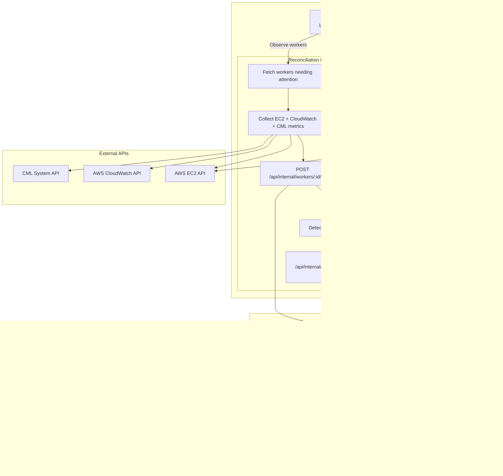

# Worker Monitoring System

> **Updated:** 2026-01-19 (Post-refactoring to controller-based architecture)
>
> This document describes the worker discovery and monitoring system after migration
> to declarative resource management per [ADR-010](./adr/ADR-010-service-unification-neuroglia.md)
> and [ADR-011](./adr/ADR-011-apscheduler-removal.md).

The Lablet Cloud Manager implements an automated worker discovery and monitoring system
that tracks the health, status, and performance of CML Workers running on AWS EC2 instances.

## Overview

The worker monitoring system provides:

- **Automated Worker Discovery**: Periodic scanning of AWS regions for EC2 instances matching AMI patterns
- **Metrics Collection**: Continuous polling of AWS EC2, CloudWatch, and CML System APIs
- **Status Synchronization**: Real-time sync between EC2 instance state and worker status
- **Real-time Updates**: SSE event broadcasting to connected browsers
- **Idle Detection**: Activity tracking for cost optimization (auto-pause)

## Architecture

### Post-Refactoring Architecture (Current)


```mermaid
graph TB
    subgraph "worker-controller"
        WR[WorkerReconciler<br/>LeaderElectedHostedService]

        WR -->|Discovery task| AWS_SCAN
        WR -->|Observe workers| RECONCILE

        subgraph "Discovery Loop (_run_discovery_loop)"
            AWS_SCAN[Scan AWS Regions]
            AWS_SCAN --> POST_IMPORT[POST /api/internal/workers/bulk-import]
        end

        subgraph "Reconciliation Loop"
            RECONCILE["Fetch workers needing attention"]
            RECONCILE --> METRICS["Collect EC2 + CloudWatch + CML metrics"]
            METRICS --> POST_METRICS["POST /api/internal/workers/:id/metrics"]
            POST_METRICS --> IDLE["Detect idle activity"]
            IDLE --> POST_IDLE["POST /api/internal/workers/:id/detect-idle"]
        end
    end

    subgraph "control-plane-api"
        INT_API[InternalController]
        REPO[(MongoDB)]
        SSE[SSEEventRelay]

        POST_IMPORT --> INT_API
        POST_METRICS --> INT_API
        POST_IDLE --> INT_API
        INT_API --> REPO
        INT_API --> DOMAIN_EVENTS[Domain Events]
        DOMAIN_EVENTS --> SSE
    end

    subgraph "Browser"
        UI[Frontend UI]
        SSE -->|SSE Stream| UI
    end

    subgraph "External APIs"
        EC2[AWS EC2 API]
        CW[AWS CloudWatch API]
        CML[CML System API]

        AWS_SCAN --> EC2
        METRICS --> EC2
        METRICS --> CW
        METRICS --> CML
    end
```

### Key Principle: API-Centric State Management (ADR-001)

Per [ADR-001](./adr/ADR-001-api-centric-state-management.md):

- **control-plane-api** is the ONLY component that writes to MongoDB
- **worker-controller** observes and reports; does NOT persist directly
- All state mutations flow through internal API endpoints
- SSE events are triggered by domain events in control-plane-api

## Key Components

### Worker Discovery (WorkerReconciler._run_discovery_loop)

Discovery runs as an independent asyncio task inside `WorkerReconciler`, under leader election.
Per AD-020, the standalone `WorkerDiscoveryService` was removed and its logic consolidated here
to prevent redundant AWS API calls when multiple replicas are running.

```python
# worker-controller/application/hosted_services/worker_reconciler.py

class WorkerReconciler(WatchTriggeredHostedService[CMLWorkerReadModel]):
    """Reconciles worker state; also runs discovery as an independent task."""

    async def _run_discovery_loop(self) -> None:
        """Discovery loop - scans AWS for EC2 instances matching AMI patterns."""
        while self._running:
            for region in self._discovery_regions:
                ami_ids = await ec2_client.get_ami_ids_by_name(ami_pattern)
                instances = await ec2_client.list_instances_by_ami(ami_ids)
                await self._api.bulk_import_workers(
                    discovered_instances=instances,
                    aws_region=region,
                    source="worker-controller-discovery",
                )
            await asyncio.sleep(self._discovery_interval)
```

**Features:**

- Configurable via `WORKER_DISCOVERY_REGIONS` and `WORKER_DISCOVERY_AMI_NAME`
- Dynamic region configuration via SystemSettings (see [ADR-012](./adr/ADR-012-dynamic-region-configuration.md))
- Runs under leader election (only one replica discovers)
- Submits discoveries to control-plane-api for persistence
- Includes orphan detection / garbage collection (see [ADR-014](./adr/ADR-014-worker-orphan-detection.md))

### WorkerReconciler (worker-controller)

Leader-elected hosted service for worker lifecycle management and metrics collection:

```python
# worker-controller/application/hosted_services/worker_reconciler.py

class WorkerReconciler(WatchTriggeredHostedService[CMLWorkerReadModel]):
    """Reconciles worker state with actual EC2/CML state."""

    async def reconcile(self, worker: CMLWorkerReadModel) -> ReconciliationResult:
        """Reconcile a single worker."""
        if worker.status == "RUNNING":
            return await self._handle_running(worker)
        # ... handle other states ...

    async def _handle_running(self, worker: CMLWorkerReadModel) -> ReconciliationResult:
        """Handle RUNNING worker - collect metrics and detect activity."""
        # 1. Collect EC2 status and CloudWatch metrics
        ec2_metrics = await self._ec2.get_instance_metrics(worker.ec2_instance_id)

        # 2. Collect CML system stats
        cml_metrics = await self._cml.get_system_stats(worker.ip_address)

        # 3. Report metrics to Control Plane API
        await self._api.report_worker_metrics(worker.id, {
            "collected_at": datetime.now(timezone.utc).isoformat(),
            "ec2": ec2_metrics,
            "cml": cml_metrics,
        })

        # 4. Detect activity and idle state
        await self._detect_activity(worker)

        return ReconciliationResult.success()
```

**Features:**

- Leader election via etcd (only one instance reconciles)
- etcd watch for reactive reconciliation on state changes
- Periodic polling fallback (configurable interval)
- Handles full worker lifecycle: PENDING → PROVISIONING → RUNNING → STOPPING → STOPPED → TERMINATED
- Metrics collection and activity detection integrated

### InternalController (control-plane-api)

Internal API endpoints for service-to-service communication:

| Endpoint | Method | Purpose | Called By |
|----------|--------|---------|-----------|
| `/api/internal/workers` | GET | List workers | worker-controller |
| `/api/internal/workers/{id}` | GET | Get worker details | worker-controller |
| `/api/internal/workers/bulk-import` | POST | Import discovered workers | WorkerReconciler |
| `/api/internal/workers/{id}/status` | POST | Update worker status | WorkerReconciler |
| `/api/internal/workers/{id}/metrics` | POST | Update worker metrics | WorkerReconciler |
| `/api/internal/workers/{id}/detect-idle` | POST | Execute idle detection | WorkerReconciler |

### SSEEventRelay (control-plane-api)

Broadcasts domain events to connected browsers:

```python
# control-plane-api/application/services/sse_event_relay.py

class SSEEventRelay:
    """Relay service for broadcasting events to SSE clients."""

    async def broadcast_event(self, event_type: str, data: dict) -> None:
        """Broadcast event to all matching clients."""
        # Publish to Redis if enabled (multi-instance support)
        if self._redis_client:
            await self._redis_client.publish(self.REDIS_CHANNEL, payload)
        else:
            await self._broadcast_local(event_message)
```

**Event flow:**

1. InternalController receives metrics from WorkerReconciler
2. UpdateCMLWorkerMetricsCommand executed via Mediator
3. CMLWorkerTelemetryUpdatedDomainEvent emitted
4. CMLWorkerTelemetryUpdatedDomainEventHandler broadcasts SSE event
5. Connected browsers receive `worker.metrics.updated` event

## Configuration

### Environment Variables

```bash
# Worker Discovery (worker-controller)
WORKER_DISCOVERY_ENABLED=true
WORKER_DISCOVERY_INTERVAL=300              # 5 minutes
WORKER_DISCOVERY_AMI_NAME="CML-*"          # AMI name pattern
WORKER_DISCOVERY_REGIONS="us-east-1,us-west-2"  # Comma-separated

# Reconciliation (worker-controller)
WORKER_CONTROLLER_RECONCILE_INTERVAL=30    # seconds
METRICS_POLL_INTERVAL=60                   # seconds
IDLE_CHECK_INTERVAL=60                     # seconds
IDLE_THRESHOLD_MINUTES=30

# AWS Credentials
AWS_ACCESS_KEY_ID=xxx
AWS_SECRET_ACCESS_KEY=xxx
AWS_REGION=us-east-1

# CML Worker API
CML_WORKER_API_USERNAME=admin
CML_WORKER_API_PASSWORD=xxx

# Leader Election (etcd)
ETCD_HOST=etcd
ETCD_PORT=2379
WORKER_CONTROLLER_LEADER_LEASE_TTL=15

# Control Plane API Connection
CONTROL_PLANE_API_URL=http://control-plane-api:8030
CONTROL_PLANE_API_KEY=xxx
```

### Dynamic Configuration via SystemSettings

Per [ADR-012](./adr/ADR-012-dynamic-region-configuration.md), discovery regions can be configured via admin UI:

```python
@dataclass
class DiscoverySettings:
    enabled: bool = True
    regions: list[str] = field(default_factory=lambda: ["us-east-1"])
    ami_name_pattern: str = "CML-*"
    scan_interval_seconds: int = 300
```

Worker-controller fetches these settings periodically and uses them with env var fallback.

## Metrics Collected

| Source | Metric | Description |
|--------|--------|-------------|
| EC2 | Instance State | running, stopped, pending, terminated |
| EC2 | System Status | AWS system health checks |
| EC2 | Instance Status | Instance health checks |
| CloudWatch | CPU Utilization | Average % over period |
| CloudWatch | Network In/Out | Bytes transferred |
| CML | CPU Percent | CML-reported CPU usage |
| CML | Memory Percent | CML-reported memory usage |
| CML | Disk Percent | CML-reported disk usage |
| CML | Uptime Seconds | Time since CML started |

## Real-Time Updates

SSE events broadcast to browsers (see [ADR-013](./adr/ADR-013-sse-protocol-improvements.md)):

| Event Type | Trigger | Payload |
|------------|---------|---------|
| `worker.created` | Worker aggregate created | Worker summary |
| `worker.imported` | Bulk import discovered | Worker summary |
| `worker.status.updated` | Status change | Worker ID, old/new status |
| `worker.metrics.updated` | Metrics collected | Worker ID, metrics snapshot |
| `worker.labs.updated` | Labs synced | Worker ID, lab count |
| `worker.terminated` | Worker terminated | Worker ID |

## Migration from APScheduler

Per [ADR-011](./adr/ADR-011-apscheduler-removal.md), all APScheduler-based jobs have been migrated:

| Previous Job | New Location | Trigger |
|--------------|--------------|---------|
| `AutoImportWorkersJob` | `WorkerReconciler._run_discovery_loop()` | Leader-elected asyncio task |
| `WorkerMetricsCollectionJob` | `WorkerReconciler` | Reconciliation loop |
| `ActivityDetectionJob` | `WorkerReconciler._detect_activity()` | Reconciliation loop |

## Troubleshooting

### Workers Not Discovered

1. Check `WORKER_DISCOVERY_ENABLED=true`
2. Verify `WORKER_DISCOVERY_AMI_NAME` matches EC2 AMI names
3. Check worker-controller logs for discovery errors
4. Verify AWS credentials have EC2 DescribeInstances permission

### Metrics Not Updating

1. Verify worker-controller is leader (check etcd lease)
2. Check `CONTROL_PLANE_API_URL` is reachable
3. Verify internal API key is configured
4. Check CloudWatch permissions for GetMetricData

### SSE Events Not Received

1. Verify `/api/events/stream` connection is established
2. Check Redis Pub/Sub is working (if multi-instance)
3. Review domain event handler logs
4. Check browser DevTools Network tab for SSE frames

## References

- [ADR-001: API-Centric State Management](./adr/ADR-001-api-centric-state-management.md)
- [ADR-010: Service Unification on Neuroglia](./adr/ADR-010-service-unification-neuroglia.md)
- [ADR-011: APScheduler Removal](./adr/ADR-011-apscheduler-removal.md)
- [ADR-012: Dynamic Region Configuration](./adr/ADR-012-dynamic-region-configuration.md)
- [ADR-013: SSE Protocol Improvements](./adr/ADR-013-sse-protocol-improvements.md)
- [ADR-041: WebSocket-Based CML Worker Monitoring](./adr/ADR-041-websocket-based-cml-worker-monitoring.md)
- [Real-Time Updates Architecture](./realtime-updates.md)
- [Worker Controller: Worker Monitoring](./components/worker-controller/worker-monitoring.md)

   status_checks = aws_client.get_instance_status_checks(
       aws_region=worker.state.aws_region,
       instance_id=worker.state.aws_instance_id
   )
   ec2_state = status_checks["instance_state"]

   ```

1. **Status Mapping**

   ```python
   new_status = _map_ec2_state_to_cml_status(ec2_state)
   # running -> RUNNING
   # stopped -> STOPPED
   # pending -> PENDING
   # etc.
   ```

2. **CloudWatch Metrics** (if running)

   ```python
   metrics = aws_client.get_instance_resources_utilization(
       aws_region=worker.state.aws_region,
       instance_id=worker.state.aws_instance_id,
       relative_start_time=FIVE_MIN_AGO
   )

   worker.update_telemetry(
       cpu_utilization=metrics.avg_cpu_utilization,
       memory_utilization=metrics.avg_memory_utilization,
       last_activity_at=datetime.now(timezone.utc)
   )
   ```

3. **Event Emission**

   ```python
   metrics_data = {
       "worker_id": worker_id,
       "worker_name": worker.state.name,
       "status": new_status.value,
       "metrics": {
           "cpu_utilization": cpu_util,
           "memory_utilization": memory_util
       }
   }

   for observer in self._observers:
       observer(metrics_data)
   ```

## Configuration

### Application Settings

```python
# src/application/settings.py

class Settings(ApplicationSettings):
    # Worker Monitoring
    worker_monitoring_enabled: bool = True
    worker_metrics_poll_interval: int = 300  # 5 minutes
    worker_notification_webhooks: list[str] = []

    # Background Job Store
    background_job_store: dict[str, Any] = {
        "redis_host": "redis",
        "redis_port": 6379,
        "redis_db": 1
    }
```

### Environment Variables

```bash
# Enable/disable monitoring
WORKER_MONITORING_ENABLED=true

# Polling interval (seconds)
WORKER_METRICS_POLL_INTERVAL=300

# Webhook URLs for notifications (comma-separated)
WORKER_NOTIFICATION_WEBHOOKS=https://hooks.slack.com/services/xxx

# CML WebSocket Monitoring (ADR-041)
CML_WEBSOCKET_ENABLED=true                     # Enable real-time WebSocket monitoring
CML_WEBSOCKET_METRICS_REPORT_INTERVAL=10       # Seconds between metrics reports to CPA
CML_WEBSOCKET_RECONNECT_MAX_INTERVAL=30        # Max reconnect backoff (seconds)
CML_WEBSOCKET_MAX_RECONNECT_ATTEMPTS=3         # Max consecutive failures before FAILED
CML_WEBSOCKET_HEALTH_TIMEOUT=60               # Seconds without messages = unhealthy
```

## Lifecycle Integration

### Application Startup

```python
# main.py

def configure_worker_monitoring(app: FastAPI) -> None:
    """Configure worker monitoring on startup"""

    # Get services from DI container
    worker_repository = app.state.services.get_required_service(CMLWorkerRepository)
    aws_client = app.state.services.get_required_service(AwsEc2Client)
    background_task_bus = app.state.services.get_required_service(BackgroundTasksBus)
    background_task_scheduler = app.state.services.get_required_service(BackgroundTaskScheduler)

    # Create notification handler
    notification_handler = WorkerNotificationHandler(
        cpu_threshold=90.0,
        memory_threshold=90.0
    )

    # Create monitoring scheduler
    scheduler = WorkerMonitoringScheduler(
        worker_repository=worker_repository,
        aws_client=aws_client,
        notification_handler=notification_handler,
        background_task_bus=background_task_bus,
        background_task_scheduler=background_task_scheduler,
        poll_interval=app_settings.worker_metrics_poll_interval
    )

    # Add lifecycle hooks
    @app.on_event("startup")
    async def start_monitoring():
        await scheduler.start_async()

    @app.on_event("shutdown")
    async def stop_monitoring():
        await scheduler.stop_async()
```

### Worker Registration

When a worker is created or imported, monitoring starts automatically:

```python
# Domain event triggers monitoring
@integration_event_handler(CMLWorkerCreatedDomainEvent)
async def on_worker_created(event: CMLWorkerCreatedDomainEvent):
    await monitoring_scheduler.start_monitoring_worker_async(event.aggregate_id)
```

### Worker Termination

When a worker is terminated, monitoring stops automatically:

```python
# Job checks worker status
if worker.state.status == CMLWorkerStatus.TERMINATED:
    raise Exception("Worker terminated - stopping job")

# Scheduler removes job
await monitoring_scheduler.stop_monitoring_worker_async(worker_id)
```

## Monitoring Data

### Metrics Collected

- **EC2 Instance Status**: running, stopped, pending, terminated
- **CPU Utilization**: Average over 5 minutes (percentage)
- **Memory Utilization**: Average over 5 minutes (percentage)
- **Instance Health**: System status checks, instance status checks
- **Timestamps**: Last activity, last transition time

### Data Storage

Metrics are stored in the worker aggregate:

```python
# domain/entities/cml_worker.py

class CMLWorkerState:
    cpu_utilization: float | None
    memory_utilization: float | None
    active_labs_count: int
    last_activity_at: datetime | None
```

## Observability

### OpenTelemetry Integration

All monitoring operations are traced:

```python
with tracer.start_as_current_span("collect_worker_metrics") as span:
    span.set_attribute("worker_id", worker_id)
    span.set_attribute("aws_instance_id", instance_id)
    span.set_attribute("cpu_utilization", cpu_util)
```

### Logging

Comprehensive logging at each step:

```python
logger.info(f"📊 Collected metrics for worker {worker_id}: CPU={cpu}%, Memory={mem}%")
logger.warning(f"⚠️ HIGH CPU: Worker {worker_id} - {cpu}% (threshold: 90%)")
logger.error(f"❌ Failed to collect metrics for worker {worker_id}: {error}")
```

## Threshold Alerting

### CPU/Memory Thresholds

```python
handler = WorkerNotificationHandler(
    cpu_threshold=90.0,    # Alert if CPU > 90%
    memory_threshold=90.0  # Alert if memory > 90%
)
```

### Alert Processing

When thresholds are exceeded:

1. Log warning message
2. Call `_handle_threshold_violation()` method
3. Future: Send webhook notifications, create tickets, etc.

```python
def _handle_threshold_violation(
    self,
    worker_id: str,
    worker_name: str,
    metric_type: str,  # "cpu" or "memory"
    value: float,
    threshold: float
) -> None:
    logger.warning(
        f"🚨 Threshold Violation: {worker_name} - "
        f"{metric_type.upper()} at {value:.1f}% exceeds {threshold}%"
    )

    # TODO: Future integrations
    # - await self._send_webhook_notification(...)
    # - await self._trigger_pagerduty_alert(...)
```

## Error Handling

### Missing Workers

Jobs gracefully handle missing workers:

```python
worker = await worker_repository.get_by_id_async(worker_id)
if not worker:
    logger.warning(f"Worker {worker_id} not found - stopping job")
    raise Exception("Worker not found - terminating job")
```

### AWS API Failures

Transient AWS failures don't stop monitoring:

```python
try:
    status_checks = aws_client.get_instance_status_checks(...)
except Exception as e:
    logger.error(f"Failed to get EC2 status: {e}")
    # Job continues on next interval
```

### Job Deserialization

Dependencies are re-injected after restart:

```python
def configure(self, service_provider=None, **kwargs):
    if service_provider:
        self.aws_ec2_client = service_provider.get_required_service(AwsEc2Client)
        self.worker_repository = service_provider.get_required_service(CMLWorkerRepository)
```

## Best Practices

1. **Poll Interval**: Balance between freshness and API costs (default: 5 minutes)
2. **Threshold Configuration**: Adjust based on workload characteristics
3. **Job Cleanup**: Ensure terminated workers stop monitoring jobs
4. **Error Recovery**: Let jobs fail cleanly for APScheduler retry logic
5. **Observability**: Use tracing and logging for debugging

## Troubleshooting

### Monitoring Not Starting

Check scheduler logs:

```bash
# Look for startup messages
grep "Starting worker monitoring" logs/app.log

# Check active jobs
grep "Started monitoring worker" logs/app.log
```

### Metrics Not Updating

Verify AWS connectivity:

```python
# Check EC2 API access
status = aws_client.get_instance_status_checks(...)

# Check CloudWatch metrics
metrics = aws_client.get_instance_resources_utilization(...)
```

### High Resource Usage

Reduce monitoring frequency:

```python
# Increase poll interval to 10 minutes
worker_metrics_poll_interval: int = 600
```

## Future Enhancements

- **Webhook Notifications**: Send alerts to external systems
- **Auto-Remediation**: Automatically restart failed workers
- **Historical Metrics**: Store time-series data in TimescaleDB
- **Distributed Alerting**: PagerDuty/Opsgenie integration
- **Dashboard Integration**: Real-time metrics visualization

## References

- [Background Task Scheduling](background-scheduling.md)
- [APScheduler Improvements](../../notes/APSCHEDULER_IMPROVEMENTS_COMPLETE.md)
- [Worker Monitoring Architecture](../../notes/WORKER_MONITORING_ARCHITECTURE.md)
