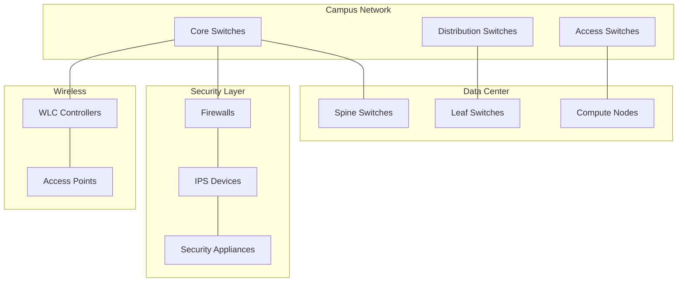

# Benefits & Capabilities

## Why CML Lablets? The Transformation

The transition from IOL to CML-based Lablets unlocks powerful new capabilities that were previously impossible with our current platform.

## 🆚 IOL vs CML Comparison

| Capability              | IOL Lablets (Current)         | CML Lablets (Future)                      |
| ----------------------- | ----------------------------- | ----------------------------------------- |
| **Device Types**        | Cisco routers & switches only | Multi-vendor devices, appliances, servers |
| **Topology Complexity** | Simple, linear topologies     | Complex, realistic network architectures  |
| **Virtualization**      | Lightweight IOS processes     | Full VM-based devices                     |
| **Security Devices**    | ❌ Not supported              | ✅ Firewalls, IPS, security appliances    |
| **Wireless**            | ❌ Not supported              | ✅ Controllers, access points             |
| **Cloud Integration**   | ❌ Limited                    | ✅ Native cloud connectivity              |
| **Third-party Devices** | ❌ Not supported              | ✅ Linux, Windows, appliances             |
| **Scalability**         | Limited by EC2 constraints    | Elastic, cloud-native scaling             |
| **Resource Management** | Manual, static allocation     | Automated, dynamic allocation             |

## 🚀 Key Benefits

### For Certification Programs

#### **Enhanced Assessment Realism**

- **Multi-vendor Scenarios**: Test real-world skills across different vendor platforms
- **Complex Topologies**: Multi-tier architectures that mirror enterprise environments
- **Emerging Technologies**: SD-WAN, cloud integration, modern security stack

#### **Expanded Coverage Areas**

- **Security Specializations**: Dedicated security appliances and advanced threat scenarios
- **Wireless Expertise**: Controller-based wireless architectures
- **Data Center Technologies**: Virtualized data center components
- **Cloud Integration**: Hybrid cloud and multi-cloud scenarios

#### **Improved Assessment Fidelity**

- **Realistic Constraints**: Resource limitations that mirror real environments
- **Performance Testing**: Network performance and optimization scenarios
- **Troubleshooting Complexity**: Multi-layer, multi-vendor problem diagnosis

### For Exam Delivery Operations

#### **Intelligent Resource Management**

- **Dynamic Allocation**: Resources allocated based on actual lab requirements
- **Demand-based Scaling**: Automatic scaling during peak exam periods
- **Cost Optimization**: Pay only for resources actually consumed

#### **Operational Efficiency**

- **Reduced Manual Intervention**: Automated lifecycle management
- **Predictable Performance**: Consistent lab initialization and runtime
- **Monitoring & Analytics**: Real-time insights into resource usage and performance

#### **Reliability & Resilience**

- **High Availability**: Built-in redundancy and failover capabilities
- **Quick Recovery**: Automated error detection and correction
- **Service Continuity**: Minimal downtime and disruption

### For Candidates

#### **Better Preparation**

- **Real-world Relevance**: Scenarios that match actual job requirements
- **Technology Currency**: Access to current and emerging technologies
- **Comprehensive Skills**: End-to-end network design and troubleshooting

#### **Enhanced Experience**

- **Faster Initialization**: Reduced wait times for lab startup
- **Stable Performance**: Consistent, reliable lab environments
- **Intuitive Interfaces**: Modern, user-friendly lab access

## 🎯 Specific Capabilities Unlocked

### Network Topology Capabilities

#### **Multi-tier Architectures**

#### **Hybrid Cloud Integration**

- On-premises to cloud connectivity
- Multi-cloud scenarios
- Edge computing integration
- SD-WAN deployment testing

### Device & Technology Support

#### **Security Technologies**

- **Next-generation Firewalls**: Palo Alto, Fortinet, Cisco ASA/FTD
- **Intrusion Prevention**: Dedicated IPS appliances
- **Identity Services**: ISE, Active Directory integration
- **Endpoint Security**: Host-based security solutions

#### **Wireless Technologies**

- **Enterprise Wireless**: Controller-based deployments
- **WiFi 6/6E/7**: Latest wireless standards
- **Location Services**: Real-time location systems
- **IoT Integration**: IoT device connectivity and management

#### **Data Center Technologies**

- **Server Virtualization**: VMware, Hyper-V environments
- **Container Platforms**: Kubernetes, Docker scenarios
- **Storage Networks**: SAN, NAS, software-defined storage
- **Compute Infrastructure**: Blade servers, converged infrastructure

### Assessment Scenarios

#### **Real-world Problem Solving**

- **Multi-vendor Troubleshooting**: Debug issues across different platforms
- **Performance Optimization**: Tune network performance end-to-end
- **Security Incident Response**: Investigate and remediate security events
- **Change Management**: Implement changes in complex environments

#### **Design & Implementation**

- **Network Architecture**: Design complete network solutions
- **Security Posture**: Implement comprehensive security frameworks
- **Capacity Planning**: Size and scale network infrastructure
- **Business Continuity**: Design resilient, highly available systems

## 📊 Measurable Impact

### Operational Metrics

- **Resource Utilization**: Up to 40% improvement in infrastructure efficiency
- **Initialization Time**: 60% reduction in lab startup time
- **Scalability**: Support for 10x more concurrent lab sessions
- **Availability**: 99.9% uptime target with automated failover

### Assessment Quality

- **Scenario Complexity**: Support for 5x more complex topologies
- **Technology Coverage**: 300% increase in supported device types
- **Real-world Relevance**: 90% alignment with current job requirements
- **Assessment Depth**: Multi-layer, multi-domain evaluation capabilities

---

**Ready to dive deeper?** Explore how to get started as an [Exam PM](../exam-pms/getting-started.md) or review the [Executive Summary](../managers/executive-summary.md) for management perspective.
