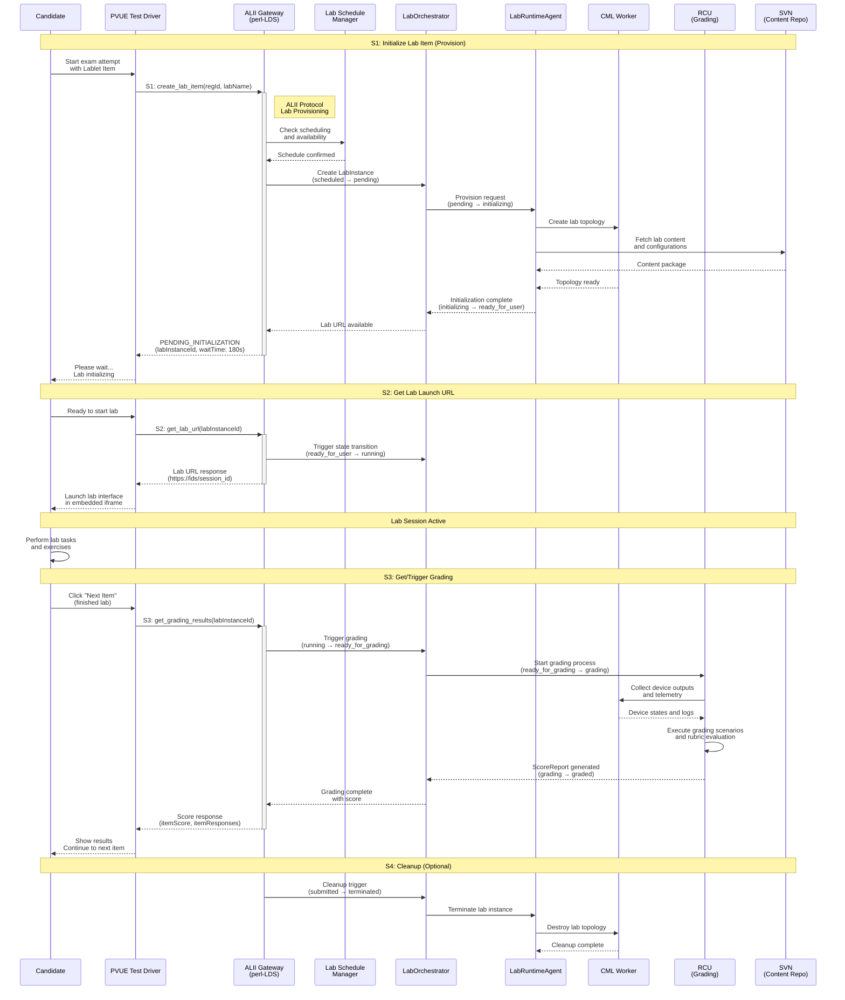
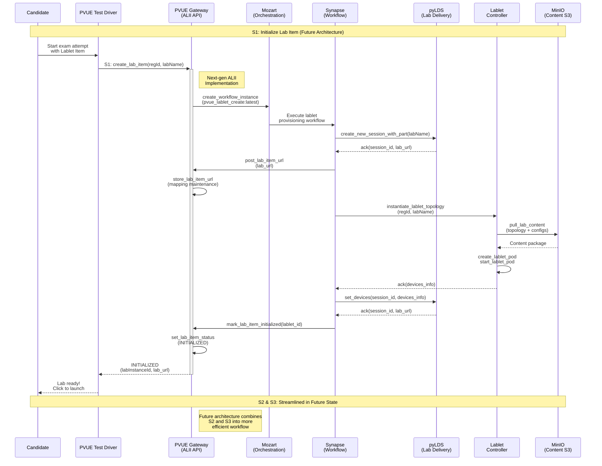

# ALII Integration Sequence Diagrams

This document shows the sequence of interactions between PVUE, the ALII gateway, and internal Cisco systems for Lablet delivery.

## Current State: perl-LDS Integration

## Future State: pyLDS + Mozart Integration

## Key Differences: Current vs Future

| Aspect               | Current (perl-LDS + SVN)    | Future (pyLDS + Mozart)      |
| -------------------- | --------------------------- | ---------------------------- |
| **Content Storage**  | SVN (centralized)           | MinIO/S3 (object storage)    |
| **Orchestration**    | Manual coordination         | Mozart workflow automation   |
| **State Management** | Distributed across services | Centralized in PVUE Gateway  |
| **Performance**      | Multi-step S1→S2→S3 calls   | Streamlined single workflow  |
| **Scalability**      | Limited by SVN bottleneck   | Cloud-native elastic scaling |
| **Monitoring**       | Basic logging               | Comprehensive telemetry      |

## ALII Protocol Reference

| Call   | Purpose                  | Current Implementation          | Future Implementation           |
| ------ | ------------------------ | ------------------------------- | ------------------------------- |
| **S1** | Initialize/Provision lab | perl-LDS + manual orchestration | PVUE Gateway + Mozart workflows |
| **S2** | Get lab launch URL       | Direct perl-LDS query           | Embedded in S1 response         |
| **S3** | Trigger grading          | RCU + manual coordination       | Automated grading pipeline      |
| **S4** | Cleanup (optional)       | Manual cleanup scripts          | Automated resource lifecycle    |

## Error Handling Patterns

Both architectures handle common failure scenarios:

- **Capacity exhaustion**: Queue requests with estimated wait times
- **Initialization failures**: Retry with exponential backoff
- **Grading timeouts**: Fallback to manual review process
- **Network failures**: Circuit breaker pattern with degraded service
