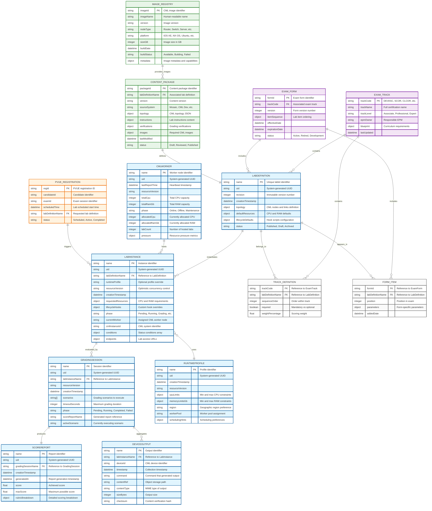

# Entity Relationship Diagram - Lablet Resources Manager

This diagram shows the data model relationships for the Lablet Resources Manager implementing the ROLAP (Resources-Oriented) architecture.

## Core Resource Entities & Relationships

### Lablet Resources Manager - Data Model

## Relationship Details & Cardinalities

### Core Resource Relationships

| From Entity    | Relationship | To Entity      | Cardinality | Description                                     |
| -------------- | ------------ | -------------- | ----------- | ----------------------------------------------- |
| LabDefinition  | instantiates | LabInstance    | 1:N         | One definition can create many instances        |
| LabInstance    | evaluated_by | GradingSession | 1:N         | One instance can have multiple grading attempts |
| GradingSession | produces     | ScoreReport    | 1:1         | Each session produces exactly one report        |
| GradingSession | aggregates   | DeviceOutput   | 1:N         | Sessions collect multiple device outputs        |
| LabInstance    | uses         | RuntimeProfile | N:1         | Many instances can share a profile              |
| CMLWorker      | hosts        | LabInstance    | 1:N         | Workers can host multiple lab instances         |

### Operational Relationships

| From Entity       | Relationship | To Entity     | Description                        |
| ----------------- | ------------ | ------------- | ---------------------------------- |
| ExamTrack         | contains     | LabDefinition | Via TrackDefinition junction table |
| ExamForm          | includes     | LabDefinition | Via FormItem junction table        |
| PVUE Registration | triggers     | LabInstance   | External ALII integration point    |

### Content Management Relationships

| From Entity    | Relationship    | To Entity      | Description                               |
| -------------- | --------------- | -------------- | ----------------------------------------- |
| ContentPackage | defines         | LabDefinition  | 1:1 mapping of content to lab definitions |
| ImageRegistry  | provides_images | ContentPackage | N:M through image dependencies            |

## Key Design Principles

### 1. Immutability Patterns

- **LabDefinition.revision**: Once referenced by a LabInstance, cannot be changed
- **ScoreReport**: Write-once, immutable after generation
- **DeviceOutput**: Append-only evidence collection

### 2. Declarative Spec/Status Pattern

- **Spec fields**: User-declared desired state (immutable after creation)
- **Status fields**: Controller-managed observed state (continuously updated)
- **ResourceVersion**: Optimistic concurrency control

### 3. Reference Integrity

- **LabInstance.labDefinitionName**: Immutable reference to specific LabDefinition
- **Foreign key constraints**: Enforced at application level with validation
- **Cascade policies**: Defined per relationship (e.g., delete LabInstance cascades to GradingSession)

### 4. Lifecycle State Management

- **Phase enumerations**: Controlled state transitions (scheduled → pending → initializing → ...)
- **Condition arrays**: Detailed status tracking with timestamps and reasons
- **Reconciliation**: Controllers detect drift and converge toward desired state

## Data Storage Strategy

### Primary Storage (etcd)

- All core resources stored as JSON documents
- Watch-based event distribution for real-time updates
- Optimistic concurrency via resourceVersion

### Object Storage (MinIO/S3)

- **DeviceOutput.contentRef**: Large output files stored separately
- **ContentPackage**: Lab topology and instruction content
- **ImageRegistry**: CML image files and metadata

### Caching Strategy

- **LabControlPlaneAPI**: In-memory cache of frequently accessed resources
- **TTL policies**: Automatic cache invalidation based on resourceVersion
- **Event-driven updates**: etcd watch feeds cache invalidation

## Migration Considerations

### Current State (perl-LDS + SVN)

- Content stored in SVN with file-based organization
- Lab state managed in perl-LDS database tables
- Manual synchronization between systems

### Future State (pyLDS + Mozart)

- All resources in cloud-native object storage
- Event-driven architecture with automatic reconciliation
- Unified data model across all components

This entity model supports both current and future architectures with abstraction layers handling the storage implementation differences.
